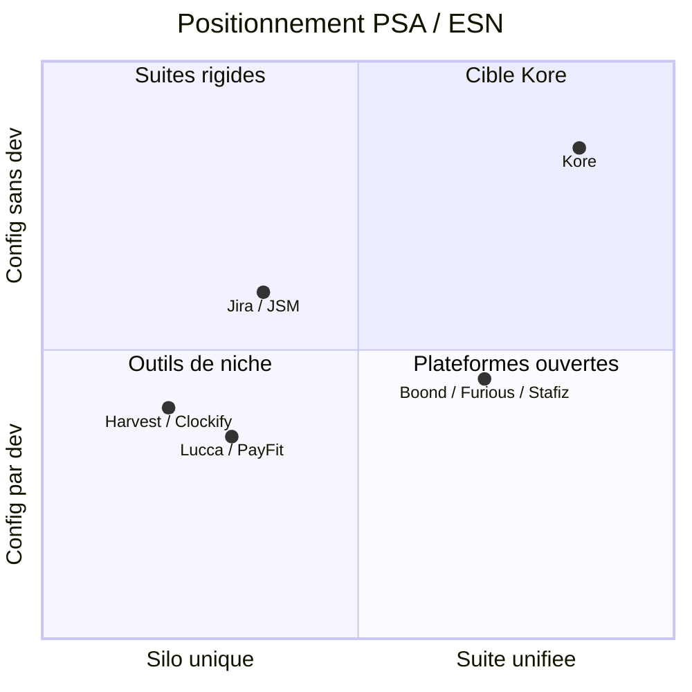
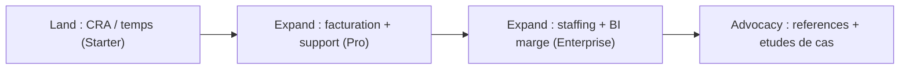

# Analyse Commerciale et Marketing — Kore

> **Document** : Analyse Commerciale & Go-to-Market (GTM)
> **Produit** : Kore (reprise fonctionnelle de B-Hive, implémentation greenfield Go + Nuxt 3)
> **Angle** : vente SaaS B2B — repositionnement 2026
> **Statut** : Brouillon v1.0 — en attente de validation direction
> **Date** : 12/07/2026
> **Document lié** : [`documentation/SPECIFICATION_FONCTIONNELLE.md`](/home/olivier/ll-it-sc/projets/kore/documentation/SPECIFICATION_FONCTIONNELLE.md)

---

## Table des matières

- [§0 Cadre du document](#0-cadre-du-document)
- [§1 Synthèse exécutive](#1-synthese-executive)
- [§2 Diagnostic de l'offre legacy (B-Hive historique)](#2-diagnostic-de-loffre-legacy-b-hive-historique)
- [§3 Recatégorisation marché](#3-recategorisation-marche)
- [§4 ICP et personas d'achat](#4-icp-et-personas-dachat)
- [§5 Proposition de valeur (ROI)](#5-proposition-de-valeur-roi)
- [§6 Analyse concurrentielle](#6-analyse-concurrentielle)
- [§7 Table stakes (prérequis de compétitivité)](#7-table-stakes-prerequis-de-competitivite)
- [§8 Packaging et pricing](#8-packaging-et-pricing)
- [§9 Business case et ROI](#9-business-case-et-roi)
- [§10 Conformité comme levier commercial](#10-conformite-comme-levier-commercial)
- [§11 Go-to-Market](#11-go-to-market)
- [§12 Plan marketing](#12-plan-marketing)
- [§13 Risques et quick wins](#13-risques-et-quick-wins)
- [§14 Décisions commerciales ouvertes](#14-decisions-commerciales-ouvertes)

---

## §0 Cadre du document

### §0.1 Objet

Ce document transforme l'offre historique **B-Hive** (2008–2013) en une **proposition commerciale compétitive 2026**. Il couvre le diagnostic, le positionnement marché, l'ICP, la proposition de valeur, le pricing, le business case, la conformité comme levier de vente, le go-to-market et le plan marketing.

Il est le **pendant commercial** de la spécification fonctionnelle. Pour tout détail produit (modules, processus, ETT, e-invoicing), se référer à [`documentation/SPECIFICATION_FONCTIONNELLE.md`](/home/olivier/ll-it-sc/projets/kore/documentation/SPECIFICATION_FONCTIONNELLE.md).

### §0.2 Cible du document

Direction générale, direction commerciale, marketing, product management.

### §0.3 Avertissement méthodologique

> Les chiffres de pricing, de business case et de ROI sont des **hypothèses de travail** issues d'un benchmark PSA/ESN. Ils doivent être **étalonnés avec 2 à 3 clients pilotes** avant toute diffusion commerciale ferme.

### §0.4 Tableau de version

| Version | Date | Auteur | Statut | Résumé |
| --- | --- | --- | --- | --- |
| 1.0 | 12/07/2026 | Équipe Kore | Brouillon | Analyse commerciale et marketing complète §0–§14 |
| 1.1 | 12/07/2026 | Équipe Kore | Brouillon | §2bis stack greenfield actée ; risques réalignés (plus de dette PHP/Flash/Flex) |

---

## §1 Synthèse exécutive

**Kore** est une suite unifiée d'opérations pour ESN et services IT, pilotée par le **compte rendu d'activité (CRA)** comme source unique de vérité : du temps consultant jusqu'à la facture client, sans double saisie.

- **Positionnement recommandé** : PSA (Professional Services Automation) / plateforme d'opérations pour ESN.
- **ICP** : ESN, sociétés de conseil IT et DSI internes de **20 à 500 collaborateurs**, France/UE, activité mixte régie + forfait + support.
- **Proposition de valeur** : zéro double-saisie, marge en temps réel, facturation accélérée (réduction du DSO), staffing optimisé.
- **Angle de rupture** : la majorité des concurrents traitent **un seul silo** ; Kore unifie **temps → projet → facturation → RH** avec des workflows configurables sans développement.
- **Leviers d'urgence 2026-2027** : conformité **facturation électronique** (France 2026/2027, ViDA 2030) et **enregistrement légal du temps de travail** (Belgique 2027, déjà en vigueur NL/DK/DE).

**Trois quick wins (6 mois)** :
1. Rebrand Kore + landing par catégorie PSA + ROI calculator.
2. Premier connecteur comptable + SSO (déblocage IT/DAF).
3. Application mobile CRA/congés (table stake d'entrée).

---

## §2 Diagnostic de l'offre legacy (B-Hive historique)

> **Périmètre** : analyse de l'ancien produit **B-Hive** (2008–2013, stack PHP/Flash/Flex). Ce diagnostic **ne décrit pas** la plateforme Kore actuelle — voir §2bis.

| Atout durable (héritage fonctionnel) | Handicap de l'offre B-Hive en 2026 |
| --- | --- |
| **Unification CRA-centrée** (temps = source unique de vérité) | Stack obsolète (PHP/Flash/Flex), pas de mobile |
| Workflows configurables **sans dev** | Aucune intégration (compta, SIRH, SSO, calendrier) |
| Multi-tenant, bilingue, dématérialisation | Pas d'API/webhooks → non « embeddable » |
| Facturation auto depuis le temps réel | UX datée ; « évolutions gratuites » non soutenable |
| Couverture métier large (TMA + ESN + support + RH) | Positionnement « GMA/helpdesk » flou vs catégories actuelles |

**Lecture** : le socle **fonctionnel** (unification, config sans dev, facturation issue du temps) reste un actif différenciant à transposer dans Kore. Les handicaps listés ci-dessus concernent l'**ancien produit commercialisé**, pas le code du dépôt Kore.

### §2bis Direction technique Kore (état actuel)

La modernisation technique est une **réécriture greenfield** — aucun socle PHP/Flash/Flex n'est embarqué ni masqué dans l'application.

| Couche | Technologie retenue | Référence |
| --- | --- | --- |
| API & logique métier | **Go** (chi, pgx, golang-migrate) — monolithe modulaire hexagonal | [`technical/foundation/01-architecture.md`](../technical/foundation/01-architecture.md) |
| Persistance | **PostgreSQL** (schéma par module) | [`technical/foundation/03-database.md`](../technical/foundation/03-database.md) |
| Cache & sessions | **Redis** | [`technical/foundation/10-cache-redis.md`](../technical/foundation/10-cache-redis.md) |
| Frontend | **Nuxt 3** (Vue 3, SSR + BFF Nitro) | [`technical/foundation/08-frontend-nuxt.md`](../technical/foundation/08-frontend-nuxt.md) |
| Paiements SaaS | **Stripe** | [`technical/foundation/11-payments-stripe.md`](../technical/foundation/11-payments-stripe.md) |
| Déploiement | **Docker** (dev), **GCP** Cloud Run / Cloud SQL / Memorystore (prod) | [`technical/foundation/09-gcp-infrastructure.md`](../technical/foundation/09-gcp-infrastructure.md) |

**Écarts produit restants** (sur la nouvelle stack, cf. §7 table stakes) : application mobile native, API publique + webhooks, connecteurs compta/SIRH/SSO — à prioriser dans la roadmap, indépendamment de la dette B-Hive.

---

## §3 Recatégorisation marché

Le legacy « GMA + helpdesk + suivi d'activité » correspond aujourd'hui à la catégorie **PSA (Professional Services Automation)** et **gestion d'ESN**, en forte croissance.

- **Catégorie cible** : PSA / plateforme d'opérations pour ESN et services IT.
- **Concurrents PSA/ESN** : Boondmanager, Furious, Stafiz, Whoz, Kantata, Certinia, Teamwork.
- **Concurrents adjacents** : Jira/JSM, Freshservice, Zendesk (ITSM/support) ; Lucca, PayFit (RH/congés) ; Harvest, Clockify (temps).
- **Angle de rupture** : la plupart des concurrents traitent *un* silo. Kore = **suite unifiée temps → projet → facturation → RH**, pilotée par le CRA.

### Positionnement (quadrant)

---

## §4 ICP et personas d'achat

**ICP** : ESN / sociétés de conseil IT et DSI internes, **20 à 500 collaborateurs**, France/UE, activité mixte régie + forfait + support.

| Persona | Rôle dans l'achat | Attentes clés | Objections |
| --- | --- | --- | --- |
| **Economic buyer** — DG / DAF | Décision budget | Marge, cash, DSO, conformité | Coût, intégration compta |
| **Champion** — Directeur d'agence / Resp. delivery / Resource manager | Prescripteur, pilote | Staffing, capacity, visibilité prestations | Conduite du changement |
| **Utilisateurs** — Consultants, managers, commerciaux | Adoption quotidienne | Rapidité CRA, mobile, simplicité | UX, temps de saisie |
| **Blocages** — IT / DSI | Veto technique | SSO, RGPD, hébergement UE, API | Sécurité, écarts intégrations/API |

**Implication commerciale** : le deal se gagne sur le **champion delivery** (valeur opérationnelle) mais se sécurise auprès du **DAF** (ROI, conformité) et de **l'IT** (SSO/RGPD/API).

---

## §5 Proposition de valeur (ROI)

Messages orientés résultats (à décliner par persona en §12) :

- « **Zéro double-saisie** : du temps consultant à la facture client, en une seule source. »
- « **Marge en temps réel** par mission / client / collaborateur. »
- « **Facturation accélérée** (régie + forfait) -> réduction du DSO. »
- « **Staffing optimisé** : capacity planning + recherche de profils. »

**Preuves à construire** : ROI calculator (heures admin économisées, jours de facturation gagnés, taux d'occupation) — cf. §9.

---

## §6 Analyse concurrentielle

| Critère | Kore (cible) | PSA/ESN (Boond, Furious, Stafiz) | ITSM (Jira/JSM, Freshservice) | RH/Temps (Lucca, Harvest) |
| --- | --- | --- | --- | --- |
| Périmètre unifié temps→projet→facturation→RH | Fort (natif, CRA pivot) | Moyen/Fort | Faible (support only) | Faible (silo) |
| Config workflow sans dev | Fort (héritage B-Hive) | Moyen | Moyen/Fort | Faible |
| Interop e-invoicing (PDP/Peppol) | **Différenciateur** (natif, multi-PDP) | Variable | Faible | N/A |
| RGPD / hébergement UE | Fort | Fort | Variable | Fort |
| Mobile | En cours (web responsive Nuxt 3 ; app native à venir) | Fort | Fort | Fort |
| API / écosystème | En cours (OpenAPI interne ; API publique à ouvrir) | Fort | Fort | Moyen |
| Prix | Compétitif | Élevé | Moyen | Faible |

**Lecture** : la stack greenfield (Go + Nuxt 3) est en place ; le rattrapage porte sur les **livrables produit** mobile natif et API publique (cf. §7), pas sur une migration technique depuis Flex/Flash. Kore peut gagner sur **unification + config sans dev + interopérabilité e-invoicing** — un cumul que peu d'acteurs proposent.

---

## §7 Table stakes (prérequis de compétitivité)

Prérequis à prioriser dans la roadmap Kore, au-delà du périmètre fonctionnel legacy :

1. **SSO/SAML/SCIM**, gestion fine des droits.
2. **API REST + webhooks** (écosystème, embeddabilité).
3. **Intégrations** : connecteur **PDP/PA + Peppol** (facturation électronique EN 16931), compta (Sage, Cegid, Pennylane, QuickBooks), SIRH/paie (Lucca, PayFit), calendrier (Google/Microsoft 365).
4. **Application mobile** (CRA, congés, validation).
5. **BI / dashboards** exportables + analytics marge.
6. **RGPD by design**, hébergement UE, SLA contractuel.
7. **Onboarding self-service** + centre d'aide.
8. **Conformité temps de travail UE** (enregistrement inaltérable) : obligation Belgique 01/01/2027, déjà en vigueur NL/DK/DE — brique différenciante.

> Priorisation commerciale : les points 1, 3 (compta), 4 et 8 sont les plus fréquemment cités comme *deal breakers* par l'IT et le DAF.

---

## §8 Packaging et pricing

**Éditions** (bundles de modules) plutôt que module-à-module. Grille indicative (benchmark PSA/ESN FR/UE, per-seat/mois, facturation annuelle) :

| Édition | Périmètre | Prix indicatif /user/mois | Cible |
| --- | --- | --- | --- |
| **Starter** | CRA + Congés + Budget (time & attendance) | 9–12 € | TPE/PME, entrée PLG |
| **Pro** | + TMA/Support + préparation facturation + dashboards | 19–25 € | PME services / DSI |
| **Enterprise** | + SSII/staffing + BI marge + SSO/SCIM + API + connecteurs (PDP, compta, SIRH) + SLA | 35–49 € | ESN, multi-agences |

- **Métrique** : per-seat actif/mois ; **remise annuelle** ~15–20 % ; paliers de volume dégressifs.
- **Add-ons payants** : connecteur PDP/compta premium, marque blanche, support prioritaire, sandbox API, connecteur pointeuse/badge (ETT), multi-pays avancé.
- **Trial** 14–30 j + **PLG** self-service sur Starter/Pro ; démo sales-assisted sur Enterprise.
- Remplacer « évolutions gratuites » (non soutenable) par « **mises à jour continues incluses** ».
- **Note e-invoicing** : la préparation des données de facturation est **incluse** ; le transit via PDP est soit un add-on connecteur, soit « bring-your-own-PDP ».

---

## §9 Business case et ROI

Cas type : **ESN de 100 consultants**, TJM moyen 500 €, ~21 jours facturables/mois (soit ~12,6 M€ de CA facturé/an).

| Levier | Hypothèse | Gain annuel estimé |
| --- | --- | --- |
| Suppression double-saisie CRA/facturation | 2 h/mois × 100 pers. × 40 €/h | ~96 000 € |
| Réduction DSO (facturation plus rapide/juste) | -5 j de délai sur ~12,6 M€ | Gain de trésorerie significatif |
| Taux d'occupation (+1 pt via capacity planning) | +1 % × 12,6 M€ | ~126 000 € de CA |
| Réduction erreurs/litiges de facturation | -30 % de litiges | Réduction des avoirs |

> À présenter comme **ROI calculator** paramétrable en avant-vente (effectif, TJM, jours facturables). Chiffres illustratifs, à étalonner avec 2–3 clients pilotes.

**Argumentaire coût/valeur** : à ~25 €/user/mois sur l'édition Pro, l'abonnement annuel d'une ESN de 100 personnes (~30 000 €) est couvert par le seul levier « suppression double-saisie » (~96 000 €), sans compter les gains DSO et occupation.

---

## §10 Conformité comme levier commercial

La conformité réglementaire crée une **urgence d'achat datée**, exploitable en accroche marketing et en accélérateur de cycle de vente.

### §10.1 Facturation électronique

- **France** : réception obligatoire pour toutes les entreprises et émission GE/ETI au **01/09/2026** ; émission PME/TPE/micro au **01/09/2027**. Transit via **Plateforme Agréée (PA, ex-PDP)** ; formats **EN 16931** (Factur-X / UBL / CII).
- **UE — ViDA** : e-invoicing B2B intra-UE au **01/07/2030** (réseau Peppol ou équivalent) ; norme **EN 16931-1:2026**.
- **Autres marchés** : Belgique (Peppol B2B live 01/2026), Allemagne (XRechnung/ZUGFeRD), Pologne (KSeF), Roumanie (e-Factura), Espagne (2027–2028).

**Angle de vente** : « **Prêt e-invoicing 2026/2027/2030** » — Kore prépare la donnée conforme et s'intègre à la PDP du client (multi-format, multi-PDP), sans imposer d'outil. Détail architecture : spec fonctionnelle §7 (Facturation) et §13bis (conformité).

### §10.2 Enregistrement du temps de travail (ETT)

- **Belgique — 01/01/2027** (tolérance jusqu'au 31/03/2027) : obligation générale, tous employeurs/secteurs -> **fenêtre commerciale 2026**.
- Déjà en vigueur : **Pays-Bas** (2022, amendes jusqu'à 45 000 €/salarié), **Danemark** (2024, conservation 5 ans), **Allemagne** (loi attendue 2026), **Espagne**.
- Socle commun UE : directive **2003/88/CE** + jurisprudence CJUE **C-55/18** / **C-531/23**.

**Angle de vente** : « **Conforme à l'obligation belge 2027, prêt pour le reste de l'UE** » — packagé avec CRA/Congés. Différenciateur vs pointeuses pures : **unification** pointage légal ↔ CRA projet ↔ facturation, sans double outil.

---

## §11 Go-to-Market

### §11.1 Motion

- **Hybride** : PLG (trial -> self-serve Starter/Pro) + **sales-assisted** pour Enterprise/ESN.
- **Land & expand** : entrer par le CRA/temps, étendre vers la facturation puis le staffing.

### §11.2 Canaux

- SEO / contenu « gestion ESN / PSA ».
- Partenariats intégrateurs et experts-comptables.
- Marketplaces (Sage / Cegid).
- Communautés ESN.

### §11.3 Migration de la base legacy

- Migrer les clients B-Hive historiques comme **early adopters** (offre de reprise) + études de cas.
- Traiter la base installée comme un actif d'acquisition à faible CAC et fort taux de conversion.

---

## §12 Plan marketing

### §12.1 Segmentation et priorités

| Segment | Priorité | Déclencheur d'achat | Édition d'entrée |
| --- | --- | --- | --- |
| ESN 50–500 (multi-agences) | Haute | Marge, staffing, conformité multi-pays | Enterprise |
| PME services / conseil IT 20–50 | Haute | Zéro double-saisie, facturation | Pro |
| DSI internes | Moyenne | Suivi TMA, budget, refacturation interne | Pro |
| TPE / freelances structurés | Basse (PLG) | CRA + congés simples | Starter |

### §12.2 Messaging par persona

| Persona | Message principal | Preuve |
| --- | --- | --- |
| DG / DAF | « Marge en temps réel, DSO réduit, conformité assurée » | ROI calculator, §9 |
| Directeur d'agence / delivery | « Staffing optimisé, visibilité prestations » | Capacity planning, dashboards |
| IT / DSI | « SSO, RGPD, hébergement UE, API » | Table stakes §7 |
| Consultants / managers | « CRA en 2 minutes, mobile, pré-rempli » | Démo mobile, CRA pivot |

### §12.3 Contenus et SEO

- Piliers SEO : « logiciel gestion ESN », « PSA France », « facturation électronique ESN 2026 », « enregistrement temps de travail Belgique 2027 ».
- Formats : landing par catégorie (PSA), guides conformité (e-invoicing, ETT), études de cas migration B-Hive, ROI calculator interactif.
- Lead magnets : checklist conformité 2026/2027, comparatif PSA.

### §12.4 Séquences d'acquisition

- **PLG** : trial Starter/Pro -> onboarding self-service -> nurturing produit -> upsell Pro/Enterprise.
- **Sales-assisted** : démo Enterprise -> POC/pilote -> business case chiffré (§9) -> déploiement land & expand.

### §12.5 KPI d'acquisition et de croissance

| KPI | Définition | Cible indicative |
| --- | --- | --- |
| CAC | Coût d'acquisition client | À étalonner par canal |
| MRR / ARR | Revenu récurrent mensuel/annuel | Croissance mensuelle suivie |
| Taux de conversion trial -> payant | PLG Starter/Pro | > 15–20 % (à valider) |
| NRR / expansion | Revenu net de rétention (land & expand) | > 110 % (à valider) |
| Churn | Attrition logo et revenu | < 5 %/an (à valider) |
| Payback CAC | Durée de récupération du CAC | < 12 mois (à valider) |

---

## §13 Risques et quick wins

### Risques

- **Écarts produit vs table stakes** : mobile natif, API publique/webhooks et connecteurs (compta, SIRH, SSO) pas encore au niveau marché — le socle technique greenfield (Go/Nuxt 3/PostgreSQL/Redis) est acté et en cours d'implémentation.
- Dépendance au modèle mono-tenant URL (héritage fonctionnel B-Hive à trancher, cf. spec §17 D2).
- Absence d'intégrations = *deal breakers* IT/DAF.
- Textes de conformité nationaux encore mouvants (BE non finalisé) → concevoir un **moteur de règles paramétrable par pays** plutôt qu'un codage en dur.

### Quick wins (6 mois)

- Rebrand Kore + landing par catégorie PSA.
- Premier connecteur comptable.
- SSO.
- Application mobile CRA.
- ROI calculator.

---

## §14 Décisions commerciales ouvertes

| # | Décision | Options | Recommandation |
| --- | --- | --- | --- |
| C1 | Positionnement | PSA ESN / helpdesk ITSM / suite RH | **PSA ESN** |
| C2 | Cœur de cible | ESN pure / DSI interne / les deux | À trancher (les deux, ESN prioritaire) |
| C3 | Grille tarifaire | Par édition (§8) | Valider avec pilotes |
| C4 | Migration base legacy | Offre de reprise B-Hive | Prioriser (faible CAC) |
| C5 | Marché géographique | France -> UE -> international | France d'abord |
| C6 | E-invoicing | Add-on PDP vs bring-your-own-PDP | Les deux ; FR d'abord |
| C7 | ETT | Pays au lancement (BE 2027 ?) | BE prioritaire, moteur multi-pays |

> Ces décisions conditionnent la roadmap produit (cf. spec fonctionnelle §15 MVP/phases et §17 décisions ouvertes).
