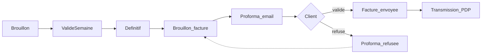

# Guide utilisateur — Kore

> **Public** : équipe de développement (prise en main produit) et utilisateurs métier / admin.  
> **Dernière mise à jour** : 2026-08-20 (précisions seed / Prestations / reporting)  
> **Aide in-app** : `/aide` (accès par profil, projets agile)  
> **Droits RBAC** : détail dans [`GUIDE_ACCES_UTILISATEURS.md`](GUIDE_ACCES_UTILISATEURS.md) — ce guide ne duplique pas la matrice L/E/V.

Kore est une suite **PSA/ESN** centrée sur le **CRA** : le temps saisi alimente projets, budget et facturation. Ce document décrit les **écrans et parcours MVP réellement branchés**.

---

## 1. À propos et prérequis

| Élément | Valeur |
| --- | --- |
| Stack locale | `make up` (Docker) |
| Frontend | http://localhost:3001 |
| API | http://localhost:8081 |
| Seed | `make seed` ou `make seed-reset` |

Après démarrage, ouvrir le frontend, se connecter, puis parcourir ce guide section par section avec un compte seed adapté (voir §2).

Pour la spécification métier détaillée (RG, US, processus) : [`SPECIFICATION_FONCTIONNELLE.md`](SPECIFICATION_FONCTIONNELLE.md).  
Pour l’architecture technique : [`../CLAUDE.md`](../CLAUDE.md) et [`../technical/README.md`](../technical/README.md).

---

## 2. Premiers pas

### Connexion

1. Aller sur `/login`.
2. Saisir un login / mot de passe seed.
3. La session repose sur des cookies httpOnly ; le client ne parle jamais directement à l’API Go (tout passe par le BFF Nitro `/api/...`).

### Comptes seed (tenant démo)

| Login | Mot de passe | Profil RBAC | À quoi s’en servir |
| --- | --- | --- | --- |
| `ADM_admin` | `Admin123!` | Administrateur | Org, paramètres, tous modules, évent. plateforme |
| `MGR_manager` | `Manager123!` | Responsable de service | Validations étendues, budget, facturation |
| `CHE_chefdev` | `Chef123!` | Chef d’équipe | Validation CRA/TMA, projets agile |
| `COL_collab` | `Collab123!` | Collaborateur | Saisie CRA, TMA, congés |
| `COL_dev2` | `Collab123!` | Collaborateur | 2ᵉ collab démo |
| `PRE_presta` | `Presta123!` | Collaborateur (type compte Prestataire) | Variante collab seed — **pas** le profil RBAC Sous-traitant |
| `CLI_contact` | `Client123!` | Collaborateur (type compte Client) | Variante collab seed — **pas** le profil RBAC Client externe |
| `COM_commercial` | `Commercial123!` | Collaborateur | Variante collab seed — **pas** le profil RBAC Commercial |

Les profils SFD **Commercial**, **Client externe**, **Sous-traitant**, etc. ne sont **pas** encore dans la matrice MVP `DefaultPermissions` — voir le [guide d’accès](GUIDE_ACCES_UTILISATEURS.md).

### Multi-profils

Un utilisateur peut cumuler plusieurs profils : les droits effectifs sont l’**union** (le plus large gagne). Visible in-app sous **Aide**.

---

## 3. Carte de navigation

Source : `frontend/layouts/default.vue`. Les menus s’affichent selon **profil**, **module souscrit** (entitlement) et parfois un **canal de demandes** ou le flag **facturation client**.

### Accueil

| Menu | Route | Notes |
| --- | --- | --- |
| Dashboard | `/dashboard` | Vue d’accueil authentifiée |
| Nouvelle demande | `/demandes/nouveau` | Visible si plusieurs canaux de demandes sont actifs |

### Temps

| Menu | Route | Notes |
| --- | --- | --- |
| CRA | `/cra` | Saisie / suivi des feuilles de temps |
| Prestations | `/prestations` | Vue agrégée CRA → création factures (**menu réservé Administrateur**) |
| Réconciliation ETT | `/ett/reconciliation` | Module ETT souscrit |
| Congés | `/conges` | Demandes + soldes ; validation selon droits |

### Demandes

| Menu | Route | Notes |
| --- | --- | --- |
| Évolutions & incidents | `/tma` | Canal TMA |
| Projets agile | `/projets` | Apps en profil Scrum / Kanban |
| Service utilisateur | `/support` | Canal support |
| Exploitation & travaux | `/maintenance` | Canal maintenance |

### Pilotage

| Menu | Route | Notes |
| --- | --- | --- |
| Clients | `/clients` | Lecture via org / CRA / SSII |
| Missions | `/missions` | Missions SSII + staffing |
| Budget | `/budget` | Suivi UO / enveloppes |
| Facturation | `/facturation` | Uniquement si facturation client activée sur l’org |

### Compte

| Menu | Route |
| --- | --- |
| Mon profil | `/compte` |
| Aide | `/aide` |

### Organisation (Administrateur)

| Menu | Route |
| --- | --- |
| Structure | `/admin/organisation` |
| Sites | `/admin/sites` |
| Services | `/admin/services` |
| Applications | `/admin/applications` |
| Équipes | `/admin/equipes` |
| Utilisateurs | `/admin/users` |
| Connexion SSO | `/admin/identity-providers` |

### Automatisation (Administrateur)

| Menu | Route |
| --- | --- |
| Workflows | `/admin/workflows` |
| Notifications | `/admin/notifications` |
| Intégrations | `/admin/integrations` |

### Système

| Menu | Route | Notes |
| --- | --- | --- |
| Paramètres | `/admin/parametres` | CRA, congés, demandes, IA, sécurité… |
| Abonnement | `/billing/abonnement` | Stripe (module billing) |
| Plateforme | `/platform` | Super-admin (`PLATFORM_ADMIN_LOGINS`) |

**Mobile (≤768px)** : drawer + bottom nav — les mêmes destinations, présentation adaptée.

---

## 4. Flux pivot : CRA → facture

Cœur métier PSA : le temps validé devient facturable.

Statuts CRA côté produit / code : **Brouillon** → **ValidéSemaine** → **Définitif**.

### En pratique

1. **Collaborateur** : `/cra` — créer / compléter une feuille, soumettre.
2. **Chef / Manager / Admin** : valider (ValidéSemaine puis Définitif selon le workflow).
3. Créer un brouillon facture :
   - **Facturation → Depuis un CRA** (wizard preview prérempli), ou
   - validation définitive / **Prestations → Créer factures**.
4. Sur la fiche facture : **Émettre proforma** (email + lien public `/public/proforma/{token}`).
5. Le client **valide** (commentaire optionnel) ou **refuse** (commentaire obligatoire).
6. Ensuite : envoi facture / préparation transmission PDP.

Les heures facturées sont bornées à la mission (ou à l’application `temps_passe` dominante) — pas d’agrégat multi-clients.

---

## 5. Parcours métier

### 5.1 Temps — CRA

| Action | Où |
| --- | --- |
| Lister / ouvrir un CRA | `/cra`, `/cra/[id]` |
| Planning / Gantt | `/cra/planning`, `/cra/gantt` |
| Prestations (vue validation / facturation) | `/prestations` |

Statuts : **Brouillon** → **ValidéSemaine** → **Définitif**.  
Droits : Collaborateur L/E ; Chef / Responsable / Admin L/E/V.

### 5.2 Temps — Congés

| Action | Où |
| --- | --- |
| Mes demandes / dépôt | `/conges` |
| Soldes | `/conges/soldes` |
| Validation (selon droits) | `/conges/validation` |

Collaborateur : dépôt. Responsable / Admin : validation. Chef d’équipe : lecture seule sur les congés (MVP).

### 5.3 Temps — ETT

| Action | Où |
| --- | --- |
| Réconciliation | `/ett/reconciliation` |
| Pointage | `/ett/pointage` |

Visible si le module ETT est souscrit.

### 5.4 Demandes — TMA

| Action | Où |
| --- | --- |
| Liste / fiche | `/tma`, `/tma/[id]` |
| Gantt | `/tma/gantt` |

Canal **Évolutions & incidents**. Les demandes TMA nourrissent aussi le burndown des projets agile (date de résolution).

### 5.5 Demandes — Projets agile

Réservé aux **applications** en profil méthodologique **Scrum** ou **Kanban** (`/admin/applications`).

| Vue | Route typique |
| --- | --- |
| Liste des apps projet | `/projets` |
| Backlog | `/projets/[appId]/backlog` |
| Epics | `/projets/[appId]/epics` |
| Sprints (Scrum) | `/projets/[appId]/sprints` |
| Board Kanban | `/projets/[appId]/board` |
| Config colonnes WIP | `/projets/[appId]/kanban-config` |
| Métriques / burndown | `/projets/[appId]/metrics` |

Aide dédiée : `/aide/projets`. Limite WIP Kanban : transition refusée en 422 si dépassée.

### 5.6 Demandes — Support & Maintenance

| Canal | Routes |
| --- | --- |
| Service utilisateur | `/support`, `/support/[id]` |
| Exploitation & travaux | `/maintenance`, `/maintenance/[id]` |

Menus conditionnés par l’activation du canal et les droits module.

### 5.7 Pilotage — Clients & Missions

| Action | Où |
| --- | --- |
| Clients | `/clients`, `/clients/[id]` |
| Missions SSII | `/missions`, `/missions/nouveau`, `/missions/[id]` |

Création client / mission : plutôt Admin (org / SSII). Collab / Chef / Manager : lecture via droits CRA ou org. Sur une mission : staffing de collaborateurs.

### 5.8 Pilotage — Budget

| Action | Où |
| --- | --- |
| Liste / fiche | `/budget`, `/budget/[id]` |

Suivi des enveloppes / UO liées aux applications. Collab : lecture ; Chef : L/E ; Responsable / Admin : L/E/V.

### 5.9 Pilotage — Facturation

Prérequis : flag **facturation client** activé (Organisation → Modules), distinct de l’abonnement SaaS Stripe.

| Action | Où |
| --- | --- |
| Liste / fiche | `/facturation`, `/facturation/[id]` |
| Wizard depuis CRA | Facturation → « Depuis un CRA » |
| Validation client proforma | `/public/proforma/[token]` (hors auth app) |

Reporting : pages `/reporting/facturation`, `/reporting/tma`, `/reporting/dashboards/[code]` — **pas d’entrée dans la nav MVP** (accès direct URL / droits reporting).

---

## 6. Parcours administrateur

Réservé au profil **Administrateur** (`adminOnly` sur la nav). Les droits module seuls ne débloquent pas ces menus.

### 6.1 Organisation

Ordre logique de paramétrage :

1. **Structure** (`/admin/organisation`) — arbre société / sites / services.
2. **Sites** / **Services** / **Équipes** — listes CRUD dédiées.
3. **Applications** (`/admin/applications`) — libellé, propriétaire, profil **PSA / Scrum / Kanban**, mode facturation, UO, chef utilisateur, équipes liées ; soft-delete.
4. **Utilisateurs** (`/admin/users`) — profils, équipes ; protections self-edit (ne pas se retirer Administrateur ; dernier admin actif protégé).
5. **SSO** (`/admin/identity-providers`) — fournisseurs OIDC.
6. **Modules** (depuis l’org) — activer / désactiver notamment la **facturation client**.

### 6.2 Automatisation

| Écran | Rôle |
| --- | --- |
| `/admin/workflows` | Définition / édition des workflows métier (attention aux codes avec `.` dans l’URL) |
| `/admin/notifications` | Canaux et règles de notification |
| `/admin/integrations` | Connecteurs externes |

### 6.3 Système — Paramètres

Hub `/admin/parametres` et sous-pages :

| Sous-page | Route |
| --- | --- |
| Index | `/admin/parametres` |
| CRA | `/admin/parametres/cra` |
| Congés | `/admin/parametres/conges` |
| Demandes | `/admin/parametres/demandes` |
| IA | `/admin/parametres/ia` |
| Sécurité | `/admin/parametres/securite` |

### 6.4 Abonnement SaaS

`/billing/abonnement` (+ checkout / success / cancel) : souscription Stripe des modules. Indépendant du flag facturation **client** métier.

---

## 7. Plateforme et onboarding public

| Parcours | Route | Qui |
| --- | --- | --- |
| Signup public | `/signup` | Crée tenant + société + admin + trial 14 j (sans Stripe) |
| Console plateforme | `/platform` | Logins dans `PLATFORM_ADMIN_LOGINS` (défaut seed : `ADM_admin`) |

La console plateforme permet la vue multi-tenants, les paramètres LLM globaux et la **création d’organisations**. Ce n’est **pas** un profil RBAC tenant : c’est un rôle JWT injecté au login.

Pages vitrine hors app authentifiée : `/` (landing), `/tarifs`, `/reserver`.

---

## 8. Glossaire court

| Terme | Sens |
| --- | --- |
| **CRA** | Compte rendu d’activité / feuille de temps |
| **TMA** | Tierce maintenance applicative — canal évolutions & incidents |
| **UO** | Unité d’œuvre (budget / consommation) |
| **Application** | Entité org (périmètre métier, équipes, mode facturation, profil méthodo) |
| **Projet agile** | Vue Scrum/Kanban sur une application (backlog, sprints, board) |
| **Mission** | Engagement SSII chez un client (staffing, bornage facturation) |
| **Entitlement** | Module souscrit pour le tenant (sinon HTTP 402) |
| **RBAC** | Droits L / E / V par profil × module |
| **Proforma** | Devis / projet de facture envoyé au client pour validation |
| **PDP** | Plateforme de dématérialisation partenaire (e-facturation) |
| **BFF** | Backend-for-frontend Nitro : proxy auth vers l’API Go |

---

## 9. Où aller ensuite

| Besoin | Document / lieu |
| --- | --- |
| Matrice droits, fiches profils | [`GUIDE_ACCES_UTILISATEURS.md`](GUIDE_ACCES_UTILISATEURS.md) · `/aide/acces` |
| Projets agile (détail UI) | `/aide/projets` |
| Spec fonctionnelle (RG, US, processus) | [`SPECIFICATION_FONCTIONNELLE.md`](SPECIFICATION_FONCTIONNELLE.md) |
| Schéma PostgreSQL | [`SCHEMA_DB.md`](SCHEMA_DB.md) |
| Charte UI | [`CHARTE_GRAPHIQUE.md`](CHARTE_GRAPHIQUE.md) |
| Stack, modules, commandes | [`../CLAUDE.md`](../CLAUDE.md) |
| Specs techniques / roadmap | [`../technical/README.md`](../technical/README.md) |

### Parcours recommandé pour un nouveau développeur

1. `make up` + login `COL_collab` → CRA, TMA, congés.
2. Relogin `CHE_chefdev` → validation CRA/TMA, projets agile.
3. Relogin `MGR_manager` → budget, facturation si activée.
4. Relogin `ADM_admin` → Organisation → Applications → Utilisateurs → Paramètres ; éventuellement `/platform`.
5. Lire le [guide d’accès](GUIDE_ACCES_UTILISATEURS.md) pour comprendre pourquoi un menu apparaît ou non.
