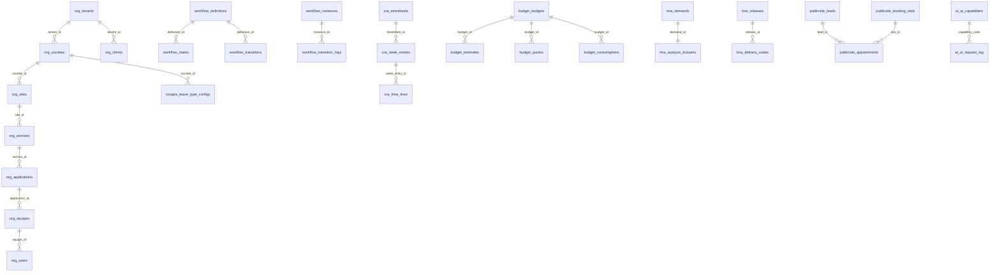

# Schéma base de données — état actuel

> **Source de vérité** : migrations SQL dans `internal/modules/<module>/migrations/`  
> **Appliquées par** : `kore-api migrate` (runner Go maison, cf. `internal/platform/db`)  
> **Dernière mise à jour doc** : 22/07/2026

---

## Vue d'ensemble

PostgreSQL — **19 schémas** actifs, un par module implémenté. Isolation multi-tenant via `tenant_id UUID` sur les tables métier (sauf `publicsite` et tables de référence globales).

### Ordre d'application des migrations

| # | Module | Schéma | Répertoire |
| --- | --- | --- | --- |
| 1 | org | `org` | `internal/modules/org/migrations/` |
| 2 | workflow | `workflow` | `internal/modules/workflow/migrations/` |
| 3 | cra | `cra` | `internal/modules/cra/migrations/` |
| 4 | notifications | `notifications` | `internal/modules/notifications/migrations/` |
| 5 | conges | `conges` | `internal/modules/conges/migrations/` |
| 6 | budget | `budget` | `internal/modules/budget/migrations/` |
| 7 | tma | `tma` | `internal/modules/tma/migrations/` |
| 8 | ssii | `ssii` | `internal/modules/ssii/migrations/` |
| 9 | support | `support` | `internal/modules/support/migrations/` |
| 10 | maintenance | `maintenance` | `internal/modules/maintenance/migrations/` |
| 11 | invoicing | `invoicing` | `internal/modules/invoicing/migrations/` |
| 12 | ett | `ett` | `internal/modules/ett/migrations/` |
| 13 | reporting | `reporting` | `internal/modules/reporting/migrations/` |
| 14 | admin | `admin` | `internal/modules/admin/migrations/` |
| 15 | integrations | `integrations` | `internal/modules/integrations/migrations/` |
| 16 | ai | `ai` | `internal/modules/ai/migrations/` |
| 17 | billing | `billing` | `internal/modules/billing/migrations/` |
| 18 | publicsite | `publicsite` | `internal/modules/publicsite/migrations/` |

> Référence code : `internal/app/migrations.go`

### Clé étrangère inter-schémas

Une seule FK explicite entre schémas :

| Table | Colonne | Référence |
| --- | --- | --- |
| `conges.leave_type_configs` | `societe_id` | `org.societes(id)` |

Les autres références (`tenant_id`, `user_id`, `application_id`, …) sont **logiques** (pas de contrainte FK inter-schémas).

---

## Schéma `org`

Organisation, identité, RBAC.

### `org.tenants`

| Colonne | Type | Contraintes |
| --- | --- | --- |
| `id` | UUID | PK |
| `name` | TEXT | NOT NULL |
| `created_at` | TIMESTAMPTZ | NOT NULL, DEFAULT NOW() |

### `org.access_tokens`

Tokens à usage unique pour **invitation** et **récupération d’organisation** (liens envoyés par email).

| Colonne | Type | Contraintes |
| --- | --- | --- |
| `token_hash` | TEXT | PK (hash SHA-256 hex du token) |
| `tenant_id` | UUID | NOT NULL |
| `email` | TEXT | NOT NULL |
| `kind` | TEXT | NOT NULL (`invite` / `discovery`) |
| `expires_at` | TIMESTAMPTZ | NOT NULL |
| `used_at` | TIMESTAMPTZ | |
| `created_at` | TIMESTAMPTZ | NOT NULL, DEFAULT NOW() |

Index :

- `access_tokens_tenant_email_kind_idx (tenant_id, email, kind)`
- `access_tokens_expires_at_idx (expires_at)`

### `org.societes`

| Colonne | Type | Contraintes |
| --- | --- | --- |
| `id` | UUID | PK |
| `tenant_id` | UUID | NOT NULL → `org.tenants(id)` |
| `raison_sociale` | TEXT | NOT NULL |
| `logo` | TEXT | |
| `devise` | TEXT | NOT NULL, DEFAULT `'EUR'` |
| `langue_defaut` | TEXT | NOT NULL, DEFAULT `'fr'` |
| `adresse` | TEXT | NOT NULL, DEFAULT `''` |
| `siret` | TEXT | NOT NULL, DEFAULT `''` |
| `url_tenant` | TEXT | NOT NULL, DEFAULT `''` |
| `pays` | TEXT | NOT NULL, DEFAULT `'FR'` |
| `week_start_day` | SMALLINT | NOT NULL, DEFAULT `1`, CHECK 0–6 (0=dimanche … 6=samedi) |
| `day_capacity_minutes` | INT | NOT NULL, DEFAULT `480`, CHECK 1–1440 |
| `cra_mail_auto` | BOOLEAN | NOT NULL, DEFAULT `FALSE` (RG-CRA-03) |
| `cra_mail_recipients` | JSONB | NOT NULL, DEFAULT `'[]'` |
| `week_submit_policy` | TEXT | NOT NULL, DEFAULT `'warn'`, CHECK `block` / `warn` / `none` |
| `cra_gate_mode` | TEXT | NOT NULL, DEFAULT `'warn'`, CHECK `block` / `warn` |
| `task_types_enabled` | JSONB | NOT NULL, DEFAULT `'[]'` (catalogue types activité CRA ; vide = défaut manual/interne/formation/mission) |
| `totp_default_enabled` | BOOLEAN | NOT NULL, DEFAULT `FALSE` |
| `totp_user_configurable` | BOOLEAN | NOT NULL, DEFAULT `TRUE` |
| `created_at` | TIMESTAMPTZ | NOT NULL, DEFAULT NOW() |

### `org.sites`

| Colonne | Type | Contraintes |
| --- | --- | --- |
| `id` | UUID | PK |
| `tenant_id` | UUID | NOT NULL → `org.tenants(id)` |
| `societe_id` | UUID | NOT NULL → `org.societes(id)` |
| `libelle` | TEXT | NOT NULL |
| `pays` | TEXT | NOT NULL, DEFAULT `'FR'` |
| `strategie_budget` | TEXT | NOT NULL, DEFAULT `'standard'` |
| `created_at` | TIMESTAMPTZ | NOT NULL, DEFAULT NOW() |

### `org.services`

| Colonne | Type | Contraintes |
| --- | --- | --- |
| `id` | UUID | PK |
| `tenant_id` | UUID | NOT NULL → `org.tenants(id)` |
| `site_id` | UUID | NOT NULL → `org.sites(id)` |
| `type` | TEXT | NOT NULL, DEFAULT `'interne'` |
| `responsable_id` | UUID | |
| `commercial_id` | UUID | |
| `assistante_id` | UUID | |
| `created_at` | TIMESTAMPTZ | NOT NULL, DEFAULT NOW() |

### `org.applications`

| Colonne | Type | Contraintes |
| --- | --- | --- |
| `id` | UUID | PK |
| `tenant_id` | UUID | NOT NULL → `org.tenants(id)` |
| `service_id` | UUID | NOT NULL → `org.services(id)` |
| `libelle` | TEXT | NOT NULL |
| `proprietaire` | TEXT | |
| `mode_facturation` | TEXT | NOT NULL, DEFAULT `'temps_passe'` |
| `budget_defaut_id` | UUID | |
| `uo_activee` | BOOLEAN | NOT NULL, DEFAULT FALSE |
| `chef_utilisateur_id` | UUID | |
| `created_at` | TIMESTAMPTZ | NOT NULL, DEFAULT NOW() |

### `org.equipes`

| Colonne | Type | Contraintes |
| --- | --- | --- |
| `id` | UUID | PK |
| `tenant_id` | UUID | NOT NULL → `org.tenants(id)` |
| `application_id` | UUID | NOT NULL → `org.applications(id)` |
| `libelle` | TEXT | NOT NULL |
| `responsable_id` | UUID | |
| `created_at` | TIMESTAMPTZ | NOT NULL, DEFAULT NOW() |

### `org.users`

| Colonne | Type | Contraintes |
| --- | --- | --- |
| `id` | UUID | PK |
| `tenant_id` | UUID | NOT NULL → `org.tenants(id)` |
| `equipe_id` | UUID | → `org.equipes(id)` |
| `login` | TEXT | NOT NULL |
| `prenom` | TEXT | NOT NULL, DEFAULT `''` |
| `nom` | TEXT | NOT NULL, DEFAULT `''` |
| `email` | TEXT | |
| `password_hash` | TEXT | NOT NULL |
| `profil` | TEXT | NOT NULL |
| `langue` | TEXT | NOT NULL, DEFAULT `'fr'` |
| `cra_requis` | BOOLEAN | NOT NULL, DEFAULT TRUE |
| `type_compte` | TEXT | NOT NULL, DEFAULT `'Interne'` |
| `salarie_ett` | BOOLEAN | NOT NULL, DEFAULT FALSE |
| `date_activation` | DATE | NOT NULL, DEFAULT CURRENT_DATE |
| `date_expiration` | DATE | |
| `active` | BOOLEAN | NOT NULL, DEFAULT TRUE |
| `release_notes_auto_show` | BOOLEAN | NOT NULL, DEFAULT TRUE |
| `last_seen_version` | TEXT | |
| `totp_enabled` | BOOLEAN | NOT NULL, DEFAULT `FALSE` |
| `totp_enrollment_required` | BOOLEAN | NOT NULL, DEFAULT `FALSE` |
| `totp_secret_encrypted` | TEXT | |
| `totp_enabled_at` | TIMESTAMPTZ | |
| `created_at` | TIMESTAMPTZ | NOT NULL, DEFAULT NOW() |

**Index / contraintes** : `UNIQUE (tenant_id, login)` — `idx_org_users_tenant`

### `org.user_totp_backup_codes`

| Colonne | Type | Contraintes |
| --- | --- | --- |
| `id` | UUID | PK |
| `tenant_id` | UUID | NOT NULL → `org.tenants(id)` |
| `user_id` | UUID | NOT NULL → `org.users(id)` ON DELETE CASCADE |
| `code_hash` | TEXT | NOT NULL |
| `used_at` | TIMESTAMPTZ | |
| `created_at` | TIMESTAMPTZ | NOT NULL, DEFAULT NOW() |

**Index** : `idx_user_totp_backup_codes_user (user_id) WHERE used_at IS NULL`

### `org.identity_providers`

| Colonne | Type | Contraintes |
| --- | --- | --- |
| `id` | UUID | PK |
| `tenant_id` | UUID | NOT NULL → `org.tenants(id)`, UNIQUE |
| `name` | TEXT | NOT NULL |
| `issuer` | TEXT | NOT NULL |
| `client_id` | TEXT | NOT NULL |
| `client_secret` | TEXT | NOT NULL, DEFAULT `''` |
| `jwks_uri` | TEXT | NOT NULL, DEFAULT `''` |
| `scopes` | TEXT | NOT NULL, DEFAULT `'openid profile email'` |
| `default_profile` | TEXT | NOT NULL, DEFAULT `'Collaborateur'` |
| `enabled` | BOOLEAN | NOT NULL, DEFAULT FALSE |
| `created_at` | TIMESTAMPTZ | NOT NULL, DEFAULT NOW() |
| `updated_at` | TIMESTAMPTZ | NOT NULL, DEFAULT NOW() |

### `org.user_identities`

| Colonne | Type | Contraintes |
| --- | --- | --- |
| `id` | UUID | PK |
| `tenant_id` | UUID | NOT NULL → `org.tenants(id)` |
| `user_id` | UUID | NOT NULL → `org.users(id)` |
| `idp_id` | UUID | NOT NULL → `org.identity_providers(id)` ON DELETE CASCADE |
| `subject` | TEXT | NOT NULL |
| `email` | TEXT | NOT NULL, DEFAULT `''` |
| `linked_at` | TIMESTAMPTZ | NOT NULL, DEFAULT NOW() |

**Index / contraintes** : `UNIQUE (tenant_id, idp_id, subject)` — `UNIQUE (tenant_id, user_id, idp_id)` — `idx_user_identities_email`

### `org.clients`

| Colonne | Type | Contraintes |
| --- | --- | --- |
| `id` | UUID | PK |
| `tenant_id` | UUID | NOT NULL → `org.tenants(id)` |
| `raison_sociale` | TEXT | NOT NULL |
| `tva` | TEXT | |
| `contacts` | JSONB | NOT NULL, DEFAULT `'[]'` |
| `archived` | BOOLEAN | NOT NULL, DEFAULT FALSE |
| `created_at` | TIMESTAMPTZ | NOT NULL, DEFAULT NOW() |

**Index** : `idx_org_clients_tenant`

### `org.tenant_request_settings`

Activation des canaux de demandes (TMA, support, maintenance) et affichage des guides par tenant.

| Colonne | Type | Contraintes |
| --- | --- | --- |
| `tenant_id` | UUID | PK → `org.tenants(id)` ON DELETE CASCADE |
| `channels_enabled` | JSONB | NOT NULL, DEFAULT `'{"tma":true,"support":true,"maintenance":true}'` |
| `guides_enabled` | BOOLEAN | NOT NULL, DEFAULT TRUE |
| `updated_at` | TIMESTAMPTZ | NOT NULL, DEFAULT NOW() |

### `org.request_attachments`

Pièces jointes des demandes TMA, tickets support et travaux maintenance.

| Colonne | Type | Contraintes |
| --- | --- | --- |
| `id` | UUID | PK |
| `tenant_id` | UUID | NOT NULL |
| `resource_type` | TEXT | NOT NULL |
| `resource_id` | UUID | NOT NULL |
| `file_name` | TEXT | NOT NULL |
| `mime_type` | TEXT | NOT NULL, DEFAULT `'application/octet-stream'` |
| `size_bytes` | BIGINT | NOT NULL, DEFAULT 0 |
| `storage_path` | TEXT | NOT NULL |
| `uploaded_by` | UUID | NOT NULL |
| `created_at` | TIMESTAMPTZ | NOT NULL, DEFAULT NOW() |

**Index** : `idx_org_request_attachments_resource` sur `(tenant_id, resource_type, resource_id)`

### `org.platform_settings`

Singleton des paramètres plateforme (admin multi-tenant), notamment le modèle Gemini global.

| Colonne | Type | Contraintes |
| --- | --- | --- |
| `id` | INT | PK, DEFAULT 1, CHECK `(id = 1)` |
| `gemini_model` | TEXT | NOT NULL, DEFAULT `'gemini-3.6-flash'` |
| `updated_at` | TIMESTAMPTZ | NOT NULL, DEFAULT NOW() |
| `updated_by` | UUID | |

Seed : une ligne `(id=1, …)` via `0005` ; la migration `0017` fixe le DEFAULT à `gemini-3.6-flash` et met à jour la valeur uniquement si elle est encore `gemini-3.5-flash` **et** `updated_by IS NULL` (jamais personnalisée).

### `org.authx_permissions`

Matrice RBAC statique (pas de `tenant_id`).

| Colonne | Type | Contraintes |
| --- | --- | --- |
| `profile` | TEXT | PK (composite) |
| `module` | TEXT | PK (composite) |
| `action` | TEXT | PK (composite) |

Profils seedés : Administrateur, Collaborateur, Chef d'équipe, Utilisateur.

---

## Schéma `workflow`

Moteur de workflow générique.

### `workflow.definitions`

| Colonne | Type | Contraintes |
| --- | --- | --- |
| `id` | UUID | PK |
| `tenant_id` | UUID | NOT NULL |
| `code` | TEXT | NOT NULL |
| `entity_type` | TEXT | NOT NULL |
| `version` | INT | NOT NULL, DEFAULT 1 |
| `created_at` | TIMESTAMPTZ | NOT NULL, DEFAULT NOW() |
| `updated_at` | TIMESTAMPTZ | NOT NULL, DEFAULT NOW() |

**Contraintes** : `UNIQUE (tenant_id, code)`

### `workflow.states`

| Colonne | Type | Contraintes |
| --- | --- | --- |
| `id` | UUID | PK |
| `definition_id` | UUID | NOT NULL → `workflow.definitions(id)` ON DELETE CASCADE |
| `code` | TEXT | NOT NULL |
| `label` | TEXT | NOT NULL, DEFAULT `''` |
| `is_initial` | BOOLEAN | NOT NULL, DEFAULT FALSE |
| `is_final` | BOOLEAN | NOT NULL, DEFAULT FALSE |
| `on_enter_effects` | JSONB | NOT NULL, DEFAULT `'[]'` — effets à l'entrée (emails, etc.) |

**Contraintes** : `UNIQUE (definition_id, code)`

### `workflow.transitions`

| Colonne | Type | Contraintes |
| --- | --- | --- |
| `id` | UUID | PK |
| `definition_id` | UUID | NOT NULL → `workflow.definitions(id)` ON DELETE CASCADE |
| `from_state` | TEXT | NOT NULL |
| `to_state` | TEXT | NOT NULL |
| `action` | TEXT | NOT NULL |
| `guard` | TEXT | NOT NULL, DEFAULT `''` |
| `doc_trigger` | JSONB | |
| `allowed_roles` | TEXT[] | NOT NULL, DEFAULT `'{}'` |
| `on_fire_effects` | JSONB | NOT NULL, DEFAULT `'[]'` — effets au déclenchement (emails, etc.) |

**Contraintes** : `UNIQUE (definition_id, from_state, action)`

### `workflow.instances`

| Colonne | Type | Contraintes |
| --- | --- | --- |
| `id` | UUID | PK |
| `tenant_id` | UUID | NOT NULL |
| `definition_code` | TEXT | NOT NULL |
| `entity_id` | TEXT | NOT NULL |
| `current_state` | TEXT | NOT NULL |
| `created_at` | TIMESTAMPTZ | NOT NULL, DEFAULT NOW() |
| `updated_at` | TIMESTAMPTZ | NOT NULL, DEFAULT NOW() |

**Index** : `idx_workflow_instances_tenant_entity (tenant_id, entity_id)`

### `workflow.transition_logs`

| Colonne | Type | Contraintes |
| --- | --- | --- |
| `id` | UUID | PK |
| `tenant_id` | UUID | NOT NULL |
| `instance_id` | UUID | NOT NULL → `workflow.instances(id)` ON DELETE CASCADE |
| `from_state` | TEXT | NOT NULL |
| `to_state` | TEXT | NOT NULL |
| `action` | TEXT | NOT NULL |
| `actor_id` | UUID | NOT NULL |
| `occurred_at` | TIMESTAMPTZ | NOT NULL, DEFAULT NOW() |

**Index** : `idx_workflow_transition_logs_instance (instance_id, occurred_at)`

---

## Schéma `cra`

Comptes rendus d'activité (pivot temps).

### `cra.timesheets`

| Colonne | Type | Contraintes |
| --- | --- | --- |
| `id` | UUID | PK |
| `tenant_id` | UUID | NOT NULL |
| `user_id` | UUID | NOT NULL |
| `month` | TEXT | NOT NULL |
| `status` | TEXT | NOT NULL, DEFAULT `'Brouillon'` |
| `commercial_info` | JSONB | NOT NULL, DEFAULT `'{}'` |
| `validated_at` | TIMESTAMPTZ | |
| `validated_by` | UUID | |
| `rejected_at` | TIMESTAMPTZ | Rejet manager (Lot 4) |
| `rejected_by` | UUID | |
| `reject_reason` | TEXT | NOT NULL, DEFAULT `''` |
| `created_at` | TIMESTAMPTZ | NOT NULL, DEFAULT NOW() |
| `updated_at` | TIMESTAMPTZ | NOT NULL, DEFAULT NOW() |

**Contraintes** : `UNIQUE (tenant_id, user_id, month)` — index `idx_cra_timesheets_tenant_user_month`

### `cra.week_entries`

| Colonne | Type | Contraintes |
| --- | --- | --- |
| `id` | UUID | PK |
| `tenant_id` | UUID | NOT NULL |
| `timesheet_id` | UUID | NOT NULL → `cra.timesheets(id)` ON DELETE CASCADE |
| `week_number` | INT | NOT NULL |
| `submitted_at` | TIMESTAMPTZ | |

**Contraintes** : `UNIQUE (timesheet_id, week_number)`

### `cra.time_lines`

| Colonne | Type | Contraintes |
| --- | --- | --- |
| `id` | UUID | PK |
| `tenant_id` | UUID | NOT NULL |
| `week_entry_id` | UUID | NOT NULL → `cra.week_entries(id)` ON DELETE CASCADE |
| `source_type` | TEXT | NOT NULL |
| `source_id` | TEXT | NOT NULL |
| `day` | DATE | NOT NULL |
| `duration` | INT | NOT NULL, DEFAULT 0 |
| `comment` | TEXT | NOT NULL, DEFAULT `''` |
| `origin` | TEXT | NOT NULL, DEFAULT `'manual'` |
| `billable` | BOOLEAN | NOT NULL, DEFAULT `TRUE` |
| `work_ref_type` | TEXT | Référence optionnelle (`tma`, `ticket`, `work_request`) |
| `work_ref_id` | TEXT | ID de la demande liée |

**Contraintes** : index `idx_cra_time_lines_source` (plusieurs lignes même source/jour autorisées depuis migration `0003`)

---

## Schéma `notifications`

Règles et file d'envoi de messages.

### `notifications.rules`

| Colonne | Type | Contraintes |
| --- | --- | --- |
| `id` | UUID | PK |
| `tenant_id` | UUID | NOT NULL |
| `code` | TEXT | NOT NULL |
| `trigger` | TEXT | NOT NULL |
| `frequency` | TEXT | NOT NULL |
| `recipient_policy` | JSONB | NOT NULL, DEFAULT `'{}'` |
| `template` | TEXT | NOT NULL, DEFAULT `''` |
| `attach_pdf` | BOOLEAN | NOT NULL, DEFAULT FALSE |
| `created_at` | TIMESTAMPTZ | NOT NULL, DEFAULT NOW() |

**Contraintes** : `UNIQUE (tenant_id, code)`, `UNIQUE (tenant_id, trigger)` — index `idx_notifications_rules_tenant`

### `notifications.messages`

| Colonne | Type | Contraintes |
| --- | --- | --- |
| `id` | UUID | PK |
| `tenant_id` | UUID | NOT NULL |
| `rule_code` | TEXT | |
| `recipients` | JSONB | NOT NULL, DEFAULT `'[]'` |
| `subject` | TEXT | NOT NULL |
| `body` | TEXT | NOT NULL |
| `status` | TEXT | NOT NULL, DEFAULT `'pending'` |
| `attempts` | INT | NOT NULL, DEFAULT 0 |
| `sent_at` | TIMESTAMPTZ | |
| `scheduled_for` | TIMESTAMPTZ | |
| `created_at` | TIMESTAMPTZ | NOT NULL, DEFAULT NOW() |

**Index** : `idx_notifications_messages_tenant`, `idx_notifications_messages_status`, `idx_notifications_messages_due (status, scheduled_for)`

### `notifications.device_tokens`

Tokens FCM/APNs pour notifications push mobile.

| Colonne | Type | Contraintes |
| --- | --- | --- |
| `id` | UUID | PK |
| `tenant_id` | UUID | NOT NULL |
| `user_id` | UUID | NOT NULL |
| `platform` | TEXT | NOT NULL, CHECK `ios` / `android` / `web` |
| `token` | TEXT | NOT NULL |
| `created_at` | TIMESTAMPTZ | NOT NULL, DEFAULT NOW() |
| `updated_at` | TIMESTAMPTZ | NOT NULL, DEFAULT NOW() |

**Contraintes** : `UNIQUE (tenant_id, user_id, token)` — index `idx_device_tokens_tenant_user`

---

## Schéma `conges`

Demandes et soldes de congés.

### `conges.leave_requests`

| Colonne | Type | Contraintes |
| --- | --- | --- |
| `id` | UUID | PK |
| `tenant_id` | UUID | NOT NULL |
| `user_id` | UUID | NOT NULL |
| `type` | TEXT | NOT NULL |
| `start_date` | DATE | NOT NULL |
| `end_date` | DATE | NOT NULL |
| `motif` | TEXT | NOT NULL, DEFAULT `''` |
| `status` | TEXT | NOT NULL, DEFAULT `'en_attente'` |
| `decided_by` | UUID | |
| `decided_at` | TIMESTAMPTZ | |
| `created_at` | TIMESTAMPTZ | NOT NULL, DEFAULT NOW() |

**Index** : `idx_conges_leave_requests_tenant_user`, `idx_conges_leave_requests_status`

### `conges.leave_balances`

| Colonne | Type | Contraintes |
| --- | --- | --- |
| `id` | UUID | PK |
| `tenant_id` | UUID | NOT NULL |
| `user_id` | UUID | NOT NULL |
| `type` | TEXT | NOT NULL |
| `acquired` | NUMERIC(8,2) | NOT NULL, DEFAULT 0 |
| `taken` | NUMERIC(8,2) | NOT NULL, DEFAULT 0 |
| `remaining` | NUMERIC(8,2) | NOT NULL, DEFAULT 0 |
| `created_at` | TIMESTAMPTZ | NOT NULL, DEFAULT NOW() |

**Contraintes** : `UNIQUE (tenant_id, user_id, type)`

### `conges.leave_type_configs`

Paramétrage des types de congés par société.

| Colonne | Type | Contraintes |
| --- | --- | --- |
| `id` | UUID | PK |
| `tenant_id` | UUID | NOT NULL |
| `societe_id` | UUID | NOT NULL → `org.societes(id)` |
| `code` | TEXT | NOT NULL |
| `label` | TEXT | NOT NULL |
| `tracks_balance` | BOOLEAN | NOT NULL, DEFAULT TRUE |
| `active` | BOOLEAN | NOT NULL, DEFAULT TRUE |
| `sort_order` | INT | NOT NULL, DEFAULT 0 |
| `created_at` | TIMESTAMPTZ | NOT NULL, DEFAULT NOW() |
| `updated_at` | TIMESTAMPTZ | NOT NULL, DEFAULT NOW() |

**Contraintes** : `UNIQUE (tenant_id, societe_id, code)` — index `idx_conges_leave_type_configs_tenant_societe`

---

## Schéma `budget`

Budgets, devis, consommations.

### `budget.budgets`

| Colonne | Type | Contraintes |
| --- | --- | --- |
| `id` | UUID | PK |
| `tenant_id` | UUID | NOT NULL |
| `application_id` | UUID | NOT NULL |
| `type` | TEXT | NOT NULL |
| `planned_days` | NUMERIC(12,2) | NOT NULL, DEFAULT 0 |
| `planned_uo` | NUMERIC(12,2) | NOT NULL, DEFAULT 0 |
| `planned_amount` | BIGINT | NOT NULL, DEFAULT 0 |
| `consumed_days` | NUMERIC(12,2) | NOT NULL, DEFAULT 0 |
| `consumed_uo` | NUMERIC(12,2) | NOT NULL, DEFAULT 0 |
| `consumed_amount` | BIGINT | NOT NULL, DEFAULT 0 |
| `currency` | TEXT | NOT NULL, DEFAULT `'EUR'` |
| `created_at` | TIMESTAMPTZ | NOT NULL, DEFAULT NOW() |

**Index** : `idx_budget_budgets_app`, `idx_budget_budgets_type`

### `budget.estimates`

| Colonne | Type | Contraintes |
| --- | --- | --- |
| `id` | UUID | PK |
| `tenant_id` | UUID | NOT NULL |
| `budget_id` | UUID | NOT NULL → `budget.budgets(id)` |
| `demand_id` | UUID | NOT NULL |
| `effort_uo` | NUMERIC(12,2) | NOT NULL, DEFAULT 0 |
| `effort_days` | NUMERIC(12,2) | NOT NULL, DEFAULT 0 |
| `superseded` | BOOLEAN | NOT NULL, DEFAULT FALSE |
| `created_at` | TIMESTAMPTZ | NOT NULL, DEFAULT NOW() |

### `budget.quotes`

| Colonne | Type | Contraintes |
| --- | --- | --- |
| `id` | UUID | PK |
| `tenant_id` | UUID | NOT NULL |
| `budget_id` | UUID | NOT NULL → `budget.budgets(id)` |
| `demand_id` | UUID | NOT NULL |
| `amount` | BIGINT | NOT NULL, DEFAULT 0 |
| `effort_uo` | NUMERIC(12,2) | NOT NULL, DEFAULT 0 |
| `effort_days` | NUMERIC(12,2) | NOT NULL, DEFAULT 0 |
| `supersedes_estimate_id` | UUID | |
| `created_at` | TIMESTAMPTZ | NOT NULL, DEFAULT NOW() |

### `budget.consumptions`

| Colonne | Type | Contraintes |
| --- | --- | --- |
| `id` | UUID | PK |
| `tenant_id` | UUID | NOT NULL |
| `budget_id` | UUID | NOT NULL → `budget.budgets(id)` |
| `period_start` | DATE | NOT NULL |
| `period_end` | DATE | NOT NULL |
| `days` | NUMERIC(12,2) | NOT NULL, DEFAULT 0 |
| `uo` | NUMERIC(12,2) | NOT NULL, DEFAULT 0 |
| `amount` | BIGINT | NOT NULL, DEFAULT 0 |
| `approved_at` | TIMESTAMPTZ | |
| `approved_by` | UUID | |
| `created_at` | TIMESTAMPTZ | NOT NULL, DEFAULT NOW() |

**Contraintes** : `UNIQUE (tenant_id, budget_id, period_start, period_end)`

---

## Schéma `tma`

Demandes TMA, dossiers d'analyse, livraisons.

### `tma.demands`

| Colonne | Type | Contraintes |
| --- | --- | --- |
| `id` | UUID | PK |
| `tenant_id` | UUID | NOT NULL |
| `application_id` | UUID | NOT NULL |
| `type` | TEXT | NOT NULL, DEFAULT `'incident'` |
| `subject` | TEXT | NOT NULL |
| `description` | TEXT | NOT NULL, DEFAULT `''` |
| `priority` | TEXT | NOT NULL, DEFAULT `'normal'` |
| `due_at` | TIMESTAMPTZ | |
| `workflow_instance_id` | UUID | |
| `author_id` | UUID | NOT NULL |
| `assignee_id` | UUID | |
| `status` | TEXT | NOT NULL |
| `visible` | BOOLEAN | NOT NULL, DEFAULT TRUE |
| `consumption_active` | BOOLEAN | NOT NULL, DEFAULT TRUE |
| `requires_chef_gate` | BOOLEAN | NOT NULL, DEFAULT FALSE |
| `created_at` | TIMESTAMPTZ | NOT NULL, DEFAULT NOW() |

**Index** : `idx_tma_demands_tenant_app_status`

### `tma.analysis_dossiers`

| Colonne | Type | Contraintes |
| --- | --- | --- |
| `id` | UUID | PK |
| `tenant_id` | UUID | NOT NULL |
| `demand_id` | UUID | NOT NULL → `tma.demands(id)` |
| `functional` | TEXT | NOT NULL, DEFAULT `''` |
| `technical` | TEXT | NOT NULL, DEFAULT `''` |
| `risks` | TEXT | NOT NULL, DEFAULT `''` |
| `test_scenario` | TEXT | NOT NULL, DEFAULT `''` |
| `created_at` | TIMESTAMPTZ | NOT NULL, DEFAULT NOW() |

**Contraintes** : `UNIQUE (demand_id)` — un dossier par demande

### `tma.releases`

| Colonne | Type | Contraintes |
| --- | --- | --- |
| `id` | UUID | PK |
| `tenant_id` | UUID | NOT NULL |
| `application_id` | UUID | NOT NULL |
| `label` | TEXT | NOT NULL |
| `created_at` | TIMESTAMPTZ | NOT NULL, DEFAULT NOW() |

### `tma.delivery_codes`

| Colonne | Type | Contraintes |
| --- | --- | --- |
| `id` | UUID | PK |
| `tenant_id` | UUID | NOT NULL |
| `release_id` | UUID | NOT NULL → `tma.releases(id)` |
| `code` | TEXT | NOT NULL |
| `created_at` | TIMESTAMPTZ | NOT NULL, DEFAULT NOW() |

---

## Schéma `ai`

Assistance IA — conformité AI Act, journalisation.

### `ai.ai_capabilities`

Registre global des capabilities (pas de `tenant_id`).

| Colonne | Type | Contraintes |
| --- | --- | --- |
| `code` | TEXT | PK |
| `risk_class` | TEXT | NOT NULL |
| `annex_iii` | BOOLEAN | NOT NULL, DEFAULT FALSE |
| `art_6_3_assessment` | TEXT | |
| `enabled` | BOOLEAN | NOT NULL, DEFAULT TRUE |
| `wave` | INT | NOT NULL, DEFAULT 0 |

11 capabilities seedées (TMA, CRA, budget, congés, workflow, publicsite).

### `ai.tenant_ai_settings`

| Colonne | Type | Contraintes |
| --- | --- | --- |
| `tenant_id` | UUID | PK |
| `enabled` | BOOLEAN | NOT NULL, DEFAULT FALSE |
| `notice_accepted_at` | TIMESTAMPTZ | |
| `notice_accepted_by` | UUID | |
| `workers_informed_at` | TIMESTAMPTZ | |
| `llm_provider` | TEXT | NOT NULL, DEFAULT `'stub'` |

### `ai.ai_request_log`

| Colonne | Type | Contraintes |
| --- | --- | --- |
| `id` | UUID | PK |
| `tenant_id` | UUID | NOT NULL |
| `user_id` | UUID | NOT NULL |
| `capability_code` | TEXT | NOT NULL → `ai.ai_capabilities(code)` |
| `entity_type` | TEXT | |
| `entity_id` | UUID | |
| `input_hash` | TEXT | NOT NULL |
| `output_json` | JSONB | |
| `model` | TEXT | NOT NULL |
| `explain_context` | JSONB | |
| `created_at` | TIMESTAMPTZ | NOT NULL, DEFAULT NOW() |

**Index** : `ai_request_log_tenant_created_idx`, `ai_request_log_tenant_capability_idx`

---

## Schéma `billing`

Abonnement SaaS Stripe.

### `billing.subscriptions`

| Colonne | Type | Contraintes |
| --- | --- | --- |
| `id` | UUID | PK |
| `tenant_id` | UUID | NOT NULL, UNIQUE |
| `stripe_customer_id` | TEXT | UNIQUE |
| `stripe_subscription_id` | TEXT | UNIQUE |
| `status` | TEXT | NOT NULL, DEFAULT `'trial'` |
| `seats` | INT | NOT NULL, DEFAULT 1, CHECK (seats >= 0) |
| `current_period_end` | TIMESTAMPTZ | |
| `created_at` | TIMESTAMPTZ | NOT NULL, DEFAULT NOW() |
| `updated_at` | TIMESTAMPTZ | NOT NULL, DEFAULT NOW() |

**Index** : `idx_billing_subscriptions_tenant`

### `billing.module_entitlements`

| Colonne | Type | Contraintes |
| --- | --- | --- |
| `id` | UUID | PK |
| `tenant_id` | UUID | NOT NULL |
| `module_code` | TEXT | NOT NULL |
| `enabled` | BOOLEAN | NOT NULL, DEFAULT TRUE |
| `created_at` | TIMESTAMPTZ | NOT NULL, DEFAULT NOW() |

**Contraintes** : `UNIQUE (tenant_id, module_code)` — index `idx_billing_entitlements_tenant`

### `billing.webhook_events`

Idempotence webhooks Stripe (pas de `tenant_id`).

| Colonne | Type | Contraintes |
| --- | --- | --- |
| `event_id` | TEXT | PK |
| `event_type` | TEXT | NOT NULL |
| `processed_at` | TIMESTAMPTZ | NOT NULL, DEFAULT NOW() |

---

## Schéma `publicsite`

Site vitrine et prise de rendez-vous commercial (hors tenant).

### `publicsite.leads`

| Colonne | Type | Contraintes |
| --- | --- | --- |
| `id` | UUID | PK |
| `email` | TEXT | NOT NULL |
| `company` | TEXT | NOT NULL, DEFAULT `''` |
| `size` | TEXT | NOT NULL, DEFAULT `''` |
| `need` | TEXT | NOT NULL, DEFAULT `''` |
| `utm_source` | TEXT | NOT NULL, DEFAULT `''` |
| `consent_at` | TIMESTAMPTZ | NOT NULL |
| `status` | TEXT | NOT NULL, DEFAULT `'new'` |
| `created_at` | TIMESTAMPTZ | NOT NULL, DEFAULT NOW() |

**Index** : `idx_publicsite_leads_email`

### `publicsite.commercial_availabilities`

| Colonne | Type | Contraintes |
| --- | --- | --- |
| `id` | UUID | PK |
| `commercial_id` | UUID | NOT NULL |
| `weekday` | INT | NOT NULL, CHECK (0–6) |
| `start_time` | TIME | NOT NULL |
| `end_time` | TIME | NOT NULL |
| `slot_minutes` | INT | NOT NULL, DEFAULT 30, CHECK (> 0) |
| `timezone` | TEXT | NOT NULL, DEFAULT `'Europe/Paris'` |
| `created_at` | TIMESTAMPTZ | NOT NULL, DEFAULT NOW() |

### `publicsite.booking_slots`

| Colonne | Type | Contraintes |
| --- | --- | --- |
| `id` | UUID | PK |
| `commercial_id` | UUID | NOT NULL |
| `slot_start` | TIMESTAMPTZ | NOT NULL |
| `slot_end` | TIMESTAMPTZ | NOT NULL |
| `status` | TEXT | NOT NULL, DEFAULT `'free'` |
| `external_event_id` | TEXT | |
| `created_at` | TIMESTAMPTZ | NOT NULL, DEFAULT NOW() |

**Contraintes** : `UNIQUE (commercial_id, slot_start)` — index `idx_publicsite_slots_commercial`

### `publicsite.appointments`

| Colonne | Type | Contraintes |
| --- | --- | --- |
| `id` | UUID | PK |
| `lead_id` | UUID | NOT NULL → `publicsite.leads(id)` |
| `commercial_id` | UUID | NOT NULL |
| `slot_id` | UUID | NOT NULL → `publicsite.booking_slots(id)` |
| `channel` | TEXT | NOT NULL, DEFAULT `'video'` |
| `status` | TEXT | NOT NULL, DEFAULT `'confirmed'` |
| `cancel_token` | TEXT | NOT NULL, UNIQUE |
| `created_at` | TIMESTAMPTZ | NOT NULL, DEFAULT NOW() |

**Index** : `idx_publicsite_appointments_token`

---

## Schéma `ssii`

Missions ESN (staffing, TJM, collaborateurs).

### `ssii.missions`

| Colonne | Type | Contraintes |
| --- | --- | --- |
| `id` | UUID | PK |
| `tenant_id` | UUID | NOT NULL |
| `client_id` | UUID | NOT NULL |
| `status` | TEXT | NOT NULL, DEFAULT `'active'` |
| `start_date` | DATE | NOT NULL |
| `end_date` | DATE | |
| `tjm_amount` | BIGINT | NOT NULL, DEFAULT 0 |
| `currency` | TEXT | NOT NULL, DEFAULT `'EUR'` |
| `technologies` | TEXT[] | NOT NULL, DEFAULT `'{}'` |
| `client_contact` | TEXT | NOT NULL, DEFAULT `''` |
| `created_at` | TIMESTAMPTZ | NOT NULL, DEFAULT NOW() |

### `ssii.mission_collaborators`

| Colonne | Type | Contraintes |
| --- | --- | --- |
| `id` | UUID | PK |
| `tenant_id` | UUID | NOT NULL |
| `mission_id` | UUID | NOT NULL → `ssii.missions(id)` |
| `user_id` | UUID | NOT NULL |

**Contrainte** : UNIQUE (`mission_id`, `user_id`)

---

## Schéma `support`

Helpdesk tickets et réponses historisées.

### `support.tickets`

| Colonne | Type | Contraintes |
| --- | --- | --- |
| `id` | UUID | PK |
| `tenant_id` | UUID | NOT NULL |
| `application_id` | UUID | NOT NULL |
| `subject` | TEXT | NOT NULL |
| `description` | TEXT | NOT NULL, DEFAULT `''` |
| `priority` | TEXT | NOT NULL, DEFAULT `'normal'` |
| `due_at` | TIMESTAMPTZ | |
| `state` | TEXT | NOT NULL, DEFAULT `'open'` |
| `channel` | TEXT | NOT NULL, DEFAULT `'web'` |
| `reporter_id` | UUID | |
| `assignee_id` | UUID | |
| `analysis_note` | TEXT | NOT NULL, DEFAULT `''` |
| `created_at` | TIMESTAMPTZ | NOT NULL, DEFAULT NOW() |
| `resolved_at` | TIMESTAMPTZ | |

### `support.ticket_replies`

| Colonne | Type | Contraintes |
| --- | --- | --- |
| `id` | UUID | PK |
| `tenant_id` | UUID | NOT NULL |
| `ticket_id` | UUID | NOT NULL → `support.tickets(id)` |
| `author_id` | UUID | NOT NULL |
| `content` | TEXT | NOT NULL |
| `created_at` | TIMESTAMPTZ | NOT NULL, DEFAULT NOW() |

---

## Schéma `maintenance`

Demandes de travaux (cycle allégé).

### `maintenance.work_requests`

| Colonne | Type | Contraintes |
| --- | --- | --- |
| `id` | UUID | PK |
| `tenant_id` | UUID | NOT NULL |
| `application_id` | UUID | NOT NULL |
| `subject` | TEXT | NOT NULL |
| `description` | TEXT | NOT NULL, DEFAULT `''` |
| `priority` | TEXT | NOT NULL, DEFAULT `'normal'` |
| `due_at` | TIMESTAMPTZ | |
| `state` | TEXT | NOT NULL, DEFAULT `'created'` |
| `assignee_id` | UUID | |
| `consumption_days` | NUMERIC(12,2) | NOT NULL, DEFAULT 0 |
| `created_at` | TIMESTAMPTZ | NOT NULL, DEFAULT NOW() |
| `completed_at` | TIMESTAMPTZ | |

---

## Schéma `invoicing`

Facturation métier e-invoicing (PDP/PA).

### `invoicing.invoices`

| Colonne | Type | Contraintes |
| --- | --- | --- |
| `id` | UUID | PK |
| `tenant_id` | UUID | NOT NULL |
| `client_id` | UUID | NOT NULL |
| `type` | TEXT | NOT NULL |
| `status` | TEXT | NOT NULL, DEFAULT `'virtuelle'` |
| `currency` | TEXT | NOT NULL, DEFAULT `'EUR'` |
| `total_amount` | BIGINT | NOT NULL, DEFAULT 0 |
| `tax_amount` | BIGINT | NOT NULL, DEFAULT 0 |
| `pdp_receipt_id` | TEXT | |
| `transmitted_at` | TIMESTAMPTZ | |
| `created_at` | TIMESTAMPTZ | NOT NULL, DEFAULT NOW() |

### `invoicing.invoice_lines`

| Colonne | Type | Contraintes |
| --- | --- | --- |
| `id` | UUID | PK |
| `tenant_id` | UUID | NOT NULL |
| `invoice_id` | UUID | NOT NULL → `invoicing.invoices(id)` |
| `description` | TEXT | NOT NULL |
| `quantity` | NUMERIC(12,2) | NOT NULL, DEFAULT 1 |
| `unit_price` | BIGINT | NOT NULL, DEFAULT 0 |
| `tax_rate` | NUMERIC(5,2) | NOT NULL, DEFAULT 20 |

### `invoicing.pdp_queue`

| Colonne | Type | Contraintes |
| --- | --- | --- |
| `id` | UUID | PK |
| `tenant_id` | UUID | NOT NULL |
| `invoice_id` | UUID | NOT NULL → `invoicing.invoices(id)` |
| `payload` | JSONB | NOT NULL, DEFAULT `'{}'` |
| `status` | TEXT | NOT NULL, DEFAULT `'pending'` |
| `attempts` | INT | NOT NULL, DEFAULT 0 |
| `last_error` | TEXT | NOT NULL, DEFAULT `''` |
| `created_at` | TIMESTAMPTZ | NOT NULL, DEFAULT NOW() |
| `next_retry_at` | TIMESTAMPTZ | |

---

## Schéma `ett`

Conformité enregistrement légal du temps (append-only).

### `ett.work_time_records`

| Colonne | Type | Contraintes |
| --- | --- | --- |
| `id` | UUID | PK |
| `tenant_id` | UUID | NOT NULL |
| `user_id` | UUID | NOT NULL |
| `work_date` | DATE | NOT NULL |
| `clock_in` | TIMESTAMPTZ | |
| `clock_out` | TIMESTAMPTZ | |
| `effective_hours` | NUMERIC(5,2) | NOT NULL, DEFAULT 0 |
| `overtime_hours` | NUMERIC(5,2) | NOT NULL, DEFAULT 0 |
| `status` | TEXT | NOT NULL, DEFAULT `'pointed'` |
| `origin` | TEXT | NOT NULL, DEFAULT `'web'` |
| `created_at` | TIMESTAMPTZ | NOT NULL, DEFAULT NOW() |

**Contrainte** : UNIQUE (`tenant_id`, `user_id`, `work_date`)

### `ett.audit_journal`

Journal légal **inaltérable** (RG-ETT-01) : chaîne de hachage tamper-evident + trigger bloquant tout `UPDATE`/`DELETE`.

| Colonne | Type | Contraintes |
| --- | --- | --- |
| `id` | UUID | PK |
| `tenant_id` | UUID | NOT NULL |
| `record_id` | UUID | NOT NULL |
| `action` | TEXT | NOT NULL |
| `actor_id` | UUID | NOT NULL |
| `payload` | JSONB | NOT NULL, DEFAULT `'{}'` |
| `created_at` | TIMESTAMPTZ | NOT NULL, DEFAULT NOW() |
| `seq` | BIGINT | NOT NULL, DEFAULT 0 — position monotone par tenant |
| `prev_hash` | TEXT | NOT NULL, DEFAULT `''` — hash de l'entrée précédente |
| `entry_hash` | TEXT | NOT NULL, DEFAULT `''` — SHA-256 chaîné de l'entrée |

**Contraintes** : UNIQUE (`tenant_id`, `seq`) ; trigger `trg_ett_audit_no_mutation` (fonction `ett.prevent_audit_mutation`) rejette `UPDATE`/`DELETE` (append-only).

### `ett.country_work_rules`

| Colonne | Type | Contraintes |
| --- | --- | --- |
| `id` | UUID | PK |
| `tenant_id` | UUID | NOT NULL |
| `country_code` | TEXT | NOT NULL |
| `max_daily_hours` | NUMERIC(5,2) | NOT NULL, DEFAULT 10 |
| `min_rest_hours` | NUMERIC(5,2) | NOT NULL, DEFAULT 11 |
| `retention_days` | INT | NOT NULL, DEFAULT 1825 |

**Contrainte** : UNIQUE (`tenant_id`, `country_code`)

---

## Schéma `reporting`

Vues et définitions de rapports (lecture seule).

### `reporting.report_definitions`

| Colonne | Type | Contraintes |
| --- | --- | --- |
| `id` | UUID | PK |
| `tenant_id` | UUID | NOT NULL |
| `code` | TEXT | NOT NULL |
| `name` | TEXT | NOT NULL |
| `config` | JSONB | NOT NULL, DEFAULT `'{}'` |
| `active` | BOOLEAN | NOT NULL, DEFAULT TRUE |
| `created_at` | TIMESTAMPTZ | NOT NULL, DEFAULT NOW() |

**Contrainte** : UNIQUE (`tenant_id`, `code`)

### `reporting.dashboard_snapshots`

| Colonne | Type | Contraintes |
| --- | --- | --- |
| `id` | UUID | PK |
| `tenant_id` | UUID | NOT NULL |
| `dashboard_code` | TEXT | NOT NULL |
| `period_start` | DATE | NOT NULL |
| `period_end` | DATE | NOT NULL |
| `payload` | JSONB | NOT NULL, DEFAULT `'{}'` |
| `computed_at` | TIMESTAMPTZ | NOT NULL, DEFAULT NOW() |

---

## Schéma `admin`

Paramétrage transverse (rubriques, modèles, répertoire).

### `admin.parameter_sets`

| Colonne | Type | Contraintes |
| --- | --- | --- |
| `id` | UUID | PK |
| `tenant_id` | UUID | NOT NULL |
| `code` | TEXT | NOT NULL |
| `payload` | JSONB | NOT NULL, DEFAULT `'{}'` |
| `updated_at` | TIMESTAMPTZ | NOT NULL, DEFAULT NOW() |

**Contrainte** : UNIQUE (`tenant_id`, `code`)

### `admin.templates`

| Colonne | Type | Contraintes |
| --- | --- | --- |
| `id` | UUID | PK |
| `tenant_id` | UUID | NOT NULL |
| `type` | TEXT | NOT NULL |
| `name` | TEXT | NOT NULL |
| `content` | JSONB | NOT NULL, DEFAULT `'{}'` |
| `active` | BOOLEAN | NOT NULL, DEFAULT TRUE |
| `created_at` | TIMESTAMPTZ | NOT NULL, DEFAULT NOW() |

### `admin.phone_directory`

| Colonne | Type | Contraintes |
| --- | --- | --- |
| `id` | UUID | PK |
| `tenant_id` | UUID | NOT NULL |
| `user_id` | UUID | |
| `label` | TEXT | NOT NULL |
| `phone` | TEXT | NOT NULL |
| `visibility` | TEXT | NOT NULL, DEFAULT `'internal'` |
| `created_at` | TIMESTAMPTZ | NOT NULL, DEFAULT NOW() |

---

## Schéma `integrations`

Hub d'intégrations (connexions, clés API, webhooks).

### `integrations.connections`

| Colonne | Type | Contraintes |
| --- | --- | --- |
| `id` | UUID | PK |
| `tenant_id` | UUID | NOT NULL |
| `type` | TEXT | NOT NULL |
| `provider` | TEXT | NOT NULL |
| `status` | TEXT | NOT NULL, DEFAULT `'active'` |
| `credentials_ref` | TEXT | NOT NULL, DEFAULT `''` |
| `last_sync_at` | TIMESTAMPTZ | |
| `created_at` | TIMESTAMPTZ | NOT NULL, DEFAULT NOW() |

### `integrations.api_keys`

| Colonne | Type | Contraintes |
| --- | --- | --- |
| `id` | UUID | PK |
| `tenant_id` | UUID | NOT NULL |
| `name` | TEXT | NOT NULL |
| `key_prefix` | TEXT | NOT NULL |
| `key_hash` | TEXT | NOT NULL |
| `revoked_at` | TIMESTAMPTZ | |
| `created_at` | TIMESTAMPTZ | NOT NULL, DEFAULT NOW() |
| `last_used_at` | TIMESTAMPTZ | |

### `integrations.webhook_subscriptions`

| Colonne | Type | Contraintes |
| --- | --- | --- |
| `id` | UUID | PK |
| `tenant_id` | UUID | NOT NULL |
| `url` | TEXT | NOT NULL |
| `events` | TEXT[] | NOT NULL, DEFAULT `'{}'` |
| `secret_ref` | TEXT | NOT NULL, DEFAULT `''` |
| `active` | BOOLEAN | NOT NULL, DEFAULT TRUE |
| `created_at` | TIMESTAMPTZ | NOT NULL, DEFAULT NOW() |

### `integrations.sync_jobs`

| Colonne | Type | Contraintes |
| --- | --- | --- |
| `id` | UUID | PK |
| `tenant_id` | UUID | NOT NULL |
| `connection_id` | UUID | NOT NULL → `integrations.connections(id)` |
| `status` | TEXT | NOT NULL |
| `started_at` | TIMESTAMPTZ | NOT NULL |
| `finished_at` | TIMESTAMPTZ | |
| `error_message` | TEXT | NOT NULL, DEFAULT `''` |

---

## Inventaire des tables (résumé)

| Schéma | Tables | Nb |
| --- | --- | --- |
| `org` | tenants, societes, sites, services, applications, equipes, users, clients, authx_permissions, platform_settings | 10 |
| `workflow` | definitions, states, transitions, instances, transition_logs | 5 |
| `cra` | timesheets, week_entries, time_lines | 3 |
| `notifications` | rules, messages, device_tokens | 3 |
| `conges` | leave_requests, leave_balances, leave_type_configs | 3 |
| `budget` | budgets, estimates, quotes, consumptions | 4 |
| `tma` | demands, analysis_dossiers, releases, delivery_codes | 4 |
| `ssii` | missions, mission_collaborators | 2 |
| `support` | tickets, ticket_replies | 2 |
| `maintenance` | work_requests | 1 |
| `invoicing` | invoices, invoice_lines, pdp_queue | 3 |
| `ett` | work_time_records, audit_journal, country_work_rules | 3 |
| `reporting` | report_definitions, dashboard_snapshots | 2 |
| `admin` | parameter_sets, templates, phone_directory | 3 |
| `integrations` | connections, api_keys, webhook_subscriptions, sync_jobs | 4 |
| `ai` | ai_capabilities, tenant_ai_settings, ai_request_log | 3 |
| `billing` | subscriptions, module_entitlements, webhook_events | 3 |
| `publicsite` | leads, commercial_availabilities, booking_slots, appointments | 4 |
| **Total** | | **63** |

---

## Maintenance de ce document

Lors de l'ajout ou modification d'une migration :

1. Mettre à jour la section du schéma concerné.
2. Ajuster le diagramme ER si une relation significative apparaît.
3. Mettre à jour la date en en-tête.

**Obligatoire dans la même PR** que la migration (règle Cursor `database-schema-doc`).

Le wiki GitHub est resynchronisé automatiquement à chaque deploy sur `main` (`scripts/sync-github-wiki.sh`).

Voir aussi : [03-database.md](../technical/foundation/03-database.md) (principes et conventions).
