# Spécification Fonctionnelle — Kore / Beehive

> **Document** : Spécification Fonctionnelle Détaillée (SFD)
> **Produit** : Kore (reprise fonctionnelle de B-Hive par Bee Software)
> **Statut** : Brouillon v1.0 — en attente de validation métier
> **Date** : 12/07/2026

---

## Table des matières

- [§0 Cadre documentaire](#0-cadre-documentaire)
- [§1 Contexte et objectifs](#1-contexte-et-objectifs)
- [§2 Vision produit](#2-vision-produit)
- [§3 Acteurs, profils et droits (RBAC)](#3-acteurs,-profils-et-droits-rbac)
- [§4 Modèle organisationnel](#4-modele-organisationnel)
- [§5 Architecture fonctionnelle modulaire](#5-architecture-fonctionnelle-modulaire)
- [§6 Cas d'utilisation](#6-cas-d'utilisation)
- [§7 Spécifications par module](#7-specifications-par-module)
- [§8 Processus métier détaillés](#8-processus-metier-detailles)
- [§8bis Index consolidé des workflows](#8bis-index-consolide-des-workflows)
- [§8ter User stories (US-xxx)](#8ter-user-stories-us-xxx)
- [§9 Catalogue des règles de gestion (RG-xxx)](#9-catalogue-des-regles-de-gestion-rg-xxx)
- [§10 Exigences fonctionnelles (EF-xxx) et traçabilité](#10-exigences-fonctionnelles-ef-xxx-et-traçabilite)
- [§11 Modèle de données fonctionnel](#11-modele-de-donnees-fonctionnel)
- [§12 Notifications et communications](#12-notifications-et-communications)
- [§13 Exigences non fonctionnelles](#13-exigences-non-fonctionnelles)
- [§14 Modèle économique](#14-modele-economique)
- [§15 Périmètre MVP vs phases ultérieures](#15-perimetre-mvp-vs-phases-ulterieures)
- [§16 Glossaire](#16-glossaire)
- [§17 Sources documentaires et décisions ouvertes](#17-sources-documentaires-et-decisions-ouvertes)
- [Annexe Hors périmètre](#Annexe-hors-perimetre)

---

## §0 Cadre documentaire

### §0.1 Objet et portée

Le présent document constitue la **Spécification Fonctionnelle Détaillée (SFD)** du projet **Kore**, reprise et modernisation fonctionnelle de la plateforme legacy **B-Hive** (Bee Software, 2008–2013).

- Description fonctionnelle des modules métier et transverses
- Processus métier opérationnels avec règles, exceptions et effets de bord
- Modèle organisationnel, RBAC, modèle de données fonctionnel
- Exigences fonctionnelles, règles de gestion et traçabilité
- Conformité e-invoicing (préparation PDP/PA) et ETT (enregistrement légal du temps)

**Hors portée** : implémentation technique (stack, API, SQL, maquettes UI). Voir [Annexe — Hors périmètre](#annexe--hors-perimetre).

### §0.2 Tableau de version

| Version | Date | Auteur | Statut | Résumé des modifications |
| --- | --- | --- | --- | --- |
| 0.1 | — | — | Brouillon interne | Première synthèse depuis sources legacy |
| 1.0 | 12/07/2026 | Équipe Kore | Brouillon | SFD complète §0–§17, 10 processus, 18 US, 28+ entités |

### §0.3 Circuit de validation et approbation

| Étape | Rôle | Action | Livrable |
| --- | --- | --- | --- |
| 1 | Rédacteur fonctionnel | Rédaction et structuration SFD | Brouillon v1.0 |
| 2 | Relecteur métier | Vérification cohérence processus et règles | Compte-rendu de revue |
| 3 | Product Owner Kore | Arbitrage décisions ouvertes (§17) | Décisions actées |
| 4 | Approbateur | Validation formelle SFD | Statut « Validé » |
| 5 | Équipe implémentation | Reprise pour cadrage technique | Backlog / architecture |

### §0.4 Conventions de nommage

| Préfixe | Signification | Exemple |
| --- | --- | --- |
| EF-xxx | Exigence Fonctionnelle | EF-CRA-01 |
| RG-xxx | Règle de Gestion | RG-CRA-01 |
| US-xxx | User Story (Given/When/Then) | US-CRA-01 |
| PR-xxx | Processus métier (§8) | PR-08.1 |

**Droits RBAC** : L = Lecture, E = Écriture, V = Validation.

---

## §1 Contexte et objectifs

### §1.1 Contexte

Le dépôt Kore contient **42 fichiers documentaires** issus du commit initial, synthétisant le produit **B-Hive** : plateforme SaaS de **Gestion de Maintenance Applicative (GMA)** développée par Bee Software entre 2008 et 2013.

- **Reprendre** l'ensemble des capacités fonctionnelles documentées
- **Moderniser** les flux obsolètes (facturation interne → préparation PDP ; conformité ETT UE)
- **Repositionner** l'offre sur le marché PSA/ESN 2026

### §1.2 Objectifs du document

| # | Objectif | Critère de réussite |
| --- | --- | --- |
| O1 | Formaliser le périmètre fonctionnel Kore | 100 % modules legacy couverts ou différés |
| O2 | Décrire les processus opérationnels | 10 processus au template uniforme |
| O3 | Assurer la traçabilité | Matrice EF ↔ RG ↔ US ↔ Processus |
| O4 | Cadrer les décisions ouvertes | Liste exhaustive §17 |
| O5 | Servir de base de test métier | 18 user stories testables |

### §1.3 KPI cibles

| KPI | Définition | Cible indicative | Mesure |
| --- | --- | --- | --- |
| Taux pré-remplissage CRA | % lignes auto-générées vs manuelles | ≥ 70 % | Audit mensuel CRA |
| Délai validation CRA | Jours fin de mois → validation manager | ≤ 5 j ouvrés | Suivi prestations |
| Taux occupation consultants | Jours facturables / disponibles | ≥ 85 % | Reporting SSII |
| DSO | Délai encaissement post-facturation | -20 % vs baseline | Module facturation |
| Conformité ETT | % salariés relevé complet/jour ouvré | 100 % | Module ETT |
| Couverture e-invoicing | % factures via PDP EN 16931 | 100 % (FR 2027) | Connecteur PDP |
| Temps onboarding tenant | Durée mise en place 7 étapes | ≤ 2 j ouvrés admin | PR-08.1 |
| Satisfaction CRA | NPS collaborateurs saisie temps | ≥ 40 | Enquête trimestrielle |

---

## §2 Vision produit

### §2.1 Proposition de valeur

- Unification CRA + TMA + SSII + Support + Budget + Facturation autour du **CRA pivot**
- Réduction de la ressaisie grâce au pré-remplissage automatique multi-sources
- Workflows configurables sans développement client (héritage B-Hive)
- SaaS web multi-tenant, personnalisable, bilingue FR/EN
- Conformité moderne : e-invoicing via PDP/PA, ETT UE (BE 01/01/2027)

### §2.2 Positionnement marché

**B-Hive GMA SaaS** (legacy) → **Kore PSA/ESN** (modernisation). Catégorie cible : *Professional Services Automation* pour ESN et DSI de 20–500 collaborateurs.

**Angle de rupture** : suite unifiée temps → projet → facturation → RH, là où les concurrents traitent souvent un silo.

### §2.3 Promesses produit

| Promesse | Bénéfice client | Modules impliqués |
| --- | --- | --- |
| Zéro double-saisie | Du temps consultant à la facture | CRA, SSII, TMA, Facturation |
| Marge temps réel | Visibilité par mission/client/collab | Budget, Reporting |
| Facturation accélérée | Réduction DSO | Facturation, PDP |
| Conformité UE | ETT + e-invoicing sans dette légale | ETT, Facturation |
| Config sans dev | Adaptation workflows par admin | Admin, TMA, Support |

---

## §3 Acteurs, profils et droits (RBAC)

### §3.1 Catalogue des profils

| Profil | Capacités principales | Alias module |
| --- | --- | --- |
| Utilisateur | Création de demandes/incidents | Utilisateur-Client |
| Collaborateur | CRA, résolution demandes | Développeur (TMA), Support, Collaborateur mission (SSII) |
| Chef d'équipe | CRA, résolution, plannings, Gantt | Responsable application / Chef de projet (TMA) |
| Responsable de service | Congés, prestations, budgets, factures | DSI, Manager, Directeur agence, Assistante |
| Commercial | Clients, missions, facturation prévisionnelle | Profil dédié SSII |
| Support | Prise en charge tickets, réponses | — |
| Administrateur | Paramétrage complet | — |
| Chef utilisateur | Validation amont demandes TMA | Gate TMA |
| Client externe | Déclaration incidents, suivi | Compte externe client |
| Sous-traitant | Suivi consommation | Compte externe prestataire |

### §3.2 Réconciliation des profils

- 5 profils socle + rôles contextuels (Commercial, Chef utilisateur)
- Manager et Assistante partagent le même profil (RG-ORG-02)
- Comptes externes Client/Sous-traitant : fonctionnement identique utilisateur interne restreint

### §3.3 Matrice profil × module (L/E/V)

Légende : **L** = Lecture, **E** = Écriture, **V** = Validation, **—** = pas d'accès.

| Profil | CRA | TMA | SSII | Support | Maintenance | Congés | Budget | Facturation | Planning | Reporting | Client | Admin | ETT |
| --- | --- | --- | --- | --- | --- | --- | --- | --- | --- | --- | --- | --- | --- |
| Utilisateur | — | L/E | — | L/E | L/E | — | — | — | L | — | — | — | — |
| Collaborateur | L/E | L/E | L/E | L/E | L/E | L/E | L | — | L | L | — | — | L/E |
| Chef d'équipe | L/E/V | L/E/V | L/E | L/E/V | L/E/V | L | L/E | — | L/E | L | — | — | L |
| Responsable de service | L/E/V | L/E/V | L/E/V | L/E/V | L/E/V | L/E/V | L/E/V | L/E/V | L/E | L/E | L/E | L | L/E/V |
| Commercial | L | L | L/E/V | — | — | — | L | L/E/V | L/E | L/E | L/E/V | — | — |
| Support | L/E | L | — | L/E/V | L/E | — | — | — | L | L | — | — | — |
| Administrateur | L/E/V | L/E/V | L/E/V | L/E/V | L/E/V | L/E/V | L/E/V | L/E/V | L/E/V | L/E/V | L/E/V | L/E/V | L/E/V |
| Chef utilisateur | — | L/E/V | — | — | — | — | — | — | — | — | — | — | — |
| Client externe | — | L/E | — | L/E | L/E | — | — | L | — | — | — | — | — |
| Sous-traitant | L/E | — | L | — | — | — | — | L | L | — | — | — | — |

---

## §4 Modèle organisationnel

### §4.1 Hiérarchie

**Société → Site → Service → Application → Équipe → Utilisateur**

### §4.2 Rôles rattachés au Service

- Type : utilisateur ou informatique
- Responsable, Commercial, Assistante
- Responsable Suppléant, Commercial Suppléant

### §4.3 Paramétrage Application

| Attribut | Description | Impact |
| --- | --- | --- |
| Propriétaire | Société ou client | Facturation, visibilité |
| Technologies | Stack applicative | CV, recherche profils |
| Mode facturation | Non / Forfait / Réel | Calcul facture TMA |
| Budget défaut | Obligatoire si TMA | RG-BUD-01 |
| UO activée | Oui/Non | Suivi demi-journées |
| Chef utilisateur | Optionnel | Gate TMA RG-TMA-01 |
| Équipe liée | Collaborateurs affectables | Affectation demandes |

### §4.4 Règles de compte utilisateur

| Règle | Valeur | Référence |
| --- | --- | --- |
| Format login | XXX_nom (3 lettres société) | RG-ORG-01 |
| Période activation | Date début/fin | RG-SEC-02 |
| Langue | FR / EN | — |
| Doit saisir CRA | Oui sauf profil Utilisateur | PR-08.1 |
| Type compte | Interne / Client / Prestataire | — |
| Salarié ETT | Flag pour conformité temps | RG-ETT-02 |

### §4.5 Multi-tenant

Legacy : URL dédiée `{url}.beesoftware.net`. **Décision ouverte Kore** : format URL, domaine, isolation données (cf. §17).

---

## §5 Architecture fonctionnelle modulaire

### §5.1 Concept Module → Modèle → Workflow

Tout gravite **autour du CRA** (« accès autour du compte rendu d'activité »). Le **modèle** définit la manière d'utiliser un module.

### §5.2 Modules métier (4)

| Module | Description | Génère activité CRA |
| --- | --- | --- |
| TMA | Tierce Maintenance Applicative | Oui — incidents |
| SSII | Gestion ESN / missions | Oui — jours mission |
| Support | Helpdesk / tickets | Oui — interventions |
| Maintenance | Demandes de travaux (cycle allégé) | Oui — travaux |

### §5.3 Transverses (7)

| Transverse | Rôle | Relation CRA |
| --- | --- | --- |
| CRA | Feuille de temps pivot | Centre du système |
| Congés | Absences et compteurs | Alimente CRA (pré-remplissage) |
| Budget / UO | Suivi Jour/UO/Euro | Consomme CRA |
| Client | Référentiel clients | Missions et applications |
| Facturation | Calcul et préparation PDP | Source CRA/Budget |
| Planning | Vues Gantt, missions, congés | Lecture CRA |
| Reporting | Statistiques et dashboards | Agrégation transverse |

### §5.4 Décision terminologique — Demande

Le terme canonique retenu est **« Demande »**, avec sous-types :

| Sous-type | Module | Libellé legacy |
| --- | --- | --- |
| Incident | TMA / Support | Incident |
| Ticket | Support | Ticket |
| Demande de travaux | Maintenance | Travaux |
| Demande d'absence | Congés | Absence |

### §5.5 Diagramme d'architecture fonctionnelle

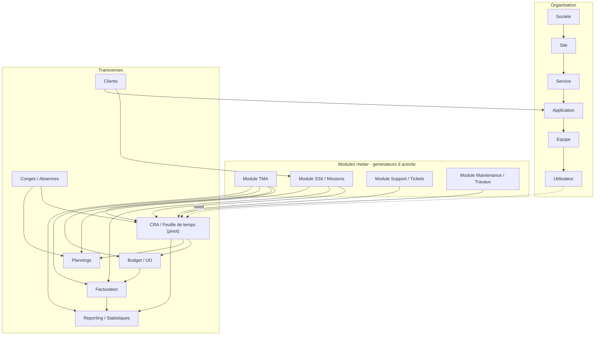

- Le **CRA est le pivot** : modules métier et congés l'alimentent par pré-remplissage
- Les **Clients** sont rattachés aux missions (SSII) et applications (TMA)
- La **Facturation** consolide CRA + Budget + TMA/SSII
- Plannings et Reporting sont des vues sans modification des flux sources

---

## §6 Cas d'utilisation

### §6.1 Diagramme use-case — Collaborateur / Développeur

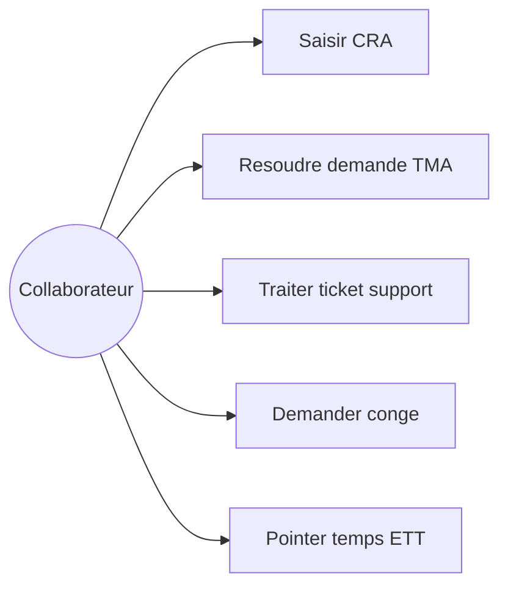

### §6.2 Diagramme use-case — Manager / Responsable

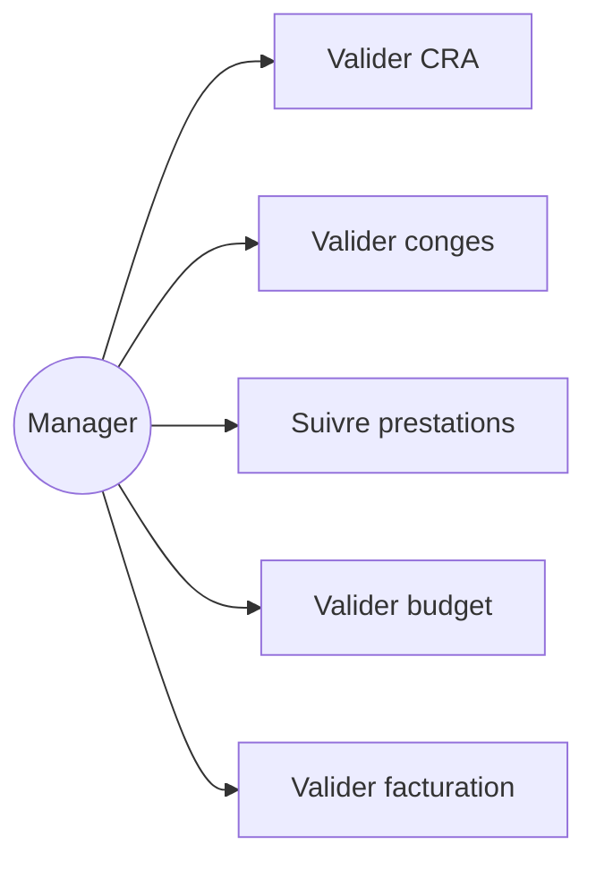

### §6.3 Diagramme use-case — Commercial / Admin

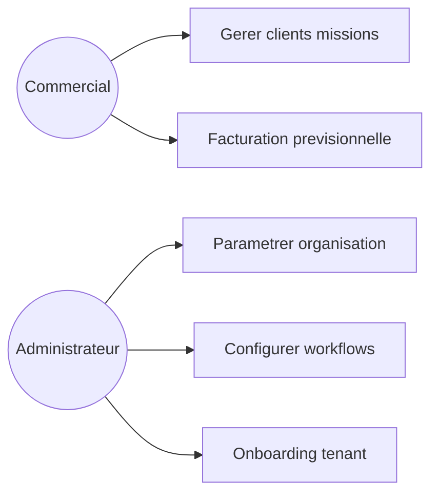

### §6.4 Diagramme use-case — Externes

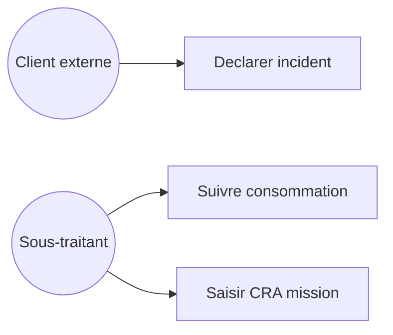

### §6.5 Tableau de correspondance acteur → processus

| Acteur | Cas d'usage principaux | Processus §8 |
| --- | --- | --- |
| Collaborateur | CRA, résolution, pointage ETT | PR-08.2, PR-08.3, PR-08.4, PR-08.6 |
| Chef d'équipe | Affectation, Gantt, validation CRA | PR-08.2, PR-08.3 |
| Manager | Congés, prestations, budget, factures | PR-08.5, PR-08.8, PR-08.9, PR-08.10 |
| Commercial | Clients, missions, facturation | PR-08.7, PR-08.10 |
| Support | Tickets, réponses, CRA | PR-08.4 |
| Admin | Onboarding, workflows | PR-08.1 |
| Chef utilisateur | Gate demandes TMA | PR-08.3 |
| Client externe | Déclaration incidents | PR-08.3, PR-08.4 |

---

## §7 Spécifications par module

> **§7 = description statique** des capacités par module. Les flux opérationnels détaillés sont en **§8**.

### §7.1 CRA / Feuille de temps (transversal)

**Sources** : `Bhive Worflow CRA.pptx, manuel collaborateur ssii.pdf`

#### §7.1.1 Capacités fonctionnelles

1. Pré-remplissage auto depuis missions SSII, tickets support, incidents TMA, congés validés, jours fériés
2. Saisie demi-journée (0/0.5/1) ou journée complète
3. Types de tâches : mission, hors prestation, absence, incident, ticket, férié
4. Workflow CRA prévisionnel → validation hebdo → CRA définitif mensuel
5. Infos commerciales obligatoires pour PDF (description, techno, lieu, responsable client)
6. Envoi mail automatique PDF CRA (gestion client, dernier lundi du mois)
7. Commentaires par tâche et par jour
8. Navigation calendrier multi-semaines

#### §7.1.2 Règles de gestion applicables

- **RG-CRA-01**
- **RG-CRA-02**
- **RG-CRA-03**

#### §7.1.3 Interfaces utilisateur

- Modifier son CRA
- Aperçu mensuel
- Infos commerciales mission

#### §7.1.4 Périmètre et limites

Module **CRA / Feuille de temps (transversal)** : périmètre couvert par les sources legacy. Évolutions Kore (API, mobile, intégrations) : cf. §15 et §17.

### §7.10 Administration / Paramétrage

**Sources** : `manuel utilisateur parametrage.pdf, nouveau parametrage.pdf`

#### §7.10.1 Capacités fonctionnelles

1. Workflows : états, déclencheurs Document×Action, exclusions client/app
2. Rubriques analyse : fonctionnelle, technique, risques, scénario test
3. États de fiche : intervenant, document déclencheur, action déclencheur
4. Types de fiche + Groupe stats
5. Modèles devis/estimation (tâches visibles, pas de création libre)
6. Modèles interface (simple → complexe)
7. Répertoire téléphonique (accès par profil/utilisateur)
8. Notifications, TMA-Rapport, TMA-Statistique configurables

#### §7.10.2 Règles de gestion applicables

- **RG-ORG-01**
- **RG-SEC-02**

#### §7.10.3 Interfaces utilisateur

- Paramétrage workflow
- Notifications
- Rubriques

#### §7.10.4 Périmètre et limites

Module **Administration / Paramétrage** : périmètre couvert par les sources legacy. Évolutions Kore (API, mobile, intégrations) : cf. §15 et §17.

### §7.11 Fonctionnalités transverses

**Sources** : `manuels manager, parametrage`

#### §7.11.1 Capacités fonctionnelles

1. Accueil / Informations personnelles avec confidentialité mail/téléphone
2. Reconstruction CV depuis technologies + poste + infos mission
3. Release et Code livraison (suivi avancement, facturation forfait)
4. Suivi d'avancement mail matinal paramétrable
5. Suivi petits projets mail vendredi
6. Export XML prestations par prestataire/client

#### §7.11.2 Règles de gestion applicables

- **RG-SEC-01**

#### §7.11.3 Interfaces utilisateur

- Fiche personnelle
- CV
- Exports XML

#### §7.11.4 Périmètre et limites

Module **Fonctionnalités transverses** : périmètre couvert par les sources legacy. Évolutions Kore (API, mobile, intégrations) : cf. §15 et §17.

### §7.12 Enregistrement légal du temps (ETT) — conformité UE

**Sources** : `Réglementation 2003/88/CE, CJUE C-55/18, C-531/23`

#### §7.12.1 Capacités fonctionnelles

1. Pointage multi-canal : web, mobile, badge/API, saisie a posteriori tracée
2. Données : heure_début, heure_fin, pauses → heures effectives/HS/repos
3. Journal audit append-only (inaltérabilité)
4. Portail salarié consultation/validation relevés
5. Export inspection du travail (PDF/structuré)
6. Rétention paramétrable par pays (NL 52 sem., DK 5 ans, BE à préciser)
7. Périmètre salariés sous contrat uniquement
8. Alertes : dépassement durée, repos non respecté, relevés manquants
9. Réconciliation ETT ↔ CRA avec signalement écarts
10. Échéance BE 01/01/2027 (tolérance 31/03/2027)

#### §7.12.2 Règles de gestion applicables

- **RG-ETT-01**
- **RG-ETT-02**
- **RG-ETT-03**

#### §7.12.3 Interfaces utilisateur

- Pointage
- Portail salarié
- Export inspection

#### §7.12.4 Périmètre et limites

Module **Enregistrement légal du temps (ETT) — conformité UE** : périmètre couvert par les sources legacy. Évolutions Kore (API, mobile, intégrations) : cf. §15 et §17.

### §7.2 Module TMA

**Sources** : `bhive module TMA.pdf, workflow tma.pdf, Test module TMA.pptx`

#### §7.2.1 Capacités fonctionnelles

1. Cycle de vie demande : création → affectation → estimation → analyses → tests → développement → clôture
2. Artefacts : estimation UO/jours, devis, analyse fonctionnelle/technique/risques, scénario test
3. Chef utilisateur + état « En attente de création » (gate amont)
4. Notion Rework : consommation supplémentaire post-clôture
5. Release (mini-projets) et Code livraison (MEP groupée)
6. Impression sélective documents (existants vs manquants, UO ou jour)
7. Export XML 17 champs (id, Type, État, Sujet, dates, estimations, charge, application, release...)
8. Gantt piloté par estimation/devis/CRA
9. Reporting TMA configurable sur demande
10. Dossier d'analyse PDF centralisé par demande

#### §7.2.2 Règles de gestion applicables

- **RG-TMA-01**
- **RG-TMA-02**
- **RG-TMA-03**
- **RG-BUD-01**

#### §7.2.3 Interfaces utilisateur

- Création incident
- Affectation
- Suivi Gantt
- Export XML

#### §7.2.4 Périmètre et limites

Module **Module TMA** : périmètre couvert par les sources legacy. Évolutions Kore (API, mobile, intégrations) : cf. §15 et §17.

### §7.3 Module SSII / Missions

**Sources** : `bhive gestion des ssii.pdf, mission.pdf, module ssii.pptx`

#### §7.3.1 Capacités fonctionnelles

1. CRUD clients et missions (1 mission → N collaborateurs)
2. Saisie période OU nombre de jours en mission
3. Recherche profils par caractéristiques mission (technologies, poste)
4. Pré-remplissage CRA futur (sauf congés validés et fériés)
5. Notes de frais récurrentes ou ponctuelles intégrées au CRA mensuel
6. Infos mission mensuelles pour reconstruction CV
7. Alertes fin de mission (mail lundis matin)
8. Planning consolidé 60 jours
9. Facturation prévisionnelle multi-mois temps réel
10. Factures virtuelles auto-calculées (CRA × TJM)

#### §7.3.2 Règles de gestion applicables

- **RG-MISS-01**
- **RG-MISS-02**
- **RG-FAC-01**

#### §7.3.3 Interfaces utilisateur

- Fiche mission
- Planning 60j
- Facturation prévisionnelle

#### §7.3.4 Périmètre et limites

Module **Module SSII / Missions** : périmètre couvert par les sources legacy. Évolutions Kore (API, mobile, intégrations) : cf. §15 et §17.

### §7.4 Module Support / Tickets

**Sources** : `Bhive Gestion ticket.pptx, module support.pptx`

#### §7.4.1 Capacités fonctionnelles

1. Création demande web ou par mail entrant
2. Activité paramétrable : logiciel, service, marque, partenaire
3. Affectation, prise en charge, réponses historisées
4. Étude distincte de la réponse (analyse notée)
5. Sous-menu « Les autres demandes » (visibilité même client)
6. Lien CRA automatique à la résolution
7. Base de connaissance : capitalisation expérience tickets
8. Extensions possibles : chef utilisateur, code livraison, devis, estimation

#### §7.4.2 Règles de gestion applicables

- **RG-SUP-01**

#### §7.4.3 Interfaces utilisateur

- Déclaration ticket
- Réponses
- Études
- CRA ticket

#### §7.4.4 Périmètre et limites

Module **Module Support / Tickets** : périmètre couvert par les sources legacy. Évolutions Kore (API, mobile, intégrations) : cf. §15 et §17.

### §7.5 Module Maintenance / Demande de travaux

**Sources** : `bhive presentation 18p.pdf`

#### §7.5.1 Capacités fonctionnelles

1. Cycle simplifié : Demande de travaux → En attente → Affecter → Suivi
2. Variante du moteur de demandes (proche TMA/Support, allégé)
3. Pas d'artefacts d'analyse obligatoires
4. Alimentation CRA à l'affectation/résolution
5. Workflow configurable par admin

#### §7.5.2 Règles de gestion applicables

- **—**

#### §7.5.3 Interfaces utilisateur

- Création travaux
- Affectation
- Suivi

#### §7.5.4 Périmètre et limites

Module **Module Maintenance / Demande de travaux** : périmètre couvert par les sources legacy. Évolutions Kore (API, mobile, intégrations) : cf. §15 et §17.

### §7.6 Congés / Absences

**Sources** : `bhive gestion des congés.pdf, Worklow congés.pptx`

#### §7.6.1 Capacités fonctionnelles

1. Demande absence : type admin, demi-journée/journée, motif
2. Validation/refus manager avec mail automatique
3. Planning absences 60 jours (en attente, validés, refusés, week-ends, fériés)
4. Compteurs congés consultables et augmentables manuellement
5. Reconfiguration jours accordés avant validation
6. Deux modes : procédure validation OU saisie libre CRA
7. Jours fériés/ponts par site (récurrent, saisissable, code budget)
8. Impact CRA futur uniquement après validation

#### §7.6.2 Règles de gestion applicables

- **RG-CONG-01**
- **RG-CONG-02**

#### §7.6.3 Interfaces utilisateur

- Demande absence
- Planning 60j
- Compteurs

#### §7.6.4 Périmètre et limites

Module **Congés / Absences** : périmètre couvert par les sources legacy. Évolutions Kore (API, mobile, intégrations) : cf. §15 et §17.

### §7.7 Budget / UO

**Sources** : `bhive gestion uo.pdf`

#### §7.7.1 Capacités fonctionnelles

1. UO = demi-journée de prestation
2. Suivi simultané Jour / UO / Euro
3. Estimation → Devis (devis prime estimation)
4. Validation/refus détail budgétaire mensuel (interface prestations)
5. Budget hors prestation et tâches absence planifiables
6. Stratégie budgétaire par pays/site (TMA interne vs offshore)
7. Paramétrage coût journalier et UO par application × collaborateur

#### §7.7.2 Règles de gestion applicables

- **RG-BUD-01**
- **RG-BUD-02**

#### §7.7.3 Interfaces utilisateur

- Suivi budgétaire
- Détail budget prestations

#### §7.7.4 Périmètre et limites

Module **Budget / UO** : périmètre couvert par les sources legacy. Évolutions Kore (API, mobile, intégrations) : cf. §15 et §17.

### §7.8 Facturation et e-invoicing

**Sources** : `module TMA.pdf, gestion ssii.pdf`

#### §7.8.1 Capacités fonctionnelles

1. SSII : factures virtuelles → cycle piloté PDP
2. TMA réel : jours prestés (CRA) × PU journalier
3. TMA forfait : mises en production × devis/estimation validés
4. Avoirs et factures manuelles
5. Kore calcule et produit payload JSON canonique interne
6. Mapping EN 16931 : Factur-X / UBL / CII
7. Transmission connecteur PDP/PA (Kore N'ÉMET PAS de e-facture)
8. Synchronisation statuts PDP : déposée/reçue/acceptée/refusée/encaissée
9. e-reporting et archivage 10 ans délégués à la PDP

#### §7.8.2 Règles de gestion applicables

- **RG-FAC-01**
- **RG-FAC-02**
- **RG-FAC-03**

#### §7.8.3 Interfaces utilisateur

- Factures virtuelles
- Validation manager
- Connecteur PDP

#### §7.8.4 Périmètre et limites

Module **Facturation et e-invoicing** : périmètre couvert par les sources legacy. Évolutions Kore (API, mobile, intégrations) : cf. §15 et §17.

### §7.9 Plannings, tableaux de bord et reporting

**Sources** : `presentation.pdf, presentation 18p.pdf, Etude marchés.pptx`

#### §7.9.1 Capacités fonctionnelles

1. Gantt (CRA/estimation/devis)
2. Planning résolution incidents
3. Planning missions 60j, congés 60j
4. Planning astreinte, suivi production, capacity planning
5. Dashboards : prestation par collaborateur/partenaire/budget
6. Reporting TMA configurable (gratuit sur demande)
7. Statistiques facturation / CA
8. Suivi de projet : alertes + stats + budget + graphe de suivi

#### §7.9.2 Règles de gestion applicables

- **—**

#### §7.9.3 Interfaces utilisateur

- Gantt
- Dashboards
- Rapports TMA

#### §7.9.4 Périmètre et limites

Module **Plannings, tableaux de bord et reporting** : périmètre couvert par les sources legacy. Évolutions Kore (API, mobile, intégrations) : cf. §15 et §17.

---

## §8 Processus métier détaillés

> Template uniforme : Objectif → Acteurs → Préconditions → Déclencheur → Étapes → RG → Exceptions → Postconditions → Effets de bord → Critères d'acceptation.

### PR-08.1 Mise en place initiale (onboarding tenant)

**Objectif** : Rendre l'instance Kore opérationnelle avant toute saisie métier.

**Acteurs** : Administrateur

**Préconditions** : Compte administrateur actif ; Module(s) souscrit(s) activés

**Déclencheur** : Création d'un nouveau tenant ou démarrage projet client

#### Étapes nominales

| Étape | Action | Acteur | Prérequis | Résultat |
| --- | --- | --- | --- | --- |
| 1 | Contrôler infos société (utilisées dans PDF) | Admin | Compte admin actif | Société paramétrée |
| 2 | Créer tous les sites (géolocalisation, budget TMA) | Admin | Société OK | Sites créés |
| 3 | Créer services (responsable obligatoire) | Admin | Sites créés | Services créés |
| 4 | Créer comptes utilisateurs (profil, CRA, XXX_nom) | Admin | Services créés | Comptes actifs |
| 5 | Affecter responsables de service | Admin | Comptes créés | Hiérarchie complète |
| 6 | Configurer visibilité résolution TMA | Admin | Module TMA activé | UI adaptée |
| 7 | Personnaliser workflows (types, états, exclusions) | Admin | Applications créées | Workflows actifs |

#### Règles de gestion applicables

- **RG-ORG-01**
- **RG-SEC-02**
- **RG-BUD-01**

#### Flux alternatifs / exceptions

- Service sans responsable : bloquer étape 3 jusqu'à affectation (ADMIN temporaire accepté)
- Compte sans profil valide : refuser création
- Workflow incomplet : incident non créable (alerte admin)
- Expiration compte pendant saisie : déconnexion forcée

**Postconditions** : Organisation complète ; Workflows actifs ; Utilisateurs connectables

#### Effets de bord transverses

| Domaine | Effet |
| --- | --- |
| CRA | — |
| Gantt | — |
| Budget | Budget défaut paramétré |
| Mail | Notifications configurées |
| PDF | Infos société dans exports |
| Facturation | — |

#### Critères d'acceptation

- [ ] Un utilisateur peut se connecter avec son compte XXX_nom
- [ ] Un incident peut être créé après étape 7
- [ ] Les workflows envoient les mails configurés

### PR-08.2 CRA — prévisionnel et définitif

**Objectif** : Collecter, valider et transmettre le compte rendu d'activité mensuel.

**Acteurs** : Collaborateur, Manager, Système

**Préconditions** : Compte avec flag CRA requis ; Missions/tickets/congés actifs

**Déclencheur** : Événement métier (mission, ticket, congé validé) ou fin de semaine/mois

#### Étapes nominales

| Étape | Action | Acteur | Prérequis | Résultat |
| --- | --- | --- | --- | --- |
| 1 | Pré-remplissage auto depuis sources métier | Système | Événement déclencheur | Lignes CRA générées |
| 2 | Saisie/correction hebdomadaire | Collaborateur | CRA ouvert | CRA semaine sauvegardé |
| 3 | Validation CRA prévisionnel | Collaborateur | Semaine complète | État validé semaine |
| 4 | Complétion infos commerciales | Collaborateur | Fin de mois | Champs obligatoires remplis |
| 5 | Génération PDF et envoi mail | Système | Infos validées | PDF transmis |
| 6 | Validation manager (option globale) | Manager | CRA soumis | CRA définitif validé |

#### Diagramme

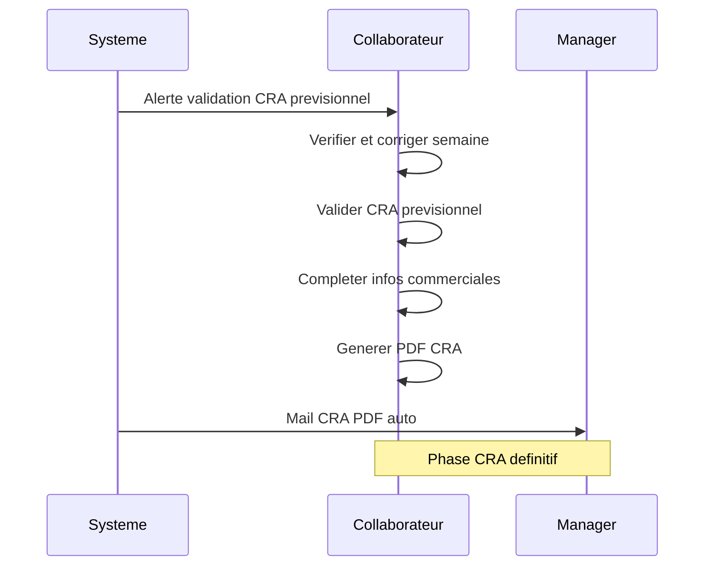

#### Règles de gestion applicables

- **RG-CRA-01**
- **RG-CRA-02**
- **RG-CRA-03**

#### Flux alternatifs / exceptions

- PDF sans infos commerciales : blocage (RG-CRA-02)
- Conflit mission + absence même jour : correction manuelle requise
- Refus validation manager : retour collaborateur avec notification
- Compte expiré en cours de saisie : sauvegarde puis déconnexion

**Postconditions** : CRA mensuel validé ; PDF archivé/envoyé ; Données facturation alimentées

#### Effets de bord transverses

| Domaine | Effet |
| --- | --- |
| CRA | Source pivot |
| Gantt | Temps passé, reste à faire |
| Budget | Consommation mise à jour |
| Mail | Alerte + PDF auto |
| PDF | CRA mensuel client |
| Facturation | Base calcul virtuelle |

#### Critères d'acceptation

- [ ] Le pré-remplissage ne supprime jamais une saisie existante
- [ ] Le PDF est bloqué sans infos commerciales
- [ ] Le Gantt reflète le temps saisi

### PR-08.3 TMA — cycle de vie d'une demande

**Objectif** : Traiter une demande TMA de la création à la clôture avec artefacts optionnels.

**Acteurs** : Utilisateur, Chef utilisateur, Responsable application, Développeur, Système

**Préconditions** : Application paramétrée (budget défaut, équipe) ; Workflow TMA actif

**Déclencheur** : Création d'un incident par un membre d'équipe applicative

#### Étapes nominales

| Étape | Action | Acteur | Prérequis | Résultat |
| --- | --- | --- | --- | --- |
| 1 | Création incident (ou attente chef utilisateur) | Utilisateur/Chef util. | Type activé | Demande créée |
| 2 | Affectation développeur | Responsable app | Demande soumise | Développeur notifié |
| 3 | Prise en charge | Développeur | Affectation | État en cours |
| 4 | Production artefacts (estimation, devis, analyses, tests) | Équipe TMA | En cours | Documents produits |
| 5 | Développement et clôture | Développeur | Résolution | Demande résolue |
| 6 | Rework éventuel | Développeur | Consommation supp. | Demande réouverte |

#### Diagramme

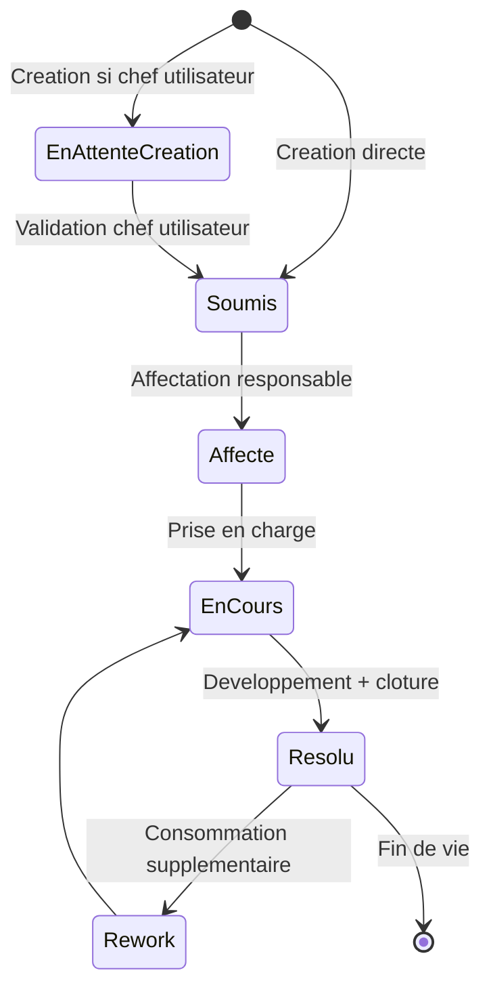

#### Règles de gestion applicables

- **RG-TMA-01**
- **RG-TMA-02**
- **RG-TMA-03**
- **RG-BUD-01**

#### Flux alternatifs / exceptions

- Demande sans affectation > délai : escalade responsable
- Refus validation chef utilisateur : demande non transmise TMA
- Test croisé échoué : réaffectation autre testeur
- Demande sans budget défaut : création bloquée

**Postconditions** : Demande clôturée ou en rework ; CRA alimenté ; Budget consommé

#### Effets de bord transverses

| Domaine | Effet |
| --- | --- |
| CRA | Incident proposé à la saisie |
| Gantt | Estimation/devis/CRA |
| Budget | Consommation UO/jours |
| Mail | Workflow notifications |
| PDF | Dossier analyse |
| Facturation | Base forfait/réel |

#### Critères d'acceptation

- [ ] Demande invisible TMA tant que chef utilisateur non validé
- [ ] Devis prime estimation dans budget
- [ ] Rework réouvre comptabilisation

### PR-08.4 Support / Tickets

**Objectif** : Gérer le cycle de vie d'un ticket support de la déclaration à la résolution.

**Acteurs** : Utilisateur/Client, Support, Responsable service, Système

**Préconditions** : Module Support activé ; Activités paramétrées

**Déclencheur** : Déclaration web ou mail entrant

#### Étapes nominales

| Étape | Action | Acteur | Prérequis | Résultat |
| --- | --- | --- | --- | --- |
| 1 | Déclaration problème | Utilisateur/Client | Activité/type choisis | Ticket créé, mail équipe |
| 2 | Prise en charge | Support | Ticket en attente | État mis à jour |
| 3 | Réponse historisée | Support | Ticket ouvert | Mail créateur |
| 4 | Étude (analyse notée) | Support | Besoin analyse | Note ajoutée |
| 5 | Résolution et clôture | Support | Problème résolu | Notification utilisateur |
| 6 | Saisie CRA | Support | Ticket résolu | Ticket proposé CRA |
| 7 | Validation prestations manager | Responsable | Fin de mois | Budget consolidé |

#### Règles de gestion applicables

- **RG-SUP-01**

#### Flux alternatifs / exceptions

- Mail entrant non reconnu : ticket brouillon admin
- Ticket sans réponse > SLA : alerte (à paramétrer Kore)
- Réaffectation support : historique conservé

**Postconditions** : Ticket résolu ; Historique complet ; CRA alimenté

#### Effets de bord transverses

| Domaine | Effet |
| --- | --- |
| CRA | Ticket intervention |
| Gantt | Planning résolution |
| Budget | Consolidation auto |
| Mail | Création + réponses |
| PDF | Réponse PDF possible |
| Facturation | — |

#### Critères d'acceptation

- [ ] Chaque réponse historisée avec mail créateur
- [ ] Ticket visible dans CRA après résolution

### PR-08.5 Congés / Absences

**Objectif** : Gérer les demandes d'absence avec validation manager et impact CRA.

**Acteurs** : Collaborateur, Manager, Système

**Préconditions** : Module Congés activé ou saisie libre CRA

**Déclencheur** : Création demande absence par collaborateur

#### Étapes nominales

| Étape | Action | Acteur | Prérequis | Résultat |
| --- | --- | --- | --- | --- |
| 1 | Création demande (type, période, motif) | Collaborateur | Compte actif | Demande en attente |
| 2 | Notification manager | Système | Demande créée | Mail + alerte accueil |
| 3 | Consultation planning/compteurs | Manager | Demande reçue | Décision informée |
| 4 | Validation ou refus | Manager | Décision prise | Statut mis à jour |
| 5 | Mise à jour CRA futur | Système | Si validé | Jours absence dans CRA |

#### Diagramme

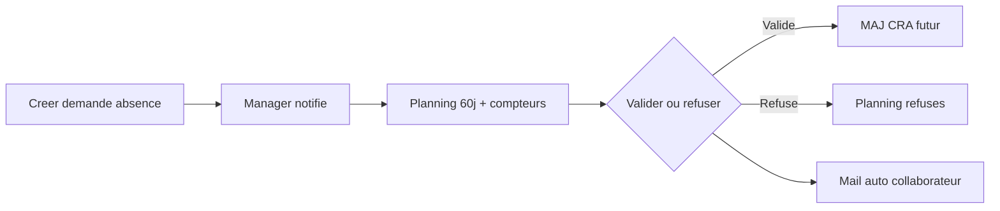

#### Règles de gestion applicables

- **RG-CONG-01**
- **RG-CONG-02**

#### Flux alternatifs / exceptions

- Modification demande après validation : interdite (retirer manuellement du CRA possible)
- Refus : visible planning refusés, modifiable
- Mode saisie libre : pas de contrôle amont

**Postconditions** : Absence traitée ; CRA futur cohérent ; Compteurs mis à jour

#### Effets de bord transverses

| Domaine | Effet |
| --- | --- |
| CRA | Jours absence pré-remplis |
| Gantt | — |
| Budget | Tâches absence planifiables |
| Mail | Notification manager/collab |
| PDF | — |
| Facturation | — |

#### Critères d'acceptation

- [ ] Validation n'impacte que jours > date du jour
- [ ] Refus génère mail auto et reste visible

### PR-08.6 Enregistrement légal du temps (ETT)

**Objectif** : Capturer des relevés objectifs, fiables et accessibles des heures prestées (conformité UE).

**Acteurs** : Salarié, Manager, RH/Admin, Inspection du travail

**Préconditions** : Utilisateur flaggé salarié ; Juridiction site activée ; Règles pays paramétrées

**Déclencheur** : Début journée travail ou saisie a posteriori

#### Étapes nominales

| Étape | Action | Acteur | Prérequis | Résultat |
| --- | --- | --- | --- | --- |
| 1 | Pointage début | Salarié | Jour ouvré | Heure début enregistrée |
| 2 | Pointage pauses | Salarié | En cours | Pauses tracées |
| 3 | Pointage fin | Salarié | Fin journée | Heure fin enregistrée |
| 4 | Calcul heures effectives/HS/repos | Système | Pointages complets | Relevé calculé |
| 5 | Contrôle règles pays | Système | Relevé calculé | Conforme ou alerte |
| 6 | Réconciliation CRA | Système | Relevé conforme | Pré-remplissage CRA |
| 7 | Consultation/validation salarié | Salarié | Relevé disponible | Relevé validé |
| 8 | Export inspection | RH/Admin | Demande audit | Export produit |

#### Diagramme

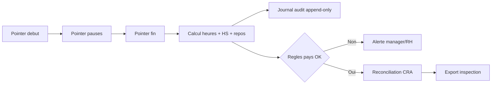

#### Règles de gestion applicables

- **RG-ETT-01**
- **RG-ETT-02**
- **RG-ETT-03**

#### Flux alternatifs / exceptions

- Oubli pointage : relance + saisie a posteriori tracée
- Correction : entrée audit append-only
- Télétravail/mobilité : pointage app mobile
- Multi-pays : règles du site applicable

**Postconditions** : Relevé journalier conforme ; Audit complet ; CRA réconcilié

#### Effets de bord transverses

| Domaine | Effet |
| --- | --- |
| CRA | Pré-remplissage depuis ETT |
| Gantt | — |
| Budget | — |
| Mail | Alertes conformité |
| PDF | Export inspection |
| Facturation | — |

#### Critères d'acceptation

- [ ] Alerte si relevé manquant jour ouvré BE
- [ ] Correction tracée dans journal audit
- [ ] Export inspection produit sur demande

### PR-08.7 SSII — Mission et facturation

**Objectif** : Staffer des missions, pré-remplir CRA et préparer facturation.

**Acteurs** : Commercial, Collaborateur, Manager, Système

**Préconditions** : Client créé ; Module SSII activé

**Déclencheur** : Création ou modification mission

#### Étapes nominales

| Étape | Action | Acteur | Prérequis | Résultat |
| --- | --- | --- | --- | --- |
| 1 | Création client | Commercial | — | Client actif |
| 2 | Création mission (période/TJM/collabs) | Commercial | Client actif | Mission créée |
| 3 | Pré-remplissage CRA futur | Système | Mission active | Jours mission dans CRA |
| 4 | Validation CRA + notes de frais | Collaborateur | Fin de mois | CRA soumis |
| 5 | Validation prestations manager | Manager | CRA soumis | Prestations validées |
| 6 | Calcul facture virtuelle | Système | CRA validés | Montant virtuel affiché |
| 7 | Création/transmission facture PDP | Commercial/Manager | Validation | Facture transmise |

#### Diagramme

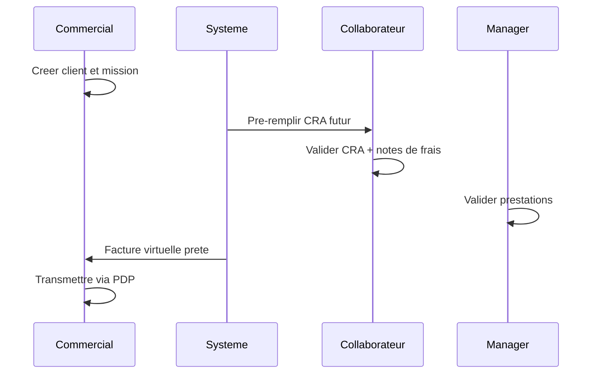

#### Règles de gestion applicables

- **RG-MISS-01**
- **RG-MISS-02**
- **RG-FAC-01**

#### Flux alternatifs / exceptions

- Mission sans collaborateur : bloquer création
- Modification date fin : recalcul CRA futur
- Arrêt mission : suppression CRA futurs uniquement
- Congé validé : pas de jour mission généré

**Postconditions** : Mission suivie ; CRA cohérent ; Facturation préparée

#### Effets de bord transverses

| Domaine | Effet |
| --- | --- |
| CRA | Jours mission |
| Gantt | Planning 60j |
| Budget | — |
| Mail | CRA mensuel, fin mission |
| PDF | CRA PDF |
| Facturation | Virtuelle → PDP |

#### Critères d'acceptation

- [ ] Pas de jour mission sur congé/férié
- [ ] Arrêt mission supprime CRA futurs seulement
- [ ] Facture virtuelle hors statistiques

### PR-08.8 Suivi prestations mensuel (Manager)

**Objectif** : Consolider et valider les prestations mensuelles de l'équipe.

**Acteurs** : Manager, Système

**Préconditions** : CRA du mois saisis ; Module prestations activé

**Déclencheur** : Ouverture vue prestations mensuelle

#### Étapes nominales

| Étape | Action | Acteur | Prérequis | Résultat |
| --- | --- | --- | --- | --- |
| 1 | Consultation vue mensuelle par collaborateur | Manager | Mois en cours | Indicateurs affichés |
| 2 | Identification cellules rouges (CRA/absence) | Manager | Vue chargée | Anomalies visibles |
| 3 | Actions : détail congés, aperçu CRA, PDF | Manager | Anomalie | Détail consulté |
| 4 | Validation/refus détail budget | Manager | Budget à valider | Budget validé/refusé |
| 5 | Validation CRA individuelle ou globale | Manager | CRA complets | CRA validés |
| 6 | Export XML prestations | Manager | Validation | XML généré |

#### Règles de gestion applicables

- **RG-PREST-01**

#### Flux alternatifs / exceptions

- CRA incomplet : cellule rouge, validation bloquée
- Absence non validée : cellule rouge
- Validation globale partielle impossible si anomalies

**Postconditions** : Prestations validées ; Budget consolidé ; Exports disponibles

#### Effets de bord transverses

| Domaine | Effet |
| --- | --- |
| CRA | État validation final |
| Gantt | — |
| Budget | Validation mensuelle |
| Mail | — |
| PDF | Export CRA collab |
| Facturation | Déblocage calcul |

#### Critères d'acceptation

- [ ] Cellules rouges sur CRA incomplet et absence non validée
- [ ] Validation globale tous CRA du mois en une action

### PR-08.9 Budget / UO

**Objectif** : Suivre et valider la consommation budgétaire en Jour/UO/Euro.

**Acteurs** : Responsable application, Manager, Système

**Préconditions** : Budget défaut application paramétré ; Estimation/devis saisis

**Déclencheur** : Saisie estimation/devis ou consommation CRA mensuelle

#### Étapes nominales

| Étape | Action | Acteur | Prérequis | Résultat |
| --- | --- | --- | --- | --- |
| 1 | Estimation charge (UO/jours) | Responsable/Dev | Demande en cours | Estimation enregistrée |
| 2 | Production devis (remplace estimation) | Responsable | Analyse faite | Devis validé |
| 3 | Suivi consommation mensuelle | Système | CRA saisis | Jour/UO/Euro calculés |
| 4 | Validation/refus manager | Manager | Interface prestations | Budget validé/refusé |

#### Règles de gestion applicables

- **RG-BUD-01**
- **RG-BUD-02**

#### Flux alternatifs / exceptions

- Dépassement budget : alerte manager
- Refus budget : retour équipe avec justification
- Application sans budget défaut : TMA bloqué

**Postconditions** : Consommation tracée ; Budget validé ou refusé

#### Effets de bord transverses

| Domaine | Effet |
| --- | --- |
| CRA | Source consommation |
| Gantt | Estimation/devis |
| Budget | Suivi triple |
| Mail | — |
| PDF | — |
| Facturation | Base calcul |

#### Critères d'acceptation

- [ ] Devis remplace estimation dans toutes interfaces
- [ ] Suivi simultané Jour/UO/Euro

### PR-08.10 Facturation (préparation PDP / e-invoicing)

**Objectif** : Calculer les factures et transmettre à la PDP/PA sans émission interne.

**Acteurs** : Manager, Commercial, Système, PDP/PA externe

**Préconditions** : CRA/prestations validés ; Connecteur PDP configuré

**Déclencheur** : Fin de période facturation ou validation manager

#### Étapes nominales

| Étape | Action | Acteur | Prérequis | Résultat |
| --- | --- | --- | --- | --- |
| 1 | Calcul facture virtuelle (SSII ou TMA) | Système | Données validées | Montant virtuel affiché |
| 2 | Révision/complément manager | Manager | Virtuelle affichée | Données ajustées |
| 3 | Génération payload JSON canonique | Système | Données finales | Payload produit |
| 4 | Mapping EN 16931 (Factur-X/UBL/CII) | Système | Payload | Format conforme |
| 5 | Transmission PDP/PA | Système | Format prêt | Facture déposée |
| 6 | Synchronisation statuts webhook | PDP → Système | Événement PDP | Statut mis à jour |

#### Diagramme

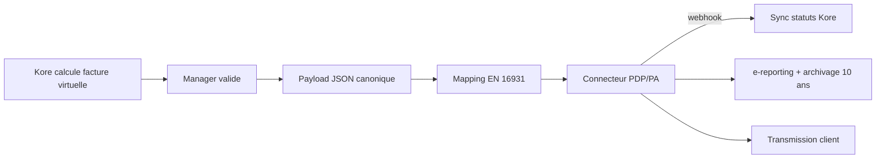

#### Règles de gestion applicables

- **RG-FAC-01**
- **RG-FAC-02**
- **RG-FAC-03**

#### Flux alternatifs / exceptions

- Facture rejetée PDP : notification + correction
- Annulation facture : statut annulé via PDP
- Mode forfait sans code livraison : calcul bloqué
- PDP indisponible : file d'attente + retry

**Postconditions** : Facture transmise PDP ; Statut synchronisé ; Traçabilité interne

#### Effets de bord transverses

| Domaine | Effet |
| --- | --- |
| CRA | Source calcul réel |
| Gantt | — |
| Budget | Montants validés |
| Mail | Notification statut |
| PDF | — |
| Facturation | Cycle PDP complet |

#### Critères d'acceptation

- [ ] Kore ne émet pas de e-facture directement
- [ ] Virtuelle exclue des statistiques
- [ ] Statuts PDP synchronisés

---

## §8bis Index consolidé des workflows

Vue matricielle processus × effets de bord — renvoie aux diagrammes §8.

| Processus | Diagramme | CRA | Gantt | Budget | Mail | PDF | Facturation |
| --- | --- | --- | --- | --- | --- | --- | --- |
| PR-08.1 | — | — | — | Budget défaut paramétré | Notifications configurées | Infos société dans exports | — |
| PR-08.2 | Séquence CRA | Source pivot | Temps passé, reste à faire | Consommation mise à jour | Alerte + PDF auto | CRA mensuel client | Base calcul virtuelle |
| PR-08.3 | États TMA | Incident proposé à la saisie | Estimation/devis/CRA | Consommation UO/jours | Workflow notifications | Dossier analyse | Base forfait/réel |
| PR-08.4 | — | Ticket intervention | Planning résolution | Consolidation auto | Création + réponses | Réponse PDF possible | — |
| PR-08.5 | Flux congés | Jours absence pré-remplis | — | Tâches absence planifiables | Notification manager/collab | — | — |
| PR-08.6 | Flux ETT | Pré-remplissage depuis ETT | — | — | Alertes conformité | Export inspection | — |
| PR-08.7 | Séquence SSII | Jours mission | Planning 60j | — | CRA mensuel, fin mission | CRA PDF | Virtuelle → PDP |
| PR-08.8 | — | État validation final | — | Validation mensuelle | — | Export CRA collab | Déblocage calcul |
| PR-08.9 | — | Source consommation | Estimation/devis | Suivi triple | — | — | Base calcul |
| PR-08.10 | Flux PDP | Source calcul réel | — | Montants validés | Notification statut | — | Cycle PDP complet |

### Transitions d'états principales

| Processus | États clés | Transitions |
| --- | --- | --- |
| PR-08.2 CRA | Brouillon → Validé semaine → Définitif | Validation collab puis manager |
| PR-08.3 TMA | Soumis → Affecté → En cours → Résolu → Rework | Workflow Document×Action |
| PR-08.4 Support | Ouvert → Pris en charge → Résolu | Réponses historisées |
| PR-08.5 Congés | En attente → Validé/Refusé | Décision manager |
| PR-08.6 ETT | Pointé → Calculé → Conforme/Alerte | Audit append-only |
| PR-08.7 SSII | Mission active → CRA validé → Virtuelle | Calcul auto |
| PR-08.10 Facturation | Virtuelle → Transmise → Statut PDP | Webhook PDP |

---

## §8ter User stories (US-xxx)

Format **Given / When / Then** — 18 user stories testables.

### US-CRA-01 — Pré-remplissage mission

**Acteur** : Collaborateur

- **Given** mission active
- **When** corrige et valide CRA hebdo
- **Then** CRA validé avec lignes mission

### US-CRA-02 — Blocage PDF

**Acteur** : Collaborateur

- **Given** infos commerciales incomplètes
- **When** tente export PDF
- **Then** message d'erreur, PDF non généré

### US-TMA-01 — Gate TMA

**Acteur** : Chef utilisateur

- **Given** demande en attente création
- **When** valide la demande
- **Then** demande visible équipe TMA

### US-TMA-02 — Devis prime estimation

**Acteur** : Responsable app

- **Given** estimation et devis saisis
- **When** consulte budget
- **Then** devis affiché comme référence

### US-TMA-03 — Test croisé

**Acteur** : Développeur

- **Given** scénario test soumis
- **When** réaffectation testeur
- **Then** état test croisé, nouveau testeur notifié

### US-TMA-04 — Rework

**Acteur** : Développeur

- **Given** demande résolue
- **When** consommation supplémentaire
- **Then** demande réouverte budget/CRA

### US-SSII-01 — Mission multi-collab

**Acteur** : Commercial

- **Given** client et TJM définis
- **When** affecte N collaborateurs
- **Then** CRA pré-rempli pour chaque collab

### US-SSII-02 — Arrêt mission

**Acteur** : Commercial

- **Given** mission en cours
- **When** arrête mission
- **Then** CRA futurs supprimés, passé archivé

### US-CONG-01 — Validation congé

**Acteur** : Manager

- **Given** demande en attente
- **When** valide absence
- **Then** CRA futur mis à jour

### US-CONG-02 — Refus congé

**Acteur** : Manager

- **Given** demande en attente
- **When** refuse absence
- **Then** mail auto, visible planning refusés

### US-SUP-01 — Ticket mail entrant

**Acteur** : Utilisateur

- **Given** mail support reçu
- **When** système parse mail
- **Then** ticket créé, équipe notifiée

### US-SUP-02 — Réponse historisée

**Acteur** : Support

- **Given** ticket ouvert
- **When** ajoute réponse
- **Then** historique enrichi, mail créateur

### US-PREST-01 — Validation globale CRA

**Acteur** : Manager

- **Given** mois en cours
- **When** valide tous CRA
- **Then** tous CRA du mois validés

### US-FACT-01 — Facture virtuelle SSII

**Acteur** : Commercial

- **Given** CRA validés
- **When** consulte facturation
- **Then** montant virtuel calculé, hors stats

### US-FACT-02 — Facturation TMA forfait

**Acteur** : Manager

- **Given** code livraison validé
- **When** transmet à PDP
- **Then** payload EN 16931, statut synchronisé

### US-SETUP-01 — Onboarding 7 étapes

**Acteur** : Admin

- **Given** instance neuve
- **When** exécute checklist
- **Then** utilisateur connecté, incident créable

### US-PRIV-01 — Données privées

**Acteur** : Collaborateur

- **Given** mail/tél marqués privés
- **When** collègue consulte fiche
- **Then** données masquées

### US-CV-01 — Reconstruction CV

**Acteur** : Collaborateur

- **Given** missions et technos saisies
- **When** génère CV
- **Then** CV reconstitué depuis historique

---

## §9 Catalogue des règles de gestion (RG-xxx)

| ID | Énoncé | Domaine | Processus | User Story |
| --- | --- | --- | --- | --- |
| RG-CRA-01 | Le pré-remplissage CRA n'écrase ni ne supprime jamais une saisie existante. | CRA | PR-08.2 | US-CRA-01 |
| RG-CRA-02 | L'impression PDF du CRA est impossible sans validation des infos commerciales obligatoires. | CRA | PR-08.2 | US-CRA-02 |
| RG-CRA-03 | Le CRA définitif est transmis par mail le dernier lundi du mois si paramétré. | CRA | PR-08.2 | US-CRA-01 |
| RG-CONG-01 | La validation d'absence n'impacte le CRA que pour les jours strictement postérieurs à la date du jour. | Congés | PR-08.5 | US-CONG-01 |
| RG-CONG-02 | Une absence refusée reste visible dans le planning des refusés et peut être modifiée. | Congés | PR-08.5 | US-CONG-02 |
| RG-MISS-01 | Aucun jour mission n'est généré sur un congé validé ou un jour férié. | SSII | PR-08.7 | US-SSII-01 |
| RG-MISS-02 | L'arrêt de mission supprime uniquement le CRA futur ; archive si CRA passé existe. | SSII | PR-08.7 | US-SSII-02 |
| RG-TMA-01 | Tant que non validée par le chef utilisateur, la demande TMA est invisible de l'équipe TMA. | TMA | PR-08.3 | US-TMA-01 |
| RG-TMA-02 | Le devis prime sur l'estimation dans toutes les interfaces budgétaires. | TMA | PR-08.3 | US-TMA-02 |
| RG-TMA-03 | Le rework réouvre la comptabilisation budget/CRA sur une demande clôturée. | TMA | PR-08.3 | US-TMA-04 |
| RG-SUP-01 | Chaque réponse support est historisée et déclenche un mail au créateur. | Support | PR-08.4 | US-SUP-02 |
| RG-FAC-01 | Une facture virtuelle n'est pas persistée et est exclue des statistiques. | Facturation | PR-08.10 | US-FACT-01 |
| RG-FAC-02 | Kore ne émet pas de facture électronique ; délégation obligatoire à une PDP/PA. | Facturation | PR-08.10 | US-FACT-01 |
| RG-FAC-03 | Le statut facture est synchronisé depuis la PDP (déposée/reçue/acceptée/refusée/encaissée). | Facturation | PR-08.10 | US-FACT-02 |
| RG-BUD-01 | Un budget par défaut est obligatoire pour activer le module TMA sur une application. | Budget | PR-08.9 | — |
| RG-BUD-02 | Le devis remplace l'estimation dans le suivi Jour/UO/Euro. | Budget | PR-08.9 | US-TMA-02 |
| RG-SEC-01 | Mail/téléphone marqués privés ne sont visibles que des responsables. | Sécurité | PR-08.1 | US-PRIV-01 |
| RG-SEC-02 | Un compte expiré ne peut plus se connecter. | Sécurité | PR-08.1 | US-SETUP-01 |
| RG-ETT-01 | Toute correction de pointage crée une entrée d'audit append-only (pas d'écrasement silencieux). | ETT | PR-08.6 | — |
| RG-ETT-02 | L'ETT concerne uniquement les salariés sous contrat (indépendants exclus). | ETT | PR-08.6 | — |
| RG-ETT-03 | Un relevé ETT manquant sur jour ouvré génère une alerte avant clôture mensuelle. | ETT | PR-08.6 | — |
| RG-PREST-01 | Le manager peut valider tous les CRA du mois en une action globale. | Prestations | PR-08.8 | US-PREST-01 |
| RG-ORG-01 | Format de compte utilisateur : XXX_nom (3 lettres société + nom). | Organisation | PR-08.1 | US-SETUP-01 |
| RG-ORG-02 | Manager et Assistante partagent le même profil RBAC. | Organisation | — | — |

**Total** : 24 règles de gestion identifiées et testables.

---

## §10 Exigences fonctionnelles (EF-xxx) et traçabilité

### §10.1 Catalogue EF-xxx

| ID | Énoncé | Processus | RG | US |
| --- | --- | --- | --- | --- |
| EF-CRA-01 | Pré-remplir automatiquement le CRA depuis missions, tickets, congés et jours fériés. | PR-08.2 | RG-CRA-01 | US-CRA-01 |
| EF-CRA-02 | Bloquer l'export PDF CRA sans infos commerciales validées. | PR-08.2 | RG-CRA-02 | US-CRA-02 |
| EF-TMA-01 | Gérer le cycle de vie complet d'une demande TMA avec workflow configurable. | PR-08.3 | RG-TMA-01 | US-TMA-01 |
| EF-TMA-02 | Supporter estimation, devis, analyses, tests et rework. | PR-08.3 | RG-TMA-02 | US-TMA-02 |
| EF-SSII-01 | Créer et gérer missions multi-collaborateurs avec pré-remplissage CRA. | PR-08.7 | RG-MISS-01 | US-SSII-01 |
| EF-SSII-02 | Recalculer CRA futur à l'arrêt ou modification de mission. | PR-08.7 | RG-MISS-02 | US-SSII-02 |
| EF-SUP-01 | Créer tickets support web ou mail avec réponses historisées. | PR-08.4 | RG-SUP-01 | US-SUP-01 |
| EF-CONG-01 | Workflow validation congés avec impact CRA futur. | PR-08.5 | RG-CONG-01 | US-CONG-01 |
| EF-BUD-01 | Suivre budget en Jour/UO/Euro avec validation mensuelle. | PR-08.9 | RG-BUD-01 | — |
| EF-FAC-01 | Calculer factures virtuelles SSII/TMA depuis CRA. | PR-08.10 | RG-FAC-01 | US-FACT-01 |
| EF-FAC-02 | Produire payload JSON et transmettre à connecteur PDP/PA. | PR-08.10 | RG-FAC-02 | US-FACT-02 |
| EF-ETT-01 | Enregistrer pointages légaux inaltérables multi-canal. | PR-08.6 | RG-ETT-01 | — |
| EF-ETT-02 | Réconcilier ETT et CRA avec signalement des écarts. | PR-08.6 | RG-ETT-03 | — |
| EF-PREST-01 | Vue manager prestations avec indicateurs rouges et validation globale. | PR-08.8 | RG-PREST-01 | US-PREST-01 |
| EF-SETUP-01 | Checklist onboarding 7 étapes admin. | PR-08.1 | RG-ORG-01 | US-SETUP-01 |
| EF-SEC-01 | Masquer données personnelles privées aux non-responsables. | PR-08.1 | RG-SEC-01 | US-PRIV-01 |
| EF-CV-01 | Reconstituer CV collaborateur depuis technologies et missions. | — | — | US-CV-01 |
| EF-NOTIF-01 | Envoyer notifications mail selon matrice paramétrable. | — | — | — |

### §10.2 Matrice de traçabilité

| EF | Processus §8 | RG | US | Source legacy |
| --- | --- | --- | --- | --- |
| EF-CRA-01 | PR-08.2 | RG-CRA-01 | US-CRA-01 | Worflow CRA.pptx |
| EF-CRA-02 | PR-08.2 | RG-CRA-02 | US-CRA-02 | manuel manager.pdf |
| EF-TMA-01 | PR-08.3 | RG-TMA-01 | US-TMA-01 | workflow tma.pdf |
| EF-TMA-02 | PR-08.3 | RG-TMA-02 | US-TMA-02 | module TMA.pdf |
| EF-SSII-01 | PR-08.7 | RG-MISS-01 | US-SSII-01 | gestion ssii.pdf |
| EF-SSII-02 | PR-08.7 | RG-MISS-02 | US-SSII-02 | mission.pdf |
| EF-SUP-01 | PR-08.4 | RG-SUP-01 | US-SUP-01 | Gestion ticket.pptx |
| EF-CONG-01 | PR-08.5 | RG-CONG-01 | US-CONG-01 | gestion congés.pdf |
| EF-BUD-01 | PR-08.9 | RG-BUD-01 | — | gestion uo.pdf |
| EF-FAC-01 | PR-08.10 | RG-FAC-01 | US-FACT-01 | gestion ssii.pdf |
| EF-FAC-02 | PR-08.10 | RG-FAC-02 | US-FACT-02 | module TMA.pdf |
| EF-ETT-01 | PR-08.6 | RG-ETT-01 | — | Réglementation UE |
| EF-ETT-02 | PR-08.6 | RG-ETT-03 | — | Réglementation UE |
| EF-PREST-01 | PR-08.8 | RG-PREST-01 | US-PREST-01 | suivi prestation.pdf |
| EF-SETUP-01 | PR-08.1 | RG-ORG-01 | US-SETUP-01 | demarrage.pdf |
| EF-SEC-01 | PR-08.1 | RG-SEC-01 | US-PRIV-01 | parametrage.pdf |
| EF-CV-01 | — | — | US-CV-01 | manuel collaborateur ssii.pdf |
| EF-NOTIF-01 | — | — | — | parametrage.pdf |

---

## §11 Modèle de données fonctionnel

Dictionnaire de données fonctionnel — **sans schéma SQL** (hors périmètre).

### Société

**Attributs** : Identifiant tenant, raison sociale, logo, coordonnées PDF, devise, langue défaut
**Relations** : 1→N Site

| Attribut | Type fonctionnel | Obligatoire | Règle |
| --- | --- | --- | --- |
| Identifiant | Clé métier | Oui | Unique par tenant |
| Libellé | Texte | Selon entité | — |
| Statut | Énumération | Selon entité | Piloté workflow |
| Dates | Date/heure | Selon entité | Traçabilité |
| Références | FK fonctionnelle | Selon entité | 1→N Site |

### Site

**Attributs** : Libellé, pays, géolocalisation, jours fériés, stratégie budget TMA
**Relations** : Société → N Site

| Attribut | Type fonctionnel | Obligatoire | Règle |
| --- | --- | --- | --- |
| Identifiant | Clé métier | Oui | Unique par tenant |
| Libellé | Texte | Selon entité | — |
| Statut | Énumération | Selon entité | Piloté workflow |
| Dates | Date/heure | Selon entité | Traçabilité |
| Références | FK fonctionnelle | Selon entité | Société → N Site |

### Service

**Attributs** : Type (utilisateur/informatique), responsable, commercial, assistante, suppléants
**Relations** : Site → N Service

| Attribut | Type fonctionnel | Obligatoire | Règle |
| --- | --- | --- | --- |
| Identifiant | Clé métier | Oui | Unique par tenant |
| Libellé | Texte | Selon entité | — |
| Statut | Énumération | Selon entité | Piloté workflow |
| Dates | Date/heure | Selon entité | Traçabilité |
| Références | FK fonctionnelle | Selon entité | Site → N Service |

### Application

**Attributs** : Propriétaire, technologies, mode facturation, budget défaut, UO, chef utilisateur, équipe
**Relations** : Service → N Application

| Attribut | Type fonctionnel | Obligatoire | Règle |
| --- | --- | --- | --- |
| Identifiant | Clé métier | Oui | Unique par tenant |
| Libellé | Texte | Selon entité | — |
| Statut | Énumération | Selon entité | Piloté workflow |
| Dates | Date/heure | Selon entité | Traçabilité |
| Références | FK fonctionnelle | Selon entité | Service → N Application |

### Équipe

**Attributs** : Libellé, membres, responsable
**Relations** : Application → N Équipe

| Attribut | Type fonctionnel | Obligatoire | Règle |
| --- | --- | --- | --- |
| Identifiant | Clé métier | Oui | Unique par tenant |
| Libellé | Texte | Selon entité | — |
| Statut | Énumération | Selon entité | Piloté workflow |
| Dates | Date/heure | Selon entité | Traçabilité |
| Références | FK fonctionnelle | Selon entité | Application → N Équipe |

### Utilisateur

**Attributs** : Login XXX_nom, profil, langue, CRA requis, type compte, période activation, salarié ETT
**Relations** : Équipe → N Utilisateur

| Attribut | Type fonctionnel | Obligatoire | Règle |
| --- | --- | --- | --- |
| Identifiant | Clé métier | Oui | Unique par tenant |
| Libellé | Texte | Selon entité | — |
| Statut | Énumération | Selon entité | Piloté workflow |
| Dates | Date/heure | Selon entité | Traçabilité |
| Références | FK fonctionnelle | Selon entité | Équipe → N Utilisateur |

### Client

**Attributs** : Raison sociale, contacts, TVA, missions, applications propriétaires
**Relations** : Société → N Client

| Attribut | Type fonctionnel | Obligatoire | Règle |
| --- | --- | --- | --- |
| Identifiant | Clé métier | Oui | Unique par tenant |
| Libellé | Texte | Selon entité | — |
| Statut | Énumération | Selon entité | Piloté workflow |
| Dates | Date/heure | Selon entité | Traçabilité |
| Références | FK fonctionnelle | Selon entité | Société → N Client |

### Mission

**Attributs** : Client, collaborateurs, période/nb jours, TJM, technologies, responsable client
**Relations** : Client → N Mission

| Attribut | Type fonctionnel | Obligatoire | Règle |
| --- | --- | --- | --- |
| Identifiant | Clé métier | Oui | Unique par tenant |
| Libellé | Texte | Selon entité | — |
| Statut | Énumération | Selon entité | Piloté workflow |
| Dates | Date/heure | Selon entité | Traçabilité |
| Références | FK fonctionnelle | Selon entité | Client → N Mission |

### Demande

**Attributs** : Sous-type (Incident/Ticket/Travaux/Absence), état, activité, auteur, assigné, sujet
**Relations** : Application → N Demande

| Attribut | Type fonctionnel | Obligatoire | Règle |
| --- | --- | --- | --- |
| Identifiant | Clé métier | Oui | Unique par tenant |
| Libellé | Texte | Selon entité | — |
| Statut | Énumération | Selon entité | Piloté workflow |
| Dates | Date/heure | Selon entité | Traçabilité |
| Références | FK fonctionnelle | Selon entité | Application → N Demande |

### CRA

**Attributs** : Semaines, tâches/jour (0/0.5/1), validation, infos commerciales, PDF
**Relations** : Utilisateur → N CRA

| Attribut | Type fonctionnel | Obligatoire | Règle |
| --- | --- | --- | --- |
| Identifiant | Clé métier | Oui | Unique par tenant |
| Libellé | Texte | Selon entité | — |
| Statut | Énumération | Selon entité | Piloté workflow |
| Dates | Date/heure | Selon entité | Traçabilité |
| Références | FK fonctionnelle | Selon entité | Utilisateur → N CRA |

### LigneCRA

**Attributs** : Date, type tâche, charge, commentaire, source pré-remplissage
**Relations** : CRA → N LigneCRA

| Attribut | Type fonctionnel | Obligatoire | Règle |
| --- | --- | --- | --- |
| Identifiant | Clé métier | Oui | Unique par tenant |
| Libellé | Texte | Selon entité | — |
| Statut | Énumération | Selon entité | Piloté workflow |
| Dates | Date/heure | Selon entité | Traçabilité |
| Références | FK fonctionnelle | Selon entité | CRA → N LigneCRA |

### Absence

**Attributs** : Type, période, motif, statut, jours accordés
**Relations** : Utilisateur → N Absence

| Attribut | Type fonctionnel | Obligatoire | Règle |
| --- | --- | --- | --- |
| Identifiant | Clé métier | Oui | Unique par tenant |
| Libellé | Texte | Selon entité | — |
| Statut | Énumération | Selon entité | Piloté workflow |
| Dates | Date/heure | Selon entité | Traçabilité |
| Références | FK fonctionnelle | Selon entité | Utilisateur → N Absence |

### JourFérié

**Attributs** : Date, libellé, récurrent, saisissable, code budget, sites
**Relations** : Site → N JourFérié

| Attribut | Type fonctionnel | Obligatoire | Règle |
| --- | --- | --- | --- |
| Identifiant | Clé métier | Oui | Unique par tenant |
| Libellé | Texte | Selon entité | — |
| Statut | Énumération | Selon entité | Piloté workflow |
| Dates | Date/heure | Selon entité | Traçabilité |
| Références | FK fonctionnelle | Selon entité | Site → N JourFérié |

### Budget

**Attributs** : Code, libellé, montant, devise, stratégie pays/site
**Relations** : Application → N Budget

| Attribut | Type fonctionnel | Obligatoire | Règle |
| --- | --- | --- | --- |
| Identifiant | Clé métier | Oui | Unique par tenant |
| Libellé | Texte | Selon entité | — |
| Statut | Énumération | Selon entité | Piloté workflow |
| Dates | Date/heure | Selon entité | Traçabilité |
| Références | FK fonctionnelle | Selon entité | Application → N Budget |

### ConsommationBudget

**Attributs** : Mois, jours, UO, euros, état validation
**Relations** : Budget → N Consommation

| Attribut | Type fonctionnel | Obligatoire | Règle |
| --- | --- | --- | --- |
| Identifiant | Clé métier | Oui | Unique par tenant |
| Libellé | Texte | Selon entité | — |
| Statut | Énumération | Selon entité | Piloté workflow |
| Dates | Date/heure | Selon entité | Traçabilité |
| Références | FK fonctionnelle | Selon entité | Budget → N Consommation |

### Facture

**Attributs** : État, lignes Qt×PU, TVA, application/mission, statut PDP
**Relations** : Client → N Facture

| Attribut | Type fonctionnel | Obligatoire | Règle |
| --- | --- | --- | --- |
| Identifiant | Clé métier | Oui | Unique par tenant |
| Libellé | Texte | Selon entité | — |
| Statut | Énumération | Selon entité | Piloté workflow |
| Dates | Date/heure | Selon entité | Traçabilité |
| Références | FK fonctionnelle | Selon entité | Client → N Facture |

### LigneFacture

**Attributs** : Description, quantité, PU, TVA, référence CRA/mission
**Relations** : Facture → N Ligne

| Attribut | Type fonctionnel | Obligatoire | Règle |
| --- | --- | --- | --- |
| Identifiant | Clé métier | Oui | Unique par tenant |
| Libellé | Texte | Selon entité | — |
| Statut | Énumération | Selon entité | Piloté workflow |
| Dates | Date/heure | Selon entité | Traçabilité |
| Références | FK fonctionnelle | Selon entité | Facture → N Ligne |

### Notification

**Attributs** : Type, déclencheur, destinataires, fréquence, modèle mail
**Relations** : Société → N Notification

| Attribut | Type fonctionnel | Obligatoire | Règle |
| --- | --- | --- | --- |
| Identifiant | Clé métier | Oui | Unique par tenant |
| Libellé | Texte | Selon entité | — |
| Statut | Énumération | Selon entité | Piloté workflow |
| Dates | Date/heure | Selon entité | Traçabilité |
| Références | FK fonctionnelle | Selon entité | Société → N Notification |

### Workflow

**Attributs** : Module, états, transitions, déclencheurs Document×Action
**Relations** : Société → N Workflow

| Attribut | Type fonctionnel | Obligatoire | Règle |
| --- | --- | --- | --- |
| Identifiant | Clé métier | Oui | Unique par tenant |
| Libellé | Texte | Selon entité | — |
| Statut | Énumération | Selon entité | Piloté workflow |
| Dates | Date/heure | Selon entité | Traçabilité |
| Références | FK fonctionnelle | Selon entité | Société → N Workflow |

### État

**Attributs** : Libellé, intervenant saisie, document déclencheur, action déclencheur
**Relations** : Workflow → N État

| Attribut | Type fonctionnel | Obligatoire | Règle |
| --- | --- | --- | --- |
| Identifiant | Clé métier | Oui | Unique par tenant |
| Libellé | Texte | Selon entité | — |
| Statut | Énumération | Selon entité | Piloté workflow |
| Dates | Date/heure | Selon entité | Traçabilité |
| Références | FK fonctionnelle | Selon entité | Workflow → N État |

### TypeFiche

**Attributs** : Libellé, groupe stats, module, workflow associé
**Relations** : Société → N TypeFiche

| Attribut | Type fonctionnel | Obligatoire | Règle |
| --- | --- | --- | --- |
| Identifiant | Clé métier | Oui | Unique par tenant |
| Libellé | Texte | Selon entité | — |
| Statut | Énumération | Selon entité | Piloté workflow |
| Dates | Date/heure | Selon entité | Traçabilité |
| Références | FK fonctionnelle | Selon entité | Société → N TypeFiche |

### RubriqueAnalyse

**Attributs** : Type (fonctionnelle/technique/risques/test), position, options validation
**Relations** : Société → N Rubrique

| Attribut | Type fonctionnel | Obligatoire | Règle |
| --- | --- | --- | --- |
| Identifiant | Clé métier | Oui | Unique par tenant |
| Libellé | Texte | Selon entité | — |
| Statut | Énumération | Selon entité | Piloté workflow |
| Dates | Date/heure | Selon entité | Traçabilité |
| Références | FK fonctionnelle | Selon entité | Société → N Rubrique |

### Release

**Attributs** : Libellé, demandes regroupées, reste à faire
**Relations** : Application → N Release

| Attribut | Type fonctionnel | Obligatoire | Règle |
| --- | --- | --- | --- |
| Identifiant | Clé métier | Oui | Unique par tenant |
| Libellé | Texte | Selon entité | — |
| Statut | Énumération | Selon entité | Piloté workflow |
| Dates | Date/heure | Selon entité | Traçabilité |
| Références | FK fonctionnelle | Selon entité | Application → N Release |

### CodeLivraison

**Attributs** : Date MEP, demandes groupées, objets livrés
**Relations** : Application → N CodeLivraison

| Attribut | Type fonctionnel | Obligatoire | Règle |
| --- | --- | --- | --- |
| Identifiant | Clé métier | Oui | Unique par tenant |
| Libellé | Texte | Selon entité | — |
| Statut | Énumération | Selon entité | Piloté workflow |
| Dates | Date/heure | Selon entité | Traçabilité |
| Références | FK fonctionnelle | Selon entité | Application → N CodeLivraison |

### Devis

**Attributs** : UO, jours, montant, validation client, date
**Relations** : Demande → 0..1 Devis

| Attribut | Type fonctionnel | Obligatoire | Règle |
| --- | --- | --- | --- |
| Identifiant | Clé métier | Oui | Unique par tenant |
| Libellé | Texte | Selon entité | — |
| Statut | Énumération | Selon entité | Piloté workflow |
| Dates | Date/heure | Selon entité | Traçabilité |
| Références | FK fonctionnelle | Selon entité | Demande → 0..1 Devis |

### Estimation

**Attributs** : UO, jours, date, auteur
**Relations** : Demande → 0..1 Estimation

| Attribut | Type fonctionnel | Obligatoire | Règle |
| --- | --- | --- | --- |
| Identifiant | Clé métier | Oui | Unique par tenant |
| Libellé | Texte | Selon entité | — |
| Statut | Énumération | Selon entité | Piloté workflow |
| Dates | Date/heure | Selon entité | Traçabilité |
| Références | FK fonctionnelle | Selon entité | Demande → 0..1 Estimation |

### Technologie

**Attributs** : Libellé, rattachement application/mission
**Relations** : N↔N Application/Mission

| Attribut | Type fonctionnel | Obligatoire | Règle |
| --- | --- | --- | --- |
| Identifiant | Clé métier | Oui | Unique par tenant |
| Libellé | Texte | Selon entité | — |
| Statut | Énumération | Selon entité | Piloté workflow |
| Dates | Date/heure | Selon entité | Traçabilité |
| Références | FK fonctionnelle | Selon entité | N↔N Application/Mission |

### NoteDeFrais

**Attributs** : Type récurrent/ponctuel, montant, validation, mission
**Relations** : Mission → N NoteDeFrais

| Attribut | Type fonctionnel | Obligatoire | Règle |
| --- | --- | --- | --- |
| Identifiant | Clé métier | Oui | Unique par tenant |
| Libellé | Texte | Selon entité | — |
| Statut | Énumération | Selon entité | Piloté workflow |
| Dates | Date/heure | Selon entité | Traçabilité |
| Références | FK fonctionnelle | Selon entité | Mission → N NoteDeFrais |

### PointageTemps

**Attributs** : Date, heure début/fin, pauses, canal, heures effectives/HS
**Relations** : Utilisateur → N Pointage

| Attribut | Type fonctionnel | Obligatoire | Règle |
| --- | --- | --- | --- |
| Identifiant | Clé métier | Oui | Unique par tenant |
| Libellé | Texte | Selon entité | — |
| Statut | Énumération | Selon entité | Piloté workflow |
| Dates | Date/heure | Selon entité | Traçabilité |
| Références | FK fonctionnelle | Selon entité | Utilisateur → N Pointage |

### JournalAudit

**Attributs** : Entité, champ, ancienne/nouvelle valeur, auteur, horodatage
**Relations** : PointageTemps → N entrées

| Attribut | Type fonctionnel | Obligatoire | Règle |
| --- | --- | --- | --- |
| Identifiant | Clé métier | Oui | Unique par tenant |
| Libellé | Texte | Selon entité | — |
| Statut | Énumération | Selon entité | Piloté workflow |
| Dates | Date/heure | Selon entité | Traçabilité |
| Références | FK fonctionnelle | Selon entité | PointageTemps → N entrées |

### RègleTempsTravailPays

**Attributs** : Pays, durée max, repos min, rétention, actif
**Relations** : Site → règle applicable

| Attribut | Type fonctionnel | Obligatoire | Règle |
| --- | --- | --- | --- |
| Identifiant | Clé métier | Oui | Unique par tenant |
| Libellé | Texte | Selon entité | — |
| Statut | Énumération | Selon entité | Piloté workflow |
| Dates | Date/heure | Selon entité | Traçabilité |
| Références | FK fonctionnelle | Selon entité | Site → règle applicable |

### RéponseTicket

**Attributs** : Contenu, auteur, date, pièces jointes
**Relations** : Demande → N Réponse

| Attribut | Type fonctionnel | Obligatoire | Règle |
| --- | --- | --- | --- |
| Identifiant | Clé métier | Oui | Unique par tenant |
| Libellé | Texte | Selon entité | — |
| Statut | Énumération | Selon entité | Piloté workflow |
| Dates | Date/heure | Selon entité | Traçabilité |
| Références | FK fonctionnelle | Selon entité | Demande → N Réponse |

### ActivitéSupport

**Attributs** : Logiciel, service, marque, partenaire
**Relations** : Société → N Activité

| Attribut | Type fonctionnel | Obligatoire | Règle |
| --- | --- | --- | --- |
| Identifiant | Clé métier | Oui | Unique par tenant |
| Libellé | Texte | Selon entité | — |
| Statut | Énumération | Selon entité | Piloté workflow |
| Dates | Date/heure | Selon entité | Traçabilité |
| Références | FK fonctionnelle | Selon entité | Société → N Activité |

**Total entités** : 33

### Règles de cardinalité et archivage

- Client archivé si missions existantes (pas de suppression)
- Mission archivée si CRA passé existe
- PointageTemps immuable — corrections via JournalAudit uniquement
- Facture virtuelle non persistée (RG-FAC-01)
- Demande 1→N Réponses, 0..1 Devis, 0..1 Estimation

---

## §12 Notifications et communications

### §12.1 Canaux

- Email sortant (SMTP) — canal principal legacy
- Email entrant — ouverture ticket support
- PDF joint — CRA, réponses support, dossiers analyse
- SMS / push — à définir Kore (hors périmètre legacy)

### §12.2 Règles transverses

- Signature par défaut : « Cordialement » + nom société + URL tenant
- Destinataires sélectionnables + filtrage service/équipe/application
- Fréquences : immédiat, matinal (TMA), lundi (fin mission), vendredi (petits projets), dernier lundi du mois (CRA)

### §12.3 Matrice des notifications

| Notification | Déclencheur | Fréquence | Destinataires |
| --- | --- | --- | --- |
| Demande absence | Création congé | Immédiat | Service/équipe sélectionnés |
| Fin de mission | Échéance mission | Lundis matin | Sélectionnés ; CV fin ≤ 30j |
| Suivi TMA | État fiches | Matins | Par application |
| Suivi petit projet | Mini-projets | Vendredis matin | Sélectionnés |
| CRA soumis | Validation CRA | Immédiat | Sélectionnés ; PDF joint |
| Workflow TMA | Changement état | Selon config | Intervenants |
| Nouvelle demande | Création incident | Immédiat | Responsable application |
| Ticket support | Création/réponse | Selon config | Support / utilisateur |

---

## §13 Exigences non fonctionnelles

### §13.1 Sécurité et confidentialité

| Exigence | Legacy | Cible Kore |
| --- | --- | --- |
| Transport | SSL | TLS 1.2+ obligatoire |
| Authentification | Login/mot de passe | SSO/SAML à définir |
| Comptes | Période activation/expiration | Conservé |
| Données privées | Mail/tél masqués | RG-SEC-01, RGPD à cadrer |
| Multi-tenant | URL dédiée | Isolation données à définir |

### §13.2 UX et internationalisation

- Prise en main rapide (« aucune formation » visée)
- Interfaces paramétrables simple → complexe
- Info-bulles planning
- Bilingue FR/EN par utilisateur, extensible

### §13.3 Traçabilité et conformité

- Historique réponses tickets, audit workflow, dates validation
- Conformité CMMI visée
- ETT inaltérable (journal append-only)
- e-invoicing : archivage 10 ans délégué PDP

### §13.4 Volumétrie (placeholder)

| Dimension | Valeur indicative | Statut |
| --- | --- | --- |
| Tenants | À renseigner | Placeholder |
| Utilisateurs actifs/tenant | À renseigner | Placeholder |
| Demandes/mois/tenant | À renseigner | Placeholder |
| CRA/mois/tenant | À renseigner | Placeholder |
| Pointages ETT/jour | À renseigner | Placeholder |
| Factures/mois via PDP | À renseigner | Placeholder |

---

## §14 Modèle économique

### §14.1 Legacy B-Hive

- Essai 2 mois gratuit
- Abonnement mensuel par module et par poste
- Évolutions fonctionnelles gratuites pour clients
- Options payantes (logo client sur PDF)

### §14.2 Cible Kore (indicatif)

| Édition | Périmètre | Prix indicatif /user/mois |
| --- | --- | --- |
| Starter | CRA + Congés + Budget + ETT | 9–12 € |
| Pro | + TMA/Support + préparation facturation | 19–25 € |
| Enterprise | + SSII + SSO/API + connecteurs PDP | 35–49 € |

- Métrique : per-seat actif/mois ; remise annuelle ~15–20 %
- Add-ons : connecteur PDP premium, marque blanche, support prioritaire
- e-invoicing : préparation incluse ; transit PDP en add-on ou bring-your-own-PDP

---

## §15 Périmètre MVP vs phases ultérieures

### §15.1 MVP (socle + TMA)

- Paramétrage org + utilisateurs (PR-08.1)
- CRA pré-rempli + validation (PR-08.2)
- TMA basique : demande → résolution → CRA (PR-08.3)
- Congés avec validation (PR-08.5)
- Budget basique + notifications mail

**Justification** : CRA + TMA = noyau minimal exploitable (CRA pivot). SSII/Support réutilisent le même socle.

### §15.2 Phases ultérieures

| Phase | Périmètre | Priorité |
| --- | --- | --- |
| Phase 2 | SSII complet, Support/tickets, ETT (BE 2027) | Haute si clients BE |
| Phase 3 | Facturation avancée + connecteur PDP, capacity planning | Moyenne |
| Phase 4 | Module PROJET, app mobile, ETT multi-pays, pointeuses | À cadrer |

> Si clients belges ciblés 2027 : remonter ETT en Phase 1bis (inaltérabilité dès l'architecture).

---

## §16 Glossaire

| Terme | Définition |
| --- | --- |
| GMA | Gestion de Maintenance Applicative — périmètre historique B-Hive. |
| TMA | Tierce Maintenance Applicative — maintenance corrective/évolutive applicative. |
| SSII / ESN | Société de Services / Entreprise de Services du Numérique. |
| CRA | Compte Rendu d'Activité — feuille de temps orientée projet/facturation. |
| UO | Unité d'Œuvre — demi-journée de prestation. |
| TJM | Taux Journalier Moyen — tarif journalier mission SSII. |
| Demande | Entité canonique regroupant Incident, Ticket, Travaux, Absence. |
| Incident | Sous-type Demande pour TMA/support. |
| Ticket | Sous-type Demande pour module Support. |
| Demande de travaux | Sous-type Demande pour module Maintenance. |
| Demande d'absence | Sous-type Demande pour module Congés. |
| Release | Mini-projet regroupant plusieurs demandes TMA. |
| Code livraison | Mise en production groupée — base facturation forfait. |
| Rework | Consommation supplémentaire sur demande clôturée. |
| Chef utilisateur | Rôle gate TMA — validation amont des demandes. |
| Forfait | Mode facturation TMA basé sur mises en production × devis. |
| Réel | Mode facturation TMA basé sur jours prestés × PU. |
| Inter-affectation | Période collaborateur non missionné. |
| CMMI | Référentiel maturité processus — traçabilité visée. |
| Dossier d'analyse | PDF centralisant analyses/tests d'une demande. |
| FAH | Fournisseur d'Application Hébergée — modèle SaaS legacy. |
| Facture virtuelle | Montant calculé à l'affichage, non persisté ni comptabilisé. |
| PDP / PA | Plateforme Dématérialisation Partenaire / Plateforme Agréée. |
| PPF | Portail Public Facturation — annuaire/concentrateur. |
| EN 16931 | Norme européenne facture électronique. |
| Factur-X | Format hybride PDF+XML conforme EN 16931. |
| UBL | Universal Business Language — format XML facture. |
| CII | Cross Industry Invoice — format XML facture. |
| e-reporting | Transmission données transaction/paiement administration. |
| ViDA | VAT in the Digital Age — cadre UE e-invoicing 2030. |
| Peppol | Réseau échange documents électroniques interopérables. |
| ETT | Enregistrement légal du Temps de Travail — conformité droit du travail. |
| Directive 2003/88/CE | Directive UE aménagement temps de travail. |
| CJUE C-55/18 | Arrêt CCOO v Deutsche Bank — obligation enregistrement temps. |
| CJUE C-531/23 | Arrêt Loredas — renforcement exigences enregistrement. |
| PSA | Professional Services Automation — catégorie marché cible Kore. |
| DSO | Days Sales Outstanding — délai encaissement post-facturation. |
| RBAC | Role-Based Access Control — droits L/E/V par profil. |
| L/E/V | Lecture / Écriture / Validation — niveaux de droits. |
| Multi-tenant | Instance dédiée par client avec URL propre. |
| Workflow | Moteur états/transitions piloté Document×Action. |
| Modèle | Configuration d'usage d'un module (ex. CRA avec/sans validation). |
| Prestation virtuelle | Synonyme facture virtuelle — calcul non persisté. |
| Capacity planning | Répartition charge et disponibilités équipes. |
| Base de connaissance | Capitalisation historique tickets support. |
| Payload canonique | JSON interne Kore avant mapping EN 16931. |
| Bring-your-own-PDP | Client connecte sa propre plateforme agréée. |

**Total** : 47 termes.

---

## §17 Sources documentaires et décisions ouvertes

### §17.1 Tableau des 42 fichiers sources

| Fichier | Format | Statut extraction | Contenu synthétisé |
| --- | --- | --- | --- |
| beehive/Bhive Gestion ticket.pptx | PPTX | Complet | Flux support, tickets, réponses historisées |
| beehive/Bhive Test du module TMA.pptx | PPTX | Complet | Scénarios test TMA, cycle de vie demande |
| beehive/Bhive Worflow CRA.pptx | PPTX | Complet | Workflow CRA prévisionnel/définitif |
| beehive/Bhive Worklow congés.pptx | PPTX | Complet | Workflow congés, validation manager |
| beehive/Bhive cgv.docx | DOCX | Partiel | Conditions générales de vente |
| beehive/Bhive gestion SSII.pptx | PPTX | Complet | Gestion ESN, missions, facturation |
| beehive/Bhive modele.pptx | PPTX | Complet | Modèle modulaire, profils, CRA pivot |
| beehive/Bhive présentation.pptx | PPTX | Partiel | Présentation commerciale |
| beehive/Bhive siteWeb.pptx | PPTX | Partiel | Site web, positionnement |
| beehive/Bhive suivi des prestation.pdf | PDF | Complet | Suivi prestations manager, indicateurs |
| beehive/Bhive suivi prestation.pptx | PPTX | Complet | Complément suivi prestations |
| beehive/bhive Etude du marchés.pptx | PPTX | Partiel | Étude marché, roadmap module PROJET |
| beehive/bhive cgv2.doc | DOC | Partiel | CGV version 2 |
| beehive/bhive contrat de maintenance.doc | DOC | Partiel | Contrat de maintenance |
| beehive/bhive demarrage.pdf | PDF | Complet | Checklist 7 étapes mise en place |
| beehive/bhive demarrage.pptx | PPTX | Complet | Complément démarrage |
| beehive/bhive gestion des congés.pdf | PDF | Complet | Congés, absences, compteurs, planning |
| beehive/bhive gestion des ssii.pdf | PDF | Complet | SSII, missions, facturation, notes de frais |
| beehive/bhive gestion uo.pdf | PDF | Complet | Budget, UO, suivi Jour/UO/Euro |
| beehive/bhive gestion uo.pptx | PPTX | Complet | Complément gestion UO |
| beehive/bhive manuel utilisateur SSII.ppt | PPT | Partiel | Manuel SSII (redondant PDF) |
| beehive/bhive manuel utilisateur collaborateur ssii.pdf | PDF | Complet | Manuel collaborateur, CRA mission |
| beehive/bhive manuel utilisateur manager.pdf | PDF | Complet | CRA, congés, prestations, factures |
| beehive/bhive manuel utilisateur manager.ppt | PPT | Partiel | Manuel manager (redondant PDF) |
| beehive/bhive manuel utilisateur parametrage.pdf | PDF | Complet | Workflows, notifications, paramétrage |
| beehive/bhive manuel utilisateur parametrage.ppt | PPT | Partiel | Paramétrage (redondant PDF) |
| beehive/bhive manuel utisateur modele couverture.ppt | PPT | Partiel | Modèle couverture manuel |
| beehive/bhive mission.pdf | PDF | Complet | Fiche mission, champs obligatoires |
| beehive/bhive module TMA.pdf | PDF | Complet | Module TMA, facturation, export XML |
| beehive/bhive module ssii.pptx | PPTX | Complet | Module SSII, recherche profils |
| beehive/bhive module support.pptx | PPTX | Complet | Module support, activités paramétrables |
| beehive/bhive module tma.pptx | PPTX | Complet | Module TMA, workflow |
| beehive/bhive nouveau parametrage.pdf | PDF | Complet | Nouveau paramétrage, chef utilisateur |
| beehive/bhive presentation 18p.pdf | PDF | Complet | Vision produit, modules, maintenance |
| beehive/bhive presentation vente.ppt | PPT | Partiel | Présentation vente |
| beehive/bhive presentation.pdf | PDF | Complet | Présentation générale B-Hive |
| beehive/bhive presentation.pptx | PPTX | Complet | Présentation produit |
| beehive/bhive siteweb2.pptx | PPTX | Partiel | Site web v2 |
| beehive/bhive suivie mission.pptx | PPTX | Complet | Suivi mission |
| beehive/bhive workflow TMA.pptx | PPTX | Complet | Workflow TMA |
| beehive/bhive workflow tma.pdf | PDF | Complet | Workflow TMA détaillé |
| logo/kore logo.png | Image | N/A | Logo Kore (rebranding) |

### §17.2 Décisions ouvertes Kore

| # | Sujet | Options | Impact |
| --- | --- | --- | --- |
| D1 | Périmètre MVP | TMA seul vs TMA+SSII | Roadmap, time-to-market |
| D2 | URL multi-tenant | Sous-domaine vs domaine custom | Infrastructure |
| D3 | Migration legacy B-Hive | Reprise données clients historiques | Commercial |
| D4 | SSO/API | Phase 1 vs Phase 3 | Intégrations IT |
| D5 | Partenaire PDP | Add-on vs bring-your-own-PDP | Facturation |
| D6 | Pays e-invoicing lancement | FR 2026/2027 puis UE | Conformité |
| D7 | ETT périmètre pays | BE 2027 prioritaire ? | Conformité RH |
| D8 | Canaux pointage ETT | Web/mobile/badge/API | UX salariés |
| D9 | Articulation CRA↔ETT | Pré-remplissage auto ou manuel | Processus |
| D10 | Module Maintenance | Variante moteur demandes vs module distinct | Architecture |
| D11 | Positionnement marché | PSA ESN vs ITSM vs RH | GTM |
| D12 | RGPD | Rétention, consentement, droit à l'oubli | Légal |

---

## Annexe — Hors périmètre

- Stack technique cible (Symfony legacy vs greenfield)
- Schéma de base de données SQL
- API REST / webhooks / SSO (mentionnés en décisions ouvertes uniquement)
- Maquettes UI / wireframes
- Plan de migration données clients B-Hive
- Émission et archivage probant des factures électroniques (délégué PDP/PA)
- e-reporting administratif (délégué PDP/PA)

## Checklist mise en place — 7 étapes (PR-08.1)

Source : `beehive/bhive demarrage.pdf`

| Étape | Action | Acteur | Prérequis | Résultat |
| --- | --- | --- | --- | --- |
| 1 | Contrôler infos société (utilisées dans PDF) | Admin | Compte admin actif | Société paramétrée |
| 2 | Créer tous les sites (géolocalisation, budget TMA) | Admin | Société OK | Sites créés |
| 3 | Créer services (responsable obligatoire) | Admin | Sites créés | Services créés |
| 4 | Créer comptes utilisateurs (profil, CRA, XXX_nom) | Admin | Services créés | Comptes actifs |
| 5 | Affecter responsables de service | Admin | Comptes créés | Hiérarchie complète |
| 6 | Configurer visibilité résolution TMA | Admin | Module TMA activé | UI adaptée |
| 7 | Personnaliser workflows (types, états, exclusions) | Admin | Applications créées | Workflows actifs |

### Règles de compte (étape 4)

- Profils : Utilisateur / Collaborateur / Chef d'équipe / Responsable de service / Administrateur
- Flag « Doit saisir CRA » : Non pour Utilisateur uniquement
- Interface « Activité » visible si CRA requis
- Comptes externes : client ou sous-traitant
- Expiration compte → connexion impossible (RG-SEC-02)

### Critères d'acceptation mise en place

- Un utilisateur peut se connecter avec son compte XXX_nom
- Un incident peut être créé après étape 7
- Les workflows envoient les mails configurés

