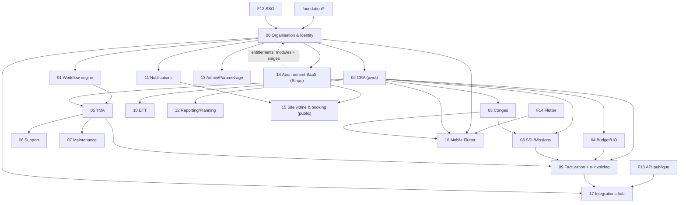

# Spécifications techniques Kore

Spécifications techniques du projet **Kore** (reprise fonctionnelle de B-Hive), implémenté en **greenfield** sur une stack moderne — **aucun code legacy** PHP/Flash/Flex dans ce dépôt.

## Stack actuelle (décision actée)

- Stack : **Go** (chi + pgx + golang-migrate), **PostgreSQL**, **Redis** (cache/sessions), **Nuxt 3** (SSR + BFF), **Flutter 3** (mobile iOS/Android), **Stripe** (abonnements), **Docker**.
- Cloud : **GCP** — Cloud Run, Cloud SQL, Memorystore (Redis **partagé**), Secret Manager, Cloud Build.
- Architecture : **monolithe modulaire** en **Clean/Hexagonal**, conception **SOLID**, services **stateless** (état partagé dans Redis).
- Source fonctionnelle : [`documentation/SPECIFICATION_FONCTIONNELLE.md`](/home/olivier/ll-it-sc/projets/kore/documentation/SPECIFICATION_FONCTIONNELLE.md).
- Analyse commerciale liée : [`documentation/ANALYSE_COMMERCIALE.md`](/home/olivier/ll-it-sc/projets/kore/documentation/ANALYSE_COMMERCIALE.md) (§2bis).

## État d'implémentation (MVP en cours)

| Brique | Statut | Packages |
| --- | --- | --- |
| 00 Organisation & Identity | Implémenté | `internal/modules/org/` |
| 01 Workflow engine | Implémenté | `internal/modules/workflow/` |
| 02 CRA (pivot) | Implémenté | `internal/modules/cra/` |
| 03 Congés | Implémenté | `internal/modules/conges/` |
| 04 Budget / UO | Implémenté | `internal/modules/budget/` |
| 05 TMA | Implémenté | `internal/modules/tma/` |
| 11 Notifications | Implémenté | `internal/modules/notifications/` |
| 14 Abonnement SaaS (Stripe) | Implémenté | `internal/modules/billing/` |
| 15 Site vitrine & booking | Implémenté | `internal/modules/publicsite/` |
| Frontend Nuxt 3 + BFF | En cours | `frontend/` |
| Mobile Flutter | Phase 1bis (planifié) | `mobile/` (à créer) |
| F12 SSO / F13 API publique / F14 Flutter | Planifié | cf. [ROADMAP.md](ROADMAP.md) |
| 06–13, 16–17 (Support, SSII, Facturation, ETT, Mobile, Intégrations, …) | Phase ultérieure | — |

## Comment utiliser ces spécifications

1. Lire d'abord l'ensemble du dossier [`foundation/`](foundation) (socle commun réutilisé par toutes les briques).
2. Consulter la [**roadmap par phases**](ROADMAP.md) pour le planning post-MVP (SSO, mobile Flutter, intégrations, conformité).
3. Implémenter les briques `modules/` **dans l'ordre de dépendance** ci-dessous.
4. Pour chaque brique : implémenter -> exécuter le **plan de tests** de la fiche -> valider la **Definition of Done** -> passer à la suivante.

Chaque fiche module est autoportante et suit le **même template** (référence fonctionnelle, périmètre, domaine, ports, adapters, API, DB, mapping SOLID, tests, frontend, DoD).

## Socle (foundation/)

| Fiche | Contenu |
| --- | --- |
| [01-architecture.md](/home/olivier/ll-it-sc/projets/kore/technical/foundation/01-architecture.md) | Hexagonal, monolithe modulaire, règle de dépendance, mapping SOLID, layout |
| [02-stack-conventions.md](/home/olivier/ll-it-sc/projets/kore/technical/foundation/02-stack-conventions.md) | Stack, versions, conventions de code et nommage |
| [03-database.md](/home/olivier/ll-it-sc/projets/kore/technical/foundation/03-database.md) | Schéma par module, migrations, sqlc, transactions, inaltérabilité |
| [04-auth-rbac.md](foundation/04-auth-rbac.md) | JWT + cookie httpOnly, OIDC SSO, matrice RBAC, multi-tenant |
| [05-api-conventions.md](foundation/05-api-conventions.md) | REST, erreurs, pagination, OpenAPI, API keys |
| [06-testing-strategy.md](foundation/06-testing-strategy.md) | Tests unitaires table-driven, mocks, testcontainers (PostgreSQL/Redis), stripe-mock, seuils |
| [07-docker-devops.md](foundation/07-docker-devops.md) | Docker Compose (db + redis + stripe-mock), test local, CI/CD |
| [08-frontend-nuxt.md](foundation/08-frontend-nuxt.md) | Nuxt 3 SSR + BFF, Pinia, auth, Material Symbols, Stripe front (≠ mobile Flutter) |
| [09-gcp-infrastructure.md](/home/olivier/ll-it-sc/projets/kore/technical/foundation/09-gcp-infrastructure.md) | Cloud Run, Cloud SQL, Memorystore, Secret Manager, Cloud Build |
| [10-cache-redis.md](/home/olivier/ll-it-sc/projets/kore/technical/foundation/10-cache-redis.md) | Port `Cache`, cache-aside, isolation par préfixe (instance partagée) |
| [11-payments-stripe.md](foundation/11-payments-stripe.md) | Stripe Billing/Checkout, webhooks, entitlements (≠ module 09/PDP) |
| [12-sso-federation.md](foundation/12-sso-federation.md) | OIDC/SAML, PKCE Flutter, fédération IdP (Phase 1) |
| [13-public-api-ecosystem.md](foundation/13-public-api-ecosystem.md) | Clés API, webhooks sortants, scopes (Phase 2) |
| [14-flutter-mobile-client.md](foundation/14-flutter-mobile-client.md) | Conventions client Flutter iOS/Android (Phase 1bis) |

## Roadmap par phases

Le [**ROADMAP.md**](ROADMAP.md) détaille les phases post-MVP, alignées sur [`documentation/ANALYSE_COMMERCIALE.md`](../documentation/ANALYSE_COMMERCIALE.md) §7 (table stakes) et §13 (quick wins) :

| Phase | Périmètre | Fondations / modules clés |
| --- | --- | --- |
| MVP | En cours | 00–05, 11, 14, 15 |
| Phase 1 | Deal breakers IT/DAF | F12, UI Nuxt 03/04/05 |
| Phase 1bis | Mobile Flutter | F14, M16 |
| Phase 2 | Écosystème + e-invoicing 2026 | F13, M17, M09, M13 |
| Phase 3 | Parité PSA + ETT BE 2027 | M10, M08, M12 |

## Briques (modules/) — ordre de construction

| # | Brique | Dépend de | MVP | Phase | Fiche |
| --- | --- | --- | --- | --- | --- |
| 00 | Organisation & Identity | foundation | Oui | — | [00-organisation-identity.md](modules/00-organisation-identity.md) |
| 01 | Workflow engine | 00 | Oui | — | [01-workflow-engine.md](modules/01-workflow-engine.md) |
| 02 | CRA (pivot) | 00 | Oui | — | [02-cra.md](modules/02-cra.md) |
| 03 | Congés / Absences | 02 | Oui | 1 (UI) | [03-conges.md](modules/03-conges.md) |
| 04 | Budget / UO | 02 | Oui | 1 (UI) | [04-budget-uo.md](modules/04-budget-uo.md) |
| 05 | TMA | 01, 02 | Oui | 1 (UI) | [05-tma.md](modules/05-tma.md) |
| 06 | Support / Tickets | 05 | Non | — | [06-support.md](modules/06-support.md) |
| 07 | Maintenance | 05 | Non | — | [07-maintenance.md](modules/07-maintenance.md) |
| 08 | SSII / Missions | 02, 00, 03 | Non | 3 | [08-ssii-missions.md](modules/08-ssii-missions.md) |
| 09 | Facturation + e-invoicing | 02, 04, 05, 08 | Non | 2 | [09-facturation-einvoicing.md](modules/09-facturation-einvoicing.md) |
| 10 | ETT (conformité temps) | 02 | Non | 3 | [10-ett-conformite.md](modules/10-ett-conformite.md) |
| 11 | Notifications | 00 | Oui | — | [11-notifications.md](modules/11-notifications.md) |
| 12 | Reporting / Planning | 02 | Non | 3 | [12-reporting-planning.md](modules/12-reporting-planning.md) |
| 13 | Admin / Paramétrage | 00 | Non | 2 | [13-admin-parametrage.md](modules/13-admin-parametrage.md) |
| 14 | Abonnement SaaS (Stripe) | 00 | Oui | — | [14-abonnement-saas-stripe.md](modules/14-abonnement-saas-stripe.md) |
| 15 | Site vitrine & booking commercial | 00, 11, 14 | Oui | — | [15-site-vitrine-booking.md](modules/15-site-vitrine-booking.md) |
| 16 | Application mobile Flutter | F12, F14, 00, 02, 03 | Non | 1bis | [16-mobile-flutter.md](modules/16-mobile-flutter.md) |
| 17 | Hub d'intégrations | F13, 00, 09, 14 | Non | 2–3 | [17-integrations-hub.md](modules/17-integrations-hub.md) |

## Périmètre MVP (spec §15)

MVP = **00 + 01 + 02 + 03 + 04 + 05 + 11 + 14 + 15**. Le module **14 (abonnement Stripe)** est intégré dès le MVP car il conditionne l'activation des modules et le plafond de sièges (SaaS commercialisable). Le module **15 (site vitrine + tunnel de vente + réservation commerciale)** est la porte d'entrée d'acquisition (page racine publique). Les briques 06 à 13 (hors 11) relèvent des phases ultérieures. Le CRA (02) est le pivot : il doit être stable avant les modules générateurs d'activité.

**Post-MVP** : phases 1 à 3 décrites dans [ROADMAP.md](ROADMAP.md) — SSO (F12), mobile Flutter (F14/M16), écosystème API (F13/M17), e-invoicing (M09), ETT (M10).

> Note d'infrastructure : le socle `foundation/` (notamment 09-GCP, 10-Redis, 11-Stripe) doit être en place avant les briques métier. Les services sont **stateless** ; tout état partagé (révocation de token, rate-limit, cache) réside dans **Redis** (Memorystore partagé, isolation par préfixe `kore:{tenant}:...`).

## Règle de validation d'une brique (gate)

Une brique est « validée » quand :
- [x] La Definition of Done de sa fiche est cochée.
- [x] Les tests unitaires (domaine + app) passent et atteignent les seuils (foundation/06).
- [x] Les tests d'intégration DB de la brique passent.
- [x] Les endpoints sont documentés dans `api/openapi.yaml`.
- [x] Les frontières hexagonales sont respectées (pas de dépendance interdite).

## Persistance SQL (décision sqlc)

**Décision MVP** : requêtes SQL **manuelles** via `pgx` dans `adapters/postgres/` — pas de génération sqlc en production pour l'instant.

- Le fichier `sqlc.yaml` reste présent pour un **pilote futur** (module org ou cra).
- Toute nouvelle brique suit le pattern repository existant jusqu'à migration sqlc planifiée.
- `make sqlc` génère vers `internal/platform/db/queries/` si activé ultérieurement.
