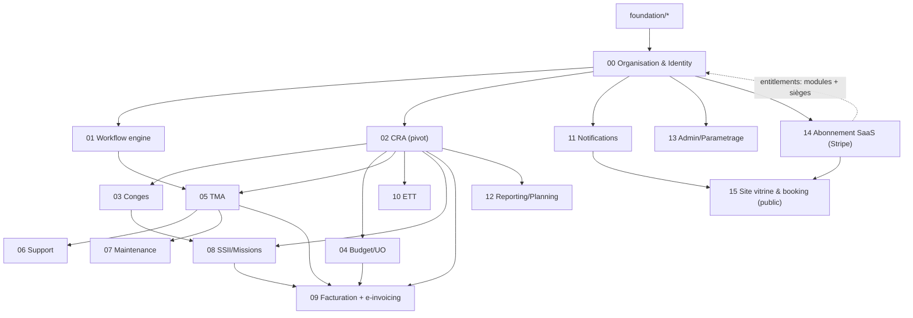

# Spécifications techniques Kore

Spécifications techniques du projet **Kore** (reprise/modernisation de B-Hive), conçues pour une **mise en place modulaire, brique par brique**.

- Stack : **Go** (chi + sqlc + golang-migrate + pgx), **PostgreSQL**, **Redis** (cache), **Nuxt 3** (SSR + BFF), **Stripe** (abonnements), **Docker**.
- Cloud : **GCP** — Cloud Run, Cloud SQL, Memorystore (Redis **partagé**), Secret Manager, Cloud Build.
- Architecture : **monolithe modulaire** en **Clean/Hexagonal**, conception **SOLID**, services **stateless** (état partagé dans Redis).
- Source fonctionnelle : [`documentation/SPECIFICATION_FONCTIONNELLE.md`](/home/olivier/ll-it-sc/projets/kore/documentation/SPECIFICATION_FONCTIONNELLE.md).
- Analyse commerciale liée : [`documentation/ANALYSE_COMMERCIALE.md`](/home/olivier/ll-it-sc/projets/kore/documentation/ANALYSE_COMMERCIALE.md).

## Comment utiliser ces spécifications

1. Lire d'abord l'ensemble du dossier [`foundation/`](/home/olivier/ll-it-sc/projets/kore/technical/foundation) (socle commun réutilisé par toutes les briques).
2. Implémenter les briques `modules/` **dans l'ordre de dépendance** ci-dessous.
3. Pour chaque brique : implémenter -> exécuter le **plan de tests** de la fiche -> valider la **Definition of Done** -> passer à la suivante.

Chaque fiche module est autoportante et suit le **même template** (référence fonctionnelle, périmètre, domaine, ports, adapters, API, DB, mapping SOLID, tests, frontend, DoD).

## Socle (foundation/)

| Fiche | Contenu |
| --- | --- |
| [01-architecture.md](/home/olivier/ll-it-sc/projets/kore/technical/foundation/01-architecture.md) | Hexagonal, monolithe modulaire, règle de dépendance, mapping SOLID, layout |
| [02-stack-conventions.md](/home/olivier/ll-it-sc/projets/kore/technical/foundation/02-stack-conventions.md) | Stack, versions, conventions de code et nommage |
| [03-database.md](/home/olivier/ll-it-sc/projets/kore/technical/foundation/03-database.md) | Schéma par module, migrations, sqlc, transactions, inaltérabilité |
| [04-auth-rbac.md](/home/olivier/ll-it-sc/projets/kore/technical/foundation/04-auth-rbac.md) | JWT + cookie httpOnly, matrice RBAC, multi-tenant |
| [05-api-conventions.md](/home/olivier/ll-it-sc/projets/kore/technical/foundation/05-api-conventions.md) | REST, erreurs, pagination, OpenAPI |
| [06-testing-strategy.md](/home/olivier/ll-it-sc/projets/kore/technical/foundation/06-testing-strategy.md) | Tests unitaires table-driven, mocks, testcontainers (PostgreSQL/Redis), stripe-mock, seuils |
| [07-docker-devops.md](/home/olivier/ll-it-sc/projets/kore/technical/foundation/07-docker-devops.md) | Docker Compose (db + redis + stripe-mock), test local, CI/CD |
| [08-frontend-nuxt.md](/home/olivier/ll-it-sc/projets/kore/technical/foundation/08-frontend-nuxt.md) | Nuxt 3 SSR + BFF, Pinia, auth, Google Fonts (Material Symbols), Stripe front |
| [09-gcp-infrastructure.md](/home/olivier/ll-it-sc/projets/kore/technical/foundation/09-gcp-infrastructure.md) | Cloud Run, Cloud SQL, Memorystore, Secret Manager, Cloud Build |
| [10-cache-redis.md](/home/olivier/ll-it-sc/projets/kore/technical/foundation/10-cache-redis.md) | Port `Cache`, cache-aside, isolation par préfixe (instance partagée) |
| [11-payments-stripe.md](/home/olivier/ll-it-sc/projets/kore/technical/foundation/11-payments-stripe.md) | Stripe Billing/Checkout, webhooks, entitlements (≠ module 09/PDP) |

## Briques (modules/) — ordre de construction

| # | Brique | Dépend de | MVP | Fiche |
| --- | --- | --- | --- | --- |
| 00 | Organisation & Identity | foundation | Oui | [00-organisation-identity.md](/home/olivier/ll-it-sc/projets/kore/technical/modules/00-organisation-identity.md) |
| 01 | Workflow engine | 00 | Oui | [01-workflow-engine.md](/home/olivier/ll-it-sc/projets/kore/technical/modules/01-workflow-engine.md) |
| 02 | CRA (pivot) | 00 | Oui | [02-cra.md](/home/olivier/ll-it-sc/projets/kore/technical/modules/02-cra.md) |
| 03 | Congés / Absences | 02 | Oui | [03-conges.md](/home/olivier/ll-it-sc/projets/kore/technical/modules/03-conges.md) |
| 04 | Budget / UO | 02 | Oui | [04-budget-uo.md](/home/olivier/ll-it-sc/projets/kore/technical/modules/04-budget-uo.md) |
| 05 | TMA | 01, 02 | Oui | [05-tma.md](/home/olivier/ll-it-sc/projets/kore/technical/modules/05-tma.md) |
| 06 | Support / Tickets | 05 | Non | [06-support.md](/home/olivier/ll-it-sc/projets/kore/technical/modules/06-support.md) |
| 07 | Maintenance | 05 | Non | [07-maintenance.md](/home/olivier/ll-it-sc/projets/kore/technical/modules/07-maintenance.md) |
| 08 | SSII / Missions | 02, 00, 03 | Non | [08-ssii-missions.md](/home/olivier/ll-it-sc/projets/kore/technical/modules/08-ssii-missions.md) |
| 09 | Facturation + e-invoicing | 02, 04, 05, 08 | Non | [09-facturation-einvoicing.md](/home/olivier/ll-it-sc/projets/kore/technical/modules/09-facturation-einvoicing.md) |
| 10 | ETT (conformité temps) | 02 | Non | [10-ett-conformite.md](/home/olivier/ll-it-sc/projets/kore/technical/modules/10-ett-conformite.md) |
| 11 | Notifications | 00 | Oui | [11-notifications.md](/home/olivier/ll-it-sc/projets/kore/technical/modules/11-notifications.md) |
| 12 | Reporting / Planning | 02 | Non | [12-reporting-planning.md](/home/olivier/ll-it-sc/projets/kore/technical/modules/12-reporting-planning.md) |
| 13 | Admin / Paramétrage | 00 | Non | [13-admin-parametrage.md](/home/olivier/ll-it-sc/projets/kore/technical/modules/13-admin-parametrage.md) |
| 14 | Abonnement SaaS (Stripe) | 00 | Oui | [14-abonnement-saas-stripe.md](/home/olivier/ll-it-sc/projets/kore/technical/modules/14-abonnement-saas-stripe.md) |
| 15 | Site vitrine & booking commercial | 00, 11, 14 | Oui | [15-site-vitrine-booking.md](/home/olivier/ll-it-sc/projets/kore/technical/modules/15-site-vitrine-booking.md) |

## Périmètre MVP (spec §15)

MVP = **00 + 01 + 02 + 03 + 04 + 05 + 11 + 14 + 15**. Le module **14 (abonnement Stripe)** est intégré dès le MVP car il conditionne l'activation des modules et le plafond de sièges (SaaS commercialisable). Le module **15 (site vitrine + tunnel de vente + réservation commerciale)** est la porte d'entrée d'acquisition (page racine publique). Les briques 06 à 13 (hors 11) relèvent des phases ultérieures. Le CRA (02) est le pivot : il doit être stable avant les modules générateurs d'activité.

> Note d'infrastructure : le socle `foundation/` (notamment 09-GCP, 10-Redis, 11-Stripe) doit être en place avant les briques métier. Les services sont **stateless** ; tout état partagé (révocation de token, rate-limit, cache) réside dans **Redis** (Memorystore partagé, isolation par préfixe `kore:{tenant}:...`).

## Règle de validation d'une brique (gate)

Une brique est « validée » quand :
- [ ] La Definition of Done de sa fiche est cochée.
- [ ] Les tests unitaires (domaine + app) passent et atteignent les seuils (foundation/06).
- [ ] Les tests d'intégration DB de la brique passent.
- [ ] Les endpoints sont documentés dans `api/openapi.yaml`.
- [ ] Les frontières hexagonales sont respectées (pas de dépendance interdite).
