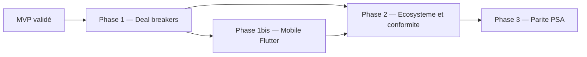

# Roadmap technique Kore — post-MVP

> Document de pilotage des phases post-MVP. Complète [`technical/README.md`](README.md) (ordre de construction des briques) avec le **calendrier commercial** et les **gates** de validation.
>
> Références : [`documentation/ANALYSE_COMMERCIALE.md`](../documentation/ANALYSE_COMMERCIALE.md) (§7 table stakes, §13 risques et quick wins), [`documentation/SPECIFICATION_FONCTIONNELLE.md`](../documentation/SPECIFICATION_FONCTIONNELLE.md) (§15 phases, §17 décisions ouvertes).

## Vue d'ensemble

| Phase | Horizon indicatif | Gate commercial | Fondations / modules |
| --- | --- | --- | --- |
| **MVP** | Gate validée (07/2026) | Early access 2026 | 00–05, 11, 14, 15 |
| **Phase 1** | Q3–Q4 2026 | Veto IT/DAF levé | F12, UI Nuxt 03/04/05 |
| **Phase 1bis** | Q4 2026 – Q1 2027 | Table stake consultants (mobile) | F14, M16 |
| **Phase 2** | 2026–2027 | Embeddabilité + e-invoicing sept. 2026 | F13, M17, M09, M13 |
| **Phase 3** | 2027+ | Conformité UE (ETT BE) + parité PSA | M10, M08, M12, M17 (SIRH/calendrier) |

---

## MVP (référence)

**Périmètre** : modules **00 + 01 + 02 + 03 + 04 + 05 + 11 + 14 + 15** (cf. README §Périmètre MVP).

**État actuel (07/2026, post-plan technique)** :
- Backend : modules MVP + post-MVP câblés dans `internal/app/app.go` (support, maintenance, ssii, ett, invoicing, integrations, reporting, admin, ai).
- Frontend Nuxt : UI Phase 1 (congés/TMA/budget), facturation, admin intégrations/workflows, support/maintenance.
- SSO OIDC (F12) : backend + admin + tests ; gate Phase 1 partiellement validée.
- Mobile Flutter : socle OIDC PKCE (`flutter_web_auth_2`), écrans CRA/congés, CI `flutter test`.
- Intégrations : clés API, webhooks sortants, export FEC, middleware `X-Api-Key`.
- E-facturation M09 : mapper EN 16931 + stub PDP + webhook entrant.
- **Dette résiduelle** : validation E2E IdP prod, connecteurs compta/SIRH réels, inaltérabilité ETT DB prod.

**Gate MVP** : validée — tests Go + smoke + build frontend OK (07/2026).

---

## IA transverse (post-MVP)

> Spécifications : [`ia/README.md`](ia/README.md) — conformité IA Act UE, module `internal/modules/ai/`.

| Vague | Horizon | Livrables |
| --- | --- | --- |
| **0** | Prérequis | Dossier `technical/ia/`, schéma `ai`, gouvernance tenant, `AppAiBadge` |
| **1** | 4–6 sem. | TMA : brouillon analyse, classification, doublons |
| **2** | 6–8 sem. | CRA prefill + anomalies factuelles, budget estimation, dashboard briefing |
| **3** | 8–12 sem. | Congés manager context, workflow explain, chatbot publicsite (Art. 50) |
| **4** | Phase 2+ | Capabilities M08/M09/M10, pgvector embeddings |

**Gate IA Vague 1** : registre capabilities à jour, journalisation Art. 12, opt-in tenant, aucune capability interdite IA Act.

---

## Phase 1 — Deal breakers (IT / DAF)

**Objectif** : lever les veto techniques et commerciaux identifiés dans l'analyse commerciale §7 (SSO, profondeur produit web).

### Prérequis

- MVP stable (CRA pivot testé, workflow 01 opérationnel).

### Livrables

| # | Livrable | Fiche(s) | Effort estimé |
| --- | --- | --- | --- |
| 1.1 | **SSO OIDC** (Azure AD / Google Workspace) + login password conservé (Starter) | [F12](foundation/12-sso-federation.md), MAJ [04](foundation/04-auth-rbac.md), [00](modules/00-organisation-identity.md) | 6–8 sem. |
| 1.2 | **UI Nuxt congés** : pages + BFF (`leave-requests`, `leave-balances`) | [03](modules/03-conges.md) §10 | 3–4 sem. |
| 1.3 | **UI Nuxt TMA** : liste, détail, workflow | [05](modules/05-tma.md) §10 | 4–6 sem. |
| 1.4 | **UI Nuxt budget** : suivi triple Jour/UO/Euro | [04](modules/04-budget-uo.md) §10 | 3–4 sem. |
| 1.5 | **Alignement marketing/code** e-facturation : locales landing → « roadmap 2026 » tant que M09 absent | `frontend/locales/fr.json`, `en.json` | 1 jour |

### Décisions actées

| Décision spec §17 | Choix roadmap |
| --- | --- |
| **D4** SSO/API Phase 1 vs 3 | **SSO en Phase 1** (quick win ANALYSE_COMMERCIALE §13) |
| **D2** URL multi-tenant | Hors scope Phase 1 (infra existante `tenant_id`) |

### Critères de gate (Phase 1)

- [ ] OIDC fonctionnel sur au moins un IdP (Azure AD ou Google) ; login password inchangé.
- [ ] Parcours congés E2E web (demande → validation manager → impact CRA).
- [ ] Parcours TMA et budget utilisables depuis Nuxt (liste + détail minimum).
- [ ] Aucune promesse « e-facturation intégrée » sur la landing tant que M09 non livré.
- [ ] Tests RBAC et isolation tenant passants (F12 + modules existants).

### Risques

- Dual-mode auth (cookie Nuxt + Bearer Flutter préparé en F12) : régression login password.
- Charge UI : 3 modules frontend en parallèle — prioriser congés (dépendance mobile Phase 1bis).

---

## Phase 1bis — Mobile Flutter

**Objectif** : table stake « app mobile CRA/congés » (ANALYSE_COMMERCIALE §7.4). Client **Flutter** multi-OS (iOS, Android) — **pas de PWA**.

### Prérequis

- Phase 1 : F12 SSO OIDC (PKCE) opérationnel.
- APIs 02 CRA et 03 Congés stables.

### Livrables

| # | Livrable | Fiche(s) | Effort estimé |
| --- | --- | --- | --- |
| 1b.1 | Socle Flutter (`mobile/`) : auth PKCE, API client, thème charte | [F14](foundation/14-flutter-mobile-client.md) | 3–4 sem. |
| 1b.2 | **M16** : écrans CRA (liste, saisie, validation) + congés (demande, soldes, validation manager) | [M16](modules/16-mobile-flutter.md), MAJ [02](modules/02-cra.md), [03](modules/03-conges.md) | 8–10 sem. |
| 1b.3 | Builds CI Android (APK/AAB) + iOS (IPA) | MAJ [07](foundation/07-docker-devops.md) | 1–2 sem. |

### Hors scope initial

- TMA, budget, offline complet, push notifications (FCM/APNs + module 11 — phase ultérieure).

### Critères de gate (Phase 1bis)

- [ ] Login OIDC PKCE sur iOS et Android.
- [ ] Parcours CRA + congés E2E sur device réel.
- [ ] RBAC respecté (validation manager conditionnelle au profil).
- [ ] i18n fr/en ; accessibilité WCAG AA sur écrans CRA.
- [ ] `flutter test` vert en CI.

### Décision actée

| Décision spec §17 | Choix roadmap |
| --- | --- |
| **D8** Canaux pointage ETT | Flutter = canal privilégié mobile (préparation M10 Phase 3) |

---

## Phase 2 — Écosystème et conformité

**Objectif** : embeddabilité (API + webhooks), 1er connecteur compta, e-invoicing sept. 2026, admin workflow no-code.

### Prérequis

- Phase 1 SSO ; APIs métier stables.
- Module 08 SSII **non requis** pour le connecteur compta initial (export FEC/CSV ou Pennylane).

### Livrables

| # | Livrable | Fiche(s) | Effort estimé |
| --- | --- | --- | --- |
| 2.1 | **API publique** : clés API, scopes, rate-limit | [F13](foundation/13-public-api-ecosystem.md), MAJ [05](foundation/05-api-conventions.md) | 4–6 sem. |
| 2.2 | **Webhooks sortants** (événements CRA, congés, facturation) | F13, [M17](modules/17-integrations-hub.md) | 3–4 sem. |
| 2.3 | **1er connecteur compta** (Pennylane ou export FEC) | M17 | 6–8 sem. |
| 2.4 | **Module 09** facturation + e-invoicing (bring-your-own-PDP) | [09](modules/09-facturation-einvoicing.md) | 12–20 sem. |
| 2.5 | **UI admin workflow** no-code (config sans dev) | [13](modules/13-admin-parametrage.md) | 4–8 sem. |

### Décisions actées

| Décision spec §17 | Choix roadmap |
| --- | --- |
| **D5** Partenaire PDP | Bring-your-own-PDP + add-on (les deux ; FR d'abord) |
| **D6** Pays e-invoicing | France 2026/2027 en priorité |

### Distinction critique

> **Module 14 (Stripe)** = abonnement SaaS Kore au tenant.
> **Module 09 (facturation)** = facturation métier des clients ESN via PDP/PA.
> **M17 connecteur compta** = export écritures vers outil comptable du tenant — distinct des deux.

### Critères de gate (Phase 2)

- [ ] Clé API tierce fonctionnelle avec scope limité et rate-limit.
- [ ] Webhook sortant livré avec retry et signature HMAC.
- [ ] 1er export compta validé avec client pilote.
- [ ] Payload EN 16931 transmis à PDP test ; statuts synchronisés par webhook entrant.
- [ ] UI admin : création workflow sans JSON manuel.
- [ ] OpenAPI section `integrations` à jour.

### Risques

- Échéance e-facturation France sept. 2026 : M09 sur le chemin critique.
- Textes conformité nationaux mouvants → moteur de règles paramétrable (M10, pas codage en dur).

---

## Phase 3 — Parité PSA

**Objectif** : conformité ETT Belgique 2027, SSII, reporting/BI, connecteurs SIRH et calendrier.

### Prérequis

- Phase 2 M09 et M17 (socle intégrations).
- CRA pivot et Flutter mobile stables.

### Livrables

| # | Livrable | Fiche(s) | Effort estimé |
| --- | --- | --- | --- |
| 3.1 | **Module 10 ETT** (BE 2027, moteur multi-pays) | [10](modules/10-ett-conformite.md) | 8–12 sem. |
| 3.2 | **Module 08 SSII** missions + facturation | [08](modules/08-ssii-missions.md) | 10–14 sem. |
| 3.3 | **Module 12** reporting, dashboards, capacity planning | [12](modules/12-reporting-planning.md) | 8–12 sem. |
| 3.4 | Connecteurs **SIRH** (Lucca/PayFit) + **calendrier** (Google/M365) | M17 | 6–10 sem. |
| 3.5 | Dashboard applicatif : remplacer KPIs statiques | `frontend/pages/dashboard/index.vue` | 2–3 sem. |

### Critères de gate (Phase 3)

- [ ] Pointage ETT inaltérable (append-only DB) ; export inspection BE.
- [ ] Réconciliation ETT ↔ CRA opérationnelle.
- [ ] Gantt, planning 60j, stats CA disponibles (lecture seule).
- [ ] Sync absences SIRH → congés (au moins un connecteur).
- [ ] Dashboard alimenté par données réelles (plus de placeholders).

---

## Matrice lacunes audit → phase

| Lacune (audit 07/2026) | Réel ? | Phase cible |
| --- | --- | --- |
| Stack obsolète PHP/Flash | Non (résolu Go/Nuxt) | — |
| Pas de mobile commercial | Oui | Phase 1bis (Flutter) |
| Aucune intégration tiers | Oui | Phase 1 (SSO), Phase 2 (compta/API), Phase 3 (SIRH/calendrier) |
| API non embeddable | Partiel | Phase 2 (F13 + M17) |
| UX / profondeur produit | Partiel (03/04/05 UI MVP) | Phase 1 (complété web), Phase 3 (dashboard) |
| E-invoicing promis en landing | Écart marketing | Phase 1 (correction), Phase 2 (M09) |
| Workflows sans dev (UI) | Partiel (backend OK) | Phase 2 (M13) |
| Multi-tenant | Oui (socle OK) | Finition continue |
| ETT conformité UE | Non | Phase 3 (M10) |

---

## Règle de validation par phase

Reprise de la gate README, étendue au niveau phase :

Une phase est « validée » quand :
- [ ] Tous les critères de gate de la phase sont cochés.
- [ ] Les Definitions of Done des fiches livrées sont cochées.
- [ ] Les tests unitaires et d'intégration des briques touchées passent.
- [ ] `api/openapi.yaml` reflète les nouveaux endpoints.
- [ ] Documentation technique mise à jour (fiches foundation/modules + ce ROADMAP).

---

## Liens

- [README technique](README.md) — ordre de construction et socle
- [ANALYSE_COMMERCIALE §7](../documentation/ANALYSE_COMMERCIALE.md) — table stakes
- [ANALYSE_COMMERCIALE §13](../documentation/ANALYSE_COMMERCIALE.md) — quick wins 6 mois
- [SPECIFICATION_FONCTIONNELLE §15](../documentation/SPECIFICATION_FONCTIONNELLE.md) — périmètre MVP vs phases
