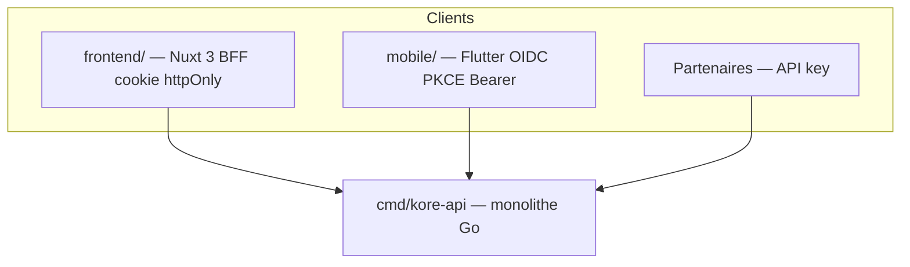
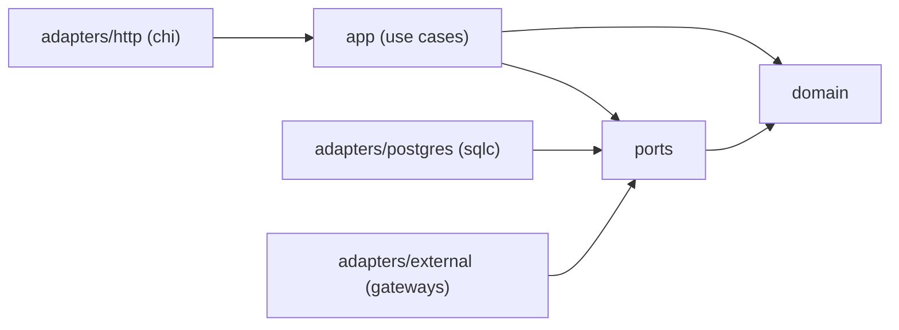
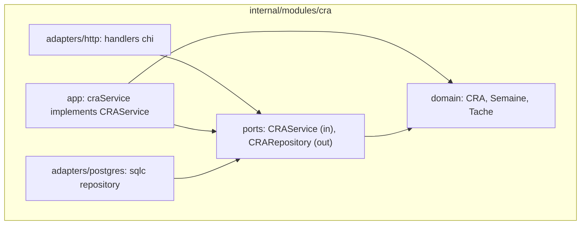

# 01 — Architecture technique

> Fondation transverse. Réutilisée par toutes les briques `technical/modules/*`.
> Référence fonctionnelle : [`documentation/SPECIFICATION_FONCTIONNELLE.md`](/home/olivier/ll-it-sc/projets/kore/documentation/SPECIFICATION_FONCTIONNELLE.md) §5 (architecture modulaire), §4 (organisation), §3 (RBAC).

## 1. Style d'architecture

**Monolithe modulaire** en **Clean / Hexagonal Architecture** (ports & adapters).

- Un seul binaire déployable (`cmd/kore-api`), un frontend web Nuxt, un **client mobile Flutter** ([14-flutter-mobile-client.md](14-flutter-mobile-client.md)).
- Chaque module métier/transverse est un package Go isolé sous `internal/modules/<module>`, avec des frontières explicites.
- La communication inter-modules passe **uniquement par les ports** (interfaces) exposés, jamais par accès direct aux structures internes ou aux tables d'un autre module.
- PostgreSQL : **un schéma par module** (`org`, `cra`, `tma`, `integrations`, ...) pour matérialiser les frontières au niveau données.

### Clients applicatifs



| Client | Dossier | Auth | Fiche |
| --- | --- | --- | --- |
| Web app + marketing | `frontend/` | Cookie httpOnly (BFF) ou OIDC | [08-frontend-nuxt.md](08-frontend-nuxt.md) |
| Mobile iOS/Android | `mobile/` | OIDC PKCE + Bearer | [14-flutter-mobile-client.md](14-flutter-mobile-client.md) |
| Intégrations tierces | — | `X-Api-Key` | [13-public-api-ecosystem.md](13-public-api-ecosystem.md) |

### Pourquoi ce choix (vs microservices)

| Critère | Monolithe modulaire | Microservices |
| --- | --- | --- |
| Time-to-market brique par brique | Fort | Faible (overhead infra) |
| Cohérence transactionnelle (CRA pivot) | Native | Complexe (saga) |
| Coût opérationnel | Faible | Élevé |
| Découplage logique | Fort (si discipline ports) | Fort (physique) |
| Évolutivité vers services | Possible (extraction par module) | — |

Le CRA étant le **pivot transactionnel** (spec §5.1), un monolithe modulaire évite la complexité des transactions distribuées tout en préservant un découplage strict qui autorisera l'extraction ultérieure d'un module en service si nécessaire.

## 2. Règle de dépendance

Le sens des dépendances est **unidirectionnel**, du plus externe vers le plus interne :



- `domain` ne dépend de **rien** (ni framework, ni SQL, ni HTTP).
- `ports` ne dépend que de `domain` (types métier dans les signatures).
- `app` implémente les ports inbound, orchestre le `domain`, appelle les ports outbound.
- `adapters` dépendent des `ports` (implémentation) — **jamais** l'inverse (DIP).

Aucune dépendance de `domain`/`app` vers `adapters`. Toute violation doit échouer en revue (et idéalement via un lint d'architecture, cf. §7).

### Contrats inter-modules

Quand une brique consomme une autre (ex. Budget lit le CRA via `CRAReader`), elle dépend **uniquement de l'interface (port) et des types de contrat exposés par le module fournisseur**, jamais de son `domain` interne ni de ses tables. Règles :

- Un port partagé (`CRAReader`, `MissionReader`, `BudgetReader`, `EntitlementReader`, `PricingReader`, `NotificationPublisher`, `CRAFeeder`, `CRAFutureCleaner`, `WorkflowService`) est **défini par le module fournisseur** et importé par les consommateurs (DIP).
- Les **types de contrat** échangés (ex. `Consumption`, `MissionBilling`, `ProposedLine`, `PricingCatalog`) sont des structures simples exposées avec le port, distinctes des entités `domain` internes.
- Les **value objects primitifs transverses** (`TenantID`, `Money`, `Period`, `DateRange`, `Duration`) vivent dans un **noyau partagé** minimal (`pkg/kernel`) pour éviter la duplication, sans logique métier.
- Le câblage des implémentations concrètes reste au **composition root** (`cmd/kore-api`).

## 3. Layout du dépôt

```
kore/
  cmd/
    kore-api/               -> main : wiring (composition root), lecture config, démarrage HTTP
  internal/
    modules/
      <module>/             -> ex. cra, tma, org, integrations (module 17)
        domain/             -> entités, value objects, invariants, erreurs métier
        ports/              -> interfaces inbound (use cases) + outbound (repositories, gateways)
        app/                -> services applicatifs (implémentent les use cases)
        adapters/
          http/             -> handlers chi, DTO, routing, mapping erreurs
          postgres/         -> requêtes sqlc générées + repositories
          <external>/       -> gateways (PDP, SMTP, ...)
        migrations/         -> *.sql golang-migrate (schéma dédié)
    platform/               -> code transverse non métier
      config/               -> chargement configuration (env / Secret Manager)
      httpx/                -> middleware communs, enveloppe d'erreur, helpers
      authx/                -> JWT, contexte d'identité, RBAC (cf. 04-auth-rbac.md)
      db/                   -> pool pgx, gestion transaction, migrations runner
      cache/                -> port Cache + adapter Redis/InMemory (cf. 10-cache-redis.md)
      logging/              -> logger structuré
      tenant/               -> résolution et isolation multi-tenant
  pkg/
    kernel/                 -> noyau partagé : value objects transverses (TenantID, Money, Period, DateRange, Duration)
  db/
    migrations/             -> agrégation/ordonnancement global des migrations par schéma
  api/
    openapi.yaml            -> contrat OpenAPI agrégé (cf. 05-api-conventions.md)
  frontend/                 -> application Nuxt 3 (cf. 08-frontend-nuxt.md)
  mobile/                   -> application Flutter iOS/Android (cf. 14-flutter-mobile-client.md)
  deploy/                   -> docker-compose, Dockerfile (cf. 07-docker-devops.md)
  technical/                -> ces spécifications
```

Le **composition root** unique est `cmd/kore-api/main.go` : c'est le seul endroit où les implémentations concrètes (adapters) sont instanciées et injectées dans les services (`app`). Cela concentre le câblage et garde les modules ignorants des implémentations (DIP).

## 4. Anatomie d'un module (exemple générique)



## 5. Mapping SOLID (transverse)

| Principe | Application concrète dans Kore |
| --- | --- |
| **S** — Single Responsibility | Un module = un domaine métier ; une fiche = un port ; un service applicatif par cas d'usage cohérent. Le `domain` porte les règles, l'`adapter http` ne fait que traduire HTTP↔use case. |
| **O** — Open/Closed | Le moteur de workflow (module 01) est extensible par configuration (états/transitions/déclencheurs) sans modifier le code ; nouveaux sous-types de Demande ajoutés sans toucher le cœur. |
| **L** — Liskov | Toute implémentation d'un port (ex. `CRARepository` postgres vs mock) est substituable sans casser les invariants attendus par `app`. Les tests d'`app` tournent contre les mocks et le contrat reste vrai en prod. |
| **I** — Interface Segregation | Ports fins et orientés cas d'usage (`CRAReader`, `CRAWriter`) plutôt qu'une interface monolithique. Un adapter n'implémente que ce dont il a besoin. |
| **D** — Dependency Inversion | `app` dépend d'abstractions (`ports`), les `adapters` fournissent les implémentations, câblées au composition root. Aucune dépendance de haut niveau vers un détail d'infrastructure. |

## 6. Multi-tenant

- Isolation logique par **`tenant_id`** présent sur toutes les tables métier + colonne systématique dans les requêtes (filtré au niveau repository).
- Le `tenant_id` est résolu depuis le JWT / contexte de requête (`platform/tenant`) et injecté dans le contexte applicatif — jamais accepté depuis le corps client.
- Décision ouverte (spec §4.5, §17) : stratégie URL (sous-domaine vs chemin) et éventuel schéma-par-tenant à grande échelle. Par défaut : **table partagée + `tenant_id`**.
- **Exceptions pré-tenant** : le schéma `publicsite` (module 15 : leads/booking, visiteurs anonymes *avant* la création d'un tenant) ne porte **pas** de `tenant_id`. Les données Stripe du module 14 (`subscription`) rattachent le tenant dès sa création. Ces exceptions sont explicitement documentées dans les fiches concernées.

## 7. Garde-fous d'architecture

- Lint d'imports pour interdire `domain`/`app` -> `adapters` (ex. `depguard` / règles `go vet` custom, ou vérification CI dédiée).
- Revue obligatoire : tout nouveau port ajouté doit être justifié (ISP) et testé (mock).
- Chaque module reste **buildable et testable indépendamment** (`go test ./internal/modules/<module>/...`).

## 8. Definition of Done (fondation architecture)

- [ ] Le layout `cmd/ internal/ pkg/` est acté et documenté.
- [ ] La règle de dépendance est comprise et vérifiable (revue/lint).
- [ ] Le composition root unique est identifié (`cmd/kore-api`).
- [ ] Le mapping SOLID est référencé par les fiches modules.
