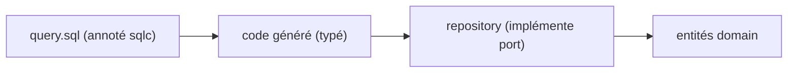

# 03 — Base de données PostgreSQL

> Fondation transverse. Stratégie de persistance commune à toutes les briques.
> Référence fonctionnelle : spec §11 (modèle de données), §4 (organisation).
> **Schéma DB actuel (tables, colonnes, relations)** : [`documentation/SCHEMA_DB.md`](../../documentation/SCHEMA_DB.md).

## 1. Principes

- **Un schéma PostgreSQL par module** : `org`, `workflow`, `cra`, `conges`, `budget`, `tma`, `support`, `maintenance`, `ssii`, `facturation`, `ett`, `notifications`, `reporting`, `admin`.
- Les frontières logiques des modules sont matérialisées : un module n'écrit que dans son schéma. La lecture de données d'un autre module passe par son **port** (pas de `JOIN` inter-schémas dans le code métier d'un module).
  - **Exception sanctionnée** : le module **12 Reporting** (agrégation/BI) peut s'appuyer sur des **vues SQL en lecture seule inter-schémas**, strictement en lecture et sans logique métier. C'est la seule dérogation admise, documentée dans sa fiche.
- **`tenant_id`** (UUID) sur toute table métier, indexé, filtré systématiquement (isolation multi-tenant, cf. 01-architecture §6).

## 2. Conventions

| Élément | Règle |
| --- | --- |
| Clé primaire | `id UUID` (généré applicatif ou `gen_random_uuid()`) |
| Multi-tenant | `tenant_id UUID NOT NULL` + index composite `(tenant_id, ...)` |
| Horodatage | `created_at`, `updated_at` (`timestamptz`, défaut `now()`) |
| Suppression | **Soft delete** via `archived_at timestamptz NULL` quand la règle métier l'exige (ex. mission avec CRA passé, spec RG-MISS-02) |
| Énumérations | Type `text` + contrainte `CHECK` ou table de référence (états workflow) |
| Nommage | tables au pluriel snake_case, colonnes snake_case |

## 3. Migrations (golang-migrate)

- Fichiers `NNNN_description.up.sql` / `NNNN_description.down.sql` dans `internal/modules/<module>/migrations`.
- Chaque migration crée/altère uniquement le schéma du module.
- La création du schéma est la première migration du module : `CREATE SCHEMA IF NOT EXISTS <module>;`.
- Exécution : au démarrage de `cmd/kore-api` (option `MIGRATE_ON_BOOT=true` en dev) ou via commande dédiée en CI/prod.
- Migrations **immuables** après merge (cf. 02 §6).

## 4. Accès aux données (sqlc)

- Requêtes SQL dans `query.sql` par module, annotées sqlc (`-- name: GetTimesheet :one`).
- sqlc génère le code type-safe dans `adapters/postgres/gen`.
- Le **repository** (implémentation d'un port outbound) enveloppe le code généré et convertit les rows en entités `domain`.

## 5. Transactions

- Gérées via `platform/db` : helper `WithTx(ctx, fn)` fournissant un `pgx.Tx`.
- Le **pivot CRA** impose des écritures cohérentes (ex. validation congé -> mise à jour CRA) : ces opérations transverses sont orchestrées dans un service `app` sous une transaction unique lorsque les données sont dans le même schéma, ou via un **événement de domaine** publié après commit quand elles franchissent une frontière de module (cf. module 11 Notifications et module 01 Workflow).
- Règle : pas de transaction traversant plusieurs schémas de modules distincts dans le code métier ; préférer l'orchestration applicative + idempotence.

## 6. Intégrité et règles fortes

- Contraintes `CHECK`, `NOT NULL`, `UNIQUE (tenant_id, clé_métier)` privilégiées à la validation applicative seule.
- **Inaltérabilité ETT** (spec §7.12) : table `ett.pointages` en **append-only** ; les corrections écrivent une ligne dans `ett.journal_audit` (jamais d'`UPDATE`/`DELETE` destructif). Révocation des droits `UPDATE/DELETE` au niveau rôle DB applicatif sur ces tables.
- **Facture virtuelle** (spec RG-FAC-01) : non persistée tant que non transmise (calcul à la volée) → pas de ligne en base avant l'action de préparation.

## 7. Rôles PostgreSQL

- `kore_app` : rôle applicatif principal (CRUD sur les schémas, sauf restrictions ETT).
- `kore_migrator` : rôle des migrations (DDL).
- Séparation des privilèges pour renforcer l'inaltérabilité et l'auditabilité.

## 8. Hébergement : Cloud SQL for PostgreSQL (prod)

- Instance managée régionale, **HA** (failover) en production ; sauvegardes automatiques + PITR.
- Connexion depuis Cloud Run (cf. [09-gcp-infrastructure.md](/home/olivier/ll-it-sc/projets/kore/technical/foundation/09-gcp-infrastructure.md)) :
  - **Cloud SQL Auth Proxy** intégré (socket `/cloudsql/PROJECT:REGION:INSTANCE`, chiffrement + IAM), ou **IP privée** via VPC connector.
  - Authentification par mot de passe (Secret Manager) ou **IAM database authentication**.
- **Pooling** : `pgxpool` dimensionné pour respecter `max_connections` de l'instance compte tenu de l'autoscaling Cloud Run (`concurrence × instances max ≤ connexions`). Activer un pooler (PgBouncer/Cloud SQL) si nécessaire.
- **Migrations** : exécutées par un **job dédié avant la bascule de trafic** (jamais `MIGRATE_ON_BOOT` en prod ; option réservée au dev local).
- **Parité dev/prod** : en local, conteneur `postgres:16` via Docker Compose ; seules les variables de connexion changent.

## 9. Definition of Done (fondation database)

- [x] Schémas par module définis et documentés ([SCHEMA_DB.md](../../documentation/SCHEMA_DB.md)).
- [ ] Conventions PK/tenant/timestamps actées.
- [ ] Stratégie migrations golang-migrate opérationnelle (up/down testés).
- [ ] Règles d'inaltérabilité ETT traduites en contraintes/roles DB.
- [ ] Connexion Cloud SQL (Auth Proxy/IP privée) et dimensionnement du pool documentés.
- [ ] Migrations exécutées en job avant bascule de trafic (pas de migration au boot en prod).
