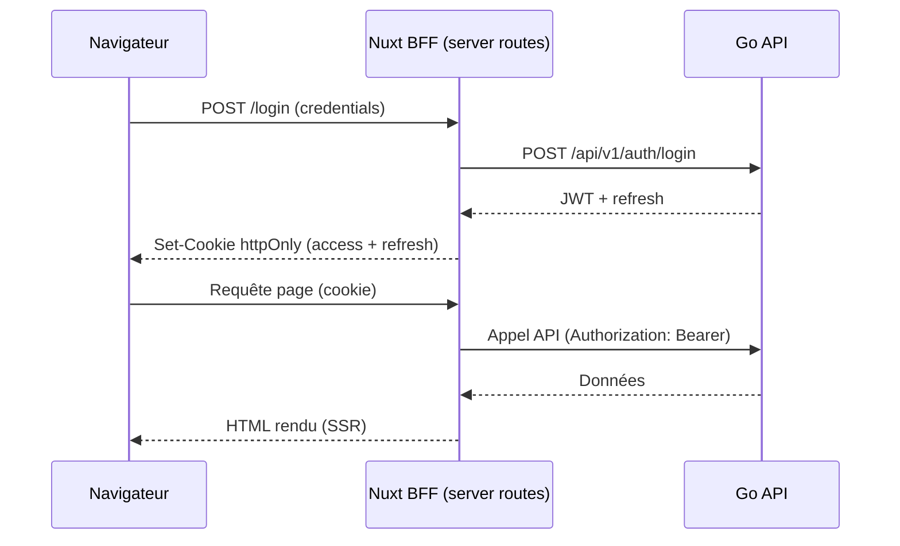

# 04 — Authentification et RBAC

> Fondation transverse. Sécurité, identité et autorisation communes à toutes les briques.
> Référence fonctionnelle : spec §3 (acteurs, profils, matrice RBAC), §4.4 (règles de compte), §13 (NFR sécurité).

## 1. Authentification

Kore supporte un **dual-mode** (et plus) selon le client :

| Mode | Client | Mécanisme | Phase |
| --- | --- | --- | --- |
| Password | Nuxt (web) | `POST /api/v1/auth/login` → cookie httpOnly | MVP |
| OIDC | Nuxt (web) | Authorization Code via [12-sso-federation.md](12-sso-federation.md) → cookie httpOnly | Phase 1 |
| OIDC + PKCE | Flutter (mobile) | Authorization Code + PKCE → Bearer + secure storage | Phase 1bis |
| API key | Partenaires | Header `X-Api-Key` (cf. [13-public-api-ecosystem.md](13-public-api-ecosystem.md)) | Phase 2 |

### 1.1 Login mot de passe (MVP)

- **JWT** signé côté Go (HS256 par défaut, clé `JWT_SIGNING_KEY` ; RS256 possible en cible).
- Émission au login (`POST /api/v1/auth/login`) après vérification identifiants.
- **Cookie httpOnly + Secure + SameSite=Lax** porté par le BFF Nuxt : le token n'est jamais exposé au JavaScript client (choix SSR/BFF, cf. [08-frontend-nuxt.md](08-frontend-nuxt.md)).
- **Refresh token** rotatif (cookie httpOnly séparé) ; endpoint `POST /api/v1/auth/refresh`.
- Déconnexion : invalidation côté serveur via **liste de révocation dans Redis** (clé `kore:{tenant}:auth:revoked:{jti}`, TTL = durée de vie résiduelle du token). Voir [10-cache-redis.md](10-cache-redis.md).
- **Rate-limiting** (login, endpoints sensibles) : compteurs Redis à fenêtre glissante, préfixés `kore:{tenant}:ratelimit:...`.
- Le service reste **stateless** (compatible autoscaling Cloud Run) : tout état de session partagé vit dans Redis, pas en mémoire locale.



### 1.2 SSO OIDC (Phase 1)

- Fédération enterprise via [12-sso-federation.md](12-sso-federation.md) : Azure AD, Google Workspace.
- Après validation IdP (JWKS), l'API émet un **JWT Kore** identique (mêmes claims §2) — le pipeline RBAC/entitlement est inchangé.
- Nuxt : le BFF reçoit le JWT et pose les cookies httpOnly (même flux post-auth que §1.1).
- Flutter : reçoit access + refresh en JSON ; stocke en secure storage ; envoie `Authorization: Bearer` (pas de cookie).
- Login password **conservé** pour Starter/Pro et comptes locaux non fédérés.

## 2. Contenu du JWT (claims)

| Claim | Description |
| --- | --- |
| `sub` | Identifiant utilisateur |
| `tenant_id` | Tenant (isolation multi-tenant) |
| `profile` | Profil socle (cf. §3.1 spec) |
| `roles` | Rôles contextuels éventuels (Commercial, Chef utilisateur) |
| `exp` / `iat` | Expiration / émission |

Le `tenant_id` du contexte provient **exclusivement** du token (jamais du corps de requête).

## 3. Modèle RBAC

Reprise de la **matrice profil × module (L/E/V)** de la spec §3.3. Les profils socle :

`Utilisateur, Collaborateur, Chef d'équipe, Responsable de service, Commercial, Support, Administrateur, Chef utilisateur, Client externe, Sous-traitant`.

Actions : **L** (lecture), **E** (écriture), **V** (validation).

### Représentation technique

- Une table de politique `authx.permissions (profile, module, action)` (seed depuis la matrice §3.3), chargée puis **mise en cache Redis** (clé `kore:{tenant}:rbac:permissions`, invalidée à toute modification de profil).
- Un **middleware d'autorisation** chi : `RequirePermission(module, action)` appliqué au niveau des routes de chaque module.
- Les rôles contextuels (Chef utilisateur = gate TMA, Commercial = SSII/facturation) ajoutent des permissions spécifiques (OCP : ajout sans modifier le cœur).

### Contrôle d'abonnement (entitlement)

En plus du profil, le middleware vérifie que **le module est inclus dans l'abonnement du tenant** via `EntitlementReader` (module 14, cf. [11-payments-stripe.md](/home/olivier/ll-it-sc/projets/kore/technical/foundation/11-payments-stripe.md)) :

```go
type EntitlementReader interface { // fourni par le module 14
    IsModuleEnabled(ctx context.Context, tenantID TenantID, module Module) (bool, error)
}
```

Ordre d'évaluation : authentification → tenant → **entitlement (module souscrit ?)** → RBAC (profil autorisé ?). Module non souscrit → `402 PAYMENT_REQUIRED` / `403 MODULE_NOT_SUBSCRIBED`. L'état d'entitlement est mis en cache Redis (TTL court, invalidé sur webhook Stripe).

### Routes publiques (site vitrine)

Les endpoints du [module 15](/home/olivier/ll-it-sc/projets/kore/technical/modules/15-site-vitrine-booking.md) (`/api/v1/public/*` : tarifs, modules, leads, réservation) sont **non authentifiés** (visiteurs anonymes, avant tout tenant). Ils sont exclus du pipeline JWT/tenant/RBAC mais soumis à :
- **Rate-limiting Redis** (par IP, fenêtre glissante, clé `kore:public:ratelimit:...`) → `429` au dépassement.
- **Anti-spam** (honeypot / challenge) et **consentement RGPD** obligatoire pour la capture de leads.
- Aucune donnée applicative tenant accessible depuis ces routes.

```go
// port transverse (platform/authx)
type Authorizer interface {
    Can(ctx context.Context, module Module, action Action) bool
}
```

## 4. Middleware et contexte d'identité

- `platform/authx` expose : extraction/validation JWT, injection d'une `Identity{UserID, TenantID, Profile, Roles}` dans le `context.Context`.
- Les handlers récupèrent l'identité via `authx.FromContext(ctx)` ; les services `app` reçoivent le `tenant_id` et l'acteur pour appliquer les règles (ex. données personnelles privées visibles des seuls responsables, spec RG-SEC-01).

## 5. Règles de sécurité (spec §13)

| Règle | Traduction technique |
| --- | --- |
| RG-SEC-01 — données perso privées | Filtrage champ (mail/téléphone) selon profil du demandeur dans la couche `app`/DTO |
| RG-SEC-02 — période activation/expiration | Vérification `date_activation`/`date_expiration` au login + refus si expiré |
| RG-ORG-01 — login `XXX_nom` | Validation format à la création utilisateur (module 00) |
| TLS | Terminaison HTTPS (reverse proxy/infra), cookies `Secure` |
| Mots de passe | Hash `argon2id` ou `bcrypt` (coût configurable) |

## 6. Tests (sécurité et RBAC)

- Unitaires : table-driven sur `Authorizer.Can` couvrant chaque cellule pertinente de la matrice §3.3 (profil × module × action attendu).
- Unitaires : validation JWT (expiré, signature invalide, tenant manquant).
- Unitaires : refus si module non souscrit (`EntitlementReader` mocké → `MODULE_NOT_SUBSCRIBED`).
- Intégration : un utilisateur d'un tenant ne peut jamais lire les données d'un autre tenant (test d'isolation).
- Intégration : révocation de refresh-token via Redis (testcontainers) ; token révoqué refusé.
- Unitaires : masquage des champs privés selon profil (RG-SEC-01).

## 7. Definition of Done (fondation auth-rbac)

- [x] Flux login/refresh/logout spécifiés (cookies httpOnly).
- [x] Matrice §3.3 traduite en table de permissions + middleware.
- [x] Isolation multi-tenant garantie par le token.
- [x] Révocation/rate-limiting via Redis (service stateless, compatible Cloud Run).
- [x] Contrôle d'entitlement (module souscrit) intégré au pipeline d'autorisation.
- [x] Plan de tests RBAC/sécurité couvrant la matrice, l'isolation et la révocation.
- [ ] Dual-mode OIDC + password documenté et testé (cf. [12-sso-federation.md](12-sso-federation.md), [ROADMAP Phase 1](../ROADMAP.md)).
