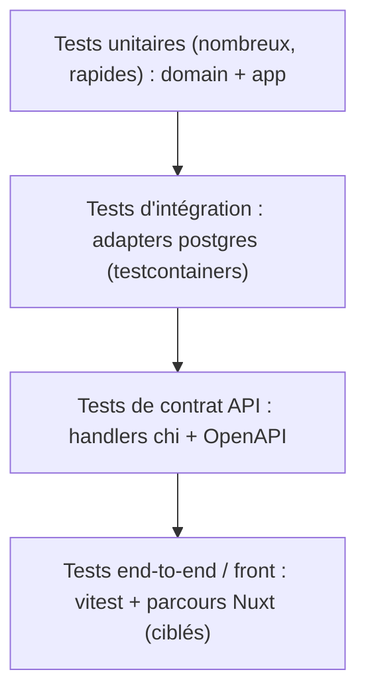

# 06 — Stratégie de tests

> Fondation transverse. Standard de test appliqué à chaque brique. Les tests unitaires sont **partie intégrante** de la spécification de chaque module.

## 1. Pyramide de tests



Priorité au **socle unitaire** : le `domain` et l'`app` concentrent la logique métier et se testent sans I/O.

## 2. Tests unitaires Go (standard obligatoire)

- **Domaine** : test pur des invariants et règles (aucune dépendance). Ex. transition d'état interdite, calcul UO/facturation.
- **Application (use cases)** : test contre des **mocks des ports outbound** (repositories, gateways). Vérifie l'orchestration et l'application des règles de gestion (RG-xxx) et des critères d'acceptation (spec §8).
- Style **table-driven** :

```go
func TestCRAService_Submit(t *testing.T) {
    tests := []struct {
        name    string
        setup   func(*mocks.CRARepository)
        input   SubmitCommand
        wantErr error
    }{
        {name: "soumission valide", /* ... */},
        {name: "deja validee -> conflit", wantErr: domain.ErrCRAAlreadyValidated},
    }
    for _, tc := range tests {
        t.Run(tc.name, func(t *testing.T) { /* arrange/act/assert */ })
    }
}
```

- **Mocks** : générés (`mockery`) depuis les ports, ou doublures manuelles simples. Un port = un mock substituable (LSP).
- **Horloge** : port `Clock` injecté pour tester les règles temporelles (jours futurs, dernier lundi du mois) de façon déterministe.

## 3. Tests d'intégration

- **Repositories postgres** testés via **testcontainers-go** (PostgreSQL éphémère) + migrations appliquées.
- Vérifient : mapping row↔entité, contraintes (unicité tenant, append-only ETT), requêtes sqlc réelles.
- **Cache Redis** testé via **testcontainers `redis:7`** : préfixe de clés (`kore:{tenant}:...`), TTL, invalidation ciblée, comportement au miss, dégradation si indisponible (cf. [10-cache-redis.md](/home/olivier/ll-it-sc/projets/kore/technical/foundation/10-cache-redis.md)).
- **Stripe** testé via **`stripe-mock`** (conteneur) : création de session Checkout, réception et **idempotence** des webhooks, vérification de signature (cf. [11-payments-stripe.md](/home/olivier/ll-it-sc/projets/kore/technical/foundation/11-payments-stripe.md)).
- Marqués `//go:build integration` et exécutés dans un job CI dédié.
- Le cache est testé en **unitaire** avec `InMemoryCache` (sans réseau) ; Stripe en unitaire avec un mock du port `PaymentGateway`.

## 4. Tests de contrat API

- Handlers chi testés via `httptest` : codes HTTP, enveloppe d'erreur, application RBAC (401/403), validation DTO.
- Cohérence avec `api/openapi.yaml`.

## 5. Tests frontend (Nuxt)

- **vitest** + `@vue/test-utils` : composables (logique), stores Pinia, composants critiques.
- Tests des **server routes BFF** : mapping cookie->Authorization, gestion erreurs API.

## 6. Seuils et qualité

| Couche | Couverture cible | Nature |
| --- | --- | --- |
| domain | > 90 % | unitaire pur |
| app (use cases) | > 80 % | unitaire + mocks |
| adapters postgres | chemins clés | intégration |
| handlers http | chemins clés + RBAC | contrat |
| frontend | composables/stores critiques | unitaire |

- CI bloquante sur : build, lint, `go test ./...`, seuils de couverture domaine/app.
- Chaque **critère d'acceptation** de la spec §8 doit correspondre à au moins un test nommé.

## 7. Definition of Done (fondation testing)

- [ ] Standard table-driven + mocks des ports documenté.
- [ ] testcontainers en place pour l'intégration DB.
- [ ] Port `Clock` prévu pour le déterminisme temporel.
- [ ] Seuils de couverture et gates CI définis.
