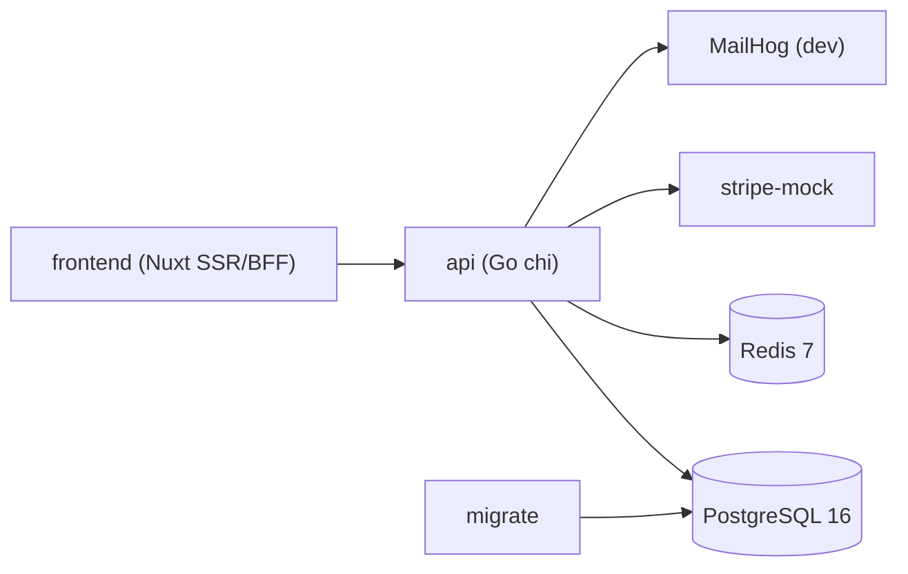

# 07 — Docker et DevOps

> Fondation transverse. Conteneurisation, environnement local et CI communs.

## 1. Composants Docker

| Service | Image | Rôle |
| --- | --- | --- |
| `api` | build Go multi-stage | API Kore (`cmd/kore-api`) |
| `frontend` | build Node/Nuxt | SSR + BFF Nuxt 3 |
| `db` | `postgres:16` | Base de données (miroir local de Cloud SQL) |
| `redis` | `redis:7` | Cache local (miroir local de Memorystore) |
| `migrate` | golang-migrate (one-shot) | Application des migrations |
| `mailhog` (dev) | `mailhog/mailhog` | Capture des mails en dev (module Notifications) |
| `stripe-mock` (dev/test) | `stripe/stripe-mock` | Simulation de l'API Stripe (module 14) |

> Objectif : **parité dev/prod**. Les conteneurs `db` et `redis` reproduisent localement Cloud SQL et Memorystore (cf. [09-gcp-infrastructure.md](/home/olivier/ll-it-sc/projets/kore/technical/foundation/09-gcp-infrastructure.md)) ; seules les variables de connexion changent entre local et GCP.

## 2. docker-compose (dev)



- Réseau interne : `frontend` -> `api` -> {`db`, `redis`, `stripe-mock`, `mailhog`}.
- Volumes : données PostgreSQL persistées ; Redis éphémère (cache) ; hot-reload en dev (air/nodemon) optionnel.
- Variables via `.env` (non committé) ; `.env.example` documente les clés (cf. 02 §5).

### Structure de test locale

Un fichier `deploy/docker-compose.test.yml` (ou profil `test`) fournit un environnement isolé et reproductible :

- `db` (`postgres:16`) + `redis:7` + `stripe-mock`, éphémères (données jetables).
- Exécution : migrations appliquées puis `go test -tags=integration ./...` et `vitest`.
- Même topologie qu'en dev pour garantir la fidélité des tests d'intégration (les tests unitaires, eux, utilisent `InMemoryCache` et des mocks — cf. [06-testing-strategy.md](/home/olivier/ll-it-sc/projets/kore/technical/foundation/06-testing-strategy.md)).
- Les tests Go peuvent aussi piloter leurs propres conteneurs via **testcontainers** (PostgreSQL, Redis) sans dépendre du compose, au choix du développeur/CI.

## 3. Dockerfile Go (multi-stage)

```dockerfile
# build
FROM golang:1.23 AS build
WORKDIR /src
COPY go.mod go.sum ./
RUN go mod download
COPY . .
RUN CGO_ENABLED=0 go build -o /out/kore-api ./cmd/kore-api

# runtime
FROM gcr.io/distroless/static-debian12
COPY --from=build /out/kore-api /kore-api
USER nonroot:nonroot
ENTRYPOINT ["/kore-api"]
```

## 4. Dockerfile Nuxt (multi-stage)

- Stage build : `npm ci` + `nuxt build` (sortie Nitro).
- Stage runtime : Node slim, `node .output/server/index.mjs`.

## 5. Migrations

- Service `migrate` one-shot appliquant les migrations de tous les modules (ordonnancées par schéma) avant le démarrage de `api` (dépendance `depends_on` + healthcheck DB).
- En dev : `MIGRATE_ON_BOOT=true` possible ; **en prod (GCP) : job explicite avant la bascule de trafic** (cf. [09-gcp-infrastructure.md](/home/olivier/ll-it-sc/projets/kore/technical/foundation/09-gcp-infrastructure.md) §6).

## 6. CI/CD (pipeline)

1. Lint (`golangci-lint`, `eslint`).
2. Build (Go + Nuxt).
3. Tests unitaires (`go test ./...`, `vitest`).
4. Tests d'intégration (`-tags=integration`, testcontainers PostgreSQL + Redis, `stripe-mock`).
5. Vérification couverture (seuils 06-testing-strategy).
6. Build images Docker → **Artifact Registry** (sur merge).
7. Job **migrations Cloud SQL** (golang-migrate) avant bascule.
8. Déploiement **Cloud Run** (API + frontend) + smoke test `/health` `/ready`.

Le déploiement cloud (Cloud Build, Artifact Registry, Cloud Run, Secret Manager) est détaillé dans [09-gcp-infrastructure.md](/home/olivier/ll-it-sc/projets/kore/technical/foundation/09-gcp-infrastructure.md).

## 7. Observabilité (base)

- Logs structurés JSON (`platform/logging`), niveau via `LOG_LEVEL` ; en prod **Cloud Logging**.
- Endpoints `GET /health` (liveness) et `GET /ready` (readiness : **PostgreSQL + Redis** joignables).
- Métriques/traces : **Cloud Monitoring / Error Reporting** en prod.

## 8. Definition of Done (fondation docker/devops)

- [x] `docker-compose.yml` dev fonctionnel (api + frontend + db + **redis** + migrate + mailhog + **stripe-mock**).
- [x] `docker-compose.test.yml` (ou profil test) pour l'environnement de test local isolé.
- [x] Dockerfile multi-stage Go et Nuxt.
- [x] `.env.example` documenté (DB, Redis, Stripe).
- [x] Pipeline CI/CD défini avec gates lint/test/couverture + déploiement GCP.
- [x] Readiness vérifie DB **et** Redis.
