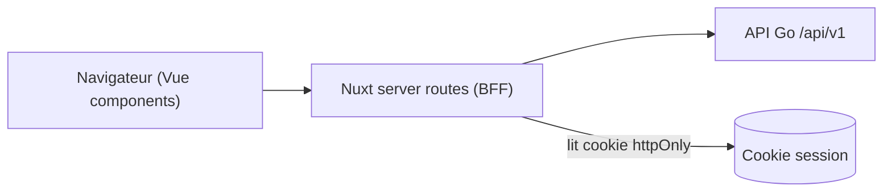

# 08 — Frontend Nuxt 3 (SSR + BFF)

> Fondation transverse. Conventions frontend réutilisées par chaque brique (section « Frontend Nuxt » des fiches modules).

## 1. Approche

- **Nuxt 3** en **SSR**, avec une couche **BFF** (Backend-For-Frontend) via les **server routes Nitro** (`server/api/**`).
- Le navigateur ne parle qu'au BFF Nuxt ; le BFF appelle l'API Go avec le JWT extrait du **cookie httpOnly** (jamais exposé au client).
- **Pinia** pour l'état, un store par module.
- **Deux surfaces** dans la même application Nuxt :
  - **Surface publique** (marketing / tunnel de vente) : non authentifiée, orientée SEO — page racine `/`, `/modules`, `/tarifs`, `/reserver` (cf. [module 15](/home/olivier/ll-it-sc/projets/kore/technical/modules/15-site-vitrine-booking.md)).
  - **Surface applicative** : authentifiée (cookie httpOnly), derrière le middleware auth.



## 2. Structure de projet (frontend/)

```
frontend/
  app.vue
  nuxt.config.ts
  middleware/           -> auth global (redirection si non authentifié) — EXCLUT les routes publiques
  layouts/
    public.vue          -> layout marketing (tunnel de vente, SEO, sans nav applicative)
    default.vue         -> layout applicatif authentifié (nav par module selon RBAC)
  pages/
    index.vue           -> page racine PUBLIQUE (présentation + tunnel de vente)
    modules/            -> présentation publique des modules
    tarifs/             -> grille tarifaire publique (dynamique Stripe)
    reserver/           -> réservation d'entretien commercial
    <module>/           -> pages applicatives du module (ex. cra/index.vue, cra/[id].vue)
  components/
    <module>/           -> composants du module
  composables/
    use<Module>.ts      -> logique d'accès données (appelle le BFF)
  stores/
    <module>.ts         -> store Pinia du module
  server/
    api/<module>/       -> routes BFF proxifiant l'API Go
    utils/auth.ts       -> extraction cookie -> Authorization Bearer
```

## 3. Flux d'authentification (rappel)

- `server/api/auth/login.post.ts` : appelle Go, pose les cookies httpOnly (access + refresh).
- Middleware global : vérifie la session, rafraîchit via refresh token si expiré. Les **routes publiques** (`/`, `/modules`, `/tarifs`, `/reserver`, `/contact`) sont **exclues** du middleware auth (accessibles anonymement).
- Les server routes ajoutent `Authorization: Bearer <jwt>` aux appels Go à partir du cookie ; les routes publiques (`server/api/public/*`) n'envoient pas de JWT.

## 4. Conventions par module (section frontend des fiches)

Chaque fiche module décrit :

| Élément | Description |
| --- | --- |
| Pages | Écrans du module (liste, détail, formulaire) |
| Composants | Composants réutilisables du module |
| Composables | `use<Module>()` encapsulant les appels au BFF |
| Store Pinia | État et actions du module |
| Routes BFF | `server/api/<module>/*` mappant vers l'API Go |
| Permissions UI | Affichage conditionnel selon profil (miroir RBAC §3.3) |

## 5. Iconographie — Google Fonts (Material Symbols)

- Icônes fournies par **Google Fonts / Material Symbols** (police d'icônes variable).
- Intégration : chargement optimisé via `@nuxtjs/google-fonts` (ou `@nuxt/fonts`) avec `display=swap` et auto-hébergement des fichiers (performances + confidentialité, pas d'appel tiers au runtime).
- Un composant `<AppIcon name="..." />` encapsule l'usage (cohérence, A11y : `aria-hidden` ou `aria-label` selon contexte). Aucune icône codée en dur ailleurs.
- Variantes (rempli/contour, graduation, poids) pilotées par les axes variables de la police.

## 6. Paiements — Stripe (front)

- **`@stripe/stripe-js`** pour rediriger vers **Stripe Checkout** (hébergé). Le front ne manipule que la **clé publiable** (`STRIPE_PUBLISHABLE_KEY`).
- Aucune donnée de carte ne transite par Kore (PCI simplifié). Le BFF crée la session via l'API Go (module 14) ; le **webhook Stripe reste côté API Go**, jamais dans le BFF.
- Écrans : sélection modules/sièges, statut d'abonnement, retours succès/annulation (cf. [module 14](/home/olivier/ll-it-sc/projets/kore/technical/modules/14-abonnement-saas-stripe.md)).

## 7. Accessibilité et i18n

- i18n FR/EN (spec §13) via `@nuxtjs/i18n`, langue selon préférence utilisateur.
- Accessibilité (A11y) : décision Kore (spec §13) — cibler WCAG AA sur les écrans clés (CRA, congés) ; icônes Material Symbols avec libellés accessibles.

## 8. Tests frontend

- vitest pour composables et stores ; tests des server routes BFF (auth, mapping erreurs). Cf. 06-testing-strategy §5.
- Test du composant `<AppIcon>` et du flux de redirection Checkout (BFF mocké).

## 9. Definition of Done (fondation frontend)

- [ ] Structure Nuxt + BFF actée.
- [ ] Flux auth par cookie httpOnly spécifié.
- [ ] Conventions pages/composables/stores/BFF par module définies.
- [ ] Icônes Material Symbols (Google Fonts) auto-hébergées via `<AppIcon>`.
- [ ] Intégration Stripe front (clé publiable + Checkout) spécifiée.
- [ ] Stratégie i18n et A11y posée.
