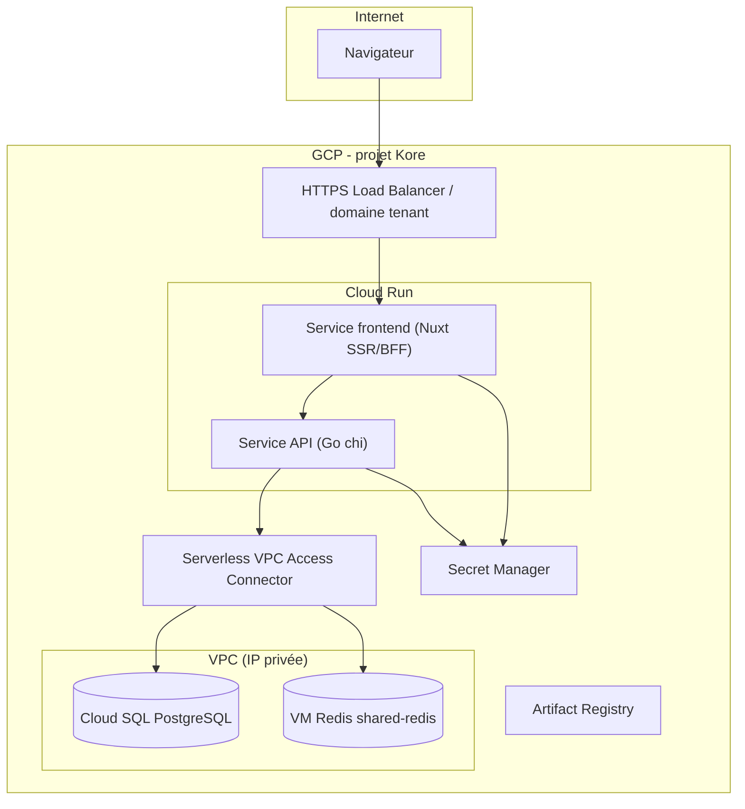
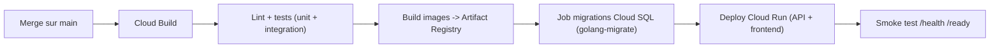

# 09 — Infrastructure GCP & déploiement

> Fondation transverse. Cible de déploiement **Google Cloud Platform**. Le développement et les tests restent en **Docker Compose local** (cf. [07-docker-devops.md](/home/olivier/ll-it-sc/projets/kore/technical/foundation/07-docker-devops.md)).

## 1. Vue d'ensemble

- **Compute** : **Cloud Run** (conteneurs managés, scale-to-zero, autoscaling) — un service pour l'API Go, un service pour le frontend Nuxt (SSR/BFF).
- **Base de données** : **Cloud SQL for PostgreSQL** (managé, un schéma par module — cf. [03-database.md](/home/olivier/ll-it-sc/projets/kore/technical/foundation/03-database.md)).
- **Cache** : **VM Redis partagée** (`shared-redis`, projet `premedica-prod-2025`) — DB index **13**, isolation par préfixe `kore:` (cf. [10-cache-redis.md](/home/olivier/ll-it-sc/projets/kore/technical/foundation/10-cache-redis.md)).
- **Secrets** : **Secret Manager** (clés JWT, mots de passe DB, clés Stripe, config PDP).
- **Images** : **Artifact Registry**.
- **CI/CD** : **Cloud Build** (build + push + déploiement Cloud Run) déclenché sur merge.
- **Réseau** : **VPC + Serverless VPC Access Connector** (`premedica-connector`) pour joindre Cloud SQL et Redis VM en **IP privée**.

## 2. Cloud Run

| Paramètre | API Go | Frontend Nuxt |
| --- | --- | --- |
| Concurrence | 80 (I/O bound) | 80 |
| Min instances | 1 (évite le cold start métier) | 0/1 selon trafic |
| CPU | 1 vCPU (ajustable) | 1 vCPU |
| Port | `$PORT` (injecté par Cloud Run) | `$PORT` |
| Connexion DB | Cloud SQL via **connecteur intégré** (socket `/cloudsql/...`) ou IP privée via connector | via API uniquement |
| VPC egress | connector (privé) pour SQL/Redis | connector si nécessaire |

- Le service API lit sa configuration depuis les variables d'environnement, secrets montés via Secret Manager.
- **Stateless** : aucun état local (les sessions/révocations vont dans Redis — cf. [04-auth-rbac.md](/home/olivier/ll-it-sc/projets/kore/technical/foundation/04-auth-rbac.md)), ce qui rend l'autoscaling sûr.

## 3. Cloud SQL for PostgreSQL

- Instance régionale, **haute disponibilité** (failover) en production.
- Connexion depuis Cloud Run :
  - **Cloud SQL Auth Proxy** intégré (recommandé) : chiffrement + IAM, connexion via socket unix `/cloudsql/PROJECT:REGION:INSTANCE`.
  - ou **IP privée** via le VPC connector.
- Authentification : mot de passe applicatif (Secret Manager) ou **IAM database authentication**.
- Pool : `pgxpool` dimensionné en tenant compte de `max_connections` de l'instance **et** du nombre max d'instances Cloud Run (concurrence × instances ≤ connexions dispo — sinon activer un pooler).
- Sauvegardes automatiques + PITR ; migrations appliquées via job dédié (cf. §6).

## 4. Redis partagé (VM `shared-redis`)

- Instance **partagée** avec les autres applications LL-IT sur Premedica → voir `infra/shared-redis/redis-apps.conf` (Kore : DB **13**, secret `kore-redis-url`).
- Points d'infrastructure :
  - Accès en **IP privée** via le VPC connector (`REDIS_ADDR` + `REDIS_DB=13`).
  - **Interdiction des commandes destructrices/globales** (`FLUSHALL`, `FLUSHDB`, `KEYS *`) : elles impacteraient les autres applications.
  - Politique d'éviction gérée au niveau de l'instance (partagée) : ne pas présumer de persistance, tout doit être **reconstructible** (cache-aside).

## 5. Secret Manager & configuration

| Secret GCP | Variable runtime |
| --- | --- |
| `kore-database-url` | `DATABASE_URL` |
| `kore-migrate-database-url` | Job migrate |
| `kore-jwt-signing-key` | `JWT_SIGNING_KEY` |
| `kore-redis-url` | `REDIS_ADDR` + `REDIS_DB` |
| `REDIS_KEY_PREFIX` | `kore` (env) |
| `kore-stripe-secret-key` / `kore-stripe-webhook-secret` | Stripe |
| `kore-gemini-api-key` | `GEMINI_API_KEY` (Gemini IA, projet `237481297060`) |

- Aucun secret dans l'image ou le dépôt. Montés comme variables d'environnement ou volumes par Cloud Run.

## 6. CI/CD (Cloud Build)

- Les **migrations** s'exécutent dans un **job dédié** (Cloud Run Job ou étape Cloud Build) **avant** le basculement de trafic, jamais au boot en production (cf. [03-database.md](/home/olivier/ll-it-sc/projets/kore/technical/foundation/03-database.md) et [07-docker-devops.md](/home/olivier/ll-it-sc/projets/kore/technical/foundation/07-docker-devops.md)).
- Déploiement progressif possible (revisions Cloud Run + répartition de trafic).

## 7. Multi-tenant sur GCP

- Isolation logique par `tenant_id` (cf. [01-architecture.md](/home/olivier/ll-it-sc/projets/kore/technical/foundation/01-architecture.md) §6) conservée : une seule base Cloud SQL, une entrée de cache préfixée par tenant.
- Routage tenant : sous-domaine → même service Cloud Run (résolution du tenant depuis le JWT/host). Décision URL ouverte (spec §4.5, §17).

## 8. Observabilité

- **Cloud Logging** (logs JSON structurés), **Cloud Monitoring** (métriques Cloud Run/SQL/Redis), **Error Reporting**.
- Endpoints `GET /health` (liveness) et `GET /ready` (readiness : DB + Redis joignables).

## 9. Environnements

| Env | Compute | Cloud SQL | Redis |
| --- | --- | --- | --- |
| Local | Docker Compose | conteneur `postgres:16` | conteneur `redis:7` |
| Staging | Cloud Run | `premedica-db-staging` / base `kore` | VM Redis DB 13 |
| Prod | Cloud Run (min=1) | Cloud SQL partagé | VM Redis DB 13 |

La **parité dev/prod** est assurée par des variables d'environnement identiques ; seuls les endpoints changent.

## 10. Definition of Done (fondation GCP)

- [x] Cible Cloud Run (API + frontend) documentée et paramétrée (`infra/gcp/cloudbuild.yaml`).
- [x] Connexion Cloud SQL via connecteur intégré + VPC connector `premedica-connector`.
- [x] Accès Redis VM partagée (DB 13, préfixe `kore:`).
- [x] Secrets centralisés dans Secret Manager (`infra/gcp/setup-gcp.sh`).
- [x] Pipeline Cloud Build + GitHub Actions (`.github/workflows/deploy-gcp.yml`).
- [x] Migrations exécutées en job `kore-migrate` avant deploy API.
- [x] Monitoring transverse via Business Management (`gcp_platform_registry.py`).

Scripts : `make gcp-setup`, `make gcp-deploy`, `make gcp-postdeploy-full`, `make gcp-domain`.
