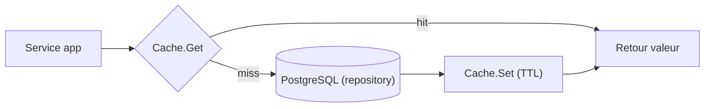

# 10 — Cache Redis (Memorystore partagé)

> Fondation transverse. Cache applicatif via **Redis**. En production : **Memorystore for Redis partagé avec d'autres applications** → l'isolation par **préfixe de clés** est une contrainte de conception non négociable.

## 1. Principes

- Redis est un **cache** (accélération), **jamais** une source de vérité. Toute donnée en cache est **reconstructible** depuis PostgreSQL (**cache-aside**).
- Bibliothèque : **`redis/go-redis/v9`**.
- Le cache est exposé aux modules via un **port abstrait `Cache`** (DIP) : les modules ne connaissent pas Redis, seulement l'interface. Cela permet un `Cache` en mémoire pour les tests unitaires.

## 2. Isolation sur instance partagée (contrainte critique)

L'instance Memorystore est **partagée avec d'autres applications**. Règles impératives :

| Règle | Détail |
| --- | --- |
| **Préfixe global** | Toutes les clés commencent par `REDIS_KEY_PREFIX` (ex. `kore`). Une autre application n'utilise jamais ce préfixe. |
| **Namespace tenant** | Format : `kore:{tenant_id}:{module}:{clé}`. Garantit l'isolation multi-tenant **et** inter-application. |
| **Aucune commande globale** | Interdits : `FLUSHALL`, `FLUSHDB`, `KEYS *`, `SCAN` sans `MATCH kore:*`. Ces commandes affecteraient les autres applications. |
| **TTL obligatoire** | Chaque entrée a un TTL (pas de clé immortelle) — limite l'empreinte sur une instance partagée. |
| **Éviction non maîtrisée** | La politique d'éviction (`maxmemory-policy`) est globale à l'instance : une clé peut disparaître à tout moment → le code doit toujours gérer le **cache miss**. |
| **Invalidation ciblée** | Suppression par clé/liste de clés connues, jamais par pattern destructeur global. Versionner les clés (ex. suffixe `:v2`) plutôt que scanner. |

## 3. Port `Cache` (platform/cache)

```go
// platform/cache
type Cache interface {
    Get(ctx context.Context, key string, dest any) (found bool, err error)
    Set(ctx context.Context, key string, value any, ttl time.Duration) error
    Delete(ctx context.Context, keys ...string) error
    // helper cache-aside
    GetOrLoad(ctx context.Context, key string, ttl time.Duration, load func(ctx context.Context) (any, error), dest any) error
}

// Constructeur de clé — SEUL point autorisé à fabriquer une clé (garantit le préfixe)
type KeyBuilder interface {
    Key(tenant TenantID, module, name string, parts ...string) string // -> "kore:{tenant}:{module}:{name}:..."
}
```

- Implémentation prod : `RedisCache` (go-redis) + `KeyBuilder` injectant `REDIS_KEY_PREFIX`.
- Implémentation test : `InMemoryCache` (map + TTL simulé) pour les tests unitaires des modules, sans dépendance réseau.

## 4. Patterns d'utilisation

### Cache-aside (lecture)



### Invalidation (écriture)

- Après une écriture métier réussie (commit DB), le service **supprime** les clés impactées (`Cache.Delete`) — jamais de scan global.
- Préférer des TTL courts + invalidation ciblée à une invalidation exhaustive.

## 5. Cas d'usage par module (indicatifs)

| Module | Donnée cachée | TTL | Invalidation |
| --- | --- | --- | --- |
| 00 Identity | permissions RBAC (matrice §3.3), résolution tenant | moyen | à la modification d'un profil |
| 01 Workflow | définitions de workflow (lecture fréquente) | moyen | à la redéfinition |
| 02 CRA | agrégats de consommation par application/période | court | à la validation/écriture CRA |
| 04 Budget | consommation Jour/UO/Euro calculée | court | au recalcul |
| 12 Reporting | projections/dashboards | court | expiration TTL (données de lecture) |
| Auth | révocation refresh-token, rate-limiting | = TTL token | à la déconnexion |

## 6. Sécurité et robustesse

- **Résilience** : si Redis est indisponible, l'application **dégrade** vers la base (le cache miss n'est jamais une erreur bloquante). Le readiness check signale Redis mais n'interrompt pas le service métier si la stratégie est « best effort ».
- **Pas de données sensibles en clair** non nécessaires ; respecter la confidentialité (RG-SEC-01) — ne pas cacher de coordonnées privées sans contrôle d'accès équivalent.
- **Sérialisation** : JSON (ou msgpack) documentée ; gérer les changements de schéma par versionnage de clé.

## 7. Configuration

| Variable | Rôle |
| --- | --- |
| `REDIS_ADDR` | hôte:port Memorystore (IP privée) |
| `REDIS_AUTH` | auth (Secret Manager) |
| `REDIS_KEY_PREFIX` | préfixe d'isolation applicatif (`kore`) |
| `REDIS_TLS` | activation TLS |
| `CACHE_DEFAULT_TTL` | TTL par défaut |

## 8. Tests

- Unitaires : modules testés avec `InMemoryCache` (déterministe, sans réseau).
- Intégration : `RedisCache` testé via **testcontainers `redis:7`** (cf. [06-testing-strategy.md](/home/olivier/ll-it-sc/projets/kore/technical/foundation/06-testing-strategy.md)) — vérifie préfixe, TTL, invalidation ciblée, comportement au miss.
- Test de garde : aucune commande globale (`FLUSHALL`/`KEYS`) dans le code (revue + lint).

## 9. Definition of Done (fondation cache)

- [ ] Port `Cache` + `KeyBuilder` définis (préfixe imposé).
- [ ] Namespacing `kore:{tenant}:{module}:...` appliqué partout.
- [ ] Aucune commande globale/destructrice sur l'instance partagée.
- [ ] Cache-aside + gestion systématique du miss + dégradation si Redis indisponible.
- [ ] TTL obligatoire et invalidation ciblée.
- [ ] `InMemoryCache` pour tests unitaires + testcontainers Redis pour l'intégration.
