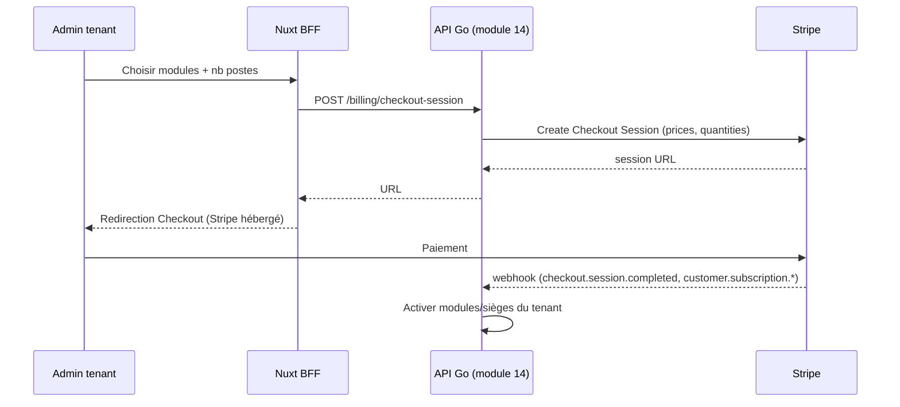

# 11 — Paiements Stripe (abonnements SaaS)

> Fondation transverse. **Stripe** gère la **facturation des abonnements SaaS de Kore** (le produit lui-même), conformément au modèle économique (spec §14 : abonnement par module et par poste).
>
> ⚠️ **Ne pas confondre** avec le **module 09 Facturation/e-invoicing** : celui-ci prépare la facturation **métier** des clients des ESN et la transmet à une **PDP/PA** (EN 16931). Les deux domaines sont **strictement séparés**. La mécanique produit/abonnement est détaillée dans le [module 14 — Abonnement SaaS (Stripe)](/home/olivier/ll-it-sc/projets/kore/technical/modules/14-abonnement-saas-stripe.md).

## 1. Périmètre

- Souscription d'un tenant à Kore : choix des **modules** activés et du **nombre de postes** (sièges).
- Cycle : essai gratuit (2 mois, §14.1) → abonnement mensuel → upgrades/downgrades (add/remove modules, sièges) → résiliation.
- Facturation **par siège et par module** via Stripe Billing (prix + quantités).
- Gestion des états d'abonnement et de leur impact sur l'accès (activation/suspension de tenant).

## 2. Choix d'intégration Stripe

| Aspect | Choix | Raison |
| --- | --- | --- |
| Produit | **Stripe Billing** (Products + Prices récurrents) | Abonnements récurrents par module/poste |
| Souscription | **Stripe Checkout** (hébergé) | PCI simplifié, TVA/Tax gérée par Stripe Tax |
| Gestion client | **Customer Portal** Stripe | Self-service (moyen de paiement, factures, résiliation) |
| Sièges | `quantity` sur les line items | Facturation par poste |
| Modules | un **Price** par module | Activation modulaire |
| Webhooks | **obligatoires** | Source de vérité de l'état d'abonnement |
| SDK | `stripe-go` (backend) ; `@stripe/stripe-js` (front, redirection Checkout) | Officiel |

- **Clés** dans Secret Manager (`STRIPE_SECRET_KEY`, `STRIPE_WEBHOOK_SECRET`) — jamais côté client. Le front ne manipule que la clé publiable et l'URL de session Checkout.

## 3. Flux de souscription

## 4. Webhooks (source de vérité)

Événements traités (a minima) :

| Événement | Effet dans Kore |
| --- | --- |
| `checkout.session.completed` | Rattacher `customer`/`subscription` au tenant, activer l'abonnement |
| `customer.subscription.updated` | Mettre à jour modules actifs / quantité de sièges |
| `customer.subscription.deleted` | Suspendre l'accès du tenant (fin d'abonnement) |
| `invoice.paid` | Marquer la période payée |
| `invoice.payment_failed` | Alerte + période de grâce (dunning) |

- **Vérification de signature** obligatoire (`STRIPE_WEBHOOK_SECRET`).
- **Idempotence** : chaque event Stripe (`event.id`) est traité une seule fois (table de déduplication).
- L'état d'abonnement local est une **projection** des webhooks, pas une saisie manuelle.

## 5. Lien avec l'autorisation (RBAC / activation modules)

- L'abonnement détermine quels **modules** sont activés pour le tenant et le **nombre de sièges** (utilisateurs actifs autorisés).
- Le middleware d'autorisation ([04-auth-rbac.md](/home/olivier/ll-it-sc/projets/kore/technical/foundation/04-auth-rbac.md)) vérifie, en plus du profil, que **le module est inclus dans l'abonnement du tenant** (sinon `402 PAYMENT_REQUIRED` / `403 MODULE_NOT_SUBSCRIBED`).
- Le nombre d'utilisateurs actifs ne peut dépasser le nombre de sièges souscrits (contrôle à la création d'utilisateur, module 00).

## 6. Séparation stricte vs facturation métier (module 09)

| | Stripe (module 14) | PDP / e-invoicing (module 09) |
| --- | --- | --- |
| Qui paie | Le **tenant** (client de Kore) | Les **clients** des ESN utilisatrices |
| Objet | Abonnement SaaS (modules/sièges) | Prestations TMA/SSII |
| Canal | Stripe Billing/Checkout | PDP/PA (EN 16931) |
| Format | Stripe (interne) | Factur-X / UBL / CII |
| Domaine Go | `internal/modules/subscription` | `internal/modules/facturation` |

Aucune dépendance entre ces deux modules.

## 7. Tests

- Unitaires : logique d'activation (mock du port `PaymentGateway`), traitement idempotent des webhooks, mapping événement → état tenant.
- Intégration : **`stripe-mock`** en Docker Compose / CI (cf. [06-testing-strategy.md](/home/olivier/ll-it-sc/projets/kore/technical/foundation/06-testing-strategy.md), [07-docker-devops.md](/home/olivier/ll-it-sc/projets/kore/technical/foundation/07-docker-devops.md)).
- Vérification signature webhook, rejeu (idempotence).

## 8. Configuration

| Variable | Rôle |
| --- | --- |
| `STRIPE_SECRET_KEY` | Clé secrète serveur (Secret Manager) |
| `STRIPE_WEBHOOK_SECRET` | Vérification signature webhook |
| `STRIPE_PUBLISHABLE_KEY` | Clé publiable (front) |
| `STRIPE_PRICE_<MODULE>` | Mapping module → Price ID |
| `BILLING_TRIAL_DAYS` | Durée d'essai (défaut 60, §14.1) |

## 9. Definition of Done (fondation Stripe)

- [ ] Modèle produits/prix (par module + par siège) défini dans Stripe.
- [ ] Checkout + Customer Portal intégrés.
- [ ] Webhooks vérifiés (signature) et idempotents ; état = projection Stripe.
- [ ] Activation modules/sièges reliée au RBAC (module non souscrit → refus).
- [ ] Séparation stricte avec le module 09/PDP.
- [ ] `stripe-mock` en tests d'intégration.
