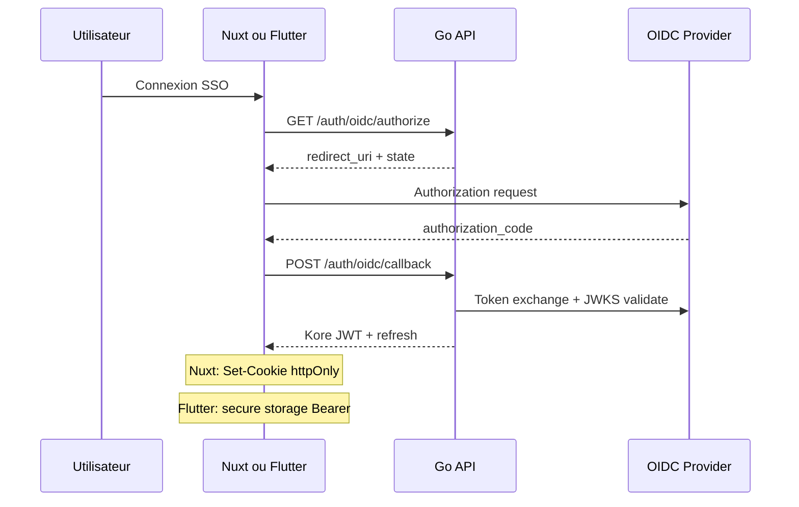

# 12 — SSO et fédération d'identité

> Fondation transverse. Authentification enterprise (OIDC, SAML ultérieur) et provisioning SCIM optionnel.
> Complète [04-auth-rbac.md](04-auth-rbac.md). Phase cible : [ROADMAP §Phase 1](../ROADMAP.md).
> Référence commerciale : [ANALYSE_COMMERCIALE §7](../documentation/ANALYSE_COMMERCIALE.md) (SSO/SAML table stake).

## 1. Objectif

Permettre aux tenants **Enterprise** de connecter un fournisseur d'identité (IdP) tout en conservant le **login mot de passe** pour les éditions Starter/Pro et les comptes locaux.

Trois clients d'authentification coexistent :

| Client | Mécanisme | Stockage token |
| --- | --- | --- |
| Nuxt (web) | OIDC Authorization Code **ou** login password → cookie httpOnly | Cookie BFF |
| Flutter (mobile) | OIDC Authorization Code **+ PKCE** | `flutter_secure_storage` |
| API partenaires | Clé API (cf. [13-public-api-ecosystem.md](13-public-api-ecosystem.md)) | Header `X-Api-Key` |



## 2. Périmètre Phase 1 (DoD initiale)

**Inclus** :
- OIDC Authorization Code Flow (Azure AD, Google Workspace)
- PKCE obligatoire pour clients publics (Flutter)
- Émission JWT Kore après validation IdP (claims mappés)
- Liaison JIT (Just-In-Time) ou rattachement compte `XXX_nom` existant
- Login password inchangé (dual-mode)

**Hors DoD initiale** (phases ultérieures) :
- SAML 2.0
- SCIM 2.0 provisioning (`/scim/v2/Users`)
- Multi-IdP par tenant (1 IdP par tenant en Phase 1)

## 3. Modèle de données (schéma `org`)

| Table | Colonnes clés |
| --- | --- |
| `org.identity_providers` | `id`, `tenant_id`, `name`, `issuer`, `client_id`, `client_secret_ref` (Secret Manager), `jwks_uri`, `scopes`, `enabled`, `created_at` |
| `org.user_identities` | `id`, `tenant_id`, `user_id`, `idp_id`, `subject` (sub IdP), `email`, `linked_at` |

Contrainte : `UNIQUE (tenant_id, idp_id, subject)` ; `UNIQUE (tenant_id, user_id, idp_id)`.

## 4. Endpoints

| Méthode | Chemin | Auth | Description |
| --- | --- | --- | --- |
| GET | `/api/v1/auth/oidc/authorize` | Public | Redirection vers IdP (query: `tenant`, `redirect_uri`, `code_challenge`) |
| POST | `/api/v1/auth/oidc/callback` | Public | Échange code → JWT Kore (+ refresh) |
| POST | `/api/v1/auth/token/refresh` | Bearer refresh | Renouvellement access token (Flutter + fallback API) |
| GET | `/api/v1/admin/identity-providers` | Admin | Liste IdP du tenant |
| PUT | `/api/v1/admin/identity-providers/{id}` | Admin | Configurer IdP (Enterprise) |

Erreurs : `401 INVALID_IDP_TOKEN`, `403 SSO_NOT_ENABLED`, `409 IDENTITY_ALREADY_LINKED`, `422 TENANT_MISMATCH`.

## 5. Mapping claims IdP → JWT Kore

| Claim Kore | Source IdP | Règle |
| --- | --- | --- |
| `sub` | `user_id` Kore (interne) | Après liaison ou création JIT |
| `tenant_id` | Résolution par `org.identity_providers` | Jamais depuis le corps client |
| `profile` | Attribut IdP mappé ou défaut `Collaborateur` | Config admin par tenant |
| `email` | `email` IdP | Pour liaison compte existant |

**JIT** : si `subject` inconnu et email correspond à un `XXX_nom` actif → liaison ; sinon création utilisateur si sièges disponibles (module 14).

## 6. Ports (platform/authx + module 00)

```go
// platform/authx — validation et émission
type OIDCAuthenticator interface {
    AuthorizeURL(ctx context.Context, tenant TenantID, redirectURI, codeChallenge string) (string, error)
    ExchangeCode(ctx context.Context, tenant TenantID, code, codeVerifier string) (ExternalIdentity, error)
    IssueKoreTokens(ctx context.Context, user UserID, tenant TenantID) (TokenPair, error)
}

// module 00 — configuration IdP
type IdentityProviderService interface {
    Configure(ctx context.Context, cmd ConfigureIdPCommand) (IdentityProvider, error)
    List(ctx context.Context, tenant TenantID) ([]IdentityProvider, error)
    LinkUser(ctx context.Context, cmd LinkIdentityCommand) error
}
```

## 7. Sécurité

- Validation signature JWT IdP via **JWKS** (cache Redis TTL court, clé `kore:{tenant}:oidc:jwks:{issuer}`).
- `state` et `nonce` obligatoires ; TTL Redis 10 min.
- `code_verifier` PKCE : S256 uniquement.
- Secrets IdP (`client_secret`) dans **Secret Manager** — jamais en base en clair.
- Rate-limiting login OIDC : même politique que login password ([04-auth-rbac.md](04-auth-rbac.md)).

## 8. Tests

- Unitaires : validation JWKS (token expiré, issuer invalide, tenant mismatch).
- Unitaires : liaison compte existant vs JIT ; refus si `SEAT_LIMIT_REACHED`.
- Intégration : flux complet avec IdP mock (testcontainers ou stub HTTP).
- Non-régression : login password + cookie Nuxt inchangés après activation SSO.

## 9. Definition of Done (fondation SSO — Phase 1)

- [ ] OIDC opérationnel sur au moins Azure AD **ou** Google Workspace.
- [ ] PKCE fonctionnel pour client Flutter (préparation Phase 1bis).
- [ ] Dual-mode auth documenté dans [04-auth-rbac.md](04-auth-rbac.md).
- [ ] Admin IdP par tenant (module [00](../modules/00-organisation-identity.md)).
- [ ] Tests isolation tenant et liaison compte passants.
