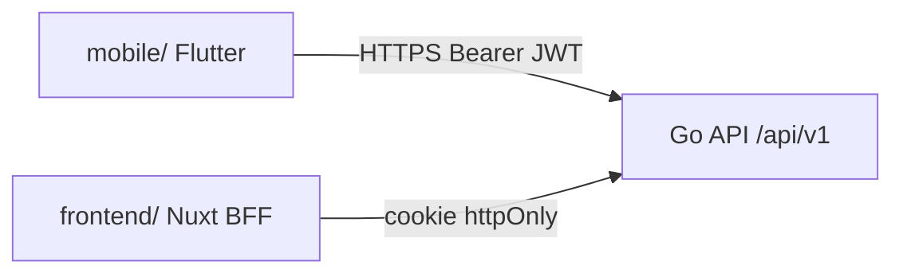

# 14 — Client mobile Flutter

> Fondation transverse. Conventions du client mobile multi-OS (iOS, Android).
> Module applicatif : [16-mobile-flutter.md](../modules/16-mobile-flutter.md). Phase cible : [ROADMAP §Phase 1bis](../ROADMAP.md).
> Auth : [12-sso-federation.md](12-sso-federation.md) (OIDC PKCE).

## 1. Décision et périmètre

- **Flutter 3.x** pour iOS et Android — facilité multi-OS, une codebase.
- **Pas de PWA** : le mobile commercial Kore passe par l'app native Flutter, pas par une Progressive Web App Nuxt.
- **Pas de BFF** : Flutter appelle l'API Go **directement** (`/api/v1/*`) avec `Authorization: Bearer`.
- Web Flutter et desktop : **hors scope initial**.



## 2. Stack

| Élément | Package / outil | Rôle |
| --- | --- | --- |
| Framework | **Flutter 3.x** | UI multi-OS |
| HTTP | `dio` | Client REST typé |
| Auth | `flutter_appauth` ou `oauth2` + PKCE | OIDC ([12-sso-federation.md](12-sso-federation.md)) |
| Stockage sécurisé | `flutter_secure_storage` | Access + refresh tokens |
| Navigation | `go_router` | Routes déclaratives |
| État | `riverpod` ou `bloc` | State management (choix à figer à l'init) |
| i18n | `flutter_localizations` + ARB | FR/EN (miroir `frontend/locales/`) |
| Tests | `flutter_test`, `mockito` | Widget + intégration |

## 3. Structure du projet (`mobile/`)

```
mobile/
  pubspec.yaml
  analysis_options.yaml
  lib/
    main.dart
    app.dart                    -> MaterialApp, thème, router
    core/
      auth/
        oidc_service.dart       -> PKCE flow, token refresh
        auth_repository.dart
      api/
        api_client.dart         -> dio + interceptors (Bearer, 401 refresh)
        api_exceptions.dart
      theme/
        kore_theme.dart         -> tokens --kore-* (cf. CHARTE_GRAPHIQUE)
      l10n/
        app_fr.arb
        app_en.arb
    features/
      cra/
        data/                   -> repositories, DTOs
        presentation/           -> screens, widgets
      conges/
        data/
        presentation/
      auth/
        presentation/           -> login screen
  android/
  ios/
  test/
    features/
```

## 4. Authentification

1. L'utilisateur lance l'app → écran login (bouton « Connexion SSO » + option password si édition Starter).
2. **OIDC PKCE** : `code_challenge` S256 → redirect IdP → `authorization_code` → `POST /api/v1/auth/oidc/callback` avec `code_verifier`.
3. Réponse : `{ access_token, refresh_token, expires_in }` → stockage `flutter_secure_storage`.
4. `ApiClient` injecte `Authorization: Bearer <access_token>` sur chaque requête.
5. Sur `401 TOKEN_EXPIRED` : `POST /api/v1/auth/token/refresh` → mise à jour tokens.
6. Logout : suppression secure storage + `POST /api/v1/auth/logout` (invalidation refresh).

**Tenant** : résolu via le JWT (`tenant_id` claim) — pas de sélection manuelle en Phase 1bis (un tenant par utilisateur).

## 5. Consommation API

Endpoints consommés en Phase 1bis (modules 02, 03) :

| Feature | Endpoints |
| --- | --- |
| CRA | `GET /timesheets`, `PUT /timesheets/{id}/weeks/{week}`, `POST .../submit`, `POST .../validate` |
| Congés | `POST /leave-requests`, `GET /leave-requests`, `POST .../approve`, `POST .../reject`, `GET /leave-balances` |

Option Phase 1bis+ : `GET /api/v1/timesheets/current-week` (agrégat mobile-optimisé, à ajouter côté Go si besoin perf).

Gestion erreurs : mapper codes API (`CRA_ALREADY_VALIDATED`, `LEAVE_PAST_DATE`, etc.) vers messages i18n.

## 6. Charte graphique

- Traduire les tokens CSS `--kore-*` ([`documentation/CHARTE_GRAPHIQUE.md`](../documentation/CHARTE_GRAPHIQUE.md)) en `ThemeData` / `ColorScheme`.
- Typographie : police système ou équivalent web (à valider avec charte).
- Composants réutilisables : `KoreButton`, `KoreCard`, `KoreAppBar` (miroir sémantique `App*` Nuxt, pas de partage de code Vue/Dart).
- Mode clair/sombre : suivre préférence système ou utilisateur.

## 7. Responsive et accessibilité

- Cibles : phones 320–428px largeur ; support safe areas iOS (notch, home indicator).
- Touch targets ≥ 44px.
- Accessibilité : WCAG AA sur écrans CRA (labels, contrastes, `Semantics`).
- Orientation : portrait prioritaire ; paysage optionnel Phase ultérieure.

## 8. Offline (hors scope initial)

- Phase 1bis : **online only** avec indicateur réseau.
- Phase ultérieure : cache lecture CRA semaine courante (`hive` ou `drift`) + file sync.

## 9. CI/CD

Extension [07-docker-devops.md](07-docker-devops.md) :

- `flutter analyze` + `flutter test` en CI.
- Build Android : `flutter build appbundle` (AAB pour Play Store).
- Build iOS : `flutter build ipa` (Xcode + certificats via Cloud Build ou pipeline dédié).
- Distribution interne : Firebase App Distribution ou TestFlight (hors scope doc).

Variables : `KORE_API_BASE_URL`, `OIDC_CLIENT_ID`, `OIDC_REDIRECT_URI` (custom scheme `kore://callback`).

## 10. Tests

- Widget : `TimesheetGrid`, `LeaveRequestForm`, login screen.
- Unit : `OidcService` (PKCE), `ApiClient` refresh interceptor (mock dio).
- Intégration : parcours login mock → liste CRA (serveur stub).

## 11. Definition of Done (fondation Flutter — Phase 1bis)

- [ ] Projet `mobile/` initialisé avec structure §3.
- [ ] OIDC PKCE fonctionnel iOS + Android.
- [ ] Thème `--kore-*` appliqué.
- [ ] i18n fr/en sur écrans CRA et congés.
- [ ] `flutter test` et `flutter analyze` verts en CI.
- [ ] Builds AAB + IPA reproductibles.
