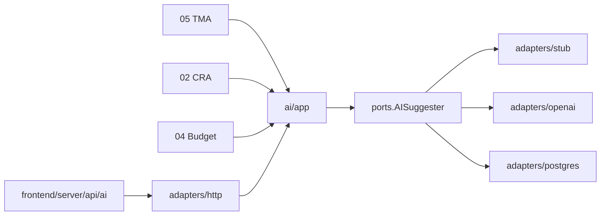

# 01 — Architecture module IA

> Module transverse hexagonal `internal/modules/ai/`.
> Fondations : [01-architecture.md](../foundation/01-architecture.md), [00-ai-act-conformite.md](00-ai-act-conformite.md).

## 1. Périmètre

**Inclus** : port `AISuggester`, journalisation, registre capabilities, adapters LLM (stub/cloud/local), routes HTTP `/api/v1/ai/*`, contrat BFF `frontend/server/api/ai/*`.

**Hors brique** : logique métier TMA/CRA/Budget (reste dans modules hôtes).

**Consommé par** : TMA (05), CRA (02), Budget (04), Dashboard, Congés (03), Workflow (01), Publicsite (15).



## 2. Layout

```
internal/modules/ai/
  domain/           — Capability, RiskClass, RequestLog
  ports/            — AIService, LLMProvider, Repository
  app/              — Service (orchestration + logging)
  adapters/
    http/           — handlers chi
    postgres/       — ai_capabilities, ai_request_log, tenant_ai_settings
    stub/           — génération heuristique (dev / sans clé API)
  migrations/
  module.go
```

## 3. Port inbound

```go
type AIService interface {
    SuggestAnalysisDraft(ctx context.Context, cmd AnalysisDraftCommand) (AnalysisDraftResult, error)
    ClassifyDemand(ctx context.Context, cmd ClassifyDemandCommand) (ClassifyResult, error)
    FindSimilarDemands(ctx context.Context, cmd SimilarDemandsCommand) ([]SimilarDemand, error)
    SuggestCraPrefill(ctx context.Context, cmd CraPrefillCommand) (CraPrefillResult, error)
    ListCraAnomalies(ctx context.Context, cmd CraAnomaliesCommand) ([]CraAnomaly, error)
    EstimateBudgetEffort(ctx context.Context, cmd BudgetEstimateCommand) (BudgetEstimateResult, error)
    SuggestBudgetDemands(ctx context.Context, cmd BudgetDemandSuggestCommand) ([]DemandSuggestion, error)
    DashboardBriefing(ctx context.Context, cmd DashboardBriefingCommand) (BriefingResult, error)
    CongesManagerContext(ctx context.Context, cmd CongesManagerCommand) (ManagerContextResult, error)
    ExplainWorkflow(ctx context.Context, cmd WorkflowExplainCommand) (ExplainResult, error)
    PublicChat(ctx context.Context, cmd PublicChatCommand) (ChatResult, error)
    ExplainRequest(ctx context.Context, tenant TenantID, requestID uuid.UUID) (ExplainResult, error)
    GetTenantSettings(ctx context.Context, tenant TenantID) (TenantAISettings, error)
    EnableAI(ctx context.Context, cmd EnableAICommand) error
}
```

Chaque méthode vérifie : capability enabled, tenant AI activé, journalise dans `ai_request_log`.

## 4. Port outbound LLM

```go
type LLMProvider interface {
    Complete(ctx context.Context, req CompletionRequest) (CompletionResponse, error)
    Embed(ctx context.Context, text string) ([]float32, error)
}
```

Implémentations : `stub` (défaut), `openai` (roadmap), `ollama` (roadmap).

## 5. Routes HTTP

| Méthode | Path | Capability |
| --- | --- | --- |
| POST | `/ai/tma/analysis-draft` | `tma.analysis_draft` |
| POST | `/ai/tma/classify` | `tma.classify` |
| GET | `/ai/tma/similar` | `tma.similar` |
| POST | `/ai/cra/prefill-suggest` | `cra.prefill` |
| GET | `/ai/cra/anomalies` | `cra.anomalies` |
| POST | `/ai/budget/estimate-effort` | `budget.estimate` |
| GET | `/ai/budget/demand-suggest` | `budget.demand_suggest` |
| GET | `/ai/dashboard/briefing` | `dashboard.briefing` |
| POST | `/ai/conges/manager-context` | `conges.manager_assist` |
| GET | `/ai/workflow/explain` | `workflow.explain` |
| POST | `/ai/public/chat` | `publicsite.chatbot` |
| GET | `/ai/explain/{requestId}` | transversal |
| GET | `/ai/settings` | gouvernance |
| POST | `/ai/settings/enable` | gouvernance |

Routes `/ai/public/chat` : sans JWT, rate-limit recommandé.

## 6. BFF Nitro

Miroir sous `frontend/server/api/ai/**` — proxy vers API Go avec cookies auth.

## 7. Entitlements

Capability `ai_assist` via billing (add-on roadmap). En dev : activable via `tenant_ai_settings.enabled`.

## 8. Configuration

| Variable | Défaut | Description |
| --- | --- | --- |
| `AI_LLM_PROVIDER` | `stub` | `stub`, `openai`, `ollama` |
| `AI_OPENAI_API_KEY` | — | Clé API si provider openai |
| `AI_OLLAMA_BASE_URL` | `http://localhost:11434` | Base Ollama |

## 9. Tests

- Unitaires : stub provider, logging, capability disabled
- Intégration : handlers HTTP avec mock LLM
- Pas d'appel réseau LLM en CI (stub uniquement)

## 10. Definition of Done

- [ ] Module câblé dans `internal/app/app.go`
- [ ] Migrations `ai` schema appliquées
- [ ] Routes documentées OpenAPI
- [ ] BFF routes créées
- [ ] Build Go + frontend OK
