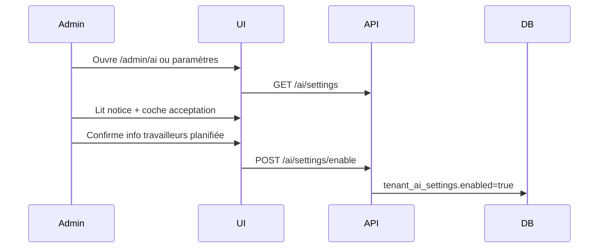

# 03 — Gouvernance deployer (tenant)

> Outillage des obligations Art. 26 IA Act pour les clients ESN/DSI.
> Référence : [00-ai-act-conformite.md](00-ai-act-conformite.md).

## 1. Opt-in tenant

L'IA n'est **pas active par défaut**. Activation en 3 étapes :

1. **Entitlement** `ai_assist` (billing add-on — roadmap) ou flag dev
2. **Admin** lit la notice d'utilisation IA (Art. 13)
3. **Admin** confirme activation + accuse réception obligation Art. 26(7)

### Table `ai.tenant_ai_settings`

| Colonne | Type | Description |
| --- | --- | --- |
| `tenant_id` | UUID PK | Tenant |
| `enabled` | BOOLEAN | IA active pour ce tenant |
| `notice_accepted_at` | TIMESTAMPTZ | Horodatage acceptation notice |
| `notice_accepted_by` | UUID | User admin |
| `workers_informed_at` | TIMESTAMPTZ | Confirmation info travailleurs |
| `llm_provider` | TEXT | `stub`, `openai`, `ollama` |

## 2. Notice d'utilisation (Art. 13)

Contenu minimum (FR/EN via i18n `ai.notice.*`) :

- Liste des capabilities activées
- Finalité de chaque capability
- Limites connues (hallucinations, données non décisionnelles)
- Rôle du deployer : information travailleurs, supervision humaine
- Contact DPO / support Kore

### Clés i18n

```
ai.notice.title
ai.notice.intro
ai.notice.capabilities
ai.notice.limits
ai.notice.deployer_duties
ai.notice.accept_label
ai.notice.workers_informed_label
```

## 3. Workflow activation admin



Page admin : roadmap — en Vague 0, activation via API ou seed demo.

## 4. Information travailleurs (Art. 26(7))

Kore fournit un **modèle email** (module notifications) :

- Objet : « Activation de l'assistance IA sur Kore »
- Corps : capabilities activées, lien notice, droit explication
- Déclenchement : manuel par admin après activation (pas automatique sans consentement deployer)

## 5. Template FRIA (Art. 27)

Secteur public : template Markdown téléchargeable — roadmap Phase 2.

## 6. API gouvernance

| Route | Description |
| --- | --- |
| `GET /api/v1/ai/settings` | État activation tenant |
| `POST /api/v1/ai/settings/enable` | Activation avec accusé notice |

Body enable :

```json
{
  "noticeAccepted": true,
  "workersInformed": true
}
```

## 7. Garde-fous runtime

Si `tenant_ai_settings.enabled = false` :

- Toutes les routes `/ai/*` (sauf public chat config) retournent `403 AI_DISABLED`
- UI masque boutons « Générer brouillon » etc.

## 8. Definition of Done

- [ ] Table `tenant_ai_settings` migrée
- [ ] Notice FR/EN dans locales
- [ ] Endpoint enable avec validation champs obligatoires
- [ ] Vérification enabled dans service AI
