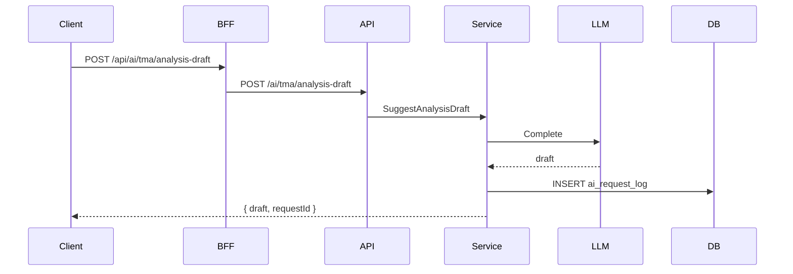

# 04 — Journalisation et explicabilité

> Art. 12 (record-keeping) et Art. 86 (droit à explication).
> Référence : [01-architecture-module-ai.md](01-architecture-module-ai.md).

## 1. Table `ai.ai_request_log`

| Colonne | Type | Description |
| --- | --- | --- |
| `id` | UUID PK | Identifiant requête (retourné au client) |
| `tenant_id` | UUID | Isolation multi-tenant |
| `user_id` | UUID | Acteur |
| `capability_code` | TEXT FK | Référence `ai_capabilities.code` |
| `entity_type` | TEXT | ex. `tma_demand`, `timesheet` |
| `entity_id` | UUID | Entité métier liée |
| `input_hash` | TEXT | SHA-256 du payload entrée (pas de PII en clair) |
| `output_json` | JSONB | Réponse IA (truncated si > 64KB) |
| `model` | TEXT | ex. `stub-v1`, `gpt-4o-mini` |
| `explain_context` | JSONB | Contexte pour Art. 86 |
| `created_at` | TIMESTAMPTZ | Horodatage |

Index : `(tenant_id, created_at)`, `(tenant_id, capability_code)`.

## 2. Anonymisation prompts (Art. 10)

Avant envoi LLM externe :

- Remplacer login/nom par `USER_{hash8}`
- Exclure emails, SIRET, tokens
- Option tenant `llm_provider=stub` ou `ollama` pour souveraineté

## 3. Endpoint explicabilité

```
GET /api/v1/ai/explain/{requestId}
```

Réponse :

```json
{
  "requestId": "uuid",
  "capability": "tma.analysis_draft",
  "summary": "Brouillon généré à partir du sujet de la demande et du contexte application.",
  "factors": [
    { "label": "Sujet demande", "value": "Erreur export XML" },
    { "label": "Modèle", "value": "stub-v1" }
  ],
  "disclaimer": "Suggestion non décisionnelle — validation humaine requise."
}
```

Source : colonne `explain_context` + métadonnées capability.

## 4. Rétention

| Paramètre | Défaut | Notes |
| --- | --- | --- |
| Durée | 365 jours | Configurable par tenant (roadmap) |
| Export | CSV/JSON | Admin audit — roadmap |
| Suppression | Cascade tenant | RGPD droit effacement |

## 5. Flux journalisation



Le `requestId` est affiché dans UI avancée / support — optionnel en V1.

## 6. Tests

- Chaque appel capability crée une ligne log
- `ExplainRequest` retourne contexte pour requestId tenant-scopé
- Cross-tenant explain → 404

## 7. Definition of Done

- [ ] Migration `ai_request_log`
- [ ] Hash input implémenté
- [ ] Endpoint explain opérationnel
- [ ] explain_context rempli par capability
