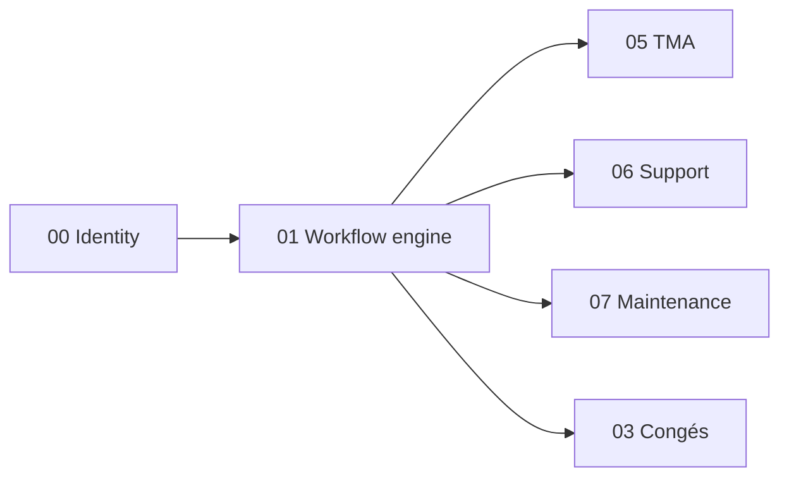

# Brique 01 — Workflow engine

> Moteur générique d'états et de transitions piloté par configuration (Document × Action). Utilisé par TMA, Support, Maintenance, Congés pour leurs cycles de vie de Demande.

## 1. Référence fonctionnelle

- Spec §7.10 (paramétrage workflow : états, déclencheurs Document×Action, exclusions client/app), §5.4 (Demande et sous-types), §8 (tableau des flux d'états par processus).
- Règles : RG-TMA-01 (gate chef utilisateur), états TMA/Support/Congés (§8, tableaux « flux d'états »).
- Fondations : [01-architecture.md](/home/olivier/ll-it-sc/projets/kore/technical/foundation/01-architecture.md), [05-api-conventions.md](/home/olivier/ll-it-sc/projets/kore/technical/foundation/05-api-conventions.md).

## 2. Périmètre de la brique et dépendances

**Inclus** : définition de machines à états paramétrables (états, transitions, garde, déclencheurs Document×Action), moteur d'exécution des transitions, historique des transitions, hooks/événements émis à chaque transition.

**Hors brique** : la sémantique métier des états (portée par chaque module consommateur), l'UI de paramétrage avancé (brique 13 Admin), l'envoi effectif de notifications (brique 11).

**Dépend de** : 00 (identité/tenant, RBAC). **Consommée par** : 05 TMA, 06 Support, 07 Maintenance, 03 Congés.



## 3. Modèle de domaine

- **Agrégat `WorkflowDefinition`** (racine) : `code`, `entityType` (ex. `demand.incident`), ensemble d'`State`, ensemble de `Transition`.
- **`State`** : `code`, `label`, `isInitial`, `isFinal`.
- **`Transition`** : `from`, `to`, `action` (déclencheur), `guard` (condition), `documentTrigger` (Document×Action optionnel), rôles autorisés.
- **`WorkflowInstance`** : `definitionCode`, `currentState`, `entityID`, historique (`TransitionLog`).
- **Value objects** : `StateCode`, `ActionCode`, `Trigger{Document, Action}`.
- **Invariants** :
  - Une seule state initiale ; au moins une state finale.
  - Une transition n'est franchissable que depuis `currentState`, action connue, garde satisfaite, rôle autorisé.
  - Transition invalide -> erreur `ErrTransitionNotAllowed` (LSP : même comportement quelle que soit la définition).
  - Historique append-only (auditabilité).

## 4. Ports

### Inbound

```go
type WorkflowService interface {
    DefineWorkflow(ctx context.Context, def WorkflowDefinition) error
    Start(ctx context.Context, cmd StartInstanceCommand) (WorkflowInstance, error)
    Fire(ctx context.Context, cmd FireTransitionCommand) (WorkflowInstance, error) // exécute une action
    AvailableActions(ctx context.Context, instanceID InstanceID, actor Identity) ([]ActionCode, error)
    History(ctx context.Context, instanceID InstanceID) ([]TransitionLog, error)
}
```

### Outbound

```go
type WorkflowRepository interface {
    SaveDefinition(ctx context.Context, def WorkflowDefinition) error
    GetDefinition(ctx context.Context, tenant TenantID, code string) (WorkflowDefinition, error)
    SaveInstance(ctx context.Context, inst WorkflowInstance) error
    GetInstance(ctx context.Context, tenant TenantID, id InstanceID) (WorkflowInstance, error)
    AppendLog(ctx context.Context, log TransitionLog) error
}

// port outbound optionnel : publication d'événement de transition (consommé par Notifications 11)
type TransitionPublisher interface {
    Publish(ctx context.Context, evt TransitionOccurred) error
}
```

> **Cache (Redis)** : les définitions de workflow (lecture fréquente, écriture rare) sont mises en cache (clé `kore:{tenant}:workflow:def:{code}`, TTL moyen) et **invalidées** à la redéfinition. Port `Cache` (cf. [foundation/10-cache-redis.md](/home/olivier/ll-it-sc/projets/kore/technical/foundation/10-cache-redis.md)) injecté dans le service.

Le module consommateur (ex. TMA) implémente éventuellement une `GuardEvaluator` pour les gardes métier spécifiques, injectée dans le moteur (OCP/DIP).

```go
type GuardEvaluator interface {
    Evaluate(ctx context.Context, guard Guard, entityID string) (bool, error)
}
```

## 5. Adapters

- **HTTP (chi)** : endpoints de consultation et de déclenchement d'action (utilisés indirectement par les modules).
- **PostgreSQL (sqlc)** : schéma `workflow` (`definitions`, `states`, `transitions`, `instances`, `transition_logs`).
- **Publisher** : adapter émettant `TransitionOccurred` vers le bus interne / module Notifications.

## 6. Contrat d'API

| Méthode | Chemin | Permission | Description |
| --- | --- | --- | --- |
| POST | `/api/v1/workflows` | Admin (E) | Définir/mettre à jour une définition |
| GET | `/api/v1/workflows/{code}` | Admin/Resp (L) | Lire une définition |
| GET | `/api/v1/workflow-instances/{id}` | selon module (L) | État courant + historique |
| GET | `/api/v1/workflow-instances/{id}/actions` | selon module (L) | Actions disponibles pour l'acteur |
| POST | `/api/v1/workflow-instances/{id}/fire` | selon module (E/V) | Déclencher une action |

Erreurs : `409 TRANSITION_NOT_ALLOWED`, `422 GUARD_FAILED`, `403 ACTION_NOT_PERMITTED`, `404 WORKFLOW_NOT_FOUND`.

## 7. Schéma de données (schéma `workflow`)

| Table | Colonnes clés |
| --- | --- |
| `workflow.definitions` | `id`, `tenant_id`, `code`, `entity_type`, `version` |
| `workflow.states` | `id`, `definition_id`, `code`, `is_initial`, `is_final` |
| `workflow.transitions` | `id`, `definition_id`, `from_state`, `to_state`, `action`, `guard`, `doc_trigger`, `allowed_roles` |
| `workflow.instances` | `id`, `tenant_id`, `definition_code`, `entity_id`, `current_state` |
| `workflow.transition_logs` | `id`, `tenant_id`, `instance_id`, `from_state`, `to_state`, `action`, `actor_id`, `occurred_at` (append-only) |

## 8. Mapping SOLID

| Principe | Application |
| --- | --- |
| SRP | Le moteur gère uniquement états/transitions ; la sémantique métier reste dans les modules. |
| OCP | Nouveaux workflows/états/transitions ajoutés par **données** (définition), sans modifier le moteur. `GuardEvaluator` extensible. |
| LSP | Toute `WorkflowDefinition` respecte le même contrat d'exécution ; `Fire` se comporte identiquement. |
| ISP | Ports séparés : exécution (`WorkflowService`), persistance (`WorkflowRepository`), publication (`TransitionPublisher`), garde (`GuardEvaluator`). |
| DIP | Le moteur dépend d'abstractions (repository, publisher, guard) injectées ; les modules fournissent gardes et consomment les événements. |

## 9. Plan de tests unitaires

**Domaine** (table-driven) :
- Transition valide depuis l'état courant -> nouvel état.
- Transition depuis mauvais état -> `ErrTransitionNotAllowed`.
- Garde non satisfaite -> refus.
- Rôle non autorisé -> refus.
- Définition invalide (0 ou 2 états initiaux) -> erreur de validation.
- Gate chef utilisateur : `EnAttenteCreation -> Soumis` uniquement par rôle Chef utilisateur (RG-TMA-01).

**Application (mocks)** :
- `Fire` persiste l'instance + append log + publie l'événement (mock `TransitionPublisher`).
- `AvailableActions` filtre selon rôle de l'acteur.

**Intégration (testcontainers)** :
- Historique append-only ; relecture définition/instance.

Couverture : domaine > 90 %, app > 80 %.

## 10. Frontend Nuxt

| Élément | Détail |
| --- | --- |
| Pages | (admin) `admin/workflows` : éditeur états/transitions |
| Composants | `WorkflowDiagram` (visualisation), `TransitionButton` (actions dispo) |
| Composables | `useWorkflow()` (actions dispo + fire) réutilisé par les modules |
| Store Pinia | `workflow` (définitions chargées) |
| Routes BFF | `server/api/workflows/*`, `server/api/workflow-instances/*` |

Les modules consommateurs affichent les actions via `useWorkflow()` (les boutons d'action reflètent `AvailableActions`).

## 11. Definition of Done

- [ ] Moteur générique états/transitions opérationnel et paramétrable.
- [ ] Gardes et rôles appliqués ; gate chef utilisateur testée (RG-TMA-01).
- [ ] Historique append-only vérifié en intégration.
- [ ] Événement `TransitionOccurred` publié (consommable par Notifications).
- [ ] Endpoints documentés dans `api/openapi.yaml`.
