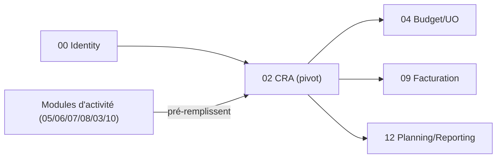

# Brique 02 — CRA (Compte Rendu d'Activité, pivot)

> **Brique pivot** du système (spec §5.1). Toutes les activités convergent vers le CRA. À stabiliser avant les modules générateurs d'activité.

## 1. Référence fonctionnelle

- Spec §7.1 (CRA / feuille de temps), §5.1 (pivot), §8 PR-08.2 (CRA prévisionnel et définitif), §8 PR-08.8 (suivi prestations mensuel).
- Règles : RG-CRA-01, RG-CRA-02 (blocage PDF sans infos commerciales), RG-CRA-03.
- Entités §11 : CRA / feuille de temps, Tâche, Semaine.
- Critères d'acceptation PR-08.2 : pré-remplissage non destructif, PDF bloqué sans infos commerciales, Gantt reflète le temps saisi.
- Fondations : [03-database.md](/home/olivier/ll-it-sc/projets/kore/technical/foundation/03-database.md), [06-testing-strategy.md](/home/olivier/ll-it-sc/projets/kore/technical/foundation/06-testing-strategy.md).

## 2. Périmètre de la brique et dépendances

**Inclus** : feuille de temps hebdomadaire/mensuelle, lignes par tâche/jour, pré-remplissage depuis sources métier, validation prévisionnelle (collaborateur) puis définitive (manager), infos commerciales, génération PDF mensuel, exposition des données consolidées aux consommateurs (Budget, Facturation, Planning, Reporting).

**Hors brique** : logique de calcul budget (04), facturation (09), génération des sources d'activité (TMA/SSII/Support/Congés qui *alimentent* le CRA via un port).

**Dépend de** : 00 (identité/tenant/RBAC). **Consommée par** : 03, 04, 05, 08, 09, 10, 12.



## 3. Modèle de domaine

- **Agrégat `Timesheet` (CRA mensuel)** : `userID`, `mois`, `semaines[]`, `statut` (Brouillon → ValidéSemaine → Définitif), `infosCommerciales`.
- **`WeekEntry`** : semaine, lignes de temps, statut de validation prévisionnelle.
- **`TimeLine`** : `tâche/activité` (référence polymorphe vers Demande/Mission/Congé), `jour`, `durée` (VO `Duration`), `commentaire`.
- **`CommercialInfo`** : champs obligatoires avant PDF (client, mission, etc.).
- **Value objects** : `Month`, `WeekNumber`, `Duration` (demi-journées/heures), `TimesheetStatus`.
- **Invariants** :
  - **Pré-remplissage non destructif** : une ligne saisie manuellement n'est jamais écrasée par une source (critère PR-08.2, RG-CRA-01).
  - **PDF bloqué** tant que `CommercialInfo` incomplète (RG-CRA-02).
  - Cohérence : total jour ne dépasse pas la capacité configurée (RG-CRA-03).
  - Conflit mission + absence (congé, arrêt) même jour -> signalement (correction manuelle). **Exception** : un jour férié pré-rempli peut être contourné (heures partielles ou activité mission le même jour).

## 4. Ports

### Inbound

```go
type CRAService interface {
    GetOrCreate(ctx context.Context, userID UserID, month Month) (Timesheet, error)
    SaveWeek(ctx context.Context, cmd SaveWeekCommand) (Timesheet, error)
    SubmitWeek(ctx context.Context, cmd SubmitWeekCommand) error        // validation prévisionnelle collab
    CompleteCommercialInfo(ctx context.Context, cmd CommercialCommand) error
    GeneratePDF(ctx context.Context, id TimesheetID) (Document, error)  // refus si infos incomplètes
    ValidateFinal(ctx context.Context, cmd ManagerValidateCommand) error // validation manager
}

// port inbound consommé par les modules d'activité pour alimenter le CRA
type CRAFeeder interface {
    ProposeLines(ctx context.Context, lines []ProposedLine) error // non destructif
}

// port inbound de purge des lignes futures issues d'une source (ex. arrêt de mission SSII)
type CRAFutureCleaner interface {
    RemoveFutureLines(ctx context.Context, source SourceRef, from time.Time) error // jours futurs uniquement
}

// port de lecture pour Budget/Facturation/Reporting (ISP : lecture seule)
type CRAReader interface {
    ConsumedByApplication(ctx context.Context, appID ApplicationID, period Period) ([]Consumption, error)
    TimesheetOf(ctx context.Context, userID UserID, month Month) (Timesheet, error)
}
```

### Outbound

```go
type CRARepository interface {
    Save(ctx context.Context, ts Timesheet) error
    Get(ctx context.Context, tenant TenantID, userID UserID, month Month) (Timesheet, error)
    FindConsumption(ctx context.Context, tenant TenantID, appID ApplicationID, period Period) ([]Consumption, error)
}

type PDFRenderer interface { Render(ctx context.Context, ts Timesheet) (Document, error) }
type Clock interface { Now() time.Time }
type Cache interface { /* platform/cache — cf. foundation/10 */ }
```

> **Cache (Redis)** : les agrégats de consommation par application/période (`ConsumedByApplication`) sont mis en cache (clé `kore:{tenant}:cra:consumption:{app}:{period}`, TTL court) et **invalidés** à toute écriture/validation de CRA. Cache-aside, dégradation vers la base si Redis indisponible (cf. [foundation/10-cache-redis.md](/home/olivier/ll-it-sc/projets/kore/technical/foundation/10-cache-redis.md)).

## 5. Adapters

- **HTTP (chi)** : `internal/modules/cra/adapters/http`.
- **PostgreSQL (sqlc)** : schéma `cra`.
- **PDFRenderer** : gateway de génération PDF (implémentation dédiée).
- **Clock** : horloge injectée (déterminisme des tests temporels).

## 6. Contrat d'API

| Méthode | Chemin | Permission | Description |
| --- | --- | --- | --- |
| GET | `/api/v1/timesheets?month=YYYY-MM` | CRA (L) | CRA du mois (créé si absent) |
| PUT | `/api/v1/timesheets/{id}/weeks/{week}` | CRA (E) | Sauvegarder une semaine |
| POST | `/api/v1/timesheets/{id}/weeks/{week}/submit` | CRA (E) | Valider prévisionnel |
| PUT | `/api/v1/timesheets/{id}/commercial-info` | CRA (E) | Compléter infos commerciales |
| POST | `/api/v1/timesheets/{id}/pdf` | CRA (E) | Générer le PDF mensuel |
| POST | `/api/v1/timesheets/{id}/validate` | CRA (V) | Validation manager (définitif) |

Erreurs : `409 CRA_ALREADY_VALIDATED`, `422 COMMERCIAL_INFO_REQUIRED` (RG-CRA-02), `422 DAY_CAPACITY_EXCEEDED` (RG-CRA-03), `409 CRA_CONFLICT_ABSENCE`, `422 WEEK_INCOMPLETE`.

Réponse `POST /timesheets/{id}/validate` : inclut `invoiceDraft` (`created` | `skipped` | `unavailable` + `reason`).

## 7. Schéma de données (schéma `cra`)

| Table | Colonnes clés |
| --- | --- |
| `cra.timesheets` | `id`, `tenant_id`, `user_id`, `month`, `status`, `commercial_info` (jsonb), `validated_at`, `validated_by` |
| `cra.week_entries` | `id`, `tenant_id`, `timesheet_id`, `week_number`, `submitted_at` |
| `cra.time_lines` | `id`, `tenant_id`, `week_entry_id`, `source_type`, `source_id`, `day`, `duration`, `comment`, `origin` (manual/prefill) |

Contraintes : `UNIQUE (tenant_id, user_id, month)` ; index `(tenant_id, source_type, source_id)` pour la consolidation ; `origin` distingue saisie manuelle vs pré-remplissage (garantit le non-écrasement).

## 8. Mapping SOLID

| Principe | Application |
| --- | --- |
| SRP | `CRAService` (édition/validation), `CRAReader` (consommation), `PDFRenderer` (rendu) séparés. |
| OCP | Nouvelles sources d'activité alimentent le CRA via `CRAFeeder.ProposeLines` sans modifier le CRA. |
| LSP | `CRARepository` réel/mock substituables ; `Clock` réel/faux pour les tests. |
| ISP | `CRAReader` (lecture seule) exposé aux consommateurs, distinct de `CRAService` (écriture). |
| DIP | Génération PDF et horloge derrière des ports ; injectés au composition root. |

## 9. Plan de tests unitaires

**Domaine** (table-driven) :
- Pré-remplissage n'écrase pas une ligne `origin=manual` (critère PR-08.2 / RG-CRA-01).
- `GeneratePDF` refuse si `CommercialInfo` incomplète (RG-CRA-02).
- Dépassement capacité jour rejeté (RG-CRA-03).
- Conflit mission + absence (congé, arrêt) même jour -> signalé ; férié pré-rempli + mission autorisé.
- Transitions de statut Brouillon → ValidéSemaine → Définitif ; refus modif après Définitif.

**Application (mocks)** :
- `SubmitWeek` puis `ValidateFinal` (mock repo) ; refus validation manager -> retour collaborateur.
- `ConsumedByApplication` agrège correctement (données consommées par Budget).
- `Clock` mocké pour « fin de mois » / alertes.

**Intégration (testcontainers)** :
- Unicité `(tenant, user, month)` ; consolidation `FindConsumption`.

**Contrat HTTP** :
- 422 `COMMERCIAL_INFO_REQUIRED` ; 409 après validation.

Couverture : domaine > 90 %, app > 80 %.

## 10. Frontend Nuxt

| Élément | Détail |
| --- | --- |
| Pages | `cra/index`, `cra/[id]` (saisie hebdo + infos commerciales), `cra/planning`, `cra/gantt`, `prestations/index`, `reporting/facturation` |
| Composants | `WeekMatrix`, `CommercialInfoForm`, `CraPdfPreview`, `CraGanttChart`, `DayActivityBlock` |
| Composables | `useCra()` (chargement, sauvegarde, soumission, validation, RBAC `cra:E`), `useCraError()` (mapping codes `CRA_*`), `useCraGate()` |
| Store Pinia | `cra` (CRA courant, statut, dirty state) |
| Routes BFF | `server/api/timesheets/*`, `server/api/billing-stats`, `server/api/gantt`, `server/api/planning` |
| Middleware | `cra-gate.ts` — mode `warn` (bannière) ou `block` (redirect) selon `cra_gate_mode` société |
| Permissions UI | `canEdit` = statut ≠ Définitif **et** `cra:E` ; validation masquée si `!canValidateCra` |

## 10bis. Client Flutter (Phase 1bis)

> Module [16-mobile-flutter.md](16-mobile-flutter.md). Fondation [14-flutter-mobile-client.md](../foundation/14-flutter-mobile-client.md).

| Élément | Détail |
| --- | --- |
| Écrans | `/cra`, `/cra/:month`, validation manager |
| Widgets | `TimesheetGrid`, `WeekStatusBadge`, `KoreScaffold` |
| Repository | `CraRepository` → endpoints §6 |
| Endpoints | `GET/PUT /timesheets`, `POST .../submit`, `POST .../validate` |

## 11. Definition of Done

- [x] CRA mensuel CRUD + validation prévisionnelle/définitive opérationnels.
- [x] Pré-remplissage non destructif garanti et testé (RG-CRA-01).
- [x] PDF bloqué sans infos commerciales (RG-CRA-02) testé.
- [x] Port `CRAReader` exposé et consommé par Budget/Facturation/Reporting.
- [x] Ports `CRAFeeder` (alimentation) et `CRAFutureCleaner` (purge jours futurs) disponibles pour les modules d'activité (SSII, etc.).
- [x] Critères d'acceptation PR-08.2 couverts par des tests nommés.
- [x] Endpoints documentés dans `api/openapi.yaml`.
