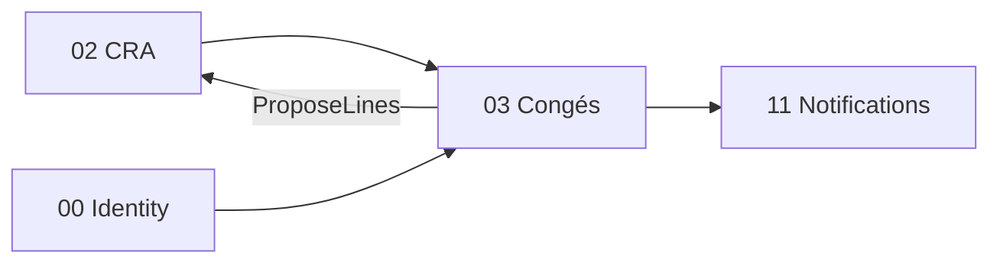

# Brique 03 — Congés / Absences

> Gestion des demandes d'absence avec validation manager et alimentation du CRA (pré-remplissage).

## 1. Référence fonctionnelle

- Spec §7.6 (Congés/Absences), §8 PR-08.5, §5.3 (transverse alimentant le CRA).
- Règles : RG-CONG-01, RG-CONG-02.
- Critères d'acceptation PR-08.5 : validation n'impacte que les jours > date du jour ; refus génère mail auto et reste visible.
- Fondations : [04-auth-rbac.md](/home/olivier/ll-it-sc/projets/kore/technical/foundation/04-auth-rbac.md).

## 2. Périmètre de la brique et dépendances

**Inclus** : types d'absence, compteurs, cycle demande → validation/refus manager, pré-remplissage du CRA futur, planning des absences.

**Hors brique** : machine à états générique (peut réutiliser 01 ou un cycle simple en attente→validé/refusé), rendu planning consolidé (12), envoi mail (11).

**Dépend de** : 02 CRA (port `CRAFeeder`), 00 (identité). **Consommée par** : 12 Planning.



## 3. Modèle de domaine

- **Agrégat `LeaveRequest`** : `userID`, `type` (congé payé, RTT, maladie...), `période` (VO `DateRange`), `motif`, `statut` (EnAttente → Validé/Refusé).
- **`LeaveBalance`** : compteurs par type et par utilisateur.
- **Value objects** : `DateRange`, `LeaveType`, `LeaveStatus`.
- **Invariants** :
  - Validation n'affecte que les jours **strictement postérieurs** à la date du jour (critère PR-08.5, RG-CONG-01).
  - Modification interdite après validation (retrait manuel du CRA possible).
  - Refus reste visible dans le planning des refusés (RG-CONG-02).
  - Un refus déclenche une notification au collaborateur.

## 4. Ports

### Inbound

```go
type LeaveService interface {
    Request(ctx context.Context, cmd RequestLeaveCommand) (LeaveRequest, error)
    Approve(ctx context.Context, cmd DecideLeaveCommand) error // manager
    Reject(ctx context.Context, cmd DecideLeaveCommand) error  // manager
    Balance(ctx context.Context, userID UserID) ([]LeaveBalance, error)
}
```

### Outbound

```go
type LeaveRepository interface {
    Save(ctx context.Context, r LeaveRequest) error
    Get(ctx context.Context, tenant TenantID, id LeaveID) (LeaveRequest, error)
    ListByUser(ctx context.Context, tenant TenantID, userID UserID) ([]LeaveRequest, error)
}

// dépendances vers d'autres briques (ports consommés)
type CRAFeeder interface { // fourni par brique 02
    ProposeLines(ctx context.Context, lines []ProposedLine) error
}
type NotificationPublisher interface { // fourni par brique 11
    Notify(ctx context.Context, evt NotificationEvent) error
}
type Clock interface { Now() time.Time }
```

## 5. Adapters

- **HTTP (chi)** : `internal/modules/conges/adapters/http`.
- **PostgreSQL (sqlc)** : schéma `conges`.
- Consomme `CRAFeeder` (02) et `NotificationPublisher` (11) via injection.

## 6. Contrat d'API

| Méthode | Chemin | Permission | Description |
| --- | --- | --- | --- |
| POST | `/api/v1/leave-requests` | Congés (E) | Créer une demande |
| GET | `/api/v1/leave-requests` | Congés (L) | Lister (filtres statut/période) |
| POST | `/api/v1/leave-requests/{id}/approve` | Congés (V) | Valider (manager) |
| POST | `/api/v1/leave-requests/{id}/reject` | Congés (V) | Refuser (manager) |
| GET | `/api/v1/leave-balances` | Congés (L) | Compteurs utilisateur |

Erreurs : `409 LEAVE_ALREADY_DECIDED`, `422 LEAVE_PAST_DATE` (validation sur jours passés), `403`.

## 7. Schéma de données (schéma `conges`)

| Table | Colonnes clés |
| --- | --- |
| `conges.leave_requests` | `id`, `tenant_id`, `user_id`, `type`, `start_date`, `end_date`, `motif`, `status`, `decided_by`, `decided_at` |
| `conges.leave_balances` | `id`, `tenant_id`, `user_id`, `type`, `acquired`, `taken`, `remaining` |

## 8. Mapping SOLID

| Principe | Application |
| --- | --- |
| SRP | `LeaveService` gère uniquement les absences ; l'impact CRA passe par `CRAFeeder`. |
| OCP | Nouveaux `LeaveType` ajoutés par données ; pas de modification du cœur. |
| LSP | `LeaveRepository` réel/mock substituables. |
| ISP | Dépendances fines : `CRAFeeder` (écriture non destructive), `NotificationPublisher`. |
| DIP | Congés dépend d'abstractions CRA/Notifications, pas des implémentations. |

## 9. Plan de tests unitaires

**Domaine** :
- `Approve` sur période incluant des jours passés -> seuls les jours futurs impactent le CRA (RG-CONG-01) — table-driven avec `Clock` mocké.
- Modification après validation refusée.
- Refus conserve la demande visible (RG-CONG-02).

**Application (mocks)** :
- `Approve` appelle `CRAFeeder.ProposeLines` avec les jours futurs uniquement.
- `Reject` appelle `NotificationPublisher.Notify` (mail auto).

**Intégration** : persistance et filtres de liste.

Couverture : domaine > 90 %, app > 80 %.

## 10. Frontend Nuxt

| Élément | Détail |
| --- | --- |
| Pages | `conges/index` (mes demandes), `conges/validation` (manager), `conges/soldes` |
| Composants | `LeaveRequestForm`, `LeaveCalendar`, `LeaveDecisionPanel` |
| Composables | `useLeave()` |
| Store Pinia | `conges` |
| Routes BFF | `server/api/leave-requests/*`, `server/api/leave-balances` |
| Permissions UI | Validation visible profils Responsable/Manager |

## 10bis. Client Flutter (Phase 1bis)

> Module [16-mobile-flutter.md](16-mobile-flutter.md). Le frontend Nuxt §10 reste la cible **web**.

| Élément | Détail |
| --- | --- |
| Écrans | `/conges`, `/conges/new`, `/conges/balances`, `/conges/validation` |
| Widgets | `LeaveRequestCard`, `LeaveRequestForm`, `LeaveDecisionSheet` |
| Repository | `LeaveRepository` |
| Endpoints | `POST/GET /leave-requests`, `POST .../approve|reject`, `GET /leave-balances` |

## 11bis. Phase cible (roadmap)

| Phase | Livrable | État audit 07/2026 |
| --- | --- | --- |
| **Phase 1** | UI Nuxt §10 + routes BFF `server/api/leave-requests/*` | API backend OK, **UI/BFF absents** |
| **Phase 1bis** | Client Flutter §10bis | Non démarré |

Cf. [ROADMAP.md](../ROADMAP.md).

## 12. Definition of Done

- [x] Cycle demande/validation/refus opérationnel.
- [x] Pré-remplissage CRA sur jours futurs uniquement testé (RG-CONG-01).
- [x] Refus notifié et conservé visible (RG-CONG-02).
- [x] Endpoints documentés dans `api/openapi.yaml`.
