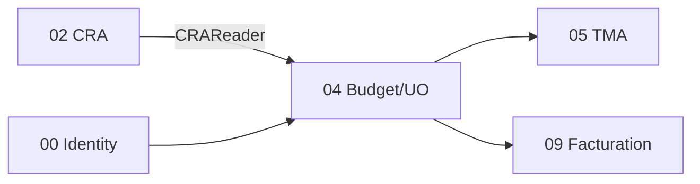

# Brique 04 — Budget / UO

> Suivi budgétaire triple **Jour / UO / Euro** : estimations, devis, consommation issue du CRA, validation manager.

## 1. Référence fonctionnelle

- Spec §7.7 (Budget/UO), §8 PR-08.8 (suivi prestations mensuel), §8 PR-08.9 (budget/UO).
- Règles : RG-BUD-01 (budget défaut obligatoire si TMA), RG-BUD-02.
- Critères d'acceptation : le devis remplace l'estimation dans toutes les interfaces ; suivi simultané Jour/UO/Euro.
- Fondations : [03-database.md](/home/olivier/ll-it-sc/projets/kore/technical/foundation/03-database.md).

## 2. Périmètre de la brique et dépendances

**Inclus** : budgets d'application, estimations, devis (remplacement d'estimation), calcul de consommation (Jour/UO/Euro) depuis le CRA, alertes de dépassement, validation/refus manager.

**Hors brique** : émission des factures (09), saisie du temps (02), production des artefacts TMA (05).

**Dépend de** : 02 CRA (port `CRAReader`), 00 (identité). **Consommée par** : 05 TMA (contrôle budget défaut), 09 Facturation (base de calcul).



## 3. Modèle de domaine

- **Agrégat `Budget`** : `applicationID`, `type` (défaut/spécifique), montants planifiés (Jour/UO/Euro), consommé, restant.
- **`Estimate`** : charge estimée (UO/jours) rattachée à une Demande.
- **`Quote` (devis)** : **remplace** l'estimation dans les calculs et affichages (RG-BUD, invariant fort).
- **Value objects** : `Effort` (Jour, UO), `Money`, `ConsumptionTriple{Jour, UO, Euro}`.
- **Invariants** :
  - Une application en mode TMA doit avoir un budget par défaut (RG-BUD-01) — vérifié à la création de Demande (brique 05).
  - Dès qu'un devis existe, il **prime** sur l'estimation partout (critère PR-08.9).
  - Consommation calculée simultanément en Jour, UO et Euro (RG-BUD-02).
  - Dépassement -> alerte manager (événement).

## 4. Ports

### Inbound

```go
type BudgetService interface {
    CreateBudget(ctx context.Context, cmd CreateBudgetCommand) (Budget, error)
    AddEstimate(ctx context.Context, cmd EstimateCommand) (Estimate, error)
    AddQuote(ctx context.Context, cmd QuoteCommand) (Quote, error) // remplace estimation
    RecomputeConsumption(ctx context.Context, appID ApplicationID, period Period) (ConsumptionTriple, error)
    Approve(ctx context.Context, cmd ApproveConsumptionCommand) error
}

// port de lecture exposé aux consommateurs (ISP)
type BudgetReader interface {
    HasDefaultBudget(ctx context.Context, appID ApplicationID) (bool, error)
    Consumption(ctx context.Context, appID ApplicationID, period Period) (ConsumptionTriple, error)
}
```

### Outbound

```go
type BudgetRepository interface {
    Save(ctx context.Context, b Budget) error
    GetByApplication(ctx context.Context, tenant TenantID, appID ApplicationID) (Budget, error)
    SaveEstimate(ctx context.Context, e Estimate) error
    SaveQuote(ctx context.Context, q Quote) error
}

type CRAReader interface { // fourni par brique 02
    ConsumedByApplication(ctx context.Context, appID ApplicationID, period Period) ([]Consumption, error)
}
type BudgetAlertPublisher interface { Publish(ctx context.Context, evt BudgetOverrun) error }
type Cache interface { /* platform/cache — cf. foundation/10 */ }
```

> **Cache (Redis)** : la consommation calculée (Jour/UO/Euro) est mise en cache (clé `kore:{tenant}:budget:consumption:{app}:{period}`, TTL court) et **invalidée** au recalcul/à la validation. Cache-aside, dégradation vers la base si Redis indisponible (cf. [foundation/10-cache-redis.md](/home/olivier/ll-it-sc/projets/kore/technical/foundation/10-cache-redis.md)).

## 5. Adapters

- **HTTP (chi)** : `internal/modules/budget/adapters/http`.
- **PostgreSQL (sqlc)** : schéma `budget`.
- Consomme `CRAReader` (02) ; publie `BudgetOverrun` (vers 11 Notifications).

## 6. Contrat d'API

| Méthode | Chemin | Permission | Description |
| --- | --- | --- | --- |
| POST | `/api/v1/budgets` | Budget (E) | Créer un budget d'application |
| POST | `/api/v1/budgets/{id}/estimates` | Budget (E) | Ajouter une estimation |
| POST | `/api/v1/budgets/{id}/quotes` | Budget (E) | Ajouter un devis (remplace estimation) |
| POST | `/api/v1/budgets/{id}/recompute` | Budget (E) | Recalculer la consommation |
| GET | `/api/v1/budgets/{id}` | Budget (L) | Détail (Jour/UO/Euro) |
| POST | `/api/v1/budgets/{id}/approve` | Budget (V) | Valider la consommation |

Erreurs : `422 DEFAULT_BUDGET_REQUIRED` (RG-BUD-01), `409 BUDGET_ALREADY_APPROVED`.

## 7. Schéma de données (schéma `budget`)

| Table | Colonnes clés |
| --- | --- |
| `budget.budgets` | `id`, `tenant_id`, `application_id`, `type`, `planned_days`, `planned_uo`, `planned_amount`, `currency` |
| `budget.estimates` | `id`, `tenant_id`, `budget_id`, `demand_id`, `effort_uo`, `effort_days` |
| `budget.quotes` | `id`, `tenant_id`, `budget_id`, `demand_id`, `amount`, `effort_uo`, `effort_days`, `supersedes_estimate_id` |
| `budget.consumptions` | `id`, `tenant_id`, `budget_id`, `period`, `days`, `uo`, `amount`, `approved_at`, `approved_by` |

## 8. Mapping SOLID

| Principe | Application |
| --- | --- |
| SRP | Calcul/suivi budgétaire isolé ; consommation lue via `CRAReader`. |
| OCP | Nouveaux types de budget / règles d'alerte extensibles sans toucher le calcul de base. |
| LSP | `BudgetRepository` réel/mock ; `CRAReader` réel/mock substituables. |
| ISP | `BudgetReader` (lecture) distinct de `BudgetService` (écriture) ; exposé à TMA/Facturation. |
| DIP | Dépend de `CRAReader` (abstraction 02), pas du module CRA concret. |

## 9. Plan de tests unitaires

**Domaine** :
- Devis prime sur estimation dans les calculs (critère PR-08.9) — table-driven.
- Consommation triple Jour/UO/Euro cohérente (RG-BUD-02).
- Dépassement -> événement `BudgetOverrun`.

**Application (mocks)** :
- `RecomputeConsumption` agrège les `Consumption` du `CRAReader` (mock).
- `HasDefaultBudget` renvoie faux -> la création de Demande TMA sera bloquée (contrat testé côté 05).

**Intégration** : persistance budgets/estimations/devis ; remplacement d'estimation par devis.

Couverture : domaine > 90 %, app > 80 %.

## 10. Frontend Nuxt

| Élément | Détail |
| --- | --- |
| Pages | `budget/index` (par application), `budget/[id]` (suivi triple), `budget/validation` |
| Composants | `BudgetTripleGauge`, `EstimateForm`, `QuoteForm` |
| Composables | `useBudget()` |
| Store Pinia | `budget` |
| Routes BFF | `server/api/budgets/*` |
| Permissions UI | Écriture/validation profils Chef d'équipe/Responsable |

## 10bis. Phase cible (roadmap)

| Phase | Livrable | État audit 07/2026 |
| --- | --- | --- |
| **Phase 1** | UI Nuxt §10 + BFF `server/api/budgets/*` | Livré (liste, détail triple, estimation/devis) |

Cf. [ROADMAP.md](../ROADMAP.md).

## 11. Definition of Done

- [x] Budgets, estimations, devis opérationnels ; devis prime (testé).
- [x] Consommation Jour/UO/Euro calculée depuis `CRAReader`.
- [x] `BudgetReader.HasDefaultBudget` exposé (RG-BUD-01) pour la brique TMA.
- [x] Alerte de dépassement publiée.
- [x] Endpoints documentés dans `api/openapi.yaml`.
