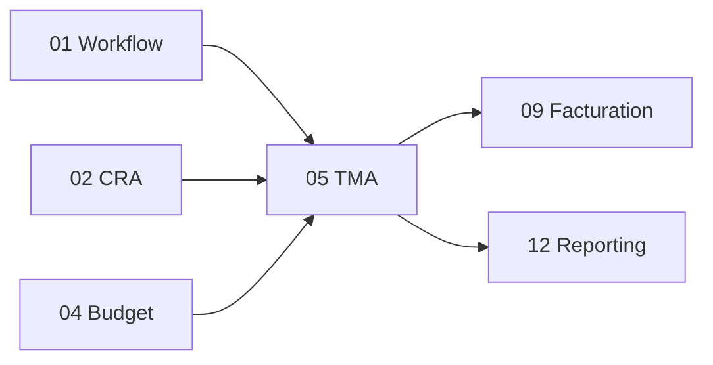

# Brique 05 — TMA (Tierce Maintenance Applicative)

> Module métier majeur : cycle de vie complet d'une Demande TMA (incident), artefacts (estimation, devis, analyses, tests), gate chef utilisateur, rework, Gantt, export XML.

## 1. Référence fonctionnelle

- Spec §7.2 (module TMA), §8 PR-08.3 (cycle de vie d'une demande).
- Règles : RG-TMA-01 (gate chef utilisateur), RG-TMA-02, RG-TMA-03, RG-BUD-01 (budget défaut requis).
- Critères d'acceptation PR-08.3 : demande invisible TMA tant que chef utilisateur non validé ; devis prime estimation ; rework rouvre la comptabilisation.
- Fondations : [01-architecture.md](/home/olivier/ll-it-sc/projets/kore/technical/foundation/01-architecture.md).

## 2. Périmètre de la brique et dépendances

**Inclus** : Demande TMA (sous-type Incident), artefacts d'analyse, estimation/devis, rework, release/code livraison, export XML (17 champs), pilotage Gantt (données), reporting TMA configurable.

**Hors brique** : moteur d'états générique (01), calcul budgétaire (04), saisie du temps (02), facturation (09).

**Dépend de** : 01 Workflow, 02 CRA (`CRAFeeder`), 04 Budget (`BudgetReader`), 00. **Consommée par** : 06 Support, 07 Maintenance, 09 Facturation, 12 Reporting.



## 3. Modèle de domaine

- **Agrégat `Demand` (Incident TMA)** : `applicationID`, `type`, `sujet`, `état` (instance workflow), `auteur`, `assigné`, artefacts, `consommation`.
- **`AnalysisDossier`** : analyses fonctionnelle / technique / risques / scénario de test.
- **`Release`** (mini-projets) et **`DeliveryCode`** (MEP groupée).
- **Value objects** : `DemandType`, `DemandState`, `XmlExportRow` (17 champs §7.2).
- **Invariants** :
  - Si l'application définit un chef utilisateur : la demande démarre en **« En attente de création »** et reste **invisible du flux TMA** jusqu'à validation (RG-TMA-01, critère PR-08.3).
  - Création bloquée si l'application n'a pas de budget par défaut (RG-BUD-01, via `BudgetReader.HasDefaultBudget`).
  - Le **devis prime** sur l'estimation (cohérent brique 04).
  - **Rework** : rouvre l'état et réactive la comptabilisation de consommation (RG-TMA-02/03).

## 4. Ports

### Inbound

```go
type TMAService interface {
    CreateDemand(ctx context.Context, cmd CreateDemandCommand) (Demand, error)
    ValidateCreation(ctx context.Context, cmd ChefUtilisateurCommand) error // gate RG-TMA-01
    Assign(ctx context.Context, cmd AssignCommand) error
    TakeOver(ctx context.Context, id DemandID) error
    AddAnalysis(ctx context.Context, cmd AnalysisCommand) error
    Resolve(ctx context.Context, id DemandID) error
    Reopen(ctx context.Context, cmd ReworkCommand) error
    ExportXML(ctx context.Context, filter ExportFilter) ([]XmlExportRow, error)
}
```

### Outbound

```go
type DemandRepository interface {
    Save(ctx context.Context, d Demand) error
    Get(ctx context.Context, tenant TenantID, id DemandID) (Demand, error)
    List(ctx context.Context, tenant TenantID, filter DemandFilter) ([]Demand, error)
}

// ports consommés (fournis par d'autres briques)
type WorkflowService interface { /* brique 01 */ }
type BudgetReader interface { HasDefaultBudget(ctx context.Context, appID ApplicationID) (bool, error) }
type CRAFeeder interface { ProposeLines(ctx context.Context, lines []ProposedLine) error }
type NotificationPublisher interface { Notify(ctx context.Context, evt NotificationEvent) error }
```

## 5. Adapters

- **HTTP (chi)** : `internal/modules/tma/adapters/http`.
- **PostgreSQL (sqlc)** : schéma `tma`.
- Gateways : consomme Workflow (01), Budget (04), CRA (02), Notifications (11).

## 6. Contrat d'API

| Méthode | Chemin | Permission | Description |
| --- | --- | --- | --- |
| POST | `/api/v1/demands` | TMA (E) | Créer une demande (gate chef util. si configuré) |
| POST | `/api/v1/demands/{id}/validate-creation` | TMA (V, Chef util.) | Débloquer la demande (RG-TMA-01) |
| POST | `/api/v1/demands/{id}/assign` | TMA (V) | Affecter un développeur |
| POST | `/api/v1/demands/{id}/take-over` | TMA (E) | Prise en charge |
| POST | `/api/v1/demands/{id}/analysis` | TMA (E) | Ajouter un artefact d'analyse |
| POST | `/api/v1/demands/{id}/resolve` | TMA (E) | Résoudre/clôturer |
| POST | `/api/v1/demands/{id}/reopen` | TMA (E) | Rework |
| GET | `/api/v1/demands/export.xml` | TMA (L) | Export XML 17 champs |

Erreurs : `422 DEFAULT_BUDGET_REQUIRED`, `409 DEMAND_NOT_VISIBLE` (gate non franchi), `409 TRANSITION_NOT_ALLOWED`.

## 7. Schéma de données (schéma `tma`)

| Table | Colonnes clés |
| --- | --- |
| `tma.demands` | `id`, `tenant_id`, `application_id`, `type`, `subject`, `workflow_instance_id`, `author_id`, `assignee_id`, `status` |
| `tma.analysis_dossiers` | `id`, `tenant_id`, `demand_id`, `functional`, `technical`, `risks`, `test_scenario` |
| `tma.releases` | `id`, `tenant_id`, `application_id`, `label` |
| `tma.delivery_codes` | `id`, `tenant_id`, `release_id`, `code` |

Index `(tenant_id, application_id, status)` pour le Gantt/reporting.

## 8. Mapping SOLID

| Principe | Application |
| --- | --- |
| SRP | Cycle de vie TMA ; état délégué au moteur (01) ; budget délégué à (04). |
| OCP | Nouveaux artefacts/types de demande ajoutés sans modifier le cœur ; workflow paramétrable. |
| LSP | `DemandRepository` réel/mock ; ports Workflow/Budget/CRA substituables. |
| ISP | Consomme uniquement `BudgetReader.HasDefaultBudget` et `CRAFeeder.ProposeLines` (interfaces fines). |
| DIP | Dépend d'abstractions Workflow/Budget/CRA/Notifications injectées. |

## 9. Plan de tests unitaires

**Domaine** :
- Demande avec chef utilisateur -> état initial « En attente de création », invisible du flux (RG-TMA-01) — table-driven.
- Rework rouvre l'état et réactive la comptabilisation (RG-TMA-02/03).
- Export XML : 17 champs présents.

**Application (mocks)** :
- `CreateDemand` appelle `BudgetReader.HasDefaultBudget` ; faux -> `DEFAULT_BUDGET_REQUIRED` (RG-BUD-01).
- `ValidateCreation` par rôle Chef utilisateur uniquement (via Workflow gate).
- `Resolve` propose une ligne au CRA (`CRAFeeder`) ; changements d'état notifiés.

**Intégration** : persistance demandes/artefacts ; filtres liste/export.

Couverture : domaine > 90 %, app > 80 %.

## 10. Frontend Nuxt

| Élément | Détail |
| --- | --- |
| Pages | `tma/index` (liste/filtre), `tma/[id]` (détail + workflow), `tma/gantt`, `tma/export` |
| Composants | `DemandForm`, `WorkflowActions` (via `useWorkflow`), `AnalysisEditor`, `GanttChart` |
| Composables | `useTma()`, `useWorkflow()` (brique 01) |
| Store Pinia | `tma` |
| Routes BFF | `server/api/demands/*` |
| Permissions UI | Gate chef utilisateur visible profil dédié ; affectation profil Chef d'équipe/Responsable |

## 10bis. Phase cible (roadmap)

| Phase | Livrable | État audit 07/2026 |
| --- | --- | --- |
| **Phase 1** | UI Nuxt §10 + BFF `server/api/demands/*` | Livré (liste, détail, workflow, export ; gantt reporté) |

Cf. [ROADMAP.md](../ROADMAP.md).

## 11. Definition of Done

- [x] Cycle de vie TMA complet piloté par le moteur de workflow (01).
- [x] Gate chef utilisateur testé (RG-TMA-01, critère PR-08.3).
- [x] Blocage création sans budget défaut (RG-BUD-01).
- [x] Rework réactive la comptabilisation ; export XML 17 champs.
- [x] Alimentation du CRA via `CRAFeeder`.
- [x] Endpoints documentés dans `api/openapi.yaml`.
