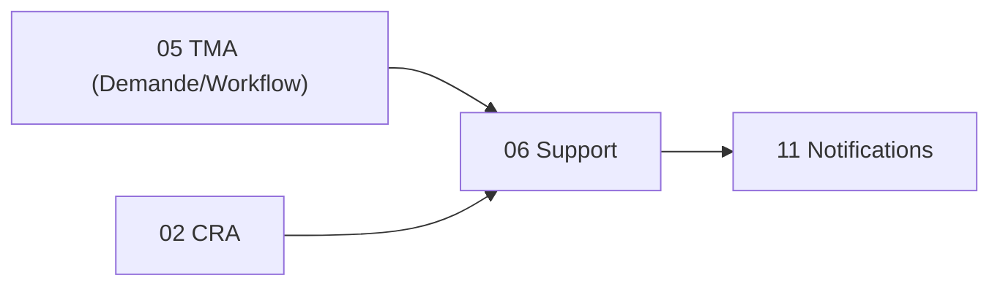

# Brique 06 — Support / Tickets

> Helpdesk : cycle de vie d'un ticket (Demande sous-type Ticket) de la déclaration (web ou mail entrant) à la résolution, avec réponses historisées et alimentation du CRA.

## 1. Référence fonctionnelle

- Spec §7.4 (Support/Tickets), §8 PR-08.4.
- Règles : RG-SUP-01.
- Cycle (§8) : Ouvert → Pris en charge → Résolu, réponses historisées.
- Fondations : [01-architecture.md](/home/olivier/ll-it-sc/projets/kore/technical/foundation/01-architecture.md).

## 2. Périmètre de la brique et dépendances

**Inclus** : déclaration de ticket (web + mail entrant), prise en charge, réponses historisées, note d'analyse, résolution/clôture, alimentation CRA, réponse PDF optionnelle.

**Hors brique** : moteur d'états (01), envoi mail sortant (11), saisie temps (02).

**Dépend de** : 05 TMA (partage du concept Demande et du workflow), 01, 02, 00. **Consommée par** : 12 Reporting.



## 3. Modèle de domaine

- **Agrégat `Ticket`** (Demande sous-type Ticket) : `applicationID`, `déclarant` (interne/client externe), `activité`, `état` (instance workflow), `réponses[]`, `note d'analyse`.
- **`TicketReply`** : réponse historisée (auteur, date, contenu, notification créateur).
- **Value objects** : `TicketChannel` (Web, MailEntrant), `TicketState`.
- **Invariants** :
  - Toute réponse est historisée et notifie le créateur (RG-SUP-01).
  - Un mail entrant crée un ticket (canal `MailEntrant`).
  - Résolution -> proposition d'une ligne CRA au support.

## 4. Ports

### Inbound

```go
type SupportService interface {
    OpenTicket(ctx context.Context, cmd OpenTicketCommand) (Ticket, error)
    IngestInboundEmail(ctx context.Context, email InboundEmail) (Ticket, error) // mail entrant
    TakeOver(ctx context.Context, id TicketID) error
    Reply(ctx context.Context, cmd ReplyCommand) error // historisé + notifie
    Resolve(ctx context.Context, id TicketID) error
}
```

### Outbound

```go
type TicketRepository interface {
    Save(ctx context.Context, t Ticket) error
    Get(ctx context.Context, tenant TenantID, id TicketID) (Ticket, error)
    List(ctx context.Context, tenant TenantID, filter TicketFilter) ([]Ticket, error)
}
type WorkflowService interface { /* brique 01 */ }
type CRAFeeder interface { ProposeLines(ctx context.Context, lines []ProposedLine) error }
type NotificationPublisher interface { Notify(ctx context.Context, evt NotificationEvent) error }
type InboundMailGateway interface { Poll(ctx context.Context) ([]InboundEmail, error) }
```

## 5. Adapters

- **HTTP (chi)** : `internal/modules/support/adapters/http`.
- **PostgreSQL (sqlc)** : schéma `support`.
- **InboundMailGateway** : récupération des mails entrants (IMAP/webhook), transformés en tickets.
- Consomme Workflow (01), CRA (02), Notifications (11).

## 6. Contrat d'API

| Méthode | Chemin | Permission | Description |
| --- | --- | --- | --- |
| POST | `/api/v1/tickets` | Support (E) / Client externe (E) | Ouvrir un ticket |
| GET | `/api/v1/tickets` | Support (L) | Lister/filtrer |
| POST | `/api/v1/tickets/{id}/take-over` | Support (V) | Prise en charge |
| POST | `/api/v1/tickets/{id}/replies` | Support (E) | Répondre (historisé) |
| POST | `/api/v1/tickets/{id}/resolve` | Support (V) | Résoudre/clôturer |

Erreurs : `409 TRANSITION_NOT_ALLOWED`, `403`.

## 7. Schéma de données (schéma `support`)

| Table | Colonnes clés |
| --- | --- |
| `support.tickets` | `id`, `tenant_id`, `application_id`, `declarant_id`, `channel`, `activity`, `workflow_instance_id`, `status` |
| `support.ticket_replies` | `id`, `tenant_id`, `ticket_id`, `author_id`, `body`, `created_at` |

## 8. Mapping SOLID

| Principe | Application |
| --- | --- |
| SRP | Gestion des tickets ; état délégué au moteur (01) ; mail entrant isolé dans `InboundMailGateway`. |
| OCP | Nouveaux canaux/activités par données ; workflow paramétrable. |
| LSP | `TicketRepository`, gateways réels/mocks substituables. |
| ISP | Consomme `CRAFeeder`, `NotificationPublisher`, `InboundMailGateway` (interfaces fines). |
| DIP | Dépend d'abstractions injectées. |

## 9. Plan de tests unitaires

**Domaine** :
- Réponse historisée + déclenche notification créateur (RG-SUP-01) — table-driven.
- Transition Ouvert→PrisEnCharge→Résolu ; transitions invalides refusées.

**Application (mocks)** :
- `IngestInboundEmail` crée un ticket canal `MailEntrant`.
- `Resolve` propose une ligne CRA (`CRAFeeder`).
- `Reply` appelle `NotificationPublisher`.

**Intégration** : persistance tickets/réponses ; filtres.

Couverture : domaine > 90 %, app > 80 %.

## 10. Frontend Nuxt

| Élément | Détail |
| --- | --- |
| Pages | `support/index`, `support/[id]` (fil de réponses), `support/nouveau` |
| Composants | `TicketForm`, `ReplyThread`, `WorkflowActions` |
| Composables | `useSupport()`, `useWorkflow()` |
| Store Pinia | `support` |
| Routes BFF | `server/api/tickets/*` |
| Permissions UI | Client externe : ouverture + suivi de ses tickets uniquement |

## 11. Definition of Done

- [ ] Cycle ticket web + mail entrant opérationnel.
- [ ] Réponses historisées et notifiées (RG-SUP-01).
- [ ] Alimentation CRA à la résolution.
- [ ] Endpoints documentés dans `api/openapi.yaml`.
