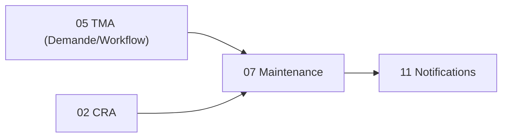

# Brique 07 — Maintenance / Travaux

> Demandes de travaux à cycle allégé (Demande sous-type « Demande de travaux »), variante simplifiée du cycle TMA.

## 1. Référence fonctionnelle

- Spec §7.5 (Maintenance/Travaux), §5.2 (module métier générant de l'activité CRA), §5.4 (sous-type « Demande de travaux »).
- Fondations : [01-architecture.md](/home/olivier/ll-it-sc/projets/kore/technical/foundation/01-architecture.md).

## 2. Périmètre de la brique et dépendances

**Inclus** : demande de travaux, cycle de vie allégé (sans artefacts d'analyse lourds), planification, alimentation CRA.

**Hors brique** : moteur d'états (01), calcul budget (04), facturation (09).

**Dépend de** : 05 TMA (réutilise Demande/Workflow), 01, 02, 00. **Consommée par** : 12 Reporting.



## 3. Modèle de domaine

- **Agrégat `WorkRequest`** (Demande sous-type Travaux) : `applicationID`, `sujet`, `état` (instance workflow allégé), `assigné`, `consommation`.
- **Value objects** : `WorkState` (cycle réduit, ex. Créé → EnCours → Terminé).
- **Invariants** :
  - Cycle allégé : pas d'obligation d'artefacts d'analyse (différence clé avec TMA).
  - Terminaison -> proposition de ligne CRA.

## 4. Ports

### Inbound

```go
type MaintenanceService interface {
    CreateWorkRequest(ctx context.Context, cmd CreateWorkCommand) (WorkRequest, error)
    Assign(ctx context.Context, cmd AssignCommand) error
    Progress(ctx context.Context, cmd ProgressCommand) error
    Complete(ctx context.Context, id WorkID) error
}
```

### Outbound

```go
type WorkRequestRepository interface {
    Save(ctx context.Context, w WorkRequest) error
    Get(ctx context.Context, tenant TenantID, id WorkID) (WorkRequest, error)
    List(ctx context.Context, tenant TenantID, filter WorkFilter) ([]WorkRequest, error)
}
type WorkflowService interface { /* brique 01 */ }
type CRAFeeder interface { ProposeLines(ctx context.Context, lines []ProposedLine) error }
type NotificationPublisher interface { Notify(ctx context.Context, evt NotificationEvent) error }
```

## 5. Adapters

- **HTTP (chi)** : `internal/modules/maintenance/adapters/http`.
- **PostgreSQL (sqlc)** : schéma `maintenance`.
- Consomme Workflow (01), CRA (02), Notifications (11).

## 6. Contrat d'API

| Méthode | Chemin | Permission | Description |
| --- | --- | --- | --- |
| POST | `/api/v1/work-requests` | Maintenance (E) | Créer une demande de travaux |
| GET | `/api/v1/work-requests` | Maintenance (L) | Lister/filtrer |
| POST | `/api/v1/work-requests/{id}/assign` | Maintenance (V) | Affecter |
| POST | `/api/v1/work-requests/{id}/progress` | Maintenance (E) | Avancement |
| POST | `/api/v1/work-requests/{id}/complete` | Maintenance (E) | Terminer |

Erreurs : `409 TRANSITION_NOT_ALLOWED`, `403`.

## 7. Schéma de données (schéma `maintenance`)

| Table | Colonnes clés |
| --- | --- |
| `maintenance.work_requests` | `id`, `tenant_id`, `application_id`, `subject`, `workflow_instance_id`, `assignee_id`, `status` |

## 8. Mapping SOLID

| Principe | Application |
| --- | --- |
| SRP | Gestion des travaux uniquement ; état délégué au moteur (01). |
| OCP | Cycle allégé défini par configuration de workflow ; extensible sans code. |
| LSP | Repository et gateways réels/mocks substituables. |
| ISP | Consomme des interfaces fines (`CRAFeeder`, `NotificationPublisher`). |
| DIP | Dépend d'abstractions injectées. |

## 9. Plan de tests unitaires

**Domaine** :
- Cycle allégé Créé→EnCours→Terminé (table-driven) ; transitions invalides refusées.
- Terminaison propose une ligne CRA.

**Application (mocks)** :
- `Complete` appelle `CRAFeeder.ProposeLines`.
- Changements d'état notifiés.

**Intégration** : persistance et filtres.

Couverture : domaine > 90 %, app > 80 %.

## 10. Frontend Nuxt

| Élément | Détail |
| --- | --- |
| Pages | `maintenance/index`, `maintenance/[id]`, `maintenance/nouveau` |
| Composants | `WorkRequestForm`, `WorkflowActions` |
| Composables | `useMaintenance()`, `useWorkflow()` |
| Store Pinia | `maintenance` |
| Routes BFF | `server/api/work-requests/*` |
| Permissions UI | Selon RBAC colonne Maintenance §3.3 |

## 11. Definition of Done

- [ ] Cycle allégé opérationnel via workflow (01).
- [ ] Alimentation CRA à la terminaison.
- [ ] Endpoints documentés dans `api/openapi.yaml`.
