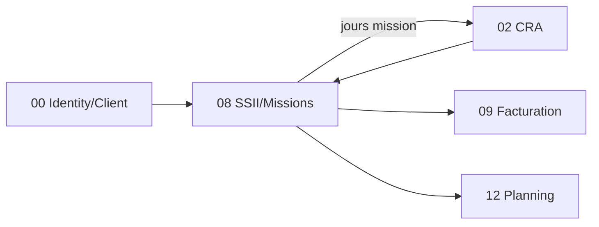

# Brique 08 — SSII / Missions

> Gestion ESN : clients, missions (staffing, TJM, période), pré-remplissage du CRA en jours mission, préparation de la facturation.

## 1. Référence fonctionnelle

- Spec §7.3 (SSII/Missions), §8 PR-08.7 (Mission et facturation), §11 (entités Client, Mission).
- Règles : RG-MISS-01, RG-MISS-02 (arrêt mission supprime CRA futurs uniquement), RG-FAC-01 (facture virtuelle).
- Critères d'acceptation PR-08.7 : pas de jour mission sur congé/férié ; arrêt mission supprime les CRA futurs seulement ; facture virtuelle hors statistiques.
- Fondations : [03-database.md](/home/olivier/ll-it-sc/projets/kore/technical/foundation/03-database.md).

## 2. Périmètre de la brique et dépendances

**Inclus** : missions (période, TJM, collaborateurs, technologies), staffing, pré-remplissage CRA en jours mission (hors congés/fériés), gestion fin/arrêt de mission, base de la facture virtuelle.

**Hors brique** : référentiel Client (créé en brique 00), calcul/transmission facture (09), rendu planning (12).

**Dépend de** : 02 CRA (`CRAFeeder`, `CRAFutureCleaner`), 00 (Client/identité/jours fériés Site), 03 Congés (jours d'absence, via `WorkCalendarGateway`). **Consommée par** : 09 Facturation, 12 Planning.



## 3. Modèle de domaine

- **Agrégat `Mission`** : `clientID`, `collaborateurs[]`, `période` (VO `DateRange`), `TJM` (VO `Money`), `technologies`, `responsableClient`.
- **Value objects** : `DateRange`, `Money` (TJM), `MissionStatus` (Active, Arrêtée, Terminée).
- **Invariants** :
  - Mission sans collaborateur -> création bloquée (RG-MISS-01).
  - Pré-remplissage CRA **exclut congés validés et jours fériés** (critère PR-08.7).
  - Arrêt de mission -> suppression des **jours CRA futurs uniquement** (RG-MISS-02) ; les jours passés restent.
  - Modification date de fin -> recalcul des jours CRA futurs.

## 4. Ports

### Inbound

```go
type MissionService interface {
    CreateMission(ctx context.Context, cmd CreateMissionCommand) (Mission, error)
    UpdateEndDate(ctx context.Context, cmd UpdateEndDateCommand) error // recalcul CRA futur
    StopMission(ctx context.Context, id MissionID) error               // supprime CRA futurs
    ListByClient(ctx context.Context, clientID ClientID) ([]Mission, error)
}

// lecture exposée à la facturation (ISP)
type MissionReader interface {
    ActiveMissionDays(ctx context.Context, missionID MissionID, period Period) (MissionBilling, error)
}
```

### Outbound

```go
type MissionRepository interface {
    Save(ctx context.Context, m Mission) error
    Get(ctx context.Context, tenant TenantID, id MissionID) (Mission, error)
    ListByClient(ctx context.Context, tenant TenantID, clientID ClientID) ([]Mission, error)
}
type CRAFeeder interface { ProposeLines(ctx context.Context, lines []ProposedLine) error }
type CRAFutureCleaner interface { // fourni par brique 02 : purge des jours futurs
    RemoveFutureLines(ctx context.Context, source SourceRef, from time.Time) error
}
type WorkCalendarGateway interface { // jours fériés (Site/00) + congés validés (03)
    IsHolidayOrLeave(ctx context.Context, userID UserID, day time.Time) (bool, error)
}
```

## 5. Adapters

- **HTTP (chi)** : `internal/modules/ssii/adapters/http`.
- **PostgreSQL (sqlc)** : schéma `ssii`.
- Consomme CRA (02) via `CRAFeeder`/`CRAFutureCleaner` et Congés (03)/Site (00) via `WorkCalendarGateway`.

## 6. Contrat d'API

| Méthode | Chemin | Permission | Description |
| --- | --- | --- | --- |
| POST | `/api/v1/missions` | SSII (E), Commercial | Créer une mission (≥ 1 collaborateur) |
| GET | `/api/v1/missions` | SSII (L) | Lister/filtrer (par client) |
| PATCH | `/api/v1/missions/{id}/end-date` | SSII (E) | Modifier la date de fin (recalcul CRA) |
| POST | `/api/v1/missions/{id}/stop` | SSII (V) | Arrêter (supprime CRA futurs) |

Erreurs : `422 MISSION_WITHOUT_COLLABORATOR` (RG-MISS-01), `409 MISSION_ALREADY_STOPPED`.

## 7. Schéma de données (schéma `ssii`)

| Table | Colonnes clés |
| --- | --- |
| `ssii.missions` | `id`, `tenant_id`, `client_id`, `start_date`, `end_date`, `tjm`, `currency`, `technologies`, `status`, `responsable_client` |
| `ssii.mission_members` | `id`, `tenant_id`, `mission_id`, `user_id` |

Index `(tenant_id, client_id)`, `(tenant_id, status)`.

## 8. Mapping SOLID

| Principe | Application |
| --- | --- |
| SRP | Gestion des missions/staffing ; le CRA gère la persistance du temps via ses ports. |
| OCP | Nouveaux modes de mission/TJM ajoutés sans modifier le cœur. |
| LSP | `MissionRepository`, `WorkCalendarGateway` réels/mocks substituables. |
| ISP | `MissionReader` (lecture facturation) distinct de `MissionService` ; `CRAFutureCleaner` fin. |
| DIP | Dépend d'abstractions CRA/Calendrier injectées. |

## 9. Plan de tests unitaires

**Domaine** :
- Mission sans collaborateur rejetée (RG-MISS-01) — table-driven.
- Pré-remplissage exclut congés/fériés (critère PR-08.7) via `WorkCalendarGateway` mocké.
- Arrêt supprime uniquement les jours futurs (RG-MISS-02) ; jours passés conservés.

**Application (mocks)** :
- `CreateMission` appelle `CRAFeeder.ProposeLines` pour les jours ouvrés non fériés/non congés.
- `StopMission` appelle `CRAFutureCleaner.RemoveFutureLines`.
- `UpdateEndDate` recalcule les jours futurs.

**Intégration** : persistance missions/membres ; filtres par client/statut.

Couverture : domaine > 90 %, app > 80 %.

## 10. Frontend Nuxt

| Élément | Détail |
| --- | --- |
| Pages | `missions/index`, `missions/[id]`, `missions/nouveau` |
| Composants | `MissionForm`, `StaffingPicker`, `MissionTimeline` |
| Composables | `useMissions()` |
| Store Pinia | `ssii` |
| Routes BFF | `server/api/missions/*` |
| Permissions UI | Écriture profils Commercial/Responsable (RBAC §3.3 colonne SSII) |

## 11. Definition of Done

- [ ] Missions CRUD + staffing (≥ 1 collaborateur) opérationnels.
- [ ] Pré-remplissage CRA hors congés/fériés (critère PR-08.7).
- [ ] Arrêt/modif fin de mission n'impacte que les jours futurs (RG-MISS-02).
- [ ] `MissionReader` exposé à la facturation.
- [ ] Endpoints documentés dans `api/openapi.yaml`.
