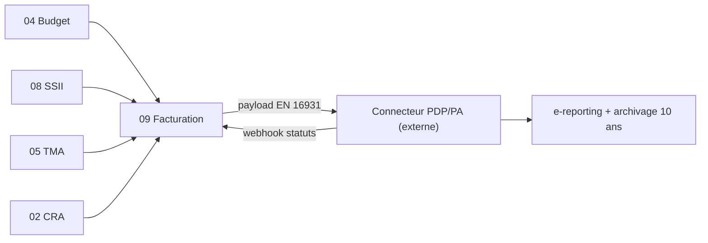

# Brique 09 — Facturation + e-invoicing (PDP/PA)

> Kore **calcule** les factures (virtuelles) et **produit un payload canonique EN 16931**, puis **délègue** émission, e-reporting et archivage à une **PDP/PA externe** via un connecteur (gateway). **Kore n'émet jamais de e-facture directement.**

## 1. Référence fonctionnelle

- Spec §7.8 (facturation et e-invoicing), §8 PR-08.10 (préparation PDP / e-invoicing), §13.3 (traçabilité et conformité), glossaire (EN 16931, Factur-X, e-reporting, payload canonique).
- Règles : RG-FAC-01 (facture virtuelle, non émise en interne, hors statistiques), RG-FAC-02, RG-FAC-03.
- Critères d'acceptation PR-08.10 : Kore n'émet pas de e-facture directement ; virtuelle exclue des statistiques ; statuts PDP synchronisés.
- Échéances : FR réception 01/09/2026, émission GE/ETI 01/09/2026, PME/TPE 01/09/2027 ; ViDA intra-UE 01/07/2030.
- Fondations : [05-api-conventions.md](/home/olivier/ll-it-sc/projets/kore/technical/foundation/05-api-conventions.md), [03-database.md](/home/olivier/ll-it-sc/projets/kore/technical/foundation/03-database.md).

## 2. Périmètre de la brique et dépendances

**Inclus** : calcul des factures (SSII : jours mission × TJM ; TMA réel : jours prestés × PU ; TMA forfait : MEP × devis/estimation), avoirs et factures manuelles, génération du **payload JSON canonique**, mapping **EN 16931** (Factur-X / UBL / CII), transmission via **connecteur PDP/PA**, synchronisation des statuts (webhook), file d'attente + retry.

**Hors brique (délégué PDP/PA)** : émission légale de la e-facture, e-reporting administratif, archivage probant 10 ans, transmission au client final.

> ⚠️ **Ne pas confondre** avec le [module 14 — Abonnement SaaS (Stripe)](/home/olivier/ll-it-sc/projets/kore/technical/modules/14-abonnement-saas-stripe.md), qui facture l'abonnement de Kore au tenant. Ici : facturation **métier** des clients des ESN via PDP/PA. Aucune dépendance entre les deux modules.

**Dépend de** : 04 Budget (`BudgetReader`), 05 TMA, 08 SSII (`MissionReader`), 02 CRA (`CRAReader`), 00. **Consommée par** : 12 Reporting (hors virtuelles).



## 3. Modèle de domaine

- **Agrégat `Invoice`** : `type` (SSII / TMA-réel / TMA-forfait / avoir / manuelle), `lignes[]`, `montants`, `statut` (Virtuelle → Préparée → Transmise → {Acceptée/Refusée/Encaissée/Annulée}), `clientID`.
- **`CanonicalPayload`** : représentation JSON interne, indépendante du format cible.
- **`En16931Document`** : mapping vers Factur-X / UBL / CII.
- **Value objects** : `InvoiceStatus`, `InvoiceType`, `Money`, `TaxRate`.
- **Invariants** :
  - Une **facture virtuelle n'est pas persistée comme émise** et est **exclue des statistiques** (RG-FAC-01, spec §3 database : calcul à la volée tant que non transmise).
  - Kore **ne produit pas** le document légal final : il s'arrête au payload/format et à la transmission (RG-FAC-01).
  - Mode forfait sans code livraison -> calcul bloqué.
  - Le statut interne suit strictement les webhooks PDP (source de vérité = PDP).

## 4. Ports

### Inbound

```go
type InvoicingService interface {
    ComputeVirtual(ctx context.Context, cmd ComputeInvoiceCommand) (Invoice, error) // à la volée
    ReviseInvoice(ctx context.Context, cmd ReviseCommand) (Invoice, error)          // ajustement manager
    PrepareAndTransmit(ctx context.Context, id InvoiceID) (Invoice, error)          // payload -> mapping -> PDP
    CreateCreditNote(ctx context.Context, cmd CreditNoteCommand) (Invoice, error)
    SyncStatus(ctx context.Context, evt PDPStatusEvent) error                       // webhook
}
```

### Outbound

```go
type InvoiceRepository interface {
    Save(ctx context.Context, inv Invoice) error   // uniquement à partir de "Transmise"
    Get(ctx context.Context, tenant TenantID, id InvoiceID) (Invoice, error)
    UpdateStatus(ctx context.Context, id InvoiceID, status InvoiceStatus) error
}

// gateway central : PDP/PA externe (émission, e-reporting, archivage délégués)
type PDPGateway interface {
    Transmit(ctx context.Context, doc En16931Document) (PDPReceipt, error)
    // les statuts arrivent par webhook -> SyncStatus
}

// mapping payload canonique -> format normalisé (OCP : plusieurs formats)
type En16931Mapper interface {
    Map(payload CanonicalPayload, format Format) (En16931Document, error) // Factur-X | UBL | CII
}

// sources de calcul (ports fournis par d'autres briques, ISP lecture)
type MissionReader interface { ActiveMissionDays(ctx context.Context, missionID MissionID, period Period) (MissionBilling, error) }
type BudgetReader  interface { Consumption(ctx context.Context, appID ApplicationID, period Period) (ConsumptionTriple, error) }
type CRAReader     interface { ConsumedByApplication(ctx context.Context, appID ApplicationID, period Period) ([]Consumption, error) }

type TransmitQueue interface { // file + retry si PDP indisponible
    Enqueue(ctx context.Context, id InvoiceID) error
}
```

## 5. Adapters

- **HTTP (chi)** : `internal/modules/facturation/adapters/http` (calcul virtuel, préparation, webhook PDP entrant).
- **PostgreSQL (sqlc)** : schéma `facturation` (factures transmises et statuts uniquement).
- **PDPGateway** : `adapters/pdp` — client HTTP vers la PDP/PA (configurable par tenant), signatures/authentification, idempotence.
- **En16931Mapper** : adapters de mapping Factur-X / UBL / CII (un par format, sélectionnés par configuration).

## 6. Contrat d'API

| Méthode | Chemin | Permission | Description |
| --- | --- | --- | --- |
| POST | `/api/v1/invoices/compute` | Facturation (E) | Calculer une facture virtuelle (non persistée émise) |
| GET | `/api/v1/invoices/{id}` | Facturation (L) | Détail (statut PDP) |
| PATCH | `/api/v1/invoices/{id}` | Facturation (E) | Réviser avant transmission |
| POST | `/api/v1/invoices/{id}/transmit` | Facturation (V) | Payload -> mapping EN 16931 -> PDP (`Idempotency-Key`) |
| POST | `/api/v1/invoices/{id}/credit-note` | Facturation (E) | Avoir |
| POST | `/api/v1/webhooks/pdp` | signature PDP | Synchronisation des statuts |

Erreurs : `422 FORFAIT_WITHOUT_DELIVERY_CODE`, `409 INVOICE_ALREADY_TRANSMITTED`, `502 PDP_UNAVAILABLE` (mise en file + retry), `400 INVALID_EN16931`.

## 7. Schéma de données (schéma `facturation`)

| Table | Colonnes clés |
| --- | --- |
| `facturation.invoices` | `id`, `tenant_id`, `type`, `client_id`, `period`, `amount_ht`, `amount_ttc`, `currency`, `status`, `pdp_reference`, `transmitted_at` |
| `facturation.invoice_lines` | `id`, `tenant_id`, `invoice_id`, `label`, `quantity`, `unit_price`, `tax_rate` |
| `facturation.pdp_status_log` | `id`, `tenant_id`, `invoice_id`, `status`, `received_at`, `raw_event` (jsonb) — traçabilité webhooks |
| `facturation.transmit_queue` | `id`, `tenant_id`, `invoice_id`, `attempts`, `next_retry_at` |

Les factures virtuelles **ne sont pas** stockées ici (calcul à la volée) ; seules les factures **transmises** et leur suivi sont persistés (RG-FAC-01).

## 8. Mapping SOLID

| Principe | Application |
| --- | --- |
| SRP | Calcul, mapping et transmission séparés (`InvoicingService`, `En16931Mapper`, `PDPGateway`). |
| OCP | Nouveau format (UBL/CII/Factur-X) ou nouvelle PDP ajouté via un adapter, sans modifier le calcul. |
| LSP | Tout `En16931Mapper`/`PDPGateway` respecte le même contrat ; mock en test. |
| ISP | Lecture des sources via ports fins (`MissionReader`, `BudgetReader`, `CRAReader`) ; pas de dépendance aux services complets. |
| DIP | La logique de facturation dépend d'abstractions (PDP, mapper, sources) injectées ; aucune dépendance vers un fournisseur PDP concret. |

## 9. Plan de tests unitaires

**Domaine** :
- Calcul SSII (jours × TJM), TMA réel (jours × PU), TMA forfait (MEP × devis) — table-driven.
- Forfait sans code livraison -> calcul bloqué.
- Virtuelle exclue des statistiques (RG-FAC-01).
- Transition de statut pilotée par événements PDP.

**Application (mocks)** :
- `PrepareAndTransmit` : payload -> `En16931Mapper.Map` (mock) -> `PDPGateway.Transmit` (mock) ; persiste seulement après transmission.
- `PDP_UNAVAILABLE` -> `TransmitQueue.Enqueue` (retry), pas de perte.
- `SyncStatus` met à jour le statut depuis le webhook et journalise.
- Vérifie que **Kore n'émet pas** le document légal (aucune génération finale interne).

**Intégration** : persistance factures transmises + `pdp_status_log` ; idempotence transmission.

Couverture : domaine > 90 %, app > 80 %.

## 10. Frontend Nuxt

| Élément | Détail |
| --- | --- |
| Pages | `facturation/virtuelles`, `facturation/[id]` (statut PDP), `facturation/avoirs` |
| Composants | `VirtualInvoiceTable`, `InvoiceReviewPanel`, `PdpStatusBadge` |
| Composables | `useInvoicing()` |
| Store Pinia | `facturation` |
| Routes BFF | `server/api/invoices/*` (le webhook PDP reste côté API Go) |
| Permissions UI | Écriture/validation profils Manager/Commercial (RBAC §3.3) |

## 10bis. Phase cible (roadmap)

| Phase | Livrable | Échéance |
| --- | --- | --- |
| **Phase 2** | Implémentation module 09 + UI §10 | E-facturation FR **sept. 2026** |
| **Phase 1** | Alignement marketing : locales landing → « roadmap 2026 » (pas « intégrée ») tant que M09 absent | Immédiat |

> **Écart audit 07/2026** : `frontend/locales/fr.json` promet « E-facturation sept. 2026 intégrée » alors que le module n'existe pas dans `internal/modules/`. Corriger en Phase 1 ([ROADMAP.md](../ROADMAP.md)).

Connecteur PDP : port `PDPGateway` ; adapter concret dans [17-integrations-hub.md](17-integrations-hub.md).

## 11. Definition of Done

- [ ] Calcul virtuel SSII/TMA réel/forfait testé ; virtuelle hors statistiques (RG-FAC-01).
- [ ] Payload canonique -> mapping EN 16931 (Factur-X/UBL/CII) via adapters interchangeables.
- [ ] Transmission PDP + file/retry + idempotence.
- [ ] Synchronisation des statuts par webhook, journalisée.
- [ ] Aucune émission de e-facture interne (vérifié par test).
- [ ] Endpoints documentés dans `api/openapi.yaml`.
