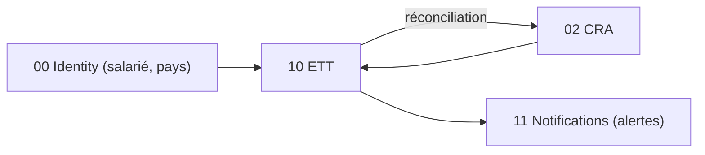

# Brique 10 — ETT : enregistrement légal du temps

> Conformité UE (Directive 2003/88/CE, CJUE C-55/18 et C-531/23 ; BE 01/01/2027). Système **objectif, fiable et accessible** de relevé des heures, avec **journal d'audit append-only inaltérable** et **moteur de règles paramétrable par pays**. Distinct du CRA (qui reste déclaratif/projet).

## 1. Référence fonctionnelle

- Spec §7.12 (ETT — conformité UE), §8 PR-08.6 (enregistrement légal du temps), §4.4 (flag salarié ETT).
- Règles : RG-ETT-01, RG-ETT-02 (périmètre salariés sous contrat), RG-ETT-03.
- Critères d'acceptation PR-08.6 : alerte si relevé manquant un jour ouvré (BE) ; correction tracée dans le journal d'audit ; export inspection produit sur demande.
- Fondations : [03-database.md](/home/olivier/ll-it-sc/projets/kore/technical/foundation/03-database.md) (inaltérabilité, rôles DB), [04-auth-rbac.md](/home/olivier/ll-it-sc/projets/kore/technical/foundation/04-auth-rbac.md).

## 2. Périmètre de la brique et dépendances

**Inclus** : pointage multi-canal (web, mobile, badge/API, saisie a posteriori tracée), calcul heures effectives / HS / repos, journal d'audit append-only, portail salarié (consultation/validation), export inspection du travail (PDF/structuré), rétention paramétrable par pays, alertes de conformité, réconciliation ETT ↔ CRA.

**Hors brique** : le CRA lui-même (02) ; l'envoi des alertes (11).

**Dépend de** : 02 CRA (`CRAFeeder` pour réconciliation/pré-remplissage, `CRAReader` pour comparaison), 00 (flag salarié, site/pays). **Consommée par** : 12 Reporting (indicateurs conformité).



## 3. Modèle de domaine

- **Agrégat `WorkTimeRecord` (relevé journalier)** : `salariéID`, `jour`, `heureDébut`, `heureFin`, `pauses[]`, `heuresEffectives`, `HS`, `reposCalculé`, `statut` (Pointé → Calculé → Conforme/Alerte), `origine` (web/mobile/badge/a-posteriori).
- **Agrégat `AuditJournal`** : entrées **append-only** ; toute correction crée une entrée (jamais d'`UPDATE`/`DELETE`).
- **`CountryWorkRule`** : règles paramétrables par pays (durée max, repos min, rétention).
- **Value objects** : `TimeOfDay`, `Break`, `WorkTimeStatus`, `RetentionPolicy`.
- **Invariants** :
  - **Inaltérabilité** : `WorkTimeRecord` et `AuditJournal` en append-only ; correction = nouvelle entrée tracée (RG-ETT-01, critère PR-08.6).
  - **Périmètre** : uniquement les utilisateurs `salarié ETT` sous contrat (RG-ETT-02).
  - Saisie a posteriori toujours **tracée** (origine + auteur + horodatage).
  - Alerte si relevé manquant un jour ouvré selon règles du pays (critère PR-08.6).
  - Réconciliation ETT ↔ CRA signale les écarts (ne les corrige pas silencieusement).

## 4. Ports

### Inbound

```go
type WorkTimeService interface {
    ClockIn(ctx context.Context, cmd ClockInCommand) (WorkTimeRecord, error)
    ClockOut(ctx context.Context, cmd ClockOutCommand) (WorkTimeRecord, error)
    RegisterBreak(ctx context.Context, cmd BreakCommand) error
    RecordAfterTheFact(ctx context.Context, cmd BackdatedCommand) (WorkTimeRecord, error) // tracé
    Compute(ctx context.Context, id RecordID) (WorkTimeRecord, error) // heures/HS/repos + contrôle pays
    Correct(ctx context.Context, cmd CorrectionCommand) error         // append-only audit
    ValidateBySalarie(ctx context.Context, id RecordID) error
    ExportForInspection(ctx context.Context, filter InspectionFilter) (Document, error)
}
```

### Outbound

```go
type WorkTimeRepository interface {
    Append(ctx context.Context, r WorkTimeRecord) error       // pas d'update destructif
    Get(ctx context.Context, tenant TenantID, id RecordID) (WorkTimeRecord, error)
    ListByEmployee(ctx context.Context, tenant TenantID, userID UserID, period Period) ([]WorkTimeRecord, error)
}
type AuditJournalRepository interface {
    Append(ctx context.Context, entry AuditEntry) error       // strictement append-only
    List(ctx context.Context, tenant TenantID, recordID RecordID) ([]AuditEntry, error)
}
type CountryRuleProvider interface {
    RulesFor(ctx context.Context, country Country) (CountryWorkRule, error)
}
type CRAReader interface { TimesheetOf(ctx context.Context, userID UserID, month Month) (Timesheet, error) }
type CRAFeeder interface { ProposeLines(ctx context.Context, lines []ProposedLine) error }
type NotificationPublisher interface { Notify(ctx context.Context, evt NotificationEvent) error }
type InspectionExporter interface { Export(ctx context.Context, records []WorkTimeRecord) (Document, error) }
type Clock interface { Now() time.Time }
```

## 5. Adapters

- **HTTP (chi)** : `internal/modules/ett/adapters/http` (pointage, portail salarié, export).
- **PostgreSQL (sqlc)** : schéma `ett` — tables append-only ; **révocation des privilèges `UPDATE`/`DELETE`** au niveau rôle applicatif (cf. foundation/03 §6, §7).
- **CountryRuleProvider** : règles pays (BE, NL 52 sem., DK 5 ans...) paramétrables.
- **InspectionExporter** : export PDF/structuré pour l'inspection du travail.
- Canaux de pointage : web, **mobile**, **badge/API** (adapter d'entrée dédié).

## 6. Contrat d'API

| Méthode | Chemin | Permission | Description |
| --- | --- | --- | --- |
| POST | `/api/v1/worktime/clock-in` | ETT (E) | Pointer le début |
| POST | `/api/v1/worktime/clock-out` | ETT (E) | Pointer la fin |
| POST | `/api/v1/worktime/breaks` | ETT (E) | Enregistrer une pause |
| POST | `/api/v1/worktime/backdated` | ETT (E) | Saisie a posteriori (tracée) |
| POST | `/api/v1/worktime/{id}/correct` | ETT (E) | Correction (entrée d'audit) |
| POST | `/api/v1/worktime/{id}/validate` | ETT (E, salarié) | Validation salarié |
| GET | `/api/v1/worktime/export` | ETT (L, RH/Admin) | Export inspection |
| GET | `/api/v1/worktime/audit/{recordId}` | ETT (L, RH/Admin) | Journal d'audit |

Erreurs : `403 NOT_AN_EMPLOYEE` (RG-ETT-02), `409 RECORD_IMMUTABLE` (tentative de modification directe), `422 MISSING_CLOCK_OUT`.

## 7. Schéma de données (schéma `ett`)

| Table | Colonnes clés | Particularité |
| --- | --- | --- |
| `ett.worktime_records` | `id`, `tenant_id`, `user_id`, `day`, `start_time`, `end_time`, `effective_hours`, `overtime`, `rest`, `status`, `origin` | Append-only |
| `ett.audit_journal` | `id`, `tenant_id`, `record_id`, `action`, `before` (jsonb), `after` (jsonb), `actor_id`, `occurred_at` | **Strictement append-only** |
| `ett.country_rules` | `id`, `tenant_id`, `country`, `max_daily`, `min_rest`, `retention` | Paramétrable |

Rôle DB applicatif : `INSERT`/`SELECT` seulement sur `worktime_records` et `audit_journal` (pas d'`UPDATE`/`DELETE`).

## 8. Mapping SOLID

| Principe | Application |
| --- | --- |
| SRP | Pointage/calcul/audit/export séparés ; règles pays isolées dans `CountryRuleProvider`. |
| OCP | Nouveau pays = nouvelle règle (donnée) ; nouveau canal de pointage = nouvel adapter, sans modifier le cœur. |
| LSP | `WorkTimeRepository`/`AuditJournalRepository` réels/mocks ; `Clock` faux en test. |
| ISP | Ports fins : audit, règles pays, export, réconciliation CRA séparés. |
| DIP | Dépend d'abstractions (règles pays, CRA, notifications, export) injectées. |

## 9. Plan de tests unitaires

**Domaine** :
- Calcul heures effectives / HS / repos selon règles pays (`CountryRuleProvider` mocké) — table-driven.
- Correction crée une entrée d'audit, ne modifie jamais l'original (RG-ETT-01, critère PR-08.6).
- Utilisateur non salarié -> `NOT_AN_EMPLOYEE` (RG-ETT-02).
- Alerte si relevé manquant un jour ouvré (BE) via `Clock`.

**Application (mocks)** :
- `Correct` appelle `AuditJournalRepository.Append` (jamais d'update).
- Réconciliation ETT ↔ CRA signale les écarts (compare `CRAReader`).
- Alertes de conformité publiées (`NotificationPublisher`).
- `ExportForInspection` produit le document (`InspectionExporter`).

**Intégration (testcontainers)** :
- Vérifie que `UPDATE`/`DELETE` sur `worktime_records`/`audit_journal` échouent (privilèges révoqués) — garantie d'inaltérabilité.
- Rétention paramétrable appliquée par pays.

Couverture : domaine > 90 %, app > 80 %.

## 10. Frontend Nuxt

| Élément | Détail |
| --- | --- |
| Pages | `ett/pointage` (clock-in/out), `ett/portail` (portail salarié, validation), `ett/export` (RH/Admin) |
| Composants | `ClockWidget`, `WorkTimeSheet`, `AuditTrailViewer`, `InspectionExportButton` |
| Composables | `useWorkTime()` |
| Store Pinia | `ett` |
| Routes BFF | `server/api/worktime/*` |
| Permissions UI | Pointage : salarié ETT ; export/audit : RH/Admin |

## 10bis. Phase cible (roadmap)

| Phase | Livrable | Échéance |
| --- | --- | --- |
| **Phase 3** | Module 10 complet + pointage Flutter ([16-mobile-flutter.md](16-mobile-flutter.md)) | Belgique **01/2027** |

Canal pointage mobile privilégié : **Flutter** (spec §17 D8). Web et badge/API en complément.

Cf. [ROADMAP.md](../ROADMAP.md).

## 11. Definition of Done

- [ ] Pointage multi-canal (web/mobile/badge/a-posteriori tracé) opérationnel.
- [ ] Calcul heures/HS/repos par règles pays paramétrables.
- [ ] Inaltérabilité garantie (append-only + privilèges DB) vérifiée en intégration.
- [ ] Journal d'audit complet ; correction tracée (critère PR-08.6).
- [ ] Export inspection (PDF/structuré) et rétention par pays.
- [ ] Réconciliation ETT ↔ CRA avec signalement d'écarts.
- [ ] Périmètre limité aux salariés (RG-ETT-02).
- [ ] Endpoints documentés dans `api/openapi.yaml`.
