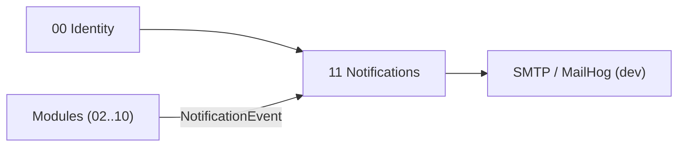

# Brique 11 — Notifications & communications

> Service transverse d'envoi (email principal) et de génération de communications, piloté par une matrice de notifications configurable. Consommé par tous les modules générateurs d'événements.

## 1. Référence fonctionnelle

- Spec §12 (notifications et communications), §12.3 (matrice), §8 (colonne « Mail » des effets de bord).
- Entité §11 : Notification.
- Fondations : [07-docker-devops.md](/home/olivier/ll-it-sc/projets/kore/technical/foundation/07-docker-devops.md) (MailHog en dev), [05-api-conventions.md](/home/olivier/ll-it-sc/projets/kore/technical/foundation/05-api-conventions.md).

## 2. Périmètre de la brique et dépendances

**Inclus** : canaux (email sortant SMTP, PDF joint), modèles de message, matrice déclencheur→destinataires→fréquence, planification (immédiat, matinal, lundi, vendredi, dernier lundi du mois), file d'envoi + retry, journal des envois.

**Hors brique** : email entrant (ouverture ticket) traité par la brique Support (06) ; SMS/push (hors périmètre legacy, décision Kore §17) ; génération des PDF métier (rendue par les modules, jointe ici).

**Dépend de** : 00 (identité/tenant). **Consommée par** : 02, 03, 04, 05, 06, 07, 08, 09, 10 (émission d'événements de notification).



## 3. Modèle de domaine

- **Agrégat `NotificationRule`** : `code`, `trigger` (événement métier), `frequency` (VO), `recipientsPolicy` (service/équipe/application + sélection), `template`, `attachPDF`.
- **`NotificationMessage`** : destinataires résolus, sujet, corps (signature par défaut §12.2), pièces jointes, statut d'envoi.
- **Value objects** : `Frequency` (Immédiat, Matinal, Lundi, Vendredi, DernierLundiDuMois), `Channel` (Email, EmailAvecPDF), `RecipientPolicy`.
- **Deux modes d'adressage** :
  - **Rule-based** (par défaut) : destinataires résolus depuis l'organisation (tenant) via `RecipientResolver`.
  - **Transactionnel** : destinataires **explicites** (adresses e-mail fournies dans l'événement), pour les flux **hors tenant** ou vers des tiers — ex. confirmation de réservation d'entretien vers un prospect + un commercial ([module 15](/home/olivier/ll-it-sc/projets/kore/technical/modules/15-site-vitrine-booking.md)), avec pièce jointe `.ics`. Ce mode contourne `RecipientResolver`.
- **Invariants** :
  - Signature par défaut ajoutée : « Cordialement » + nom société + URL tenant (§12.2) — sauf gabarits transactionnels publics.
  - Résolution des destinataires filtrée par service/équipe/application (mode rule-based uniquement).
  - Un envoi échoué est retenté (file + retry), jamais perdu silencieusement.

## 4. Ports

### Inbound

```go
type NotificationService interface {
    DefineRule(ctx context.Context, rule NotificationRule) error
    Publish(ctx context.Context, evt NotificationEvent) error // point d'entrée des modules
    ListSent(ctx context.Context, filter SentFilter) ([]NotificationMessage, error)
}

// façade fine exposée aux modules producteurs (ISP)
type NotificationPublisher interface {
    Notify(ctx context.Context, evt NotificationEvent) error              // rule-based (tenant)
    NotifyTransactional(ctx context.Context, msg TransactionalMessage) error // destinataires explicites (ex. module 15)
}
```

`TransactionalMessage` porte les destinataires explicites, le sujet, le corps et les pièces jointes (ex. `.ics`) ; il n'exige ni tenant ni `RecipientPolicy`.

### Outbound

```go
type NotificationRepository interface {
    SaveRule(ctx context.Context, r NotificationRule) error
    GetRuleByTrigger(ctx context.Context, tenant TenantID, trigger string) (NotificationRule, error)
    SaveMessage(ctx context.Context, m NotificationMessage) error
    ListPending(ctx context.Context, tenant TenantID) ([]NotificationMessage, error)
}

type EmailSender interface { Send(ctx context.Context, msg Email) error } // SMTP
type RecipientResolver interface {
    Resolve(ctx context.Context, policy RecipientPolicy) ([]Recipient, error) // s'appuie sur 00
}
type Clock interface { Now() time.Time } // planification des fréquences
```

## 5. Adapters

- **HTTP (chi)** : `internal/modules/notifications/adapters/http` (gestion des règles, consultation des envois).
- **PostgreSQL (sqlc)** : schéma `notifications`.
- **Gateways** : `EmailSender` (SMTP ; MailHog en dev), `RecipientResolver` (lecture org depuis brique 00).
- **Scheduler** : déclencheur périodique (matinal/lundi/vendredi/dernier lundi) évaluant les fréquences via `Clock`.

## 6. Contrat d'API

| Méthode | Chemin | Permission | Description |
| --- | --- | --- | --- |
| POST | `/api/v1/notification-rules` | Admin (E) | Définir/mettre à jour une règle |
| GET | `/api/v1/notification-rules` | Admin (L) | Lister les règles |
| GET | `/api/v1/notifications` | Admin/Resp (L) | Journal des envois |

L'émission n'est pas exposée en REST public : les modules appellent `NotificationPublisher.Notify` en interne. Erreurs : `404 RULE_NOT_FOUND`, `422 INVALID_FREQUENCY`.

## 7. Schéma de données (schéma `notifications`)

| Table | Colonnes clés |
| --- | --- |
| `notifications.rules` | `id`, `tenant_id`, `code`, `trigger`, `frequency`, `recipient_policy` (jsonb), `template`, `attach_pdf` |
| `notifications.messages` | `id`, `tenant_id`, `rule_code`, `recipients` (jsonb), `subject`, `body`, `status`, `attempts`, `sent_at` |

## 8. Mapping SOLID

| Principe | Application |
| --- | --- |
| SRP | Le service gère les notifications ; la résolution des destinataires est déléguée à `RecipientResolver`, l'envoi à `EmailSender`. |
| OCP | Nouvelles règles/fréquences/canaux ajoutés par données/adapters (ex. SMS futur) sans modifier le cœur. |
| LSP | `EmailSender` réel/mock (MailHog/faux) substituables. |
| ISP | `NotificationPublisher` (façade fine) exposé aux modules ; `NotificationService` (gestion complète) réservé à l'admin. |
| DIP | Dépend d'abstractions (`EmailSender`, `RecipientResolver`, `Clock`) injectées. |

## 9. Plan de tests unitaires

**Domaine** :
- Application de la signature par défaut (§12.2).
- Sélection de fréquence : « dernier lundi du mois » calculée via `Clock` mocké — table-driven.
- Résolution destinataires selon `RecipientPolicy`.

**Application (mocks)** :
- `Publish` d'un événement -> message créé + `EmailSender.Send` appelé (mock).
- Échec d'envoi -> incrément `attempts`, message reste `pending` (retry).
- Couverture de la matrice §12.3 : chaque déclencheur produit les destinataires attendus.

**Intégration** : persistance règles/messages ; file `ListPending`.

Couverture : domaine > 90 %, app > 80 %.

## 10. Frontend Nuxt

| Élément | Détail |
| --- | --- |
| Pages | `admin/notifications` (règles), `admin/notifications/journal` |
| Composants | `NotificationRuleForm`, `SentList` |
| Composables | `useNotifications()` |
| Store Pinia | `notifications` |
| Routes BFF | `server/api/notification-rules/*`, `server/api/notifications` |
| Permissions UI | Réservé profil Administrateur |

## 11. Definition of Done

- [ ] Matrice §12.3 configurable et appliquée (tests par déclencheur).
- [ ] Envoi SMTP + PDF joint ; MailHog en dev.
- [ ] Fréquences planifiées (immédiat/matinal/lundi/vendredi/dernier lundi) testées avec `Clock`.
- [ ] File + retry sur échec d'envoi.
- [ ] Façade `NotificationPublisher` consommée par les autres briques.
- [ ] Endpoints documentés dans `api/openapi.yaml`.
