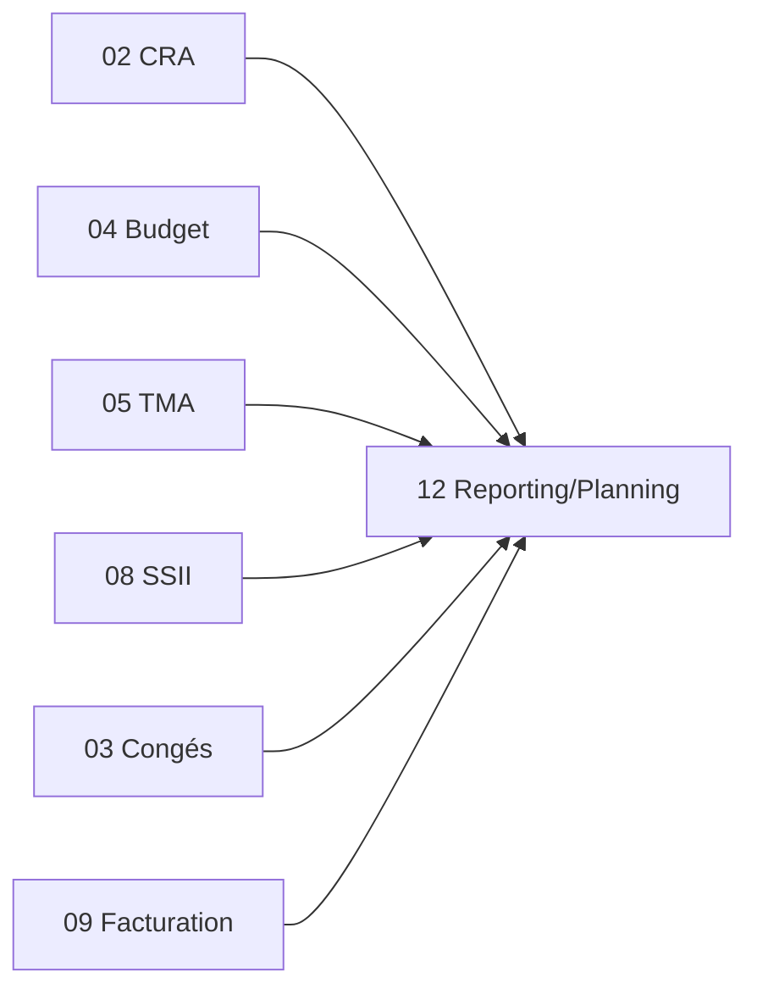

# Brique 12 — Reporting & Planning

> Vues transverses **en lecture seule** : Gantt, plannings (missions/congés 60j), dashboards, reporting TMA configurable, statistiques de facturation/CA. Ne modifie aucun flux source (spec §5.5).

## 1. Référence fonctionnelle

- Spec §7.9 (plannings, tableaux de bord, reporting), §5.3/§5.5 (Planning et Reporting = vues sans modification des sources).
- Sources de données : CRA (02), TMA (05), Budget (04), SSII (08), Congés (03), Facturation (09, hors virtuelles), ETT (10).
- Fondations : [05-api-conventions.md](/home/olivier/ll-it-sc/projets/kore/technical/foundation/05-api-conventions.md), [06-testing-strategy.md](/home/olivier/ll-it-sc/projets/kore/technical/foundation/06-testing-strategy.md).

## 2. Périmètre de la brique et dépendances

**Inclus** : Gantt (CRA/estimation/devis), plannings résolution incidents, missions 60j, congés 60j, astreinte, capacity planning, dashboards de prestation, reporting TMA configurable, statistiques facturation/CA, suivi de projet (alertes + stats + budget + graphe).

**Hors brique** : toute écriture métier (lecture seule stricte) ; génération des données sources (modules respectifs).

**Dépend de** : 02 CRA et l'ensemble des modules producteurs (via leurs ports de lecture). **Consommée par** : utilisateurs finaux (dashboards).



## 3. Modèle de domaine

> Module orienté **lecture/agrégation** : peu de domaine « transactionnel », surtout des **vues** et **projections**.

- **`GanttView`**, **`PlanningView`** (fenêtre 60j), **`Dashboard`**, **`ReportDefinition`** (reporting TMA configurable), **`Statistic`**.
- **Value objects** : `Period`, `TimeWindow`, `KPI`.
- **Invariants** :
  - Lecture seule : aucune mutation des agrégats sources.
  - Les factures **virtuelles sont exclues** des statistiques (cohérent RG-FAC-01).
  - Les projections respectent l'isolation multi-tenant et le RBAC (périmètre visible selon profil).

## 4. Ports

### Inbound

```go
type ReportingService interface {
    Gantt(ctx context.Context, filter GanttFilter) (GanttView, error)
    Planning(ctx context.Context, filter PlanningFilter) (PlanningView, error)
    Dashboard(ctx context.Context, code DashboardCode) (Dashboard, error)
    RunReport(ctx context.Context, def ReportDefinition) (Report, error)
    BillingStats(ctx context.Context, period Period) (Statistic, error)
}
```

### Outbound (ports de lecture fournis par les modules, ISP)

```go
type CRAReader interface { ConsumedByApplication(ctx context.Context, appID ApplicationID, period Period) ([]Consumption, error) }
type DemandReader interface { List(ctx context.Context, tenant TenantID, filter DemandFilter) ([]DemandSummary, error) }
type MissionReader interface { ActiveMissionDays(ctx context.Context, missionID MissionID, period Period) (MissionBilling, error) }
type BudgetReader interface { Consumption(ctx context.Context, appID ApplicationID, period Period) (ConsumptionTriple, error) }
type BillingReader interface { TransmittedTotals(ctx context.Context, period Period) (BillingTotals, error) } // exclut virtuelles
```

> Ces `*Reader` sont soit des **ports fournis par les modules sources**, soit — pour l'agrégation transverse — implémentés par l'adapter reporting au-dessus de **vues SQL en lecture seule inter-schémas**. Ce dernier cas est une **exception explicitement sanctionnée** à la règle « pas de JOIN inter-schémas » (cf. [foundation/03-database.md](/home/olivier/ll-it-sc/projets/kore/technical/foundation/03-database.md) §1) : elle est **réservée au reporting**, strictement en **lecture seule**, et n'autorise aucune écriture ni logique métier hors de ce module.

> **Cache (Redis)** : dashboards et projections d'agrégats sont fortement cachés (clés `kore:{tenant}:reporting:{code}:{period}`, TTL court à moyen) — module principalement en lecture. Expiration par TTL ; pas de scan global (instance partagée). Port `Cache` cf. [foundation/10-cache-redis.md](/home/olivier/ll-it-sc/projets/kore/technical/foundation/10-cache-redis.md).

## 5. Adapters

- **HTTP (chi)** : `internal/modules/reporting/adapters/http`.
- **PostgreSQL (sqlc)** : schéma `reporting` (vues/projections en lecture ; caches d'agrégats optionnels). Accès en lecture seule aux données sources via leurs ports/vues.

## 6. Contrat d'API

| Méthode | Chemin | Permission | Description |
| --- | --- | --- | --- |
| GET | `/api/v1/gantt` | Reporting/Planning (L) | Vue Gantt (CRA/estimation/devis) |
| GET | `/api/v1/planning?window=60` | Planning (L) | Missions/congés 60j |
| GET | `/api/v1/dashboards/{code}` | Reporting (L) | Dashboard |
| POST | `/api/v1/reports/run` | Reporting (L) | Reporting TMA configurable |
| GET | `/api/v1/stats/billing?period=YYYY-MM` | Reporting (L) | Statistiques CA (hors virtuelles) |

Uniquement des lectures (verbe POST pour `reports/run` = requête paramétrée, sans effet de bord).

## 7. Schéma de données (schéma `reporting`)

| Objet | Rôle |
| --- | --- |
| `reporting.report_definitions` | Définitions de rapports TMA configurables (`id`, `tenant_id`, `params`) |
| `reporting.dashboard_configs` | Configuration des dashboards par profil |
| Vues en lecture | Projections d'agrégats (consommation, planning) alimentées par les modules sources |

Aucune table transactionnelle métier ; caches d'agrégats reconstructibles.

## 8. Mapping SOLID

| Principe | Application |
| --- | --- |
| SRP | Uniquement lecture/agrégation/restitution ; aucune règle métier d'écriture. |
| OCP | Nouveaux dashboards/rapports ajoutés par configuration (données), pas par modification du code. |
| LSP | Chaque `*Reader` réel/mock substituable pour les tests d'agrégation. |
| ISP | Consomme des ports de lecture fins par domaine plutôt que les services complets. |
| DIP | Dépend d'abstractions de lecture ; aucune dépendance d'écriture vers les modules sources. |

## 9. Plan de tests unitaires

**Domaine/application (mocks)** :
- Agrégations correctes à partir de `*Reader` mockés (Gantt, planning 60j, dashboards) — table-driven.
- Statistiques de facturation **excluent les virtuelles** (cohérent RG-FAC-01).
- Respect du périmètre RBAC (un profil ne voit que ce qui lui est permis).

**Intégration** : projections/vues de lecture renvoient des agrégats cohérents avec les données sources.

Couverture : application/agrégation > 80 %.

## 10. Frontend Nuxt

| Élément | Détail |
| --- | --- |
| Pages | `planning/gantt`, `planning/60j`, `reporting/dashboards`, `reporting/tma`, `reporting/facturation` |
| Composants | `GanttChart`, `PlanningBoard`, `DashboardGrid`, `ReportBuilder`, `StatChart` |
| Composables | `useReporting()`, `usePlanning()` |
| Store Pinia | `reporting` |
| Routes BFF | `server/api/gantt`, `server/api/planning`, `server/api/dashboards/*`, `server/api/reports/*`, `server/api/stats/*` |
| Permissions UI | Vues filtrées selon profil (RBAC §3.3 colonnes Planning/Reporting) |

## 10bis. Phase cible (roadmap)

| Phase | Livrable | État audit 07/2026 |
| --- | --- | --- |
| **Phase 3** | Module 12 + remplacement KPIs statiques `dashboard/index.vue` (valeurs `6`, `2` en dur) | Non démarré |

Cf. [ROADMAP.md](../ROADMAP.md).

## 11. Definition of Done

- [ ] Gantt, planning 60j, dashboards, reporting TMA, stats CA disponibles en lecture.
- [ ] Virtuelles exclues des statistiques (testé).
- [ ] Aucune écriture sur les données sources (garanti par conception).
- [ ] Respect RBAC et multi-tenant sur les vues.
- [ ] Endpoints documentés dans `api/openapi.yaml`.
