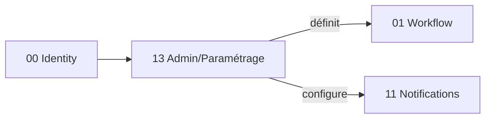

# Brique 13 — Admin & Paramétrage

> Paramétrage avancé : configuration des workflows (états, déclencheurs Document×Action), rubriques d'analyse, types/états de fiche, modèles (devis, interface), répertoire téléphonique, configuration des notifications, rapports TMA. Interface d'administration transverse.

## 1. Référence fonctionnelle

- Spec §7.10 (administration/paramétrage), §7.11 (fonctionnalités transverses : fiche personnelle, CV, exports XML), §12 (config notifications).
- Règles : RG-ORG-01, RG-SEC-01 (confidentialité mail/téléphone), RG-SEC-02.
- Fondations : [04-auth-rbac.md](/home/olivier/ll-it-sc/projets/kore/technical/foundation/04-auth-rbac.md), [01-architecture.md](/home/olivier/ll-it-sc/projets/kore/technical/foundation/01-architecture.md).

## 2. Périmètre de la brique et dépendances

**Inclus** : UI/API de paramétrage des définitions de workflow (déléguées au moteur 01), rubriques d'analyse, types et états de fiche, groupes de statistiques, modèles de devis/estimation et d'interface, répertoire téléphonique (accès par profil), configuration des règles de notification (déléguée au module 11), fiche personnelle + CV (reconstruction depuis technologies/poste/mission), exports XML transverses.

**Hors brique** : exécution des workflows (01), envoi des notifications (11), logique métier des modules.

**Dépend de** : 00 (identité/RBAC), 01 (définitions workflow), 11 (règles notification). **Consommée par** : tous les modules (paramétrage).



## 3. Modèle de domaine

- **`ParameterSet`** : rubriques d'analyse, types de fiche, états de fiche, groupes stats.
- **`Template`** : modèles de devis/estimation (tâches visibles, pas de création libre), modèles d'interface (simple → complexe).
- **`PhoneDirectoryEntry`** : répertoire téléphonique (visibilité par profil/utilisateur).
- **`PersonalProfile`** : fiche personnelle (confidentialité mail/téléphone RG-SEC-01), CV reconstruit.
- **Value objects** : `Visibility`, `TemplateType`.
- **Invariants** :
  - Modèles de devis : tâches choisies parmi celles visibles, **pas de création libre** (§7.10).
  - Confidentialité des coordonnées selon profil du consultant (RG-SEC-01).
  - Les définitions de workflow paramétrées sont validées par le moteur (01) avant activation.

## 4. Ports

### Inbound

```go
type AdminService interface {
    UpsertParameterSet(ctx context.Context, cmd ParameterSetCommand) error
    UpsertTemplate(ctx context.Context, cmd TemplateCommand) error
    ManagePhoneDirectory(ctx context.Context, cmd DirectoryCommand) error
    UpdatePersonalProfile(ctx context.Context, cmd ProfileCommand) error
    BuildCV(ctx context.Context, userID UserID) (CV, error)
    ExportXML(ctx context.Context, filter XMLExportFilter) (Document, error)
}
```

### Outbound

```go
type AdminRepository interface {
    SaveParameterSet(ctx context.Context, p ParameterSet) error
    SaveTemplate(ctx context.Context, t Template) error
    SaveDirectoryEntry(ctx context.Context, e PhoneDirectoryEntry) error
    SaveProfile(ctx context.Context, p PersonalProfile) error
}
type WorkflowDefiner interface { // brique 01
    DefineWorkflow(ctx context.Context, def WorkflowDefinition) error
}
type NotificationRuleDefiner interface { // brique 11
    DefineRule(ctx context.Context, rule NotificationRule) error
}
type CVComposer interface { Compose(ctx context.Context, data CVData) (CV, error) }
```

## 5. Adapters

- **HTTP (chi)** : `internal/modules/admin/adapters/http`.
- **PostgreSQL (sqlc)** : schéma `admin`.
- Délègue au moteur Workflow (01) et au service Notifications (11) via leurs ports.

## 6. Contrat d'API

| Méthode | Chemin | Permission | Description |
| --- | --- | --- | --- |
| PUT | `/api/v1/admin/parameter-sets` | Admin (E) | Rubriques, types/états de fiche, groupes stats |
| PUT | `/api/v1/admin/templates` | Admin (E) | Modèles devis/estimation/interface |
| PUT | `/api/v1/admin/phone-directory` | Admin (E) | Répertoire téléphonique |
| PUT | `/api/v1/me/profile` | authentifié (E) | Fiche personnelle (confidentialité) |
| GET | `/api/v1/users/{id}/cv` | selon RBAC (L) | CV reconstruit |
| GET | `/api/v1/admin/export.xml` | Admin (L) | Exports XML transverses |
| POST | `/api/v1/admin/workflows` | Admin (E) | Définir un workflow (délégué à 01) |
| POST | `/api/v1/admin/notification-rules` | Admin (E) | Configurer une notification (délégué à 11) |

Erreurs : `403`, `422 TEMPLATE_TASK_NOT_ALLOWED` (création libre interdite), `422 INVALID_WORKFLOW_DEFINITION`.

## 7. Schéma de données (schéma `admin`)

| Table | Colonnes clés |
| --- | --- |
| `admin.parameter_sets` | `id`, `tenant_id`, `kind`, `payload` (jsonb) |
| `admin.templates` | `id`, `tenant_id`, `type`, `content` (jsonb), `allowed_tasks` |
| `admin.phone_directory` | `id`, `tenant_id`, `user_id`, `phone`, `visibility` |
| `admin.personal_profiles` | `id`, `tenant_id`, `user_id`, `email_visibility`, `phone_visibility`, `cv_data` (jsonb) |

## 8. Mapping SOLID

| Principe | Application |
| --- | --- |
| SRP | Paramétrage/administration uniquement ; l'exécution reste dans les modules cibles (01/11). |
| OCP | Nouveaux types de paramètres/modèles ajoutés par données ; workflows/notifications définis sans coder de nouveau moteur. |
| LSP | `AdminRepository` et définisseurs réels/mocks substituables. |
| ISP | `WorkflowDefiner` et `NotificationRuleDefiner` = façades fines des briques 01/11. |
| DIP | Dépend d'abstractions (moteur workflow, service notifications, composeur CV) injectées. |

## 9. Plan de tests unitaires

**Domaine** :
- Modèle de devis : tâche hors liste autorisée -> `TEMPLATE_TASK_NOT_ALLOWED` (§7.10) — table-driven.
- Confidentialité coordonnées appliquée selon profil (RG-SEC-01).

**Application (mocks)** :
- Définition de workflow déléguée à `WorkflowDefiner` ; définition invalide propagée en erreur.
- Configuration notification déléguée à `NotificationRuleDefiner`.
- `BuildCV` compose depuis technologies/poste/mission (`CVComposer` mocké).

**Intégration** : persistance paramètres/modèles/annuaire/profil.

Couverture : domaine > 90 %, app > 80 %.

## 10. Frontend Nuxt

| Élément | Détail |
| --- | --- |
| Pages | `admin/parametres`, `admin/modeles`, `admin/annuaire`, `admin/workflows` (via 01), `admin/notifications` (via 11), `me/profil`, `users/[id]/cv` |
| Composants | `ParameterEditor`, `TemplateBuilder`, `PhoneDirectoryTable`, `ProfileForm`, `CvViewer` |
| Composables | `useAdmin()`, `useProfile()` |
| Store Pinia | `admin` |
| Routes BFF | `server/api/admin/*`, `server/api/me/profile`, `server/api/users/*/cv` |
| Permissions UI | Sections admin réservées profil Administrateur ; fiche personnelle accessible à chacun |

## 11. Definition of Done

- [ ] Paramétrage rubriques/types/états/modèles opérationnel.
- [ ] Modèles de devis sans création libre (testé).
- [ ] Définition de workflows déléguée au moteur (01) et notifications au module (11).
- [ ] Fiche personnelle + CV + confidentialité (RG-SEC-01).
- [ ] Exports XML transverses.
- [ ] Endpoints documentés dans `api/openapi.yaml`.
