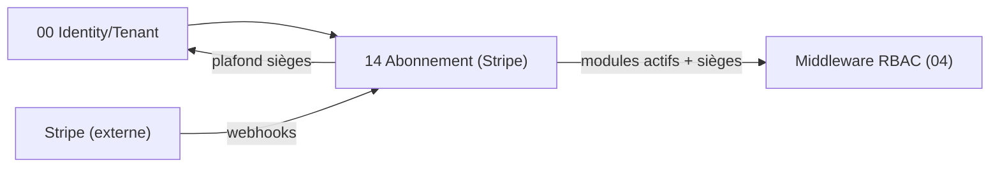

# Brique 14 — Abonnement SaaS (Stripe)

> Gère la **souscription des tenants à Kore** : modules activés, nombre de sièges, cycle de vie de l'abonnement via Stripe. Détermine l'**activation des modules** et le **plafond de sièges** exploités par le RBAC.
>
> ⚠️ Distinct du **module 09 Facturation/e-invoicing** (facturation métier des clients des ESN via PDP). Voir [foundation/11-payments-stripe.md](/home/olivier/ll-it-sc/projets/kore/technical/foundation/11-payments-stripe.md).

## 1. Référence fonctionnelle

- Spec §14 (modèle économique : essai 2 mois, abonnement mensuel par module et par poste, options payantes), §3 (RBAC — l'accès module dépend aussi de l'abonnement), §4.5 (multi-tenant).
- Fondations : [11-payments-stripe.md](/home/olivier/ll-it-sc/projets/kore/technical/foundation/11-payments-stripe.md), [04-auth-rbac.md](/home/olivier/ll-it-sc/projets/kore/technical/foundation/04-auth-rbac.md), [09-gcp-infrastructure.md](/home/olivier/ll-it-sc/projets/kore/technical/foundation/09-gcp-infrastructure.md) (Secret Manager).

## 2. Périmètre de la brique et dépendances

**Inclus** : souscription (Checkout), gestion des modules activés et des sièges, essai gratuit, upgrades/downgrades, résiliation, traitement idempotent des webhooks Stripe, exposition de l'état d'abonnement pour l'autorisation.

**Hors brique** : facturation métier client (09/PDP), gestion des utilisateurs (00) — mais contrôle du plafond de sièges exposé à 00.

**Dépend de** : 00 (tenant/identité). **Consommée par** : 00 (contrôle sièges), middleware RBAC (activation module), **module 15** (`PricingReader` pour l'affichage public des tarifs), toutes les briques indirectement (accès conditionné à l'abonnement).



## 3. Modèle de domaine

- **Agrégat `Subscription`** : `tenantID`, `stripeCustomerID`, `stripeSubscriptionID`, `statut` (Trial, Active, PastDue, Suspended, Canceled), `modulesActifs[]`, `seats`, `périodeCourante`.
- **`ModuleEntitlement`** : module activé pour le tenant (droit d'usage).
- **`WebhookEvent`** : trace de déduplication (`event.id`, traité le).
- **Value objects** : `SubscriptionStatus`, `SeatCount`, `ModuleCode`, `TrialPeriod`.
- **Invariants** :
  - L'état d'abonnement est une **projection des webhooks Stripe** (jamais saisi manuellement).
  - `utilisateurs actifs ≤ seats` (contrôle exposé au module 00).
  - Un module non inclus dans `modulesActifs` est inaccessible (refus RBAC).
  - Statut `Suspended`/`Canceled` → accès métier bloqué (lecture éventuelle en lecture seule selon politique).
  - Chaque `event.id` traité une seule fois (idempotence).

## 4. Ports

### Inbound

```go
type SubscriptionService interface {
    StartCheckout(ctx context.Context, cmd CheckoutCommand) (CheckoutSession, error) // modules + seats
    OpenCustomerPortal(ctx context.Context, tenantID TenantID) (PortalSession, error)
    HandleWebhook(ctx context.Context, payload []byte, signature string) error       // idempotent
    Cancel(ctx context.Context, tenantID TenantID) error
}

// port de lecture exposé au RBAC et au module 00 (ISP)
type EntitlementReader interface {
    IsModuleEnabled(ctx context.Context, tenantID TenantID, module ModuleCode) (bool, error)
    SeatUsageLimit(ctx context.Context, tenantID TenantID) (used int, limit int, err error)
    Status(ctx context.Context, tenantID TenantID) (SubscriptionStatus, error)
}

// port de lecture du catalogue tarifaire (Stripe = source de vérité), consommé par le site vitrine (module 15)
type PricingReader interface {
    Catalog(ctx context.Context) (PricingCatalog, error) // modules, prix par siège, devise — depuis les Prices Stripe
}
```

### Outbound

```go
type SubscriptionRepository interface {
    Save(ctx context.Context, s Subscription) error
    GetByTenant(ctx context.Context, tenantID TenantID) (Subscription, error)
    GetByStripeCustomer(ctx context.Context, customerID string) (Subscription, error)
    MarkEventProcessed(ctx context.Context, eventID string) (firstTime bool, err error) // idempotence
}

type PaymentGateway interface { // implémenté par adapter Stripe (stripe-go)
    CreateCheckoutSession(ctx context.Context, req CheckoutRequest) (CheckoutSession, error)
    CreatePortalSession(ctx context.Context, customerID string) (PortalSession, error)
    VerifyWebhook(payload []byte, signature string) (StripeEvent, error)
    CancelSubscription(ctx context.Context, subscriptionID string) error
    ListPrices(ctx context.Context) (PricingCatalog, error) // alimente PricingReader.Catalog
}
```

## 5. Adapters

- **HTTP (chi)** : `internal/modules/subscription/adapters/http` (checkout, portal, **webhook Stripe**).
- **PostgreSQL (sqlc)** : schéma `subscription`.
- **PaymentGateway** : `adapters/stripe` (stripe-go) ; clés via Secret Manager. En test : `stripe-mock`.

## 6. Contrat d'API

| Méthode | Chemin | Permission | Description |
| --- | --- | --- | --- |
| POST | `/api/v1/billing/checkout-session` | Admin tenant (E) | Créer une session Checkout (modules + sièges) |
| POST | `/api/v1/billing/portal-session` | Admin tenant (E) | Ouvrir le Customer Portal |
| GET | `/api/v1/billing/subscription` | Admin tenant (L) | État d'abonnement (modules, sièges, statut) |
| POST | `/api/v1/billing/cancel` | Admin tenant (V) | Résilier |
| POST | `/api/v1/webhooks/stripe` | signature Stripe | Réception des événements (idempotent) |

Erreurs : `402 PAYMENT_REQUIRED`, `403 MODULE_NOT_SUBSCRIBED`, `409 SEAT_LIMIT_REACHED`, `400 INVALID_WEBHOOK_SIGNATURE`.

## 7. Schéma de données (schéma `subscription`)

| Table | Colonnes clés |
| --- | --- |
| `subscription.subscriptions` | `id`, `tenant_id`, `stripe_customer_id`, `stripe_subscription_id`, `status`, `seats`, `current_period_end` |
| `subscription.module_entitlements` | `id`, `tenant_id`, `module_code`, `enabled` |
| `subscription.webhook_events` | `event_id` (PK), `type`, `processed_at` — déduplication |

Index `(tenant_id)`, `UNIQUE (stripe_customer_id)`.

## 8. Mapping SOLID

| Principe | Application |
| --- | --- |
| SRP | Gestion des abonnements uniquement ; le paiement est délégué à `PaymentGateway`. |
| OCP | Nouveau module/price ou nouveau fournisseur de paiement via un adapter, sans modifier le domaine. |
| LSP | `PaymentGateway` réel (Stripe) / `stripe-mock` substituables. |
| ISP | `EntitlementReader` (lecture pour RBAC/00) distinct de `SubscriptionService` (gestion). |
| DIP | Le domaine dépend de `PaymentGateway` (abstraction), pas de stripe-go. |

## 9. Plan de tests unitaires

**Domaine** :
- `utilisateurs actifs ≤ seats` (SEAT_LIMIT_REACHED) — table-driven.
- Module non actif → inaccessible ; statut Suspended → blocage.
- Mapping événement Stripe → statut (trial→active→past_due→canceled).

**Application (mocks)** :
- `HandleWebhook` : signature invalide rejetée ; `event.id` déjà traité → no-op (idempotence via `MarkEventProcessed`).
- `StartCheckout` appelle `PaymentGateway.CreateCheckoutSession` (mock) avec les bons prices/quantités.
- `EntitlementReader.IsModuleEnabled` cohérent avec les entitlements.

**Intégration** : `stripe-mock` (création session, webhooks) ; persistance abonnement/entitlements ; déduplication d'événements.

Couverture : domaine > 90 %, app > 80 %.

## 10. Frontend Nuxt

| Élément | Détail |
| --- | --- |
| Pages | `billing/abonnement` (choix modules/sièges), `billing/statut`, retour Checkout (succès/annulation) |
| Composants | `PlanSelector`, `SeatCounter`, `SubscriptionStatusCard` |
| Composables | `useBilling()` |
| Store Pinia | `subscription` |
| Routes BFF | `server/api/billing/*` (le webhook Stripe reste côté API Go, pas dans le BFF) |
| Front Stripe | `@stripe/stripe-js` pour la redirection Checkout (clé publiable uniquement) |
| Permissions UI | Réservé à l'Administrateur du tenant ; bandeau si `PastDue`/essai bientôt fini |

## 11. Definition of Done

- [ ] Souscription Checkout + Customer Portal opérationnels.
- [ ] Webhooks vérifiés et **idempotents** ; état = projection Stripe.
- [ ] `EntitlementReader` consommé par le middleware RBAC (module non souscrit → refus).
- [ ] Contrôle du plafond de sièges exposé au module 00.
- [ ] Séparation stricte vs module 09/PDP (aucune dépendance).
- [ ] Tests avec `stripe-mock` ; endpoints documentés dans `api/openapi.yaml`.
