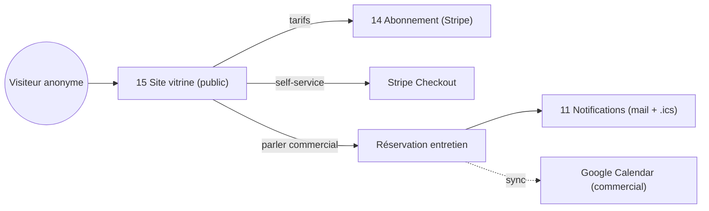

# Brique 15 — Site vitrine & réservation commerciale

> Page racine **publique** (présentation, modules, tarifs) de type **tunnel de vente**, avec **capture de leads** et **réservation d'entretien commercial**. Tunnel **hybride** : self-service (Stripe Checkout, module 14) + « parler à un commercial » (booking). Contenu commercial issu de [`documentation/ANALYSE_COMMERCIALE.md`](/home/olivier/ll-it-sc/projets/kore/documentation/ANALYSE_COMMERCIALE.md).

## 1. Référence fonctionnelle

- Analyse commerciale : §5 (proposition de valeur), §8 (packaging/pricing), §11 (GTM hybride PLG + sales-assisted), §12 (plan marketing, KPI acquisition).
- Spec §14 (modèle économique), §13 (RGPD/confidentialité).
- Fondations : [08-frontend-nuxt.md](/home/olivier/ll-it-sc/projets/kore/technical/foundation/08-frontend-nuxt.md) (layout public), [11-payments-stripe.md](/home/olivier/ll-it-sc/projets/kore/technical/foundation/11-payments-stripe.md) (pricing/Checkout), [04-auth-rbac.md](/home/olivier/ll-it-sc/projets/kore/technical/foundation/04-auth-rbac.md) (routes publiques, rate-limit), [10-cache-redis.md](/home/olivier/ll-it-sc/projets/kore/technical/foundation/10-cache-redis.md).

## 2. Périmètre de la brique et dépendances

**Inclus** : contenu public (présentation/modules/tarifs), affichage **dynamique des tarifs** depuis Stripe (module 14), CTA tunnel (checkout self-service ou booking), **capture de leads** (RGPD), **réservation d'entretien commercial** (créneaux + disponibilités des commerciaux + confirmation e-mail/`.ics`), **sync optionnelle Google Calendar** (anti double-booking).

**Hors brique** : paiement/abonnement (module 14), envoi effectif des e-mails (module 11), gestion RH des commerciaux (module 00).

**Dépend de** : 14 (pricing/Checkout via `PricingReader`), 11 (`NotificationPublisher`), 00 (référentiel commerciaux). **Consommée par** : visiteurs anonymes (public).



## 3. Modèle de domaine

- **Agrégat `Lead`** : coordonnées prospect, société, taille, besoin, source (UTM), **consentement RGPD** (horodaté), statut (Nouveau → Contacté → Qualifié → Converti/Perdu).
- **Agrégat `BookingSlot`** : commercial, créneau (VO `TimeSlot`), statut (Libre, Réservé, Annulé), origine (interne/sync).
- **Agrégat `Appointment`** : lead, commercial, créneau, canal (visio/téléphone), statut, jeton d'annulation.
- **`CommercialAvailability`** : règles de disponibilité par commercial (plages, fuseau, durée de créneau).
- **Value objects** : `TimeSlot`, `Consent`, `UTMSource`, `MeetingChannel`.
- **Invariants** :
  - Un `Lead` n'est stocké qu'avec **consentement explicite** (RGPD) ; droit à l'effacement supporté.
  - Un `BookingSlot` ne peut être réservé **deux fois** (verrou applicatif + contrainte DB) ; la sync Google Calendar bloque les créneaux occupés.
  - Un créneau passé n'est pas réservable (`Clock`).
  - Annulation/replanification via jeton, sans authentification (lien e-mail).

## 4. Ports

### Inbound

```go
type PublicSiteService interface {
    GetPricing(ctx context.Context) (PricingCatalog, error) // tarifs dynamiques (module 14), caché
    ListModules(ctx context.Context) ([]ModulePresentation, error)
}

type LeadService interface {
    CaptureLead(ctx context.Context, cmd CaptureLeadCommand) (Lead, error) // consentement requis
}

type BookingService interface {
    AvailableSlots(ctx context.Context, filter SlotFilter) ([]BookingSlot, error)
    BookAppointment(ctx context.Context, cmd BookCommand) (Appointment, error)
    CancelAppointment(ctx context.Context, token string) error
    Reschedule(ctx context.Context, cmd RescheduleCommand) (Appointment, error)
}
```

### Outbound

```go
type LeadRepository interface {
    Save(ctx context.Context, l Lead) error
    Delete(ctx context.Context, id LeadID) error // droit à l'effacement RGPD
}
type BookingRepository interface {
    SaveSlot(ctx context.Context, s BookingSlot) error
    ReserveSlot(ctx context.Context, slotID SlotID) error // atomique (anti double-booking)
    SaveAppointment(ctx context.Context, a Appointment) error
    GetByToken(ctx context.Context, token string) (Appointment, error)
}

// ports fournis par d'autres briques (ISP)
type PricingReader interface { // module 14 : catalogue prix depuis Stripe
    Catalog(ctx context.Context) (PricingCatalog, error)
}
type NotificationPublisher interface { // module 11 : canal transactionnel (destinataires explicites)
    NotifyTransactional(ctx context.Context, msg TransactionalMessage) error // confirmation e-mail + pièce .ics
}
type ExternalCalendarGateway interface { // sync optionnelle Google Calendar (distinct du WorkCalendar du module 08)
    BusyPeriods(ctx context.Context, commercialID CommercialID, window TimeWindow) ([]TimeSlot, error)
    CreateEvent(ctx context.Context, appt Appointment) (ExternalEventID, error)
}
type Cache interface { /* platform/cache — cf. foundation/10 */ }
type Clock interface { Now() time.Time }
```

## 5. Adapters

- **HTTP (chi)** : `internal/modules/publicsite/adapters/http` — endpoints **publics** (hors JWT), rate-limités (Redis) + anti-spam (honeypot/altcha/captcha au choix).
- **PostgreSQL (sqlc)** : schéma `publicsite`.
- **PricingReader** : consomme le module 14 (catalogue mis en cache Redis, TTL court).
- **ExternalCalendarGateway** : `adapters/googlecalendar` (API Google Calendar, OAuth commercial) — optionnel/désactivable.
- **NotificationPublisher** : module 11 (mail de confirmation + fichier `.ics`).

## 6. Contrat d'API (public)

| Méthode | Chemin | Auth | Description |
| --- | --- | --- | --- |
| GET | `/api/v1/public/pricing` | public | Tarifs dynamiques (Stripe), cachés |
| GET | `/api/v1/public/modules` | public | Présentation des modules |
| POST | `/api/v1/public/leads` | public (rate-limit + consentement) | Capture d'un lead |
| GET | `/api/v1/public/booking/slots` | public | Créneaux disponibles |
| POST | `/api/v1/public/booking/appointments` | public (rate-limit) | Réserver un entretien |
| POST | `/api/v1/public/booking/appointments/{token}/cancel` | jeton | Annuler |
| POST | `/api/v1/public/booking/appointments/{token}/reschedule` | jeton | Replanifier |

Erreurs : `409 SLOT_ALREADY_BOOKED`, `422 CONSENT_REQUIRED`, `410 SLOT_EXPIRED`, `429 TOO_MANY_REQUESTS`.

## 7. Schéma de données (schéma `publicsite`)

| Table | Colonnes clés |
| --- | --- |
| `publicsite.leads` | `id`, `email`, `company`, `size`, `need`, `utm_source`, `consent_at`, `status`, `created_at` |
| `publicsite.commercial_availabilities` | `id`, `commercial_id`, `weekday`, `start`, `end`, `slot_minutes`, `timezone` |
| `publicsite.booking_slots` | `id`, `commercial_id`, `slot_start`, `slot_end`, `status`, `external_event_id` |
| `publicsite.appointments` | `id`, `lead_id`, `commercial_id`, `slot_id`, `channel`, `status`, `cancel_token`, `created_at` |

Contraintes : `UNIQUE (commercial_id, slot_start)` (anti double-booking) ; `ReserveSlot` en transaction (`SELECT ... FOR UPDATE`). Pas de `tenant_id` (données **avant** création de tenant) — schéma isolé, hors périmètre multi-tenant applicatif.

## 8. Mapping SOLID

| Principe | Application |
| --- | --- |
| SRP | Contenu public, leads, booking séparés en services distincts. |
| OCP | Nouveau moteur de calendrier (Google/autre) via un adapter `ExternalCalendarGateway` ; anti-spam remplaçable. |
| LSP | `ExternalCalendarGateway`, repositories réels/mocks substituables ; sync désactivable sans casser le booking. |
| ISP | `PricingReader` (lecture module 14), `NotificationPublisher` (module 11) : interfaces fines. |
| DIP | Dépend d'abstractions (pricing, notifications, calendrier, cache) injectées ; aucune dépendance à Stripe/Google en dur. |

## 9. Plan de tests unitaires

**Domaine** :
- Lead sans consentement rejeté (`CONSENT_REQUIRED`, RGPD) — table-driven.
- Créneau passé non réservable (`Clock` mocké) ; double réservation refusée.
- Génération/validation du jeton d'annulation.

**Application (mocks)** :
- `GetPricing` lit `PricingReader` (module 14) + cache (miss → charge → set).
- `BookAppointment` : `ReserveSlot` atomique, `NotificationPublisher` appelé (mail + `.ics`), `ExternalCalendarGateway.CreateEvent` si sync active.
- Sync : créneaux occupés Google Calendar exclus des disponibilités.
- `CaptureLead` enregistre le consentement horodaté ; `Delete` (droit à l'effacement).

**Intégration (testcontainers)** :
- Contrainte `UNIQUE (commercial_id, slot_start)` ; réservation concurrente → une seule gagne.
- Rate-limiting Redis sur endpoints publics.

Couverture : domaine > 90 %, app > 80 %.

## 10. Frontend Nuxt (layout public)

| Élément | Détail |
| --- | --- |
| Layout | `layouts/public.vue` (marketing, SEO/SSR, sans nav applicative) — distinct du layout app authentifié |
| Pages | `/` (présentation + tunnel), `/modules`, `/tarifs`, `/reserver`, `/contact`, retours Checkout succès/annulation |
| Composants | `HeroSection`, `ModuleShowcase`, `PricingTable` (dynamique Stripe), `LeadForm`, `BookingCalendar`, `CtaTunnel` |
| Composables | `usePublicPricing()`, `useLead()`, `useBooking()` |
| Store Pinia | `publicsite` (léger ; état surtout serveur/SSR) |
| Routes BFF | `server/api/public/*` (proxy vers l'API Go publique) |
| SEO | SSR + métadonnées (`useSeoMeta`), sitemap, Open Graph, données structurées (Product/Offer) |
| Tunnel | CTA « Démarrer » → Stripe Checkout (module 14) ; CTA « Parler à un commercial » → `/reserver` |
| Icônes | Material Symbols (`<AppIcon>`, cf. 08-frontend) |

## 11. Definition of Done

- [ ] Page racine publique (présentation, modules, tarifs) en SSR avec SEO.
- [ ] Tarifs **dynamiques** depuis Stripe (module 14), cohérents avec le Checkout.
- [ ] Tunnel hybride : self-service (Checkout) + réservation commerciale.
- [ ] Capture de leads conforme RGPD (consentement + effacement).
- [ ] Réservation : anti double-booking (contrainte DB + transaction), confirmation e-mail + `.ics`.
- [ ] Sync Google Calendar optionnelle et désactivable.
- [ ] Endpoints publics rate-limités (Redis) + anti-spam.
- [ ] Endpoints documentés dans `api/openapi.yaml`.
