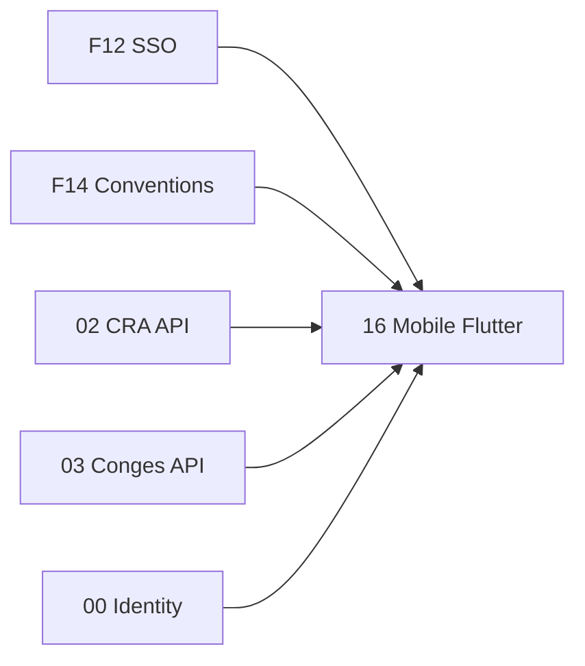

# Brique 16 — Application mobile Flutter

> Client mobile multi-OS (iOS, Android) pour les parcours consultants : CRA et congés.
> **Pas de module Go dédié** : consomme les APIs des briques 02 (CRA) et 03 (Congés).
> Fondations : [14-flutter-mobile-client.md](../foundation/14-flutter-mobile-client.md), [12-sso-federation.md](../foundation/12-sso-federation.md).
> Phase cible : [ROADMAP §Phase 1bis](../ROADMAP.md).

## 1. Référence fonctionnelle

- Spec §15.2 Phase 4 (app mobile — remontée en Phase 1bis roadmap).
- ANALYSE_COMMERCIALE §7.4 (table stake app mobile CRA/congés).
- Spec §17 D8 (canaux pointage ETT) : Flutter = canal privilégié mobile pour M10 ultérieur.
- Critères PR-08.2 (CRA), PR-08.5 (congés).

## 2. Périmètre de la brique et dépendances

**Inclus** :
- Login OIDC PKCE (+ password optionnel Starter)
- Liste et saisie CRA (grille hebdo, soumission, validation manager)
- Demandes congés, soldes, validation/refus manager
- i18n fr/en, thème charte Kore

**Hors brique** :
- TMA, budget, facturation, admin
- Push notifications (module 11 + FCM/APNs — phase ultérieure)
- Offline complet, pointage ETT (module 10 — Phase 3)
- Code backend Go (aucun `internal/modules/mobile/`)

**Dépend de** : [12 SSO](../foundation/12-sso-federation.md), [14 Flutter](../foundation/14-flutter-mobile-client.md), [00](00-organisation-identity.md) (profil/RBAC), [02](02-cra.md) (API), [03](03-conges.md) (API).

## 3. Modèle (côté client)

Pas d'agrégat domaine Go. Modèles Dart (DTO) miroir des réponses API :

- `Timesheet`, `WeekEntry`, `TimeLine` (module 02)
- `LeaveRequest`, `LeaveBalance` (module 03)
- `AuthSession` (tokens, profil, permissions UI)

État local : repositories + state management (Riverpod/BLoC).

## 4. Écrans (MVP mobile)

| Route | Écran | Module API | Profils |
| --- | --- | --- | --- |
| `/login` | Connexion SSO / password | 00 auth | Tous |
| `/cra` | Liste des mois / semaines | 02 | CRA requis |
| `/cra/:month` | Grille hebdomadaire | 02 | Collaborateur+ |
| `/cra/:month/validate` | Validation manager | 02 | Responsable (V) |
| `/conges` | Mes demandes | 03 | Tous |
| `/conges/new` | Nouvelle demande | 03 | E |
| `/conges/balances` | Soldes | 03 | L |
| `/conges/validation` | File validation manager | 03 | Manager (V) |

## 5. Composants Flutter réutilisables

| Composant | Rôle |
| --- | --- |
| `TimesheetGrid` | Grille jours × tâches (miroir Nuxt) |
| `WeekStatusBadge` | Brouillon / ValidéSemaine / Définitif |
| `LeaveRequestCard` | Carte demande avec statut |
| `LeaveRequestForm` | Formulaire type + période + motif |
| `LeaveDecisionSheet` | Approve/reject manager |
| `KoreScaffold` | AppBar + navigation basse (2 onglets CRA/Congés) |

## 6. Repositories et API

| Repository | Endpoints consommés |
| --- | --- |
| `CraRepository` | `GET/PUT /timesheets`, `POST .../submit`, `POST .../validate` |
| `LeaveRepository` | `GET/POST /leave-requests`, `POST .../approve|reject`, `GET /leave-balances` |
| `AuthRepository` | OIDC flow + `POST /auth/token/refresh`, `POST /auth/logout` |

Permissions UI : dérivées du claim JWT `profile` (miroir RBAC §3.3) — masquer validation manager si pas de droit V.

## 7. Endpoints Go optionnels (extensions 02/03)

Si la latence réseau mobile l'exige, ajouter dans les modules source (pas dans M16) :

| Méthode | Chemin | Module | Description |
| --- | --- | --- | --- |
| GET | `/api/v1/timesheets/current-week` | 02 | Agrégat semaine courante + statut |
| GET | `/api/v1/leave-requests/pending` | 03 | Demandes en attente (vue manager) |

## 8. Plan de tests

- Widget : chaque écran §4 avec données mock.
- Unit : `AuthRepository` refresh token ; `CraRepository` mapping erreurs 409/422.
- Intégration : stub API Go (ou testcontainers) — parcours demande congé → approbation.
- E2E (option) : `integration_test` sur émulateur CI.

## 9. Mapping SOLID (côté Flutter)

| Principe | Application |
| --- | --- |
| SRP | Un repository par domaine (CRA, congés, auth) |
| OCP | Nouveaux écrans = nouvelle feature sous `lib/features/` |
| DIP | UI dépend des repositories (interfaces), pas de `dio` direct dans les widgets |

## 10. Definition of Done

- [ ] App installable iOS + Android (AAB/IPA).
- [ ] Login OIDC PKCE opérationnel.
- [ ] Parcours CRA complet (saisie → soumission → validation manager).
- [ ] Parcours congés complet (demande → validation/refus manager).
- [ ] RBAC UI respecté (écrans manager conditionnels).
- [ ] i18n fr/en ; WCAG AA écrans CRA.
- [ ] `flutter test` vert ; builds CI reproductibles.
