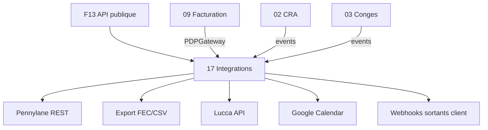

# Brique 17 — Hub d'intégrations

> Connecteurs tiers (compta, SIRH, calendrier, PDP), clés API et webhooks sortants.
> Fondation : [13-public-api-ecosystem.md](../foundation/13-public-api-ecosystem.md).
> Phase cible : [ROADMAP §Phase 2–3](../ROADMAP.md).

## 1. Référence fonctionnelle

- ANALYSE_COMMERCIALE §7 (table stakes : SSO, API, intégrations compta/SIRH/calendrier).
- Spec §7.8 (transmission PDP — port partagé avec module 09).
- ROADMAP : 1er connecteur compta Phase 2 ; SIRH/calendrier Phase 3.

> **Ne pas confondre** :
> - **Module 14 (Stripe)** = abonnement SaaS Kore.
> - **Module 09** = facturation métier ESN via PDP/PA.
> - **Module 17** = hub d'intégration du tenant vers ses outils (compta, SIRH, etc.).

## 2. Périmètre de la brique et dépendances

**Inclus** :
- Gestion des connexions d'intégration par tenant
- Clés API et abonnements webhooks sortants (implémentation [F13](../foundation/13-public-api-ecosystem.md))
- Connecteurs : comptabilité, PDP (coordination avec 09), SIRH, calendrier
- Journal de synchronisation et retry

**Hors brique** :
- Logique métier facturation (09), CRA (02), congés (03)
- Webhooks **entrants** Stripe/PDP (restent dans modules 14/09)

**Dépend de** : [F13](../foundation/13-public-api-ecosystem.md), [00](00-organisation-identity.md), [14](14-abonnement-saas-stripe.md) (entitlements add-ons). **Consommé par** : tous les modules émetteurs d'événements.



## 3. Modèle de domaine

- **`IntegrationConnection`** : `tenantID`, `type` (Accounting, PDP, HRIS, Calendar), `provider` (pennylane, sage, lucca, google, ...), `status` (Active, Error, Disabled), `credentialsRef` (Secret Manager), `lastSyncAt`.
- **`SyncJob`** : exécution planifiée ou manuelle d'une synchro.
- **`ExportBatch`** : lot d'écritures comptables exportées.
- **`WebhookSubscription`** : abonnement sortant (cf. F13).

**Invariants** :
- Credentials jamais stockées en clair en base — référence Secret Manager uniquement.
- Une connexion inactive ne déclenche pas de sync.
- Webhook sortant : livraison idempotente par `event_id`.

## 4. Ports

### Inbound

```go
type IntegrationService interface {
    Connect(ctx context.Context, cmd ConnectCommand) (IntegrationConnection, error)
    Disconnect(ctx context.Context, tenant TenantID, connID ConnectionID) error
    Sync(ctx context.Context, cmd SyncCommand) (SyncJob, error)
    ListConnections(ctx context.Context, tenant TenantID) ([]IntegrationConnection, error)
}

type ApiKeyService interface {
    CreateKey(ctx context.Context, cmd CreateApiKeyCommand) (ApiKeyCreated, error) // clé en clair une seule fois
    RevokeKey(ctx context.Context, tenant TenantID, keyID ApiKeyID) error
}
```

### Outbound (gateways par connecteur)

```go
type AccountingExporter interface {
    ExportInvoices(ctx context.Context, batch ExportBatch) error
    ExportPayments(ctx context.Context, batch ExportBatch) error
}

type HRISGateway interface {
    SyncAbsences(ctx context.Context, since time.Time) ([]ExternalAbsence, error)
    PushEmployee(ctx context.Context, emp EmployeeSnapshot) error
}

type CalendarGateway interface {
    ListBusySlots(ctx context.Context, userID UserID, period DateRange) ([]BusySlot, error)
    CreateEvent(ctx context.Context, evt CalendarEvent) error
}

type WebhookDispatcher interface { // aussi dans platform/httpx
    Dispatch(ctx context.Context, evt OutboundEvent) error
}
```

Le port `PDPGateway` reste défini par le **module 09** ; l'adapter concret peut vivre dans `integrations/adapters/pdp/`.

## 5. Connecteurs — planning par phase

| Connecteur | Provider | Phase | Port | Adapter |
| --- | --- | --- | --- | --- |
| Comptabilité | Pennylane | 2 | `AccountingExporter` | REST API Pennylane |
| Comptabilité | Sage/Cegid | 3 | `AccountingExporter` | Export FEC/CSV |
| E-invoicing | PDP/PA (BYO) | 2 | `PDPGateway` (09) | Adapter configurable |
| SIRH | Lucca | 3 | `HRISGateway` | REST Lucca |
| SIRH | PayFit | 3 | `HRISGateway` | REST PayFit |
| Calendrier | Google Workspace | 3 | `CalendarGateway` | OAuth + Calendar API |
| Calendrier | Microsoft 365 | 3 | `CalendarGateway` | OAuth + Graph API |

### 1er connecteur (Phase 2 gate)

**Pennylane** recommandé (API moderne, marché ESN FR) ; fallback **export FEC/CSV** si API indisponible.

Données exportées : factures transmises (module 09), avoirs, lignes analytiques par mission.

## 6. Adapters

- **HTTP (chi)** : `internal/modules/integrations/adapters/http` — admin connexions, API keys, webhooks.
- **PostgreSQL (sqlc)** : schéma `integrations` (cf. F13).
- **External** : `adapters/pennylane`, `adapters/fec`, `adapters/lucca`, `adapters/googlecalendar`, etc.

## 7. Contrat d'API

| Méthode | Chemin | Permission | Description |
| --- | --- | --- | --- |
| POST | `/api/v1/integrations/connections` | Admin (E) | Connecter un provider |
| GET | `/api/v1/integrations/connections` | Admin (L) | Lister connexions |
| DELETE | `/api/v1/integrations/connections/{id}` | Admin (E) | Déconnecter |
| POST | `/api/v1/integrations/connections/{id}/sync` | Admin (E) | Lancer synchro manuelle |
| GET | `/api/v1/integrations/sync-logs` | Admin (L) | Journal des syncs |
| POST | `/api/v1/integrations/api-keys` | Admin (E) | Créer clé API (F13) |
| POST | `/api/v1/integrations/webhooks` | Admin (E) | Abonnement webhook sortant |

Erreurs : `402 INTEGRATION_NOT_SUBSCRIBED`, `422 INVALID_CREDENTIALS`, `503 PROVIDER_UNAVAILABLE`.

## 8. Schéma de données (schéma `integrations`)

| Table | Colonnes clés |
| --- | --- |
| `integrations.connections` | `id`, `tenant_id`, `type`, `provider`, `status`, `credentials_ref`, `config` (jsonb), `last_sync_at` |
| `integrations.sync_logs` | `id`, `connection_id`, `direction`, `status`, `records_count`, `error`, `started_at`, `finished_at` |
| `integrations.api_keys` | cf. F13 |
| `integrations.webhook_subscriptions` | cf. F13 |
| `integrations.webhook_deliveries` | cf. F13 |

## 9. Frontend Nuxt (admin intégrations)

| Élément | Détail |
| --- | --- |
| Pages | `admin/integrations` (liste connexions), `admin/integrations/[provider]/connect`, `admin/api-keys`, `admin/webhooks` |
| Composants | `IntegrationCard`, `ConnectPennylaneForm`, `ApiKeyCreateDialog`, `WebhookSubscriptionForm` |
| Composables | `useIntegrations()` |
| Routes BFF | `server/api/integrations/*` |

Peut être regroupé sous [13-admin-parametrage.md](13-admin-parametrage.md) §admin/integrations (Phase 2).

## 10. Plan de tests

- Unitaires : mapping export compta ; retry webhook ; scope API key insuffisant.
- Intégration : connexion Pennylane mock ; export batch ; dispatch webhook vers serveur HTTP stub.
- Contrat : idempotence `event_id` webhook.

## 11. Definition of Done (Phase 2)

- [ ] Clés API et webhooks sortants opérationnels (F13).
- [ ] 1er connecteur compta (Pennylane ou FEC) validé avec pilote.
- [ ] UI admin connexion + journal sync.
- [ ] Credentials dans Secret Manager uniquement.
- [ ] Endpoints documentés dans `api/openapi.yaml`.

## 12. Definition of Done (Phase 3 — compléments)

- [ ] Connecteur SIRH (sync absences → module 03).
- [ ] Connecteur calendrier (Google ou M365).
- [ ] Au moins 2 providers compta.
